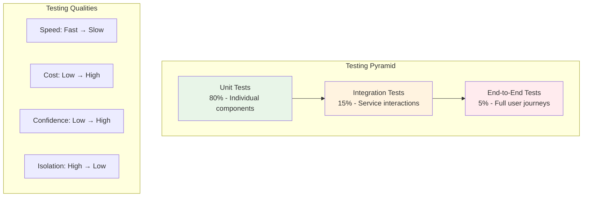

# Testing Overview

OpenFrame follows a comprehensive testing strategy to ensure reliability, performance, and security across the platform. This guide covers our testing philosophy, frameworks, and best practices for contributors.

## Testing Philosophy

### Testing Pyramid

OpenFrame adopts the testing pyramid model with emphasis on fast, reliable tests:



### Testing Principles

1. **Test Early, Test Often**: Automated tests run on every code change
2. **Fail Fast**: Quick feedback loops for developers
3. **Test in Production**: Comprehensive monitoring and observability
4. **Security First**: Security testing integrated throughout the pipeline
5. **Performance Awareness**: Regular performance regression testing

## Testing Framework Stack

### Backend Testing (Java)

| Framework | Purpose | Usage |
|-----------|---------|-------|
| **JUnit 5** | Unit testing foundation | All unit tests |
| **Mockito** | Mocking framework | Service layer testing |
| **TestContainers** | Integration testing | Database integration tests |
| **WireMock** | HTTP service mocking | External API testing |
| **Spring Boot Test** | Spring application testing | Web layer testing |
| **REST Assured** | API testing | REST endpoint testing |

### Frontend Testing (Vue.js/TypeScript)

| Framework | Purpose | Usage |
|-----------|---------|-------|
| **Vitest** | Unit testing framework | Component and utility testing |
| **Vue Test Utils** | Vue component testing | Component behavior testing |
| **Cypress** | E2E testing | Full user journey testing |
| **MSW** | API mocking | Frontend integration testing |
| **Jest DOM** | DOM testing utilities | DOM assertion helpers |

## Unit Testing

### Backend Unit Testing

#### Service Layer Testing

```java
@ExtendWith(MockitoExtension.class)
class OrganizationServiceTest {

    @Mock
    private OrganizationRepository organizationRepository;

    @Mock
    private UserService userService;

    @InjectMocks
    private OrganizationService organizationService;

    @Test
    @DisplayName("Should create organization with valid data")
    void shouldCreateOrganizationWithValidData() {
        // Given
        CreateOrganizationRequest request = CreateOrganizationRequest.builder()
            .name("Test Organization")
            .contactPerson(ContactPersonDto.builder()
                .name("John Doe")
                .email("john@example.com")
                .build())
            .build();

        Organization savedOrg = Organization.builder()
            .id("org-123")
            .name("Test Organization")
            .build();

        when(organizationRepository.save(any(Organization.class)))
            .thenReturn(savedOrg);

        // When
        OrganizationResponse result = organizationService.createOrganization(request);

        // Then
        assertThat(result.getId()).isEqualTo("org-123");
        assertThat(result.getName()).isEqualTo("Test Organization");
        
        verify(organizationRepository).save(any(Organization.class));
    }

    @Test
    @DisplayName("Should throw exception for duplicate organization name")
    void shouldThrowExceptionForDuplicateName() {
        // Given
        CreateOrganizationRequest request = CreateOrganizationRequest.builder()
            .name("Existing Organization")
            .build();

        when(organizationRepository.findByName("Existing Organization"))
            .thenReturn(Optional.of(new Organization()));

        // When & Then
        assertThrows(DuplicateOrganizationException.class, 
            () -> organizationService.createOrganization(request));
    }
}
```

#### Repository Layer Testing

```java
@DataMongoTest
@AutoConfigureTestDatabase(replace = AutoConfigureTestDatabase.Replace.NONE)
@Testcontainers
class OrganizationRepositoryTest {

    @Container
    static MongoDBContainer mongoDBContainer = new MongoDBContainer("mongo:7.0")
        .withExposedPorts(27017);

    @Autowired
    private TestEntityManager entityManager;

    @Autowired
    private OrganizationRepository organizationRepository;

    @Test
    @DisplayName("Should find organization by name")
    void shouldFindOrganizationByName() {
        // Given
        Organization organization = Organization.builder()
            .name("Test Organization")
            .tenantId("tenant-123")
            .build();
        
        entityManager.persistAndFlush(organization);

        // When
        Optional<Organization> result = organizationRepository
            .findByName("Test Organization");

        // Then
        assertThat(result).isPresent();
        assertThat(result.get().getName()).isEqualTo("Test Organization");
    }

    @DynamicPropertySource
    static void configureProperties(DynamicPropertyRegistry registry) {
        registry.add("spring.data.mongodb.uri", mongoDBContainer::getReplicaSetUrl);
    }
}
```

### Frontend Unit Testing

#### Vue Component Testing

```typescript
// OrganizationCard.test.ts
import { mount } from '@vue/test-utils'
import { describe, it, expect, vi } from 'vitest'
import OrganizationCard from '@/components/OrganizationCard.vue'

describe('OrganizationCard', () => {
  const mockOrganization = {
    id: 'org-123',
    name: 'Test Organization',
    contactPerson: {
      name: 'John Doe',
      email: 'john@example.com'
    },
    createdAt: new Date('2024-01-01'),
    memberCount: 5
  }

  it('renders organization information correctly', () => {
    // Given
    const wrapper = mount(OrganizationCard, {
      props: { organization: mockOrganization }
    })

    // Then
    expect(wrapper.text()).toContain('Test Organization')
    expect(wrapper.text()).toContain('John Doe')
    expect(wrapper.text()).toContain('john@example.com')
    expect(wrapper.text()).toContain('5 members')
  })

  it('emits edit event when edit button is clicked', async () => {
    // Given
    const wrapper = mount(OrganizationCard, {
      props: { organization: mockOrganization }
    })

    // When
    await wrapper.find('[data-test="edit-button"]').trigger('click')

    // Then
    expect(wrapper.emitted('edit')).toBeTruthy()
    expect(wrapper.emitted('edit')?.[0]).toEqual([mockOrganization.id])
  })

  it('shows loading state when provided', () => {
    // Given
    const wrapper = mount(OrganizationCard, {
      props: { 
        organization: mockOrganization,
        loading: true 
      }
    })

    // Then
    expect(wrapper.find('[data-test="loading-spinner"]').exists()).toBe(true)
  })
})
```

#### Store Testing (Pinia)

```typescript
// organizationStore.test.ts
import { setActivePinia, createPinia } from 'pinia'
import { describe, it, expect, beforeEach, vi } from 'vitest'
import { useOrganizationStore } from '@/stores/organizationStore'

// Mock API client
vi.mock('@/lib/api-client', () => ({
  apiClient: {
    post: vi.fn(),
    get: vi.fn()
  }
}))

describe('Organization Store', () => {
  beforeEach(() => {
    setActivePinia(createPinia())
  })

  it('creates organization successfully', async () => {
    // Given
    const store = useOrganizationStore()
    const mockResponse = { id: 'org-123', name: 'Test Org' }
    
    vi.mocked(apiClient.post).mockResolvedValue({ data: mockResponse })

    // When
    await store.createOrganization({
      name: 'Test Org',
      contactPerson: { name: 'John', email: 'john@example.com' }
    })

    // Then
    expect(store.organizations).toContainEqual(mockResponse)
    expect(store.loading).toBe(false)
  })

  it('handles creation errors properly', async () => {
    // Given
    const store = useOrganizationStore()
    const error = new Error('Network error')
    
    vi.mocked(apiClient.post).mockRejectedValue(error)

    // When
    await store.createOrganization({
      name: 'Test Org',
      contactPerson: { name: 'John', email: 'john@example.com' }
    })

    // Then
    expect(store.error).toBe('Failed to create organization')
    expect(store.loading).toBe(false)
  })
})
```

## Integration Testing

### Backend Integration Testing

#### Web Layer Integration

```java
@SpringBootTest(webEnvironment = SpringBootTest.WebEnvironment.RANDOM_PORT)
@AutoConfigureTestDatabase(replace = AutoConfigureTestDatabase.Replace.NONE)
@Testcontainers
class OrganizationControllerIntegrationTest {

    @Container
    static MongoDBContainer mongoDBContainer = new MongoDBContainer("mongo:7.0");

    @Container
    static RedisContainer redisContainer = new RedisContainer("redis:7-alpine");

    @Autowired
    private TestRestTemplate restTemplate;

    @Autowired
    private OrganizationRepository organizationRepository;

    @Test
    void shouldCreateOrganizationViaAPI() {
        // Given
        CreateOrganizationRequest request = CreateOrganizationRequest.builder()
            .name("Integration Test Org")
            .contactPerson(ContactPersonDto.builder()
                .name("Test User")
                .email("test@example.com")
                .build())
            .build();

        HttpHeaders headers = new HttpHeaders();
        headers.setContentType(MediaType.APPLICATION_JSON);
        headers.setBearerAuth(getValidJwtToken());
        
        HttpEntity<CreateOrganizationRequest> entity = new HttpEntity<>(request, headers);

        // When
        ResponseEntity<OrganizationResponse> response = restTemplate.postForEntity(
            "/api/organizations", 
            entity, 
            OrganizationResponse.class
        );

        // Then
        assertThat(response.getStatusCode()).isEqualTo(HttpStatus.CREATED);
        assertThat(response.getBody().getName()).isEqualTo("Integration Test Org");
        
        // Verify database state
        Optional<Organization> saved = organizationRepository.findByName("Integration Test Org");
        assertThat(saved).isPresent();
    }

    @DynamicPropertySource
    static void configureProperties(DynamicPropertyRegistry registry) {
        registry.add("spring.data.mongodb.uri", mongoDBContainer::getReplicaSetUrl);
        registry.add("spring.redis.host", redisContainer::getHost);
        registry.add("spring.redis.port", () -> redisContainer.getMappedPort(6379));
    }
}
```

#### GraphQL Integration Testing

```java
@SpringBootTest
@AutoConfigureGraphQlTester
class DeviceGraphQLIntegrationTest {

    @Autowired
    private GraphQlTester graphQlTester;

    @Test
    void shouldQueryDevicesWithFiltering() {
        // Given - Pre-populate test data
        createTestDevices();

        String query = """
            query GetDevices($filter: DeviceFilterInput) {
              devices(filter: $filter) {
                totalCount
                edges {
                  node {
                    id
                    name
                    status
                    operatingSystem
                  }
                }
              }
            }
            """;

        // When
        graphQlTester
            .document(query)
            .variable("filter", Map.of(
                "status", "ONLINE",
                "organizationId", "test-org-123"
            ))
            .execute()
            .path("devices.totalCount")
            .entity(Integer.class)
            .isGreaterThan(0)
            .path("devices.edges[*].node.status")
            .entityList(String.class)
            .allMatch(status -> "ONLINE".equals(status));
    }
}
```

### Frontend Integration Testing

#### API Integration with MSW

```typescript
// api-integration.test.ts
import { rest } from 'msw'
import { setupServer } from 'msw/node'
import { describe, it, expect, beforeAll, afterEach, afterAll } from 'vitest'
import { OrganizationService } from '@/services/organizationService'

// Mock server setup
const server = setupServer(
  rest.post('/api/organizations', (req, res, ctx) => {
    return res(
      ctx.status(201),
      ctx.json({
        id: 'org-123',
        name: 'Test Organization',
        contactPerson: {
          name: 'John Doe',
          email: 'john@example.com'
        }
      })
    )
  }),
  
  rest.get('/api/organizations', (req, res, ctx) => {
    return res(
      ctx.json({
        data: [
          { id: 'org-1', name: 'Org 1' },
          { id: 'org-2', name: 'Org 2' }
        ],
        totalCount: 2
      })
    )
  })
)

beforeAll(() => server.listen())
afterEach(() => server.resetHandlers())
afterAll(() => server.close())

describe('Organization Service Integration', () => {
  it('creates organization successfully', async () => {
    // Given
    const organizationData = {
      name: 'Test Organization',
      contactPerson: {
        name: 'John Doe',
        email: 'john@example.com'
      }
    }

    // When
    const result = await OrganizationService.create(organizationData)

    // Then
    expect(result.id).toBe('org-123')
    expect(result.name).toBe('Test Organization')
  })

  it('fetches organizations with correct data structure', async () => {
    // When
    const result = await OrganizationService.getAll()

    // Then
    expect(result.data).toHaveLength(2)
    expect(result.totalCount).toBe(2)
    expect(result.data[0]).toMatchObject({
      id: expect.any(String),
      name: expect.any(String)
    })
  })
})
```

## End-to-End Testing

### Cypress E2E Testing

#### User Journey Testing

```typescript
// cypress/e2e/organization-management.cy.ts
describe('Organization Management', () => {
  beforeEach(() => {
    // Login as admin user
    cy.login('admin@example.com', 'password')
    cy.visit('/organizations')
  })

  it('should create new organization successfully', () => {
    // Given
    cy.get('[data-cy="new-organization-button"]').click()

    // When
    cy.get('[data-cy="organization-name"]')
      .type('Cypress Test Organization')
    
    cy.get('[data-cy="contact-name"]')
      .type('Test User')
    
    cy.get('[data-cy="contact-email"]')
      .type('test@example.com')
    
    cy.get('[data-cy="contact-phone"]')
      .type('+1234567890')
    
    cy.get('[data-cy="submit-button"]').click()

    // Then
    cy.get('[data-cy="success-message"]')
      .should('contain', 'Organization created successfully')
    
    cy.get('[data-cy="organizations-table"]')
      .should('contain', 'Cypress Test Organization')
  })

  it('should edit existing organization', () => {
    // Given
    cy.get('[data-cy="organization-row"]').first()
      .find('[data-cy="edit-button"]').click()

    // When
    cy.get('[data-cy="organization-name"]')
      .clear()
      .type('Updated Organization Name')
    
    cy.get('[data-cy="submit-button"]').click()

    // Then
    cy.get('[data-cy="success-message"]')
      .should('contain', 'Organization updated successfully')
    
    cy.get('[data-cy="organizations-table"]')
      .should('contain', 'Updated Organization Name')
  })

  it('should filter organizations by name', () => {
    // Given
    const searchTerm = 'Test'

    // When
    cy.get('[data-cy="search-input"]').type(searchTerm)
    cy.get('[data-cy="search-button"]').click()

    // Then
    cy.get('[data-cy="organization-row"]').each(($row) => {
      cy.wrap($row).should('contain', searchTerm)
    })
  })
})
```

#### Device Management E2E

```typescript
// cypress/e2e/device-management.cy.ts
describe('Device Management', () => {
  beforeEach(() => {
    cy.login('technician@example.com', 'password')
  })

  it('should display device details and allow remote connection', () => {
    // Given
    cy.visit('/devices')
    
    // When
    cy.get('[data-cy="device-card"]').first().click()

    // Then
    cy.url().should('include', '/devices/details/')
    cy.get('[data-cy="device-name"]').should('be.visible')
    cy.get('[data-cy="device-status"]').should('be.visible')
    cy.get('[data-cy="device-os"]').should('be.visible')

    // Test remote connection
    cy.get('[data-cy="remote-connect-button"]').click()
    cy.get('[data-cy="remote-connection-modal"]').should('be.visible')
  })

  it('should execute script on device', () => {
    // Given
    cy.visit('/devices/details/test-device-123')
    cy.get('[data-cy="scripts-tab"]').click()

    // When
    cy.get('[data-cy="run-script-button"]').click()
    cy.get('[data-cy="script-selector"]').select('System Information')
    cy.get('[data-cy="execute-button"]').click()

    // Then
    cy.get('[data-cy="script-output"]', { timeout: 10000 })
      .should('contain', 'System:')
    cy.get('[data-cy="execution-status"]')
      .should('contain', 'Completed')
  })
})
```

## Performance Testing

### Backend Performance Testing

#### Load Testing with JMeter

```xml
<!-- jmeter/organization-api-load-test.jmx -->
<?xml version="1.0" encoding="UTF-8"?>
<jmeterTestPlan version="1.2">
  <hashTree>
    <TestPlan guiclass="TestPlanGui" testclass="TestPlan" testname="Organization API Load Test">
      <elementProp name="TestPlan.arguments" elementType="Arguments" guiclass="ArgumentsPanel">
        <collectionProp name="Arguments.arguments">
          <elementProp name="baseUrl" elementType="Argument">
            <stringProp name="Argument.name">baseUrl</stringProp>
            <stringProp name="Argument.value">http://localhost:8080</stringProp>
          </elementProp>
        </collectionProp>
      </elementProp>
      <boolProp name="TestPlan.functional_mode">false</boolProp>
      <boolProp name="TestPlan.serialize_threadgroups">false</boolProp>
    </TestPlan>
    
    <hashTree>
      <ThreadGroup guiclass="ThreadGroupGui" testclass="ThreadGroup" testname="API Users">
        <stringProp name="ThreadGroup.on_sample_error">continue</stringProp>
        <elementProp name="ThreadGroup.main_controller" elementType="LoopController">
          <boolProp name="LoopController.continue_forever">false</boolProp>
          <stringProp name="LoopController.loops">100</stringProp>
        </elementProp>
        <stringProp name="ThreadGroup.num_threads">50</stringProp>
        <stringProp name="ThreadGroup.ramp_time">30</stringProp>
      </ThreadGroup>
      
      <hashTree>
        <HTTPSamplerProxy guiclass="HttpTestSampleGui" testclass="HTTPSamplerProxy" testname="Get Organizations">
          <elementProp name="HTTPsampler.Arguments" elementType="Arguments">
            <collectionProp name="Arguments.arguments"/>
          </elementProp>
          <stringProp name="HTTPSampler.domain">${baseUrl}</stringProp>
          <stringProp name="HTTPSampler.port">8080</stringProp>
          <stringProp name="HTTPSampler.path">/api/organizations</stringProp>
          <stringProp name="HTTPSampler.method">GET</stringProp>
        </HTTPSamplerProxy>
      </hashTree>
    </hashTree>
  </hashTree>
</jmeterTestPlan>
```

#### Microbenchmarking with JMH

```java
@BenchmarkMode(Mode.Throughput)
@OutputTimeUnit(TimeUnit.SECONDS)
@State(Scope.Benchmark)
public class OrganizationServiceBenchmark {

    private OrganizationService organizationService;
    private CreateOrganizationRequest testRequest;

    @Setup
    public void setup() {
        organizationService = new OrganizationService(
            mock(OrganizationRepository.class),
            mock(UserService.class)
        );
        
        testRequest = CreateOrganizationRequest.builder()
            .name("Benchmark Test Org")
            .contactPerson(ContactPersonDto.builder()
                .name("Test User")
                .email("test@example.com")
                .build())
            .build();
    }

    @Benchmark
    public OrganizationResponse createOrganization() {
        return organizationService.createOrganization(testRequest);
    }

    @Benchmark
    public List<OrganizationResponse> getAllOrganizations() {
        return organizationService.getAllOrganizations();
    }
}
```

### Frontend Performance Testing

#### Lighthouse Performance Testing

```typescript
// tests/performance/lighthouse.test.ts
import lighthouse from 'lighthouse'
import chromeLauncher from 'chrome-launcher'
import { describe, it, expect } from 'vitest'

describe('Performance Tests', () => {
  it('should meet performance benchmarks for dashboard page', async () => {
    // Launch Chrome
    const chrome = await chromeLauncher.launch({ chromeFlags: ['--headless'] })
    
    // Run Lighthouse
    const runnerResult = await lighthouse(
      'http://localhost:3000/dashboard',
      {
        port: chrome.port,
        onlyCategories: ['performance']
      }
    )

    // Assert performance scores
    const { lhr } = runnerResult!
    expect(lhr.categories.performance.score).toBeGreaterThan(0.9) // 90+ score
    expect(lhr.audits['first-contentful-paint'].numericValue).toBeLessThan(2000) // < 2s
    expect(lhr.audits['largest-contentful-paint'].numericValue).toBeLessThan(4000) // < 4s

    await chrome.kill()
  })
})
```

## Security Testing

### Backend Security Testing

#### Security Configuration Testing

```java
@SpringBootTest(webEnvironment = SpringBootTest.WebEnvironment.RANDOM_PORT)
class SecurityConfigurationTest {

    @Autowired
    private TestRestTemplate restTemplate;

    @Test
    void shouldBlockUnauthenticatedRequests() {
        // When
        ResponseEntity<String> response = restTemplate.getForEntity(
            "/api/organizations", 
            String.class
        );

        // Then
        assertThat(response.getStatusCode()).isEqualTo(HttpStatus.UNAUTHORIZED);
    }

    @Test
    void shouldAllowAuthenticatedRequests() {
        // Given
        String validToken = generateValidJwtToken();
        HttpHeaders headers = new HttpHeaders();
        headers.setBearerAuth(validToken);
        HttpEntity<String> entity = new HttpEntity<>(headers);

        // When
        ResponseEntity<String> response = restTemplate.exchange(
            "/api/organizations",
            HttpMethod.GET,
            entity,
            String.class
        );

        // Then
        assertThat(response.getStatusCode()).isEqualTo(HttpStatus.OK);
    }

    @Test
    void shouldEnforceTenantIsolation() {
        // Given
        String tenant1Token = generateTokenForTenant("tenant-1");
        String tenant2Token = generateTokenForTenant("tenant-2");
        
        // Create organization for tenant 1
        createOrganizationForTenant("tenant-1", "Org 1");
        createOrganizationForTenant("tenant-2", "Org 2");

        // When - Tenant 1 tries to access their data
        ResponseEntity<String> tenant1Response = makeAuthenticatedRequest(
            tenant1Token, "/api/organizations"
        );

        // When - Tenant 2 tries to access their data
        ResponseEntity<String> tenant2Response = makeAuthenticatedRequest(
            tenant2Token, "/api/organizations"
        );

        // Then
        assertThat(tenant1Response.getBody()).contains("Org 1");
        assertThat(tenant1Response.getBody()).doesNotContain("Org 2");
        
        assertThat(tenant2Response.getBody()).contains("Org 2");
        assertThat(tenant2Response.getBody()).doesNotContain("Org 1");
    }
}
```

#### SQL Injection Testing

```java
@Test
void shouldPreventSQLInjection() {
    // Given - Malicious input attempting SQL injection
    String maliciousOrgName = "'; DROP TABLE organizations; --";
    
    CreateOrganizationRequest request = CreateOrganizationRequest.builder()
        .name(maliciousOrgName)
        .contactPerson(ContactPersonDto.builder()
            .name("Test User")
            .email("test@example.com")
            .build())
        .build();

    // When
    ResponseEntity<OrganizationResponse> response = restTemplate.postForEntity(
        "/api/organizations",
        request,
        OrganizationResponse.class
    );

    // Then - Should handle safely without SQL injection
    assertThat(response.getStatusCode()).isEqualTo(HttpStatus.CREATED);
    
    // Verify organization table still exists
    List<Organization> allOrgs = organizationRepository.findAll();
    assertThat(allOrgs).isNotEmpty();
}
```

## Test Data Management

### Test Data Builders

```java
public class OrganizationTestDataBuilder {
    private String name = "Test Organization";
    private String tenantId = "test-tenant-123";
    private ContactPerson contactPerson = ContactPersonTestDataBuilder.aContactPerson().build();

    public static OrganizationTestDataBuilder anOrganization() {
        return new OrganizationTestDataBuilder();
    }

    public OrganizationTestDataBuilder withName(String name) {
        this.name = name;
        return this;
    }

    public OrganizationTestDataBuilder withTenantId(String tenantId) {
        this.tenantId = tenantId;
        return this;
    }

    public OrganizationTestDataBuilder withContactPerson(ContactPerson contactPerson) {
        this.contactPerson = contactPerson;
        return this;
    }

    public Organization build() {
        return Organization.builder()
            .name(name)
            .tenantId(tenantId)
            .contactPerson(contactPerson)
            .createdAt(Instant.now())
            .updatedAt(Instant.now())
            .build();
    }
}

// Usage
Organization testOrg = anOrganization()
    .withName("Custom Test Org")
    .withTenantId("custom-tenant")
    .build();
```

### Database State Management

```java
@TestMethodOrder(OrderAnnotation.class)
class OrganizationIntegrationTest {

    @Autowired
    private DatabaseCleaner databaseCleaner;

    @BeforeEach
    void setUp() {
        databaseCleaner.cleanDatabase();
        setupTestData();
    }

    private void setupTestData() {
        // Create consistent test data for each test
        Organization org1 = anOrganization()
            .withName("Test Org 1")
            .withTenantId("tenant-1")
            .build();
        
        organizationRepository.save(org1);
    }
}
```

## Continuous Testing

### CI/CD Pipeline Testing

```yaml
# .github/workflows/ci.yml
name: Continuous Integration

on:
  push:
    branches: [ main, develop ]
  pull_request:
    branches: [ main ]

jobs:
  unit-tests:
    runs-on: ubuntu-latest
    steps:
      - uses: actions/checkout@v3
      - uses: actions/setup-java@v3
        with:
          java-version: '21'
          
      - name: Run Unit Tests
        run: mvn test -Dtest=**/*Test

      - name: Upload Coverage
        uses: codecov/codecov-action@v3

  integration-tests:
    runs-on: ubuntu-latest
    services:
      mongodb:
        image: mongo:7.0
        ports:
          - 27017:27017
      redis:
        image: redis:7-alpine
        ports:
          - 6379:6379

    steps:
      - uses: actions/checkout@v3
      - uses: actions/setup-java@v3
        with:
          java-version: '21'
          
      - name: Run Integration Tests
        run: mvn test -Dtest=**/*IntegrationTest

  e2e-tests:
    runs-on: ubuntu-latest
    steps:
      - uses: actions/checkout@v3
      - uses: actions/setup-node@v3
        with:
          node-version: '20'
          
      - name: Install Dependencies
        run: npm ci
        working-directory: openframe/services/openframe-frontend
        
      - name: Run E2E Tests
        run: npm run test:e2e
        working-directory: openframe/services/openframe-frontend

  security-tests:
    runs-on: ubuntu-latest
    steps:
      - uses: actions/checkout@v3
      
      - name: Run OWASP Dependency Check
        run: mvn org.owasp:dependency-check-maven:check
        
      - name: Run Trivy Security Scan
        uses: aquasecurity/trivy-action@master
        with:
          scan-type: 'fs'
          scan-ref: '.'
```

## Testing Best Practices

### General Guidelines

1. **Test Naming**: Use descriptive test names that explain the scenario
   ```java
   // Good
   @Test
   void shouldReturnNotFoundWhenOrganizationDoesNotExist()
   
   // Bad
   @Test
   void testGetOrganization()
   ```

2. **Test Structure**: Follow Given-When-Then pattern
   ```java
   @Test
   void shouldCreateOrganization() {
       // Given
       CreateOrganizationRequest request = ...;
       
       // When
       OrganizationResponse result = organizationService.create(request);
       
       // Then
       assertThat(result.getName()).isEqualTo("Test Organization");
   }
   ```

3. **Test Independence**: Each test should be independent and repeatable
4. **Mock External Dependencies**: Use mocks for external services and slow operations
5. **Test Edge Cases**: Include boundary conditions and error scenarios

### Code Coverage Guidelines

- **Minimum Coverage**: 80% line coverage, 70% branch coverage
- **Critical Paths**: 95% coverage for security and data integrity code
- **Exclude Coverage**: Configuration classes, DTOs, and generated code

---

This testing overview provides the foundation for maintaining high-quality code in OpenFrame. Follow these practices to ensure robust, reliable software delivery.