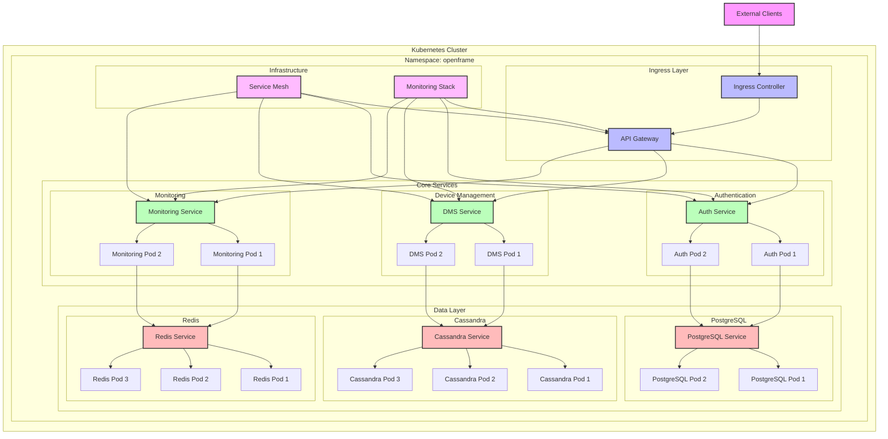

# Kubernetes Architecture

This diagram shows the Kubernetes-specific architecture of OpenFrame, including pod layout, service mesh configuration, and network topology.

## Component Description

### Ingress Layer
- **Ingress Controller**: Handles external traffic routing
- **API Gateway**: Routes requests to appropriate services

### Core Services
Each service runs with multiple replicas for high availability:
- **Authentication Service**: 2 replicas
- **Device Management Service**: 2 replicas
- **Monitoring Service**: 2 replicas

### Data Layer
- **Cassandra**: 3-node cluster for monitoring data
- **Redis**: 3-node cluster for caching
- **PostgreSQL**: 2-node cluster for user data

### Infrastructure
- **Service Mesh**: Manages service-to-service communication
- **Monitoring Stack**: Collects system metrics

## Network Topology

1. External traffic enters through Ingress Controller
2. API Gateway routes to appropriate services
3. Services communicate through Service Mesh
4. Data layer services maintain their own clusters
5. Monitoring Stack collects metrics from all components

## High Availability

- All services run with multiple replicas
- Database clusters are configured for redundancy
- Service Mesh provides load balancing
- Ingress Controller handles external traffic distribution 