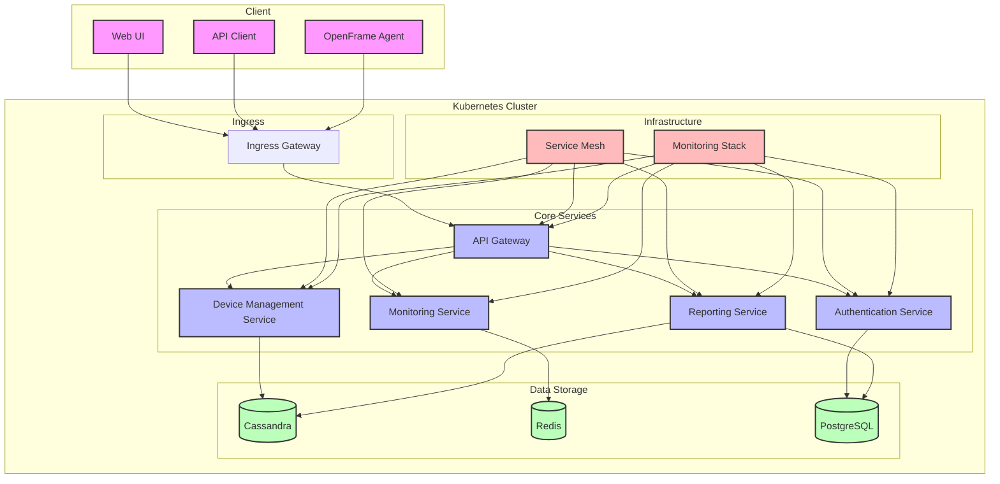

# System Overview

This diagram shows the high-level architecture of OpenFrame, including its core components and their relationships.

## Component Description

### Client Layer
- **Web UI**: Browser-based interface for users
- **API Client**: External applications using OpenFrame API
- **OpenFrame Agent**: Software installed on monitored devices

### Core Services
- **API Gateway**: Entry point for all requests
- **Authentication Service**: Handles user authentication and authorization
- **Device Management Service**: Manages device registration and configuration
- **Monitoring Service**: Collects and processes monitoring data
- **Reporting Service**: Generates reports and analytics

### Data Storage
- **Cassandra**: Stores monitoring data and device information
- **Redis**: Caches frequently accessed data
- **PostgreSQL**: Stores user data and configuration

### Infrastructure
- **Service Mesh**: Handles service-to-service communication
- **Monitoring Stack**: Collects system metrics and logs

## Data Flow

1. Client requests enter through the Ingress Gateway
2. API Gateway routes requests to appropriate services
3. Services communicate through the Service Mesh
4. Data is stored in appropriate databases
5. Monitoring Stack collects metrics from all components 