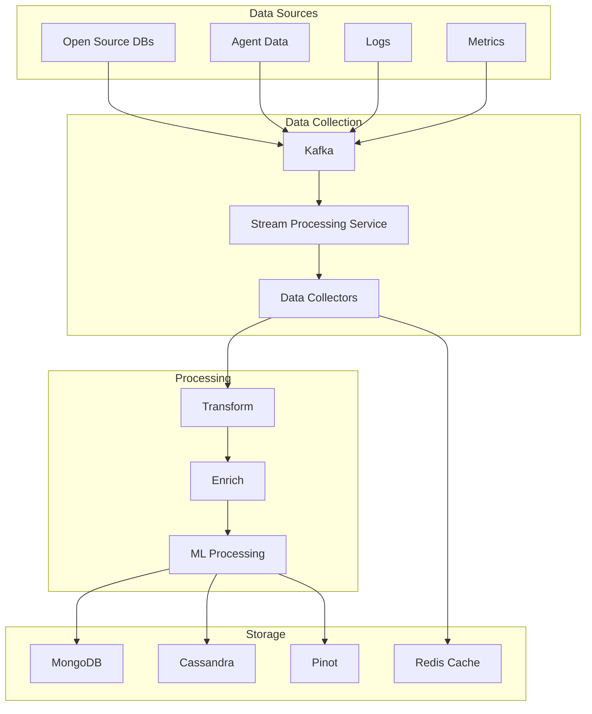
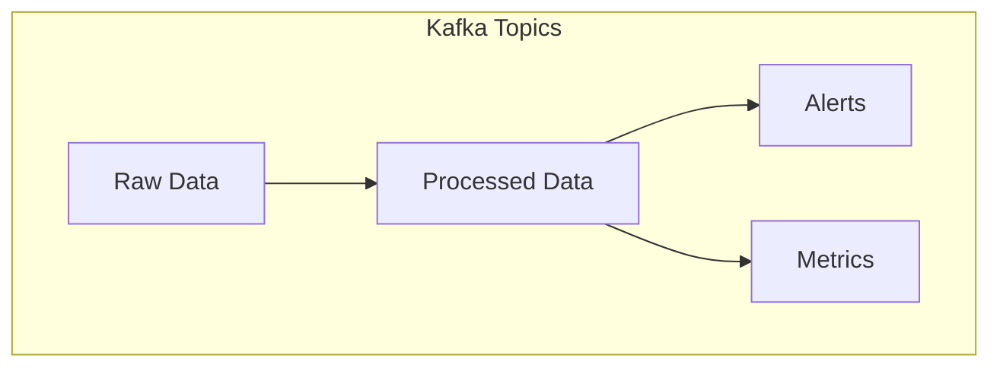
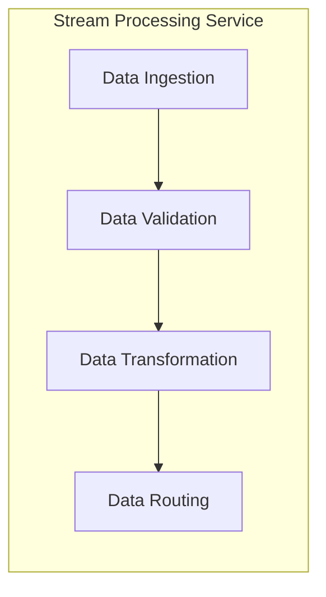
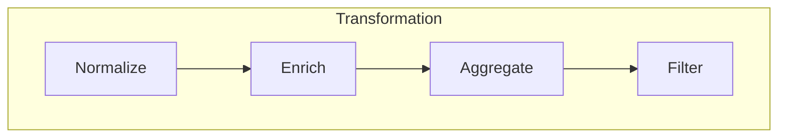
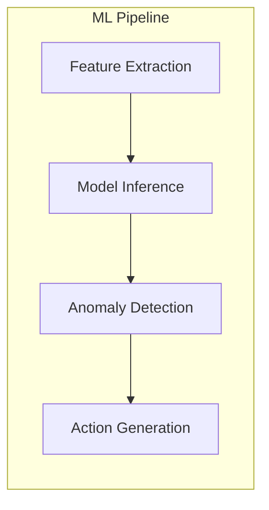
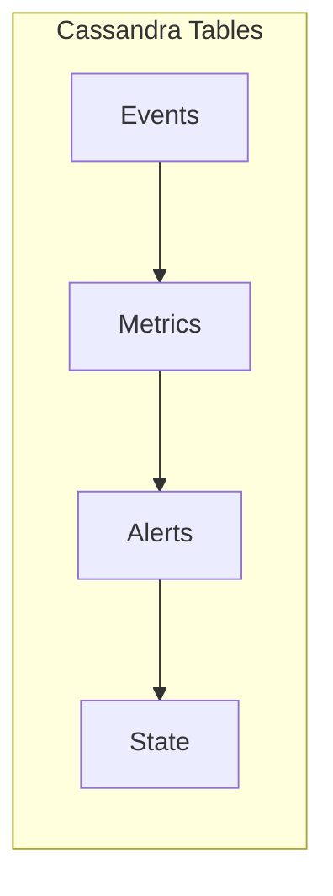
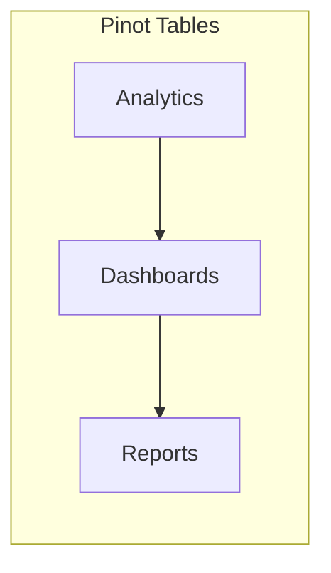
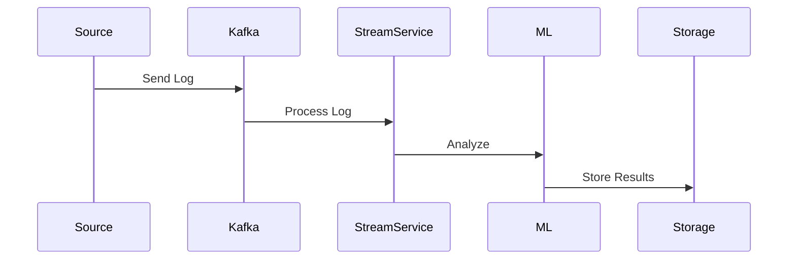
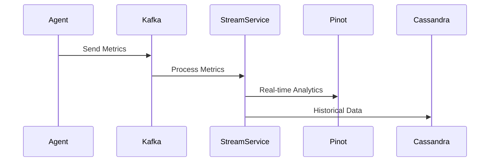
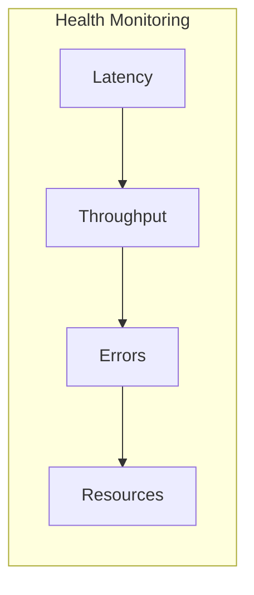

# OpenFrame Data Pipeline

This document details the data pipeline architecture and flow in OpenFrame.

## Overview

## Data Sources

### Open Source Tools
- Database dumps
- API responses
- Event streams
- Configuration changes

### Agent Data
- System metrics
- Performance data
- Health checks
- Status updates

### Logs
- Application logs
- System logs
- Security logs
- Audit trails

### Metrics
- Performance metrics
- Resource utilization
- Business metrics
- Custom metrics

## Data Collection

### Kafka Topics

### Stream Processing Components

## Data Processing

### Transformation Pipeline

### Machine Learning Processing

## Data Storage

### Cassandra Schema

### Pinot Tables

## Data Flow Examples

### Log Processing Flow

### Metrics Collection Flow

## Data Quality

### Validation Rules
- Schema validation
- Data type checking
- Required field validation
- Business rule validation

### Data Enrichment
- Metadata addition
- Reference data lookup
- Context enrichment
- Relationship mapping

### Data Governance
- Data lineage
- Access control
- Retention policies
- Compliance rules

## Monitoring and Maintenance

### Pipeline Health

### Maintenance Tasks
- Pipeline optimization
- Data cleanup
- Performance tuning
- Capacity planning

## Next Steps

- [AI and Analytics](./ai-analytics/)
- [API Integration](./api-integration/)
- [Security Implementation](../security/)
- [Deployment Guide](../deployment/) 