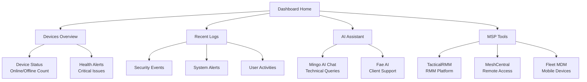
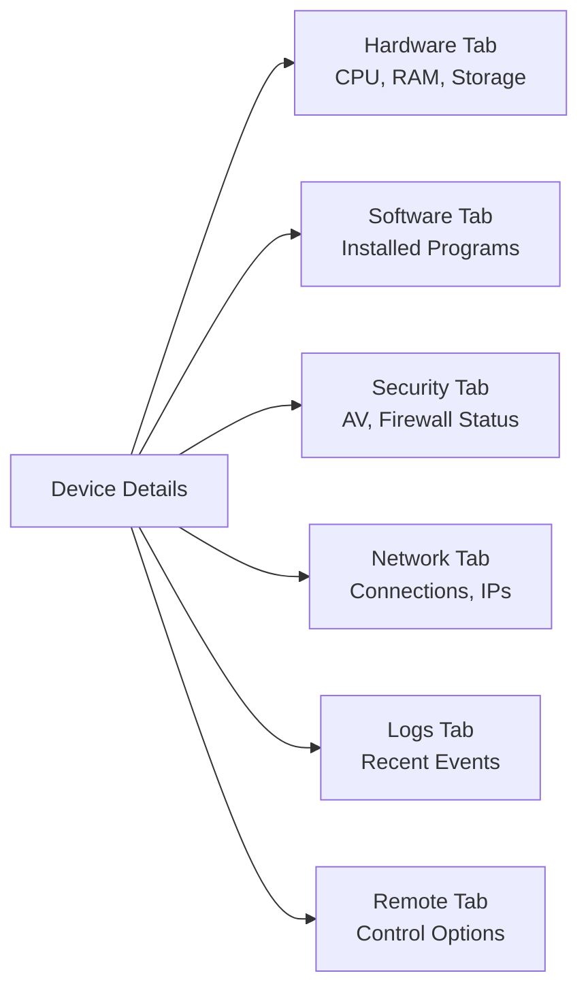

# First Steps with OpenFrame

Now that OpenFrame is running, this guide will walk you through the essential first steps to get familiar with the platform and configure it for your MSP environment.

## Your First 5 Tasks

### 1. Complete Initial Setup

After accessing the dashboard at http://localhost:8080, complete your initial organization setup:

#### Create Your Admin Account
```bash
# If you haven't already, create your first account:
Email: admin@example.com
Password: OpenFrame2024!
Organization: [Your MSP Name]
Role: Administrator
```

#### Organization Configuration
Navigate to **Settings** → **Company & Users** to configure:

- **Company Details**: MSP name, address, contact information
- **Branding**: Upload your logo and customize colors
- **Default Settings**: Time zone, currency, notification preferences

### 2. Explore the Dashboard Overview

The OpenFrame dashboard provides a unified view of your MSP operations:



#### Key Metrics to Monitor
- **Device Health**: Online/offline status and health scores
- **Security Alerts**: Critical vulnerabilities and compliance issues  
- **Performance**: System load, memory usage, and response times
- **Support Tickets**: Active client requests and resolution times

### 3. Add Your First Device

#### Option A: Install OpenFrame Agent

For comprehensive monitoring, install the OpenFrame agent:

```bash
# Download the agent installer
curl -sSL https://get.openframe.ai/install.sh | bash

# Or manual installation:
# 1. Download from: http://localhost:8080/downloads/agent
# 2. Run the installer with your registration token
```

#### Option B: Connect Existing MSP Tool

If you already use TacticalRMM, MeshCentral, or Fleet MDM:

1. **Navigate to Settings** → **MSP Tools Integration**
2. **Add Tool Connection**:
   - Tool Type: Select from dropdown (TacticalRMM, MeshCentral, Fleet MDM)
   - Server URL: Your existing tool's URL
   - API Key/Credentials: Authentication details
   - Test Connection: Verify integration works

3. **Import Devices**: Click "Sync Devices" to import existing managed devices

#### Device Details to Verify
Once devices are added, check that you can see:
- **Hardware Information**: CPU, memory, storage details
- **Operating System**: Version, patch level, installed software
- **Network Configuration**: IP addresses, connected networks
- **Agent Status**: Last check-in time, agent version
- **Security Status**: Antivirus, firewall, compliance state

### 4. Test AI Assistants

OpenFrame includes two AI assistants to enhance your MSP operations:

#### Mingo AI (Technician Assistant)
Located in the bottom-right chat bubble, try these sample queries:

```bash
# Device management queries
"Show me all offline devices"
"What devices need Windows updates?"
"List devices with low disk space"

# Performance analysis
"Which devices have high CPU usage?"
"Show network connectivity issues"
"Analyze system health trends"

# Security queries
"Find devices with security alerts"
"Show unpatched vulnerabilities"
"List devices missing antivirus"
```

#### Fae AI (Client Support)
Access through **Tickets** → **AI Support**:

```bash
# Client communication examples
"Create a ticket for network connectivity issues"
"Generate a status report for Client ABC"
"What's the resolution time for printer issues?"
```

### 5. Configure Essential Settings

#### User Management
Add your team members in **Settings** → **Company & Users**:

1. **Click "Invite User"**
2. **Enter Details**:
   - Email address
   - Role (Admin, Technician, Viewer)
   - Organization access
3. **Send Invitation**: User receives email with setup link

#### API Keys (For External Access)
Create API keys for external integrations:

1. **Navigate to Settings** → **API Keys**
2. **Create New Key**:
   - Name: "External Tool Integration"
   - Permissions: Select required access levels
   - Expiration: Set appropriate lifetime
3. **Save Key Securely**: Copy the generated key immediately

#### Notification Preferences
Configure alerts and notifications:

1. **Go to Settings** → **Notifications**
2. **Set Alert Thresholds**:
   - Device offline time: 5 minutes
   - Disk space warning: 85%
   - Memory usage alert: 90%
3. **Configure Delivery**:
   - Email notifications
   - Slack integration
   - Webhook endpoints

## Exploring Core Features

### Device Management

#### Device List and Filtering
Navigate to **Devices** to see all managed endpoints:

- **Filter Options**: Online status, operating system, organization
- **Search Functionality**: Find devices by name, IP, or hardware
- **Bulk Actions**: Update, restart, or run scripts on multiple devices
- **Export Options**: Generate device reports and inventory lists

#### Device Details
Click any device to access detailed information:



#### Remote Management
From device details, you can:

- **Remote Desktop**: Connect via MeshCentral integration
- **File Manager**: Browse and transfer files securely
- **Command Prompt**: Execute remote commands
- **Script Execution**: Run PowerShell, Bash, or custom scripts

### Log Analysis

#### Log Dashboard
Access **Logs** to monitor system events:

- **Real-time Stream**: Live events from all connected devices
- **Filtering**: By severity, source, time range, device
- **Search**: Full-text search across all log entries
- **Alerts**: Automated detection of critical events

#### Understanding Log Types
OpenFrame processes multiple log types:

| Log Type | Source | Purpose |
|----------|--------|---------|
| **System Events** | Operating System | Boot, shutdown, service status |
| **Security Logs** | Windows/Linux Security | Authentication, privilege changes |
| **Application Logs** | Installed Software | Application errors and warnings |
| **Network Events** | Network Stack | Connection attempts, failures |
| **MSP Tool Logs** | TacticalRMM, etc. | Tool-specific activities |

### MSP Tool Integration

#### TacticalRMM Integration
If enabled, access TacticalRMM features directly:

- **Agent Management**: Deploy and configure TacticalRMM agents
- **Scripts**: Run pre-built maintenance scripts
- **Policies**: Apply security and configuration policies
- **Reporting**: Generate compliance and health reports

#### MeshCentral Integration
Remote access capabilities through MeshCentral:

- **Remote Desktop**: Full desktop control with encryption
- **Terminal Access**: Command-line access to devices
- **File Operations**: Secure file transfer and management
- **Wake-on-LAN**: Power on devices remotely

### Organizations and Multi-Tenancy

#### Managing Multiple Clients
OpenFrame supports multi-tenant MSP operations:

1. **Create Organizations**:
   - Navigate to **Organizations** → **New Organization**
   - Configure client-specific settings
   - Assign devices and users

2. **Client-Specific Views**:
   - Isolated device management
   - Custom branding per client
   - Separate reporting and billing

## Common Initial Configurations

### Setting Up Monitoring Thresholds

```bash
# Navigate to Settings → Monitoring
# Configure these essential thresholds:

Device Offline Alert: 5 minutes
CPU Usage Warning: 80%
Memory Usage Critical: 95%
Disk Space Warning: 85%
Disk Space Critical: 95%
Network Connectivity Timeout: 30 seconds
```

### Configuring Backup Verification

```bash
# Settings → Policies → Backup Monitoring
# Set verification rules:

Backup Frequency Check: Daily
Maximum Backup Age: 24 hours
Backup Size Validation: Enabled
Notification on Backup Failure: Immediate
```

### Security Policy Configuration

```bash
# Settings → Security Policies
# Recommended initial settings:

Password Complexity: Enabled
Multi-Factor Authentication: Required for Admins
Session Timeout: 8 hours
API Rate Limiting: 1000 requests/hour
Audit Logging: Enabled
```

## Troubleshooting Common First-Use Issues

### Device Agent Installation Problems

#### Agent Won't Install
```bash
# Check connectivity
curl -I http://localhost:8080/actuator/health

# Verify registration token
# Get token from: Settings → Registration Secrets → Generate New

# Check firewall rules
# Ensure ports 8080, 8081 are accessible from client devices
```

#### Agent Shows Offline
```bash
# From device, check agent status:
sudo systemctl status openframe-agent   # Linux
Get-Service OpenFrameAgent              # Windows PowerShell

# Check network connectivity:
telnet your-openframe-server.com 8080

# Restart agent service:
sudo systemctl restart openframe-agent  # Linux
Restart-Service OpenFrameAgent          # Windows
```

### MSP Tool Integration Issues

#### TacticalRMM Connection Failed
```bash
# Verify TacticalRMM is accessible:
curl https://your-tactical-rmm.com/api/health

# Check API key permissions in TacticalRMM admin panel
# Ensure key has: Read Devices, Manage Agents permissions

# Test API connectivity:
curl -H "X-API-KEY: your_api_key" \
     https://your-tactical-rmm.com/api/v1/agents
```

#### MeshCentral Authentication Issues
```bash
# Verify MeshCentral server status:
curl https://your-meshcentral.com

# Check user permissions in MeshCentral
# Ensure OpenFrame integration user has "Device Group Management" rights

# Verify certificate trust:
openssl s_client -connect your-meshcentral.com:443
```

## Next Steps and Learning Resources

### Immediate Next Steps
1. **Add Production Devices**: Install agents on your actual client devices
2. **Configure Monitoring**: Set up alerting for your specific environment  
3. **Train Your Team**: Have technicians explore the AI assistant features
4. **Client Onboarding**: Create your first client organization
5. **Reporting Setup**: Configure automated reports for clients

### Advanced Topics to Explore
1. **API Development**: Use the GraphQL API for custom integrations
2. **Custom Scripts**: Develop organization-specific automation scripts
3. **Advanced Monitoring**: Set up Prometheus and Grafana dashboards
4. **SSO Integration**: Connect with existing identity providers
5. **Kubernetes Deployment**: Move to production-ready infrastructure

### Community Resources
- **Documentation**: Continue with specialized guides based on your role
- **OpenMSP Slack**: Join the community at https://www.openmsp.ai/
- **GitHub Issues**: Report bugs and request features
- **Flamingo Platform**: Explore commercial support options

### Role-Specific Learning Paths

#### For MSP Owners/Managers
- Organization management and client onboarding
- Reporting and analytics setup
- Cost optimization strategies
- Team training and adoption

#### For IT Technicians  
- Device management workflows
- AI assistant capabilities
- Remote support procedures
- Script development basics

#### For Developers/DevOps
- API integration and customization
- Deployment and scaling strategies
- Custom tool development
- Performance optimization

> 🎯 **Success Milestone**: You've successfully completed the first steps with OpenFrame! Your platform is configured with basic monitoring, you understand the core features, and you're ready to begin managing devices and serving clients effectively.

Continue your journey by exploring specific areas that match your role and requirements, or dive deeper into the [Development Documentation](../development/README.md) to customize OpenFrame for your unique MSP environment.