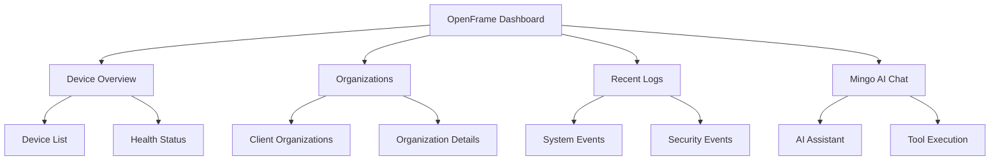

# First Steps with OpenFrame

Welcome to OpenFrame! Now that you have the platform running, let's walk through the essential first steps to get you productive quickly.

## Your First 5 Tasks

After completing the [Quick Start Guide](quick-start.md), follow these steps to configure and explore OpenFrame:

### 1. Complete Initial Setup

#### Register Your Tenant Organization
1. Open `http://localhost:3000` in your browser
2. Click **"Create Account"** if not automatically redirected
3. Fill in your organization details:
   - Organization name (e.g., "Acme MSP")
   - Your admin user details
   - Contact information
4. Complete email verification (check console logs for dev emails)
5. Log into your OpenFrame dashboard

#### Set Up Authentication
- **Development**: Use the default local authentication
- **Production**: Configure OAuth2 providers in Settings → SSO Configuration

### 2. Explore the Dashboard

Your OpenFrame dashboard provides an overview of:



#### Key Dashboard Sections

| Section | Purpose | What You'll See |
|---------|---------|-----------------|
| **Devices Overview** | Device health and status | Connected devices, health metrics |
| **Organizations** | Client management | Your MSP clients and their details |
| **Recent Logs** | System activity | Authentication, API calls, system events |
| **Mingo AI Chat** | AI assistance | Chat interface for AI-powered support |

### 3. Create Your First Client Organization

Organizations in OpenFrame represent your MSP clients:

#### Navigate to Organizations
1. Click **Organizations** in the left sidebar
2. Click **"+ Add Organization"**

#### Fill in Client Details
```text
Organization Name: Contoso Corp
Industry: Manufacturing
Contact Person: John Smith
Email: admin@contoso.com
Phone: +1-555-0123

Address:
123 Business Ave
Suite 100
Seattle, WA 98101
```

#### Review Organization Features
Once created, explore:
- **Device assignment** - Assign devices to this client
- **User management** - Add client users with appropriate permissions
- **Settings** - Client-specific configurations and policies

### 4. Connect Your First Device

#### Install the OpenFrame Agent

The OpenFrame client agent monitors and manages devices:

**Download the Agent:**
1. Go to **Settings → Downloads**
2. Generate an agent registration secret
3. Download the appropriate client for your platform:
   - **Windows**: `openframe-client.exe`
   - **macOS**: `openframe-client.dmg`
   - **Linux**: `openframe-client.AppImage`

**Install and Register:**
```bash
# Linux/macOS example
chmod +x openframe-client
./openframe-client --register --secret <your-registration-secret>

# Windows PowerShell
.\openframe-client.exe --register --secret <your-registration-secret>
```

#### Verify Device Connection
1. Return to **Devices** in the OpenFrame dashboard
2. You should see your new device listed with status "Connected"
3. Click on the device to view details:
   - System information
   - Installed software
   - Network configuration
   - Security status

### 5. Explore Core Features

#### Device Management
- **Remote Access**: Use MeshCentral integration for remote desktop
- **File Management**: Browse and manage files remotely
- **Script Execution**: Run PowerShell, bash, or custom scripts
- **Monitoring**: View real-time system metrics

#### Audit and Logging
- **Real-time Logs**: View system events as they happen
- **Security Events**: Monitor authentication and access attempts
- **Compliance Tracking**: Maintain audit trails for compliance

#### AI-Powered Chat (Mingo)
1. Click the **Chat** icon or open Mingo AI
2. Try these example commands:
   ```text
   "Show me all devices with low disk space"
   "What security events happened in the last hour?"  
   "Create a PowerShell script to check Windows updates"
   "Help me troubleshoot connectivity issues"
   ```

## Understanding the Interface

### Navigation Structure

```text
OpenFrame Dashboard
├── Dashboard (Overview)
├── Devices
│   ├── Device List
│   ├── Device Details
│   └── Remote Access
├── Organizations
│   ├── Organization List
│   ├── Organization Details
│   └── User Management
├── Logs
│   ├── Audit Logs
│   ├── Security Events
│   └── System Logs
├── Settings
│   ├── Profile
│   ├── API Keys
│   ├── SSO Configuration
│   └── Integrations
└── Mingo AI (Chat)
```

### Key UI Elements

| Element | Location | Purpose |
|---------|----------|---------|
| **Sidebar Navigation** | Left side | Main menu and navigation |
| **Search Bar** | Top header | Global search across devices and logs |
| **Notifications** | Top right | System alerts and messages |
| **User Menu** | Top right corner | Profile, settings, logout |
| **Status Indicators** | Throughout UI | Service health and connectivity |

## Common Initial Configurations

### API Keys for External Access

If you need to integrate with external systems:

1. Go to **Settings → API Keys**
2. Click **"Create API Key"**
3. Configure permissions:
   - Read devices
   - Manage organizations
   - Execute scripts
4. Save the API key securely (it won't be shown again)

### SSO Configuration (Optional)

For production deployments:

1. Navigate to **Settings → SSO Configuration**
2. Choose your identity provider:
   - **Google Workspace**
   - **Microsoft 365**
   - **Custom OIDC provider**
3. Configure the connection settings
4. Test the SSO flow

### Tool Integrations

Enable additional MSP tools:

#### Fleet MDM Integration
1. Ensure Fleet is running in your environment
2. Go to **Settings → Integrations**
3. Configure Fleet connection:
   ```text
   Fleet Server URL: https://your-fleet-server.com
   API Token: <your-fleet-token>
   ```

#### Tactical RMM Integration
1. Set up Tactical RMM server
2. Configure in **Settings → Integrations**:
   ```text
   Tactical RMM URL: https://your-tactical.com
   Username: admin
   API Token: <your-tactical-token>
   ```

## Next Steps and Learning Path

### Immediate Next Steps (Today)
- ✅ Complete initial organization and device setup
- ✅ Test AI chat functionality with Mingo
- ✅ Explore device remote access capabilities
- ✅ Review audit logs and security events

### Short Term (This Week)
- 🔧 Set up additional tool integrations
- 👥 Add team members with appropriate permissions
- 📝 Create your first automation scripts
- 🔐 Configure production authentication (SSO)

### Medium Term (This Month)
- 📊 Set up monitoring and alerting policies
- 🏗️ Customize dashboards for your workflow
- 🔄 Implement automated workflows and responses
- 📈 Review analytics and optimize operations

## Common Workflows

### Daily MSP Tasks

**Morning Routine:**
1. Check dashboard for overnight alerts
2. Review new device connections
3. Verify backup and maintenance job status
4. Respond to any security events

**Client Support:**
1. Use Mingo AI to diagnose client issues
2. Remote access to client devices via MeshCentral
3. Execute scripts for common fixes
4. Update client in real-time via chat

**End-of-Day Review:**
1. Review audit logs for compliance
2. Check system health metrics
3. Plan next day's maintenance windows
4. Update client documentation

### Emergency Response

**Security Incident:**
1. Review security logs for affected systems
2. Use AI chat to get recommended response actions
3. Execute containment scripts across multiple devices
4. Generate incident reports for clients

**System Outage:**
1. Check real-time device status dashboard
2. Use remote access to diagnose issues
3. Execute restoration procedures
4. Communicate status to affected clients

## Getting Help

### Built-in Help Resources

- **Mingo AI Chat**: Ask questions about any OpenFrame feature
- **Tool Tips**: Hover over UI elements for contextual help
- **Status Pages**: Check service health and connectivity

### Community Resources

- **OpenMSP Slack**: [Join the community](https://join.slack.com/t/openmsp/shared_invite/zt-36bl7mx0h-3~U2nFH6nqHqoTPXMaHEHA)
- **Documentation**: Continue with development guides
- **GitHub Issues**: Report bugs or request features

### Professional Support

For production deployments and advanced configurations, consider:

- Enterprise support subscriptions
- Professional services for custom integrations
- Training programs for your team

---

**🎉 Congratulations!** You've completed your first steps with OpenFrame. You now have a solid foundation to build upon as you explore more advanced features and integrations.