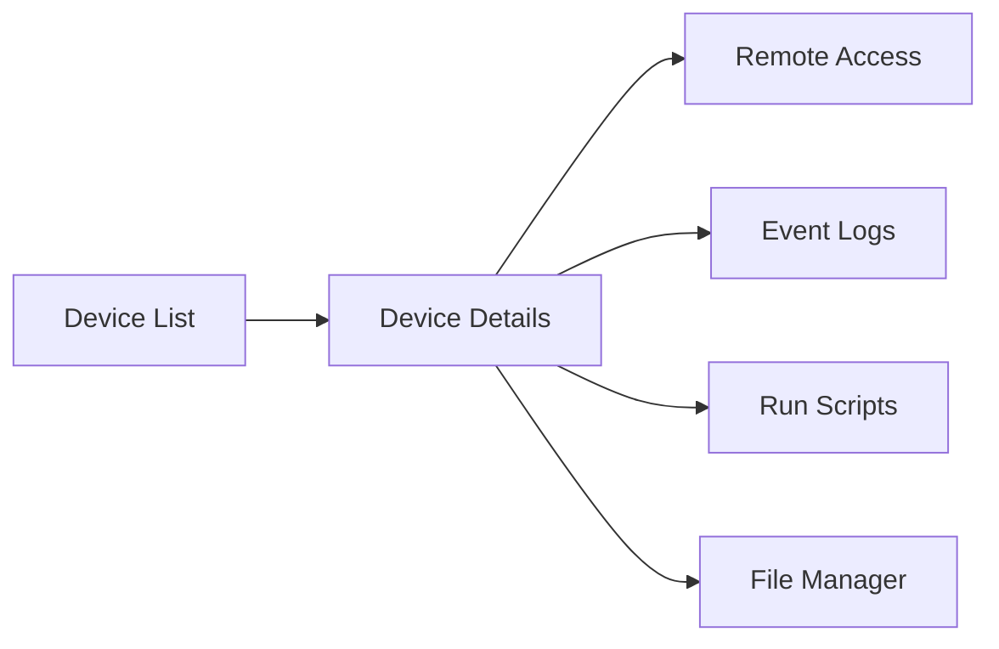

# First Steps

Welcome to OpenFrame! This guide walks you through the first 5 essential steps after installation to get you productive with the platform.

> **Prerequisites**: Complete the [Quick Start Guide](quick-start.md) before proceeding.

## Step 1: Complete Initial Setup

### Organization Configuration

After your first login, you'll be guided through organization setup:

1. **Organization Details**
   - Company name and description
   - Contact information
   - Address details
   - Billing information (if applicable)

2. **Tenant Configuration**
   - Tenant domain (your unique subdomain)
   - Default timezone and locale
   - Data retention policies

3. **Admin User Setup**
   - Your admin profile
   - Notification preferences
   - Security settings (2FA recommended)

### Verify Core Services

Check that all services are operational:

```bash
# Quick health check
curl http://localhost:8081/health

# Detailed service status
./scripts/health-check.sh
```

Expected output showing all services as `UP`:
```json
{
  "status": "UP",
  "components": {
    "mongodb": {"status": "UP"},
    "redis": {"status": "UP"},
    "kafka": {"status": "UP"}
  }
}
```

## Step 2: Configure Authentication

### Single Sign-On (SSO) Setup

Configure SSO for your team members:

1. **Navigate to Settings > SSO Configuration**

2. **Choose Your Provider**:
   - Google Workspace
   - Microsoft Azure AD
   - Generic OIDC provider

3. **Configure Provider Details**:
   ```bash
   # Example for Google SSO
   Client ID: your-google-client-id
   Client Secret: your-google-client-secret
   Domain: your-company.com
   ```

4. **Test SSO Connection**:
   - Use the "Test Connection" button
   - Verify domain mapping works correctly

### API Keys for Integrations

Generate API keys for external services:

1. **Go to Settings > API Keys**
2. **Create New API Key**:
   - Name: "External Integration"
   - Permissions: Select appropriate scopes
   - Expiration: Set based on security policy

3. **Copy the generated key** (shown only once):
   ```
   ofk_1234567890abcdef...
   ```

## Step 3: Connect Your First MSP Tools

### Supported Integrations

OpenFrame integrates with popular MSP tools:

| Tool | Type | Status |
|------|------|--------|
| **Tactical RMM** | RMM | ✅ Native integration |
| **Fleet MDM** | Device management | ✅ Native integration |
| **MeshCentral** | Remote access | ✅ Native integration |
| **ConnectWise** | PSA | 🔄 API integration |
| **Datto** | RMM/Backup | 🔄 API integration |

### Configure Tactical RMM (Example)

1. **Navigate to Settings > Integrated Tools**

2. **Add Tactical RMM Connection**:
   ```bash
   Server URL: https://your-trmm-server.com
   API Key: your-trmm-api-key
   Username: your-trmm-username
   ```

3. **Test Connection**:
   - Click "Test Connection"
   - Verify agent data synchronization

4. **Configure Sync Settings**:
   - Sync interval: Every 5 minutes (recommended)
   - Data retention: 30 days
   - Event filtering: Critical and Warning events

### Verify Tool Integration

Check that data is flowing correctly:

```bash
# Check integrated tool connections
curl -H "Authorization: Bearer YOUR_API_KEY" \
  http://localhost:8081/api/v1/tools

# Verify device data sync  
curl -H "Authorization: Bearer YOUR_API_KEY" \
  http://localhost:8081/api/v1/devices
```

## Step 4: Set Up Monitoring and Alerts

### Device Monitoring

Configure device monitoring policies:

1. **Navigate to Devices > Policies**

2. **Create Monitoring Policy**:
   - Name: "Standard Server Monitoring"
   - CPU threshold: 80%
   - Memory threshold: 85%
   - Disk space threshold: 90%
   - Network connectivity checks

3. **Assign to Device Groups**:
   - Apply to all servers
   - Set different policies for workstations

### Event Processing

Configure how events are processed:

1. **Go to Settings > Event Processing**

2. **Set Processing Rules**:
   ```yaml
   # Example processing rule
   - name: "Critical Server Alert"
     conditions:
       - severity: "CRITICAL"
       - device_type: "SERVER"
     actions:
       - create_ticket: true
       - notify_admin: true
       - escalate_after: "15 minutes"
   ```

3. **Test Event Flow**:
   - Generate test events
   - Verify alerts are created
   - Check notification delivery

### AI Agent Configuration

Configure Mingo AI for automated responses:

1. **Navigate to Settings > AI Configuration**

2. **Enable AI Features**:
   - Auto-ticket creation: Enable
   - Response suggestions: Enable
   - Automated resolutions: Enable for low-priority issues

3. **Set AI Policies**:
   - Response time targets
   - Escalation rules
   - Approval requirements

## Step 5: Explore Key Features

### Dashboard Overview

The main dashboard provides:

- **Device Health Summary**: Overview of all monitored devices
- **Recent Events**: Latest system events and alerts
- **Ticket Status**: Open tickets and resolution metrics
- **Performance Metrics**: System performance indicators

### Device Management

Explore device management capabilities:



### Ticketing System

Understand the AI-powered ticketing workflow:

1. **Event Detection**: Automated monitoring detects issues
2. **Ticket Creation**: Mingo AI creates structured tickets
3. **Initial Analysis**: AI provides diagnostic information
4. **Resolution Suggestions**: AI recommends fixes
5. **Human Review**: Technician approves or modifies
6. **Automated Resolution**: For approved simple fixes

### Real-Time Features

Test real-time functionality:

1. **Live Device Status**: Watch devices update in real-time
2. **Event Stream**: See events as they occur
3. **Chat Integration**: Test AI assistant conversations
4. **WebSocket Connections**: Verify real-time data flow

## Configuration Verification

### Test Core Functionality

Run these verification steps:

```bash
# 1. Test authentication
curl -X POST http://localhost:8081/auth/login \
  -H "Content-Type: application/json" \
  -d '{"email":"your-email","password":"your-password"}'

# 2. Test GraphQL API
curl -X POST http://localhost:8081/graphql \
  -H "Authorization: Bearer YOUR_TOKEN" \
  -d '{"query":"query { devices { id name status } }"}'

# 3. Test device management
curl -H "Authorization: Bearer YOUR_TOKEN" \
  http://localhost:8081/api/v1/devices

# 4. Test event streaming
curl -H "Authorization: Bearer YOUR_TOKEN" \
  http://localhost:8081/api/v1/events
```

### Performance Check

Monitor system performance:

```bash
# Check service memory usage
docker stats

# Monitor database performance
mongosh --eval "db.adminCommand('serverStatus')"

# Verify Kafka message flow
docker logs openframe-kafka | tail -20
```

## Next Steps by Role

### For MSP Administrators
- Configure client organizations
- Set up billing and reporting
- Define service level agreements
- Create user roles and permissions

### For Technicians  
- Learn the ticketing interface
- Practice with AI-assisted troubleshooting
- Set up personal dashboards
- Configure notification preferences

### For Developers
- Explore the GraphQL schema
- Set up development environment
- Review API documentation
- Create custom integrations

## Common First-Day Tasks

### Essential Configurations

- [ ] Complete organization setup
- [ ] Configure SSO authentication  
- [ ] Connect first MSP tool integration
- [ ] Set up basic monitoring policies
- [ ] Create initial user accounts
- [ ] Test alert notifications
- [ ] Verify data synchronization

### Optional Enhancements

- [ ] Configure custom dashboards
- [ ] Set up advanced AI policies
- [ ] Create custom device groups
- [ ] Configure backup strategies
- [ ] Set up external integrations
- [ ] Create automation workflows

## Troubleshooting First Steps

### Common Issues

**Authentication Problems**
```bash
# Check JWT configuration
grep -r "jwt.secret" openframe/services/*/src/main/resources/

# Verify OAuth2 setup
curl http://localhost:8082/.well-known/openid_configuration
```

**Integration Issues**
```bash
# Check tool connection logs
docker logs openframe-api | grep -i "integration\|tool"

# Test external API connectivity
curl -v https://your-tool-server.com/api/health
```

**Performance Problems**
```bash
# Check resource usage
top -p $(pgrep -f "openframe")

# Monitor database connections
mongosh --eval "db.adminCommand('connPoolStats')"
```

## Getting Help

### Documentation Resources
- Architecture guides for system understanding
- API documentation for integration work
- Troubleshooting guides for common issues

### Community Support
- **OpenMSP Slack**: Join at [openmsp.ai](https://www.openmsp.ai/)
- **GitHub Issues**: Report bugs and feature requests
- **Community Forums**: Share knowledge and best practices

### Learning Resources
- Video tutorials and walkthroughs
- Best practices guides
- Integration examples and templates

---

**🎯 Success!** You've completed the essential first steps. OpenFrame is now configured and ready for production use.

Continue with [Development Setup](../development/setup/environment.md) if you plan to extend the platform, or explore the architecture guides to understand the system better.