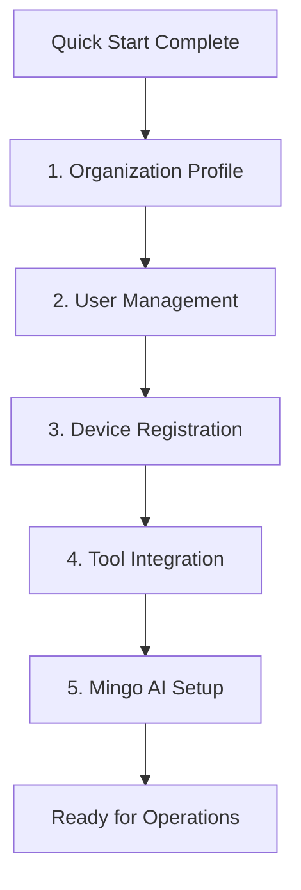

# First Steps with OpenFrame

Now that OpenFrame is running, let's walk through the essential first steps to get your MSP platform operational. This guide covers the first 5 critical tasks every OpenFrame administrator should complete.

## Overview

After completing the [Quick Start](quick-start.md), you'll configure OpenFrame for your specific MSP environment. These first steps establish the foundation for device management, client organizations, and AI-powered automation.



## 1. Complete Your Organization Profile

### Access Organization Settings

1. Log into OpenFrame at http://localhost:8080
2. Navigate to **Settings** → **Company and Users**
3. Click **"Edit Organization Profile"**

### Essential Organization Information

Fill in these critical details:

**Basic Information:**
- **Organization Name**: Your MSP company name
- **Domain**: Your primary business domain (e.g., `yourmsp.com`)
- **Industry**: Managed Service Provider
- **Size**: Number of employees/technicians

**Contact Information:**
- **Primary Email**: Support or admin contact
- **Phone Number**: Main business line
- **Address**: Business headquarters

**Branding (Optional):**
- Upload your company logo
- Set brand colors for client-facing interfaces
- Configure email templates with your branding

> **💡 Pro Tip**: Complete organization branding now - it affects all client communications and reports.

## 2. Set Up User Management & Invitations

### Invite Team Members

Add your technicians and administrators:

1. Go to **Settings** → **Company and Users** → **Users**
2. Click **"Invite Users"**
3. Enter email addresses (one per line):
   ```text
   tech1@yourmsp.com
   tech2@yourmsp.com
   manager@yourmsp.com
   ```
4. Assign roles:
   - **Admin**: Full access, user management
   - **Technician**: Device management, ticketing
   - **Viewer**: Read-only access to dashboards

### Configure Single Sign-On (Optional)

For larger teams, set up SSO integration:

1. Navigate to **Settings** → **SSO Configuration**
2. Choose your identity provider:
   - Google Workspace
   - Microsoft Azure AD
   - Generic OIDC provider
3. Follow the provider-specific setup wizard
4. Test SSO login with a test account

### User Role Permissions

| Role | Devices | Organizations | Users | Settings | AI Chat |
|------|---------|---------------|-------|----------|---------|
| **Admin** | ✅ Full | ✅ Full | ✅ Full | ✅ Full | ✅ Full |
| **Technician** | ✅ Manage | ✅ View | ❌ None | ❌ None | ✅ Full |
| **Viewer** | ✅ View | ✅ View | ❌ None | ❌ None | ✅ Limited |

## 3. Register Your First Devices

### Download the OpenFrame Agent

1. Navigate to **Devices** → **New Device**
2. Select your operating system:
   - **Windows**: Download `.msi` installer
   - **macOS**: Download `.pkg` installer  
   - **Linux**: Download `.deb` or `.rpm` package
3. Note the **Registration Secret** (required for agent setup)

### Install the Agent

**Windows:**
```powershell
# Run as Administrator
msiexec /i openframe-agent-windows-x64.msi REGISTRATION_SECRET="your_secret_here"
```

**macOS:**
```bash
# Install package
sudo installer -pkg openframe-agent-macos.pkg -target /

# Configure with secret
sudo openframe-agent configure --secret "your_secret_here"
```

**Linux (Ubuntu/Debian):**
```bash
# Install package
sudo dpkg -i openframe-agent-linux-amd64.deb

# Configure registration
sudo openframe-agent register --secret "your_secret_here"

# Start service
sudo systemctl enable --now openframe-agent
```

### Verify Device Registration

After agent installation:

1. Check **Devices** dashboard for new entries
2. Verify device status shows **"Online"**
3. Confirm system information is populated
4. Test remote connectivity

Expected device information:
- Hostname and OS version
- CPU, memory, and disk usage
- Network interfaces and IP addresses
- Installed software inventory

## 4. Configure Tool Integrations

### Enable Tactical RMM (Recommended)

Tactical RMM provides comprehensive endpoint management:

1. Navigate to **Settings** → **Integrations**
2. Click **"Configure Tactical RMM"**
3. Enter your Tactical RMM details:
   - **URL**: `https://your-trmm-server.com`
   - **API Key**: Generated from Tactical RMM admin
   - **Username**: Service account username
4. Click **"Test Connection"**
5. Enable **"Sync Devices"** and **"Import Scripts"**

### Set Up MeshCentral (Optional)

For remote desktop and file management:

1. Go to **Settings** → **Integrations** → **MeshCentral**
2. Configure connection:
   - **Server URL**: `https://your-meshcentral.com`
   - **Username**: Admin account
   - **Password**: Admin password
3. Test remote desktop functionality

### Available Integrations

| Tool | Purpose | Setup Complexity | Recommended |
|------|---------|------------------|-------------|
| **Tactical RMM** | Endpoint management | Medium | ✅ Essential |
| **MeshCentral** | Remote access | Low | ✅ Highly recommended |
| **Fleet MDM** | Mobile device management | High | 📱 If using mobile |
| **Authentik** | Identity management | High | 🏢 Enterprise setups |

## 5. Initialize Mingo AI Assistant

### Configure AI Provider

OpenFrame's Mingo AI requires an AI provider:

1. Navigate to **Settings** → **AI Settings**
2. Choose your AI provider:
   - **OpenAI** (GPT-4, recommended)
   - **Azure OpenAI** 
   - **Google Gemini**
   - **Claude** (Anthropic)
3. Enter your API credentials
4. Select model preferences:
   - **Default Model**: `gpt-4o` or `claude-3.5-sonnet`
   - **Fallback Model**: `gpt-4o-mini` for cost efficiency

### Set AI Guardrails

Configure enterprise safety controls:

1. **Content Filtering**:
   - Enable **"Block inappropriate content"**
   - Set **"Conservative"** safety level
2. **Data Protection**:
   - Enable **"Anonymize sensitive data"**
   - Configure **"Data retention"** (7-30 days recommended)
3. **Usage Controls**:
   - Set **"Daily query limits"** per user
   - Enable **"Admin approval for sensitive actions"**

### Test Mingo AI

1. Open the **Mingo Chat** interface
2. Try these test queries:
   ```text
   "Show me device health summary"
   "What alerts need attention?"
   "Help me troubleshoot high CPU usage"
   ```
3. Verify responses are accurate and helpful
4. Check that sensitive information is properly filtered

## 6. Validate Your Setup

### Run System Health Check

```bash
# Check all services
curl http://localhost:8088/health

# Verify GraphQL API
curl -X POST http://localhost:8082/graphql \
  -H "Content-Type: application/json" \
  -d '{"query":"{ devices { id hostname status } }"}'
```

### Dashboard Verification

Your OpenFrame dashboard should now show:

- ✅ **Organization** profile complete with branding
- ✅ **Users** invited and assigned appropriate roles
- ✅ **Devices** registered and reporting status
- ✅ **Integrations** connected and syncing data
- ✅ **Mingo AI** responding to queries with guardrails active

### Performance Baseline

Record these initial metrics:
- **Device Count**: ___ endpoints registered
- **User Count**: ___ team members added
- **Integration Count**: ___ tools connected
- **Response Time**: Average API response < 200ms
- **Uptime**: 99.9% service availability

## Common First-Week Tasks

After completing these first steps, you'll typically want to:

### Week 1 Priorities
1. **Import existing client data** from legacy tools
2. **Set up monitoring alerts** for critical thresholds
3. **Create automation scripts** for common tasks
4. **Train team members** on the OpenFrame interface
5. **Configure backup procedures** for OpenFrame data

### Automation Quick Wins
- **Auto-patch management** for critical updates
- **Disk space monitoring** with automated cleanup
- **Service restart policies** for failed applications
- **Security scan automation** with weekly reports

## Getting Help

### Self-Help Resources
- **Built-in Help**: Click the `?` icon in any interface
- **AI Assistant**: Ask Mingo for system guidance
- **Documentation**: Comprehensive guides in `/docs`

### Community Support
- **OpenMSP Slack**: [Join the community](https://join.slack.com/t/openmsp/shared_invite/zt-36bl7mx0h-3~U2nFH6nqHqoTPXMaHEHA)
- **Community Calls**: Weekly technical discussions
- **GitHub Issues**: Bug reports and feature requests

## Next Steps

Congratulations! You've successfully configured OpenFrame for your MSP operations. You're now ready to:

- **Explore advanced features** in specialized guides
- **Scale your deployment** for production use
- **Customize workflows** for your specific needs
- **Integrate additional tools** as your requirements grow

---

**🚀 You're Ready!** OpenFrame is now configured and operational. Your unified MSP platform is ready to transform your service delivery with AI-powered automation!