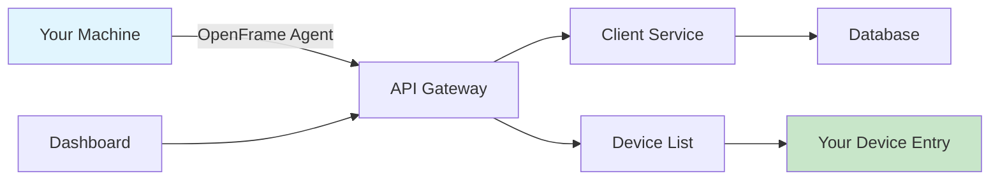

# First Steps with OpenFrame

Now that OpenFrame is running, let's configure your environment and explore the core features. This guide walks you through the essential tasks every OpenFrame administrator should complete.

## Overview

After completing the [Quick Start Guide](quick-start.md), you'll accomplish these key tasks:

1. **Configure your organization** - Set up company details and preferences
2. **Deploy system agents** - Connect devices to OpenFrame management
3. **Explore the dashboard** - Understand the main interface
4. **Set up user management** - Add team members and configure access
5. **Test core features** - Verify device management, logging, and automation

Let's get started!

## Step 1: Complete Organization Setup

### Access the Settings Page

1. **Navigate to Settings**: Click the gear icon (⚙️) in the main navigation
2. **Select Company & Users tab**: Configure your organization details

### Configure Company Information

```text
Organization Name: [Your Company Name]
Organization Type: [MSP Provider | Internal IT | System Integrator]
Primary Contact: [Your Email]
Phone: [Your Contact Number]
Time Zone: [Your Local Time Zone]
```

### Set Up Address Information

```text
Street Address: [Your Business Address]
City: [Your City]
State/Province: [Your State]
Postal Code: [Your ZIP/Postal Code]
Country: [Your Country]
```

> **Why this matters**: Organization details are used for tenant isolation, reporting, and client communication.

## Step 2: Deploy OpenFrame Agents

OpenFrame agents provide the connection between your devices and the central platform.

### Download the OpenFrame CLI

The OpenFrame CLI manages agent deployment and configuration:

```bash
# Download latest CLI (replace with your platform)
curl -L https://github.com/flamingo-stack/openframe-cli/releases/latest/download/openframe-linux -o openframe
chmod +x openframe

# Verify installation
./openframe version
```

### Register Your First Device

```bash
# Register this machine with OpenFrame
./openframe register \
  --url http://localhost:8080 \
  --org "Your Organization Name" \
  --name "$(hostname)" \
  --tags "development,server"

# Verify registration
./openframe status
# Should show: ✅ Connected to OpenFrame at http://localhost:8080
```

### Verify Device Appears in Dashboard

1. **Navigate to Devices**: Click "Devices" in the main navigation
2. **Find your machine**: Look for the hostname you registered
3. **Check connection status**: Should show "Online" with a green indicator



## Step 3: Explore the OpenFrame Dashboard

### Main Navigation Overview

| Section | Purpose | Key Features |
|---------|---------|--------------|
| **Dashboard** | Overview and metrics | Device status, recent activity, alerts |
| **Devices** | Device management | Agent status, remote access, file management |
| **Logs** | Log aggregation | Centralized logging, search, filtering |
| **Scripts** | Automation | Script deployment, scheduling, results |
| **Organizations** | Multi-tenant management | Organization CRUD, relationships |
| **Tickets** | AI-assisted support | Mingo AI chat, ticket management |
| **Settings** | Configuration | Users, API keys, integrations |

### Dashboard Widgets

After agent deployment, your dashboard should display:

1. **Device Overview**: Total devices, online status, recent connections
2. **Recent Activity**: Latest agent registrations and status changes  
3. **System Health**: Service status indicators
4. **Quick Actions**: Common tasks and shortcuts

### Device Details Deep Dive

Click on your registered device to explore:

1. **Overview Tab**: Basic device information, hardware specs
2. **Logs Tab**: Real-time log streaming from the device
3. **Files Tab**: Remote file browser and management
4. **Scripts Tab**: Run automation scripts on the device
5. **Remote Tab**: Remote desktop/terminal access (when configured)

## Step 4: Set Up User Management

### Create Additional Users

1. **Go to Settings > Company & Users**
2. **Click "Invite Users"**
3. **Add team member details**:
   ```text
   Email: teammate@yourcompany.com
   Role: Administrator | Technician | Read Only
   Organizations: [Select which orgs they can access]
   ```

### Configure User Roles

| Role | Permissions | Use Case |
|------|-------------|----------|
| **Administrator** | Full system access | IT managers, MSP owners |
| **Technician** | Device management, scripts | Front-line IT staff |
| **Read Only** | View-only access | Managers, auditors |

### Set Up SSO (Optional)

For enterprise environments, configure Single Sign-On:

1. **Navigate to Settings > SSO Configuration**
2. **Choose your provider**: Google, Microsoft, SAML
3. **Enter configuration details**:
   ```text
   Provider: Google Workspace
   Client ID: [Your OAuth Client ID]
   Client Secret: [Your OAuth Client Secret]
   Allowed Domains: yourcompany.com
   ```

## Step 5: Test Core Features

### Test 1: Device Communication

Verify your agent is communicating properly:

```bash
# Check agent status
./openframe status

# Send test heartbeat
./openframe heartbeat

# View agent logs
./openframe logs --tail 20
```

**Expected Result**: Dashboard shows device as "Online" with recent activity timestamp.

### Test 2: Log Aggregation

Generate and view logs:

1. **Generate test logs** on your device:
   ```bash
   # Linux/macOS
   logger "OpenFrame test log entry - $(date)"
   
   # Windows PowerShell
   Write-EventLog -LogName Application -Source "OpenFrame" -EventId 1001 -Message "Test log entry"
   ```

2. **View logs in dashboard**:
   - Navigate to "Logs" section
   - Filter by your device name
   - Look for your test log entry

### Test 3: Script Execution

Deploy and run a simple script:

1. **Go to Scripts section**
2. **Click "Create Script"**
3. **Enter script details**:
   ```bash
   Name: System Info Check
   Type: Shell Script
   Content: 
   #!/bin/bash
   echo "System: $(uname -a)"
   echo "Uptime: $(uptime)"
   echo "Memory: $(free -h | grep Mem)"
   ```

4. **Deploy to your device**
5. **Execute and review output**

### Test 4: Real-time Updates

1. **Open two browser tabs**: One showing the dashboard, another showing device details
2. **Disconnect the agent**: Stop the openframe process
3. **Observe status changes**: Both tabs should show the device going offline
4. **Reconnect the agent**: Restart the openframe process
5. **Verify recovery**: Both tabs should show the device coming back online

## Step 6: Explore Advanced Features

### Mingo AI Assistant

Try the AI-powered troubleshooting assistant:

1. **Navigate to Tickets section**
2. **Click "New Chat with Mingo"**
3. **Ask a question**: "Show me the status of all my devices"
4. **Explore capabilities**: Mingo can help with diagnostics, automation, and knowledge queries

### API Exploration

OpenFrame provides GraphQL APIs for integration:

1. **Access GraphQL Playground**: http://localhost:8080/graphiql
2. **Try sample queries**:
   ```graphql
   query GetDevices {
     devices {
       edges {
         node {
           id
           name
           status
           lastSeen
           operatingSystem
         }
       }
     }
   }
   ```

### File Management

Test remote file access:

1. **Go to your device details**
2. **Click "Files" tab**
3. **Browse remote filesystem**: Navigate through directories
4. **Upload test file**: Try uploading a small file
5. **Download file**: Download a file from the remote device

## Common First-Time Issues

### Issue: Agent Won't Connect

**Symptoms**: Device doesn't appear in dashboard, agent shows connection errors

**Solutions**:
```bash
# Check network connectivity
curl -v http://localhost:8080/health

# Verify organization name matches exactly
./openframe register --org "Exact Organization Name"

# Check for firewall issues
sudo ufw status  # Linux
Get-NetFirewallProfile  # Windows
```

### Issue: Logs Not Appearing

**Symptoms**: No logs visible in dashboard despite generating log entries

**Solutions**:
1. **Check log configuration**: Ensure syslog is configured correctly
2. **Verify log permissions**: Agent needs read access to log files
3. **Check filtering**: Remove any filters in the logs dashboard
4. **Wait for sync**: Initial log sync can take 1-2 minutes

### Issue: Scripts Fail to Execute

**Symptoms**: Script deployment or execution fails

**Solutions**:
```bash
# Check script permissions
ls -la /path/to/script

# Verify execution environment
./openframe exec "which bash"  # Linux/macOS
./openframe exec "Get-Command powershell"  # Windows

# Check script syntax
bash -n your-script.sh  # Bash syntax check
```

### Issue: Dashboard Performance

**Symptoms**: Slow loading, timeouts, high resource usage

**Solutions**:
```bash
# Check system resources
docker stats
htop  # or Task Manager on Windows

# Restart services if needed
./scripts/run-linux.sh --restart

# Reduce data polling frequency (in settings)
```

## Next Steps

Congratulations! You've successfully configured OpenFrame and verified its core functionality. Here's what to explore next:

### Immediate Actions
1. **Add more devices**: Deploy agents to additional machines
2. **Create automation scripts**: Build scripts for common maintenance tasks
3. **Set up monitoring**: Configure alerts for device status changes
4. **Explore integrations**: Connect external tools and services

### Learning Path
1. **Development Setup**: Set up a development environment for customization
2. **Architecture Deep Dive**: Learn how OpenFrame components interact
3. **API Integration**: Build custom integrations with the OpenFrame API
4. **Production Deployment**: Plan and execute a production deployment

### Advanced Features
1. **Multi-tenancy**: Set up multiple organizations
2. **Custom Authentication**: Integrate with your existing identity provider  
3. **Compliance**: Configure audit logging and compliance reporting
4. **Scaling**: Deploy OpenFrame across multiple nodes

## Getting Help

Need assistance? Here are your best resources:

- **Documentation**: Comprehensive guides for every feature
- **Community**: Join our [Slack workspace](https://join.slack.com/t/openmsp/shared_invite/zt-36bl7mx0h-3~U2nFH6nqHqoTPXMaHEHA)
- **GitHub Issues**: Report bugs and request features
- **Support**: Professional support available for enterprise deployments

---

**Well done!** You've successfully configured OpenFrame and verified its core functionality. You're now ready to leverage OpenFrame's full capabilities for your IT management needs.