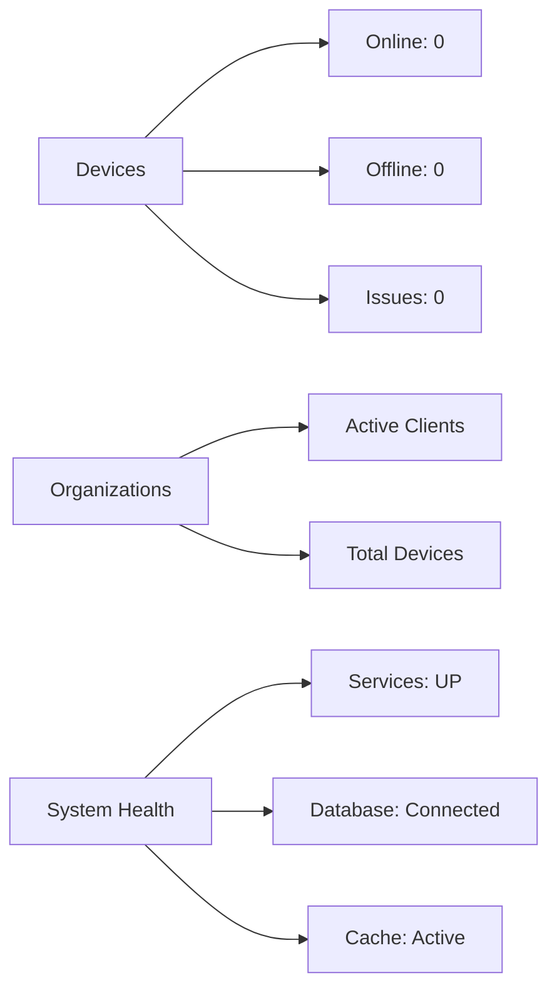
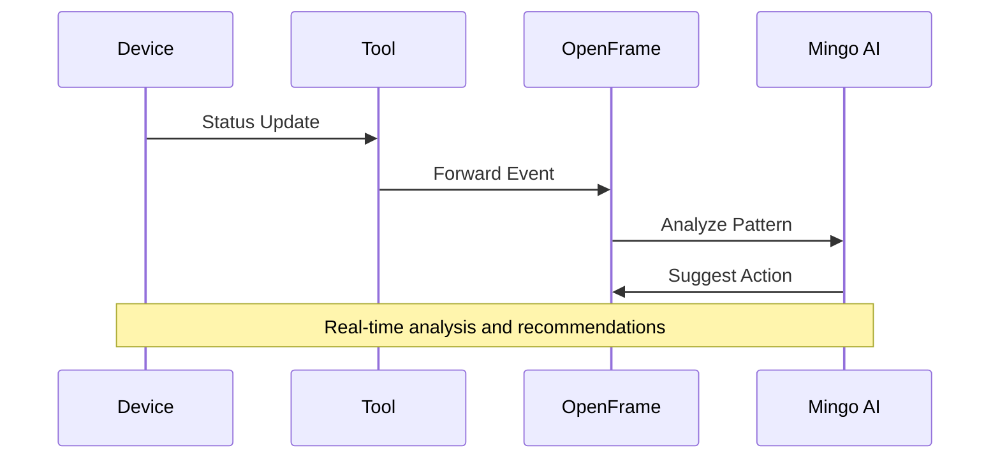
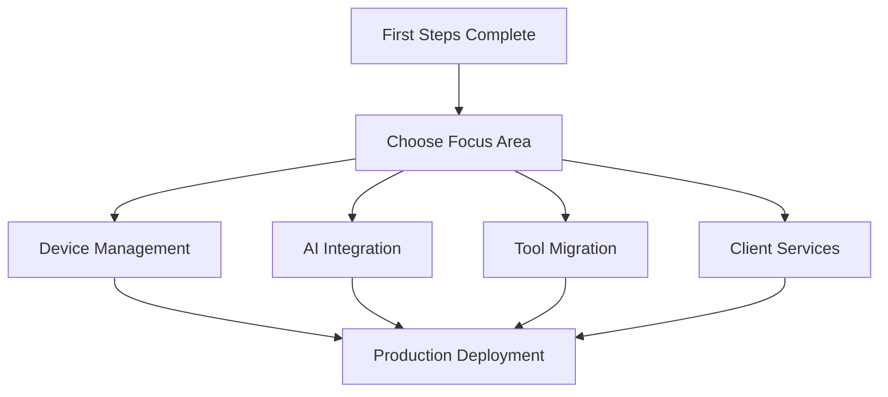

# First Steps with OpenFrame

Now that OpenFrame is running, let's explore its key features and capabilities. This guide walks you through the first 5 things you should do to get familiar with the platform.

[](https://www.youtube.com/watch?v=mAi4qqA8b00)

## 1. Explore the Dashboard

The OpenFrame dashboard is your mission control center.

### Navigate to Dashboard
- **URL**: http://localhost:3000/dashboard
- **Login**: Use the account you created during quick start

### Dashboard Components

| Section | Description | What to Look For |
|---------|-------------|-------------------|
| **Device Overview** | Summary of managed devices | Count, status distribution, recent activity |
| **Organizations** | Client organizations you manage | Active clients, device counts per organization |
| **Recent Logs** | Latest system and tool events | Error patterns, tool integrations, system health |
| **Quick Actions** | Common tasks and shortcuts | Add device, create organization, run scripts |

### Key Metrics to Monitor



## 2. Meet Mingo AI - Your Intelligent Assistant

Mingo AI is OpenFrame's intelligent assistant for technicians, providing contextual help and automation.

### Access Mingo AI
1. **Navigate to Chat**: Click the chat icon in the navigation or visit `/mingo`
2. **Start Conversation**: Click "New Chat" or existing conversation
3. **First Interaction**: Try asking "What can you help me with?"

### Sample Conversations to Try

**System Information:**
```
You: "Show me system health status"
Mingo: [Provides current service status, database connections, and alerts]
```

**Device Management:**
```
You: "How do I add a new device to monitoring?"
Mingo: [Explains device registration process with step-by-step instructions]
```

**Troubleshooting:**
```
You: "I'm seeing authentication errors in the logs"
Mingo: [Analyzes recent logs and suggests troubleshooting steps]
```

### Mingo AI Features

- **Contextual Help**: Understands your current page and tasks
- **Log Analysis**: Can analyze system logs and suggest solutions  
- **Device Insights**: Provides device-specific recommendations
- **Task Automation**: Helps automate routine MSP tasks
- **Learning**: Improves responses based on your patterns

## 3. Create Your First Organization

Organizations represent your MSP clients. Let's create one to organize devices and users.

### Create Organization

1. **Navigate**: Go to Organizations section
2. **New Organization**: Click "Add Organization" button
3. **Fill Details**:

```text
Organization Name: Demo Tech Company
Business Type: Technology Services
Primary Contact: John Smith
Email: john@demotechcompany.com
Phone: (555) 123-4567

Address:
123 Main Street
Suite 100
Anytown, ST 12345
```

### Organization Configuration

After creation, configure:

| Setting | Purpose | Recommendation |
|---------|---------|----------------|
| **Device Groups** | Organize devices by function | Servers, Workstations, Network |
| **Contact Roles** | Define contact responsibilities | Primary, Technical, Billing |
| **Service Level** | Set support expectations | Standard, Premium, Enterprise |
| **Monitoring Policies** | Define monitoring rules | Business hours, alert thresholds |

## 4. Add Integration with External Tools

OpenFrame's power comes from integrating with existing MSP tools.

### Supported Integrations

| Tool | Purpose | Status | Setup Difficulty |
|------|---------|--------|------------------|
| **TacticalRMM** | RMM platform | ✅ Full Support | Easy |
| **FleetDM** | Device management | ✅ Full Support | Easy |
| **MeshCentral** | Remote access | ✅ Full Support | Medium |
| **Authentik** | Identity provider | ✅ Full Support | Medium |

### Setup TacticalRMM Integration (Example)

1. **Configure Environment Variables**:
```bash
# Add to your .env file
TACTICAL_RMM_URL=https://your-tactical-rmm.example.com
TACTICAL_RMM_TOKEN=your-api-token-here
```

2. **Restart Services**:
```bash
# Restart the relevant services to pick up new configuration
./scripts/restart-services.sh
```

3. **Verify Integration**:
- Navigate to Settings → Integrations
- Check TacticalRMM status shows "Connected"
- Look for imported devices in Devices section

### Integration Benefits

Once integrated, you'll see:
- **Unified Device View**: All tools' devices in one interface
- **Centralized Logging**: Logs from all tools in OpenFrame
- **AI Enhancement**: Mingo can provide insights across all tools
- **Single Sign-On**: Access all tools through OpenFrame

## 5. Explore Log Analysis and Monitoring

OpenFrame provides powerful log analysis and real-time monitoring capabilities.

### Access Logs
- **Navigate**: Go to Logs section
- **Real-time View**: See live log stream from all integrated tools
- **Search & Filter**: Use advanced filtering to find specific events

### Log Categories

| Category | Source | Use Cases |
|----------|--------|-----------|
| **System Logs** | OpenFrame services | Service health, authentication, errors |
| **Device Logs** | Connected devices | Device health, performance, issues |
| **Tool Logs** | Integrated tools | Tool-specific events and actions |
| **Security Logs** | Auth and access | Login attempts, permission changes |

### Key Log Patterns to Watch



### Log Analysis Features

**Search Examples:**
```
severity:ERROR                    # Find all errors
source:tactical-rmm              # Logs from TacticalRMM
device:DESKTOP-ABC123            # Specific device logs  
timeRange:last-24h               # Recent events
```

**AI-Powered Insights:**
- **Pattern Detection**: Mingo identifies recurring issues
- **Root Cause Analysis**: Correlates events across tools
- **Predictive Alerts**: Warns about potential problems
- **Resolution Suggestions**: Recommends fixes based on patterns

## Initial Configuration Checklist

Before diving deeper, complete these configuration tasks:

### Essential Settings

- [ ] **User Profile**: Complete your profile information
- [ ] **Organization Setup**: Create at least one client organization
- [ ] **Tool Integration**: Connect one external MSP tool
- [ ] **Notification Preferences**: Configure alert settings
- [ ] **Security Settings**: Review authentication options

### Optional Enhancements

- [ ] **Custom Dashboard**: Customize widgets for your workflow
- [ ] **Alert Rules**: Set up custom monitoring alerts
- [ ] **API Keys**: Generate keys for external integrations
- [ ] **User Invitations**: Invite team members to collaborate
- [ ] **Backup Configuration**: Set up data backup preferences

## Explore Advanced Features

### Device Management
- **Remote Access**: Connect to devices through MeshCentral
- **Script Execution**: Run maintenance scripts remotely
- **Software Management**: Install/update software packages
- **Compliance Monitoring**: Track security and policy compliance

### Automation & AI
- **Workflow Automation**: Create automated response workflows
- **AI Policies**: Configure Mingo's behavior and permissions
- **Approval Workflows**: Set up AI action approval processes
- **Custom Scripts**: Develop organization-specific automations

### Reporting & Analytics
- **Performance Reports**: Generate client performance reports
- **Cost Analysis**: Track tool costs and ROI
- **Trend Analysis**: Identify patterns in device and service health
- **Custom Dashboards**: Build client-specific dashboards

## Common Initial Tasks

### For MSP Owners
1. Set up client organizations
2. Configure billing and service levels
3. Establish monitoring policies
4. Train team on Mingo AI capabilities

### For Technicians  
1. Familiarize with unified device view
2. Learn Mingo AI commands and capabilities
3. Set up personal alert preferences
4. Practice using integrated tool access

### For Clients (when deployed)
1. Access Fae AI for self-service support
2. Review device status and reports
3. Submit service requests through AI
4. Understand escalation procedures

## Getting Help and Support

### Built-in Help
- **Mingo AI**: Ask questions directly in chat
- **Contextual Help**: Look for "?" icons throughout the interface
- **Tooltips**: Hover over buttons and fields for explanations

### Community Resources
- **OpenMSP Slack**: [Join the community](https://join.slack.com/t/openmsp/shared_invite/zt-36bl7mx0h-3~U2nFH6nqHqoTPXMaHEHA)
- **Documentation**: Comprehensive guides and API references
- **GitHub Discussions**: Technical questions and feature requests
- **OpenFrame Blog**: Latest updates and best practices

### Enterprise Support
- **Flamingo Platform**: Enterprise features and support
- **Professional Services**: Implementation and customization help
- **Training Programs**: Team training and certification

## Next Steps

After completing these first steps:

1. **Deep Dive into Features**: Explore specific areas that match your needs
2. **Plan Tool Migrations**: Develop a strategy for replacing proprietary tools
3. **Team Training**: Ensure your team is comfortable with the platform
4. **Client Onboarding**: Start moving clients to the new platform
5. **Customization**: Tailor OpenFrame to your specific workflows

### Recommended Learning Path



---

*🚀 **You're ready to harness OpenFrame's power!** Continue exploring specific features or join the [OpenMSP Community](https://www.openmsp.ai/) for advanced tips and best practices.*