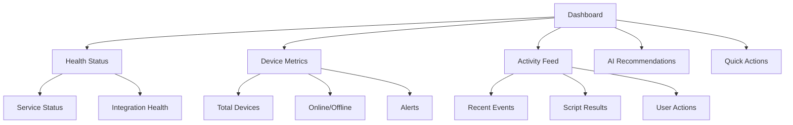
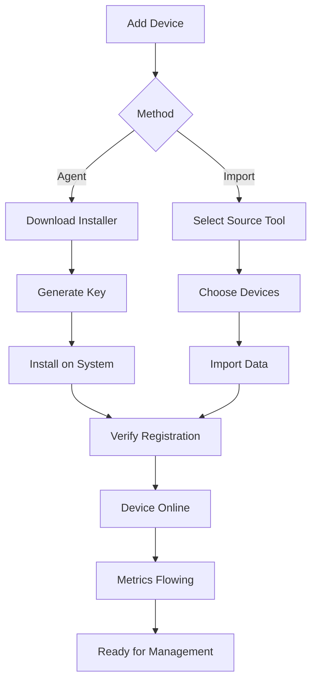

# First Steps Guide

Welcome to OpenFrame! Now that you have the platform running, this guide will walk you through the essential first steps to configure your instance and start managing your IT infrastructure.

> **Prerequisites**: Complete the [Quick Start Guide](quick-start.md) to ensure OpenFrame is running properly.

## Overview: Your First 30 Minutes

Here's what we'll accomplish in your first session with OpenFrame:

1. **Initial Setup**: Create your admin account and organization
2. **Explore the Dashboard**: Understand the main interface and navigation
3. **Configure Integrations**: Connect your first MSP tool
4. **Add Your First Device**: Register and monitor a system
5. **Set Up Team Access**: Invite team members and configure permissions

## Step 1: Initial Platform Setup

### Create Your Admin Account

When you first visit `http://localhost:3000`, you'll see the welcome screen:

1. **Click "Get Started"** or "Create Admin Account"
2. **Fill in your details**:
   - **Email**: Your primary email address
   - **Password**: Strong password (min 8 characters)
   - **Full Name**: Your display name
   - **Organization Name**: Your company or team name

3. **Complete the setup**: Click "Create Account & Organization"


### Organization Configuration

After account creation, you'll configure your organization:

1. **Organization Details**:
   - **Name**: Your MSP or company name
   - **Domain**: Your company domain (for SSO later)
   - **Time Zone**: Select your primary time zone
   - **Contact Information**: Business address and phone

2. **Initial Settings**:
   - **Multi-tenancy**: Enable if you'll manage multiple clients
   - **Default Permissions**: Set baseline access levels
   - **Notification Preferences**: Email and alert settings

## Step 2: Explore the OpenFrame Dashboard

### Main Navigation Areas

The OpenFrame interface is organized into key sections:

| Section | Purpose | Key Features |
|---------|---------|--------------|
| **Dashboard** | Overview and metrics | System status, recent activity, alerts |
| **Devices** | Endpoint management | Device inventory, monitoring, remote access |
| **Organizations** | Client management | Multi-tenant configuration, billing, users |
| **Tickets** | Support workflow | AI-powered ticket management with Mingo |
| **Scripts** | Automation | PowerShell/Bash script management and execution |
| **Policies** | Compliance | Security policies and configuration management |
| **Logs** | Audit trail | Centralized logging and event tracking |
| **Settings** | Platform config | User management, integrations, API keys |

### Understanding the Dashboard

The main dashboard shows:

1. **System Health**: Status of all connected services and tools
2. **Device Overview**: Total devices, online status, alerts
3. **Recent Activity**: Latest events, script executions, user actions  
4. **AI Insights**: Mingo's recommendations and automated actions
5. **Quick Actions**: Common tasks like running scripts or creating tickets



### Navigation Tips

- **Breadcrumbs**: Always visible at the top for easy navigation
- **Search**: Global search in the top bar finds devices, organizations, and tickets
- **Notifications**: Bell icon shows alerts, updates, and system messages
- **User Menu**: Profile settings, logout, and account management

## Step 3: Configure Your First Integration

OpenFrame's power comes from integrating with existing MSP tools. Let's connect your first tool:

### Choose Your Integration

OpenFrame supports these primary integrations:

| Tool | Best For | Setup Difficulty |
|------|----------|------------------|
| **Tactical RMM** | Windows/Linux monitoring | Easy |
| **Fleet MDM** | Device management | Medium |
| **MeshCentral** | Remote access | Easy |
| **Authentik** | SSO and identity | Medium |

### Example: Tactical RMM Integration

1. **Navigate to Settings → Integrations**
2. **Click "Add Integration"** and select "Tactical RMM"
3. **Configure connection**:
   ```bash
   # Required information
   Server URL: https://your-tactical-rmm.com
   API Token: your-api-token-here
   Organization: your-org-name
   ```

4. **Test connection**: Click "Test Connection" to verify
5. **Save configuration**: Enable the integration

### Verify Integration

After setup, verify the integration is working:

1. **Check Integration Status**: Should show "Connected" with a green indicator
2. **View Synced Data**: Navigate to Devices to see imported systems  
3. **Test Functionality**: Try remote access or run a simple script

## Step 4: Add Your First Device

### Option A: Install OpenFrame Agent

The OpenFrame agent provides comprehensive monitoring and management:

1. **Get the installer**: Navigate to Devices → "Add Device"
2. **Download agent**: Select your platform (Windows/macOS/Linux)
3. **Generate registration key**: Copy the unique registration command
4. **Install on target system**:

   **Windows (PowerShell as Admin):**
   ```bash
   Invoke-WebRequest -Uri "https://your-openframe.com/agent/install.ps1" -OutFile install.ps1
   .\install.ps1 -RegistrationKey "your-key-here"
   ```

   **macOS/Linux:**
   ```bash
   curl -fsSL https://your-openframe.com/agent/install.sh | sudo bash -s -- --key "your-key-here"
   ```

### Option B: Import from Connected Tools

If you have existing MSP tools connected:

1. **Navigate to Devices → Import**
2. **Select source**: Choose from connected integrations
3. **Select devices**: Pick which systems to import
4. **Review and import**: Confirm the device list

### Verify Device Registration

After adding devices, verify they're properly registered:

1. **Device appears in inventory**: Check Devices section
2. **Status is "Online"**: Green indicator next to device name
3. **Data is flowing**: Metrics and logs are being collected
4. **Remote access works**: Test connection if applicable



## Step 5: Set Up Team Access

### Invite Team Members

1. **Navigate to Settings → Users & Invitations**
2. **Click "Invite User"**
3. **Fill in details**:
   - **Email**: Team member's email
   - **Role**: Admin, Technician, or View-only
   - **Organizations**: Which clients they can access (multi-tenant)
   - **Message**: Optional welcome message

4. **Send invitation**: User receives email with signup link

### Configure Roles and Permissions

OpenFrame uses role-based access control:

| Role | Permissions | Use Case |
|------|-------------|----------|
| **Super Admin** | Full platform access | Platform owner, senior management |
| **Org Admin** | Tenant-level admin | Client account manager |
| **Technician** | Device management, scripts | Day-to-day IT operations |
| **View Only** | Read-only access | Reporting, managers, clients |

### Set Up Single Sign-On (Optional)

For larger teams, configure SSO:

1. **Navigate to Settings → SSO Configuration**
2. **Choose provider**: Google, Microsoft, or custom OIDC
3. **Configure integration**:
   - **Client ID**: From your identity provider
   - **Client Secret**: Secure credential
   - **Domain**: Your company domain
   - **Auto-provision**: Automatically create accounts

4. **Test SSO flow**: Verify users can sign in

## Next Steps: Exploring Key Features

### 1. Run Your First Script

1. **Navigate to Scripts → Create**
2. **Choose template**: Windows Update, System Info, or custom
3. **Select targets**: Pick devices to run on
4. **Execute**: Run the script and monitor results

### 2. Set Up Monitoring Alerts

1. **Navigate to Policies → Monitoring**
2. **Create policy**: Define thresholds for CPU, memory, disk
3. **Assign to devices**: Apply to specific systems or groups
4. **Configure notifications**: Email, Slack, or webhook alerts

### 3. Try the AI Assistant (Mingo)

1. **Click the Mingo chat icon** (bottom right)
2. **Ask questions**: "Show me devices with high CPU usage"
3. **Request actions**: "Run Windows updates on all workstations"
4. **Get insights**: "What security vulnerabilities need attention?"

### 4. Explore Remote Access

1. **Navigate to Devices** and select a system
2. **Click "Remote Desktop"** or "Terminal"
3. **Authenticate**: Use your OpenFrame credentials
4. **Manage remotely**: Full desktop or command-line access

## Configuration Best Practices

### Security Settings

1. **Enable Two-Factor Authentication**: Settings → Security → 2FA
2. **Set strong password policy**: Minimum length, complexity requirements
3. **Configure session timeouts**: Auto-logout after inactivity
4. **Review API keys**: Limit scope and rotate regularly

### Monitoring and Alerts

1. **Start with basic policies**: CPU > 80%, Memory > 90%, Disk > 85%
2. **Set up escalation**: First alert to technician, escalate to manager
3. **Tune alert frequency**: Avoid spam but catch real issues
4. **Use AI recommendations**: Let Mingo suggest optimal thresholds

### Multi-Tenant Setup

If managing multiple clients:

1. **Create organizations**: One per client
2. **Isolate data**: Ensure proper tenant separation
3. **Set up billing**: Track resource usage per client
4. **Configure branding**: Client-specific logos and colors

## Troubleshooting Common Issues

### Device Not Appearing

1. **Check registration key**: Ensure it's valid and not expired
2. **Verify network connectivity**: Device must reach OpenFrame server
3. **Review firewall settings**: Allow outbound HTTPS (443)
4. **Check service logs**: Look for errors in installation logs

### Integration Not Working

1. **Verify credentials**: Test API tokens and URLs
2. **Check permissions**: Ensure API user has sufficient rights
3. **Review network access**: Integration server must reach your tools
4. **Test manually**: Use curl or Postman to verify API access

### Performance Issues

1. **Check system resources**: Monitor CPU, memory, disk usage
2. **Review database performance**: MongoDB and Redis status
3. **Scale services**: Increase JVM heap or add instances
4. **Optimize queries**: Review slow GraphQL operations

## Getting Help

### Documentation and Resources

- **Built-in Help**: Click "?" icons throughout the interface
- **Video Tutorials**: Watch the [OpenFrame walkthrough](https://www.youtube.com/watch?v=awc-yAnkhIo)
- **Community Forums**: Join [OpenMSP Slack](https://join.slack.com/t/openmsp/shared_invite/zt-36bl7mx0h-3~U2nFH6nqHqoTPXMaHEHA)

### Support Channels

1. **Community Slack**: Fastest response for general questions
2. **GitHub Issues**: Bug reports and feature requests
3. **Documentation**: Comprehensive guides and API reference
4. **Professional Support**: Available for enterprise deployments

## What's Next?

You've completed the essential first steps! Consider these advanced topics:

### Immediate Next Steps
- **Expand monitoring**: Add more devices and integrations
- **Create custom scripts**: Automate your specific workflows  
- **Set up reporting**: Generate client-facing reports
- **Configure backups**: Protect your OpenFrame configuration

### Advanced Features  
- **API integration**: Build custom tools using OpenFrame APIs
- **Custom dashboards**: Create client-specific views
- **Advanced automation**: Complex multi-step workflows
- **Kubernetes deployment**: Scale for larger environments

### Professional Services
- **Migration assistance**: Help moving from existing tools
- **Custom development**: Specialized integrations or features  
- **Training programs**: Team education on OpenFrame best practices
- **Managed deployment**: Fully managed OpenFrame hosting

Congratulations! You've successfully configured OpenFrame and are ready to transform your IT operations with AI-powered automation and unified management.

Ready to dive deeper? Explore the [Development section](../development/README.md) to customize and extend OpenFrame for your specific needs.