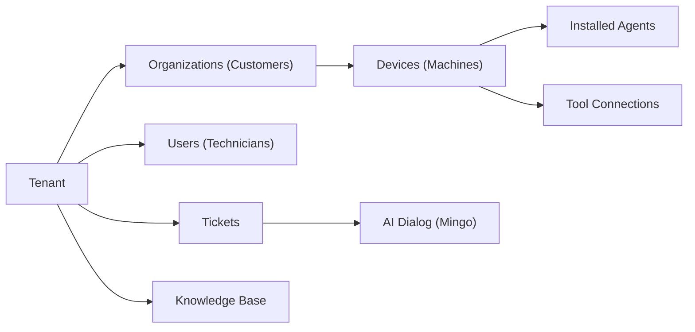

# First Steps

Congratulations on getting OpenFrame OSS Tenant running! Here are the first 5 things to do after initial setup to get the most out of the platform.

[](https://www.youtube.com/watch?v=a45pzxtg27k)

---

## 1. Register Your First Tenant

OpenFrame is multi-tenant by design. Your first step is to register your organization as a tenant.

Navigate to the Authorization Server's tenant registration endpoint:

```text
http://localhost:9000/register
```

You'll need to provide:
- **Tenant domain** — a unique subdomain identifier (e.g., `my-msp`)
- **Admin email** — the first administrator account
- **Password** — a secure password

> **Tenant domains** are validated against a slug format. Only lowercase letters, numbers, and hyphens are allowed.

After registration, your tenant will have:
- A unique `tenantId`
- A dedicated RSA signing key pair for JWT issuance
- An isolated MongoDB namespace for all your data

---

## 2. Explore the Dashboard

Once authenticated, access the frontend dashboard:

```text
http://localhost:3000
```

The dashboard provides:

| Section | Description |
|---|---|
| **Dashboard** | Overview of customers, devices, and open tickets |
| **Devices** | All monitored endpoints — online/offline status, hardware info |
| **Customers** | Organizations/clients managed by your MSP |
| **Tickets** | Helpdesk tickets with board and table views |
| **Mingo AI** | AI-powered chat assistant for IT technicians |
| **Scripts** | Automation scripts with scheduling |
| **Monitoring** | Fleet policies, queries, and compliance checks |
| **Knowledge Base** | Articles and folders for team documentation |
| **Settings** | Users, API keys, SSO, tool integrations |

---

## 3. Connect Your First Integration Tool

OpenFrame supports integrations with:
- **MeshCentral** — Remote desktop and file management
- **Tactical RMM** — Script execution, monitoring, patch management
- **Fleet MDM** — Device compliance, policies, osquery

To configure a tool integration:

1. Navigate to **Settings → Architecture** in the frontend
2. Select the tool you want to integrate
3. Provide the tool's URL and API credentials
4. Save the configuration

The Management Service will:
- Persist the tool configuration to MongoDB
- Register the Debezium CDC connector (if applicable)
- Execute any registered post-save hooks

After a tool is connected, devices registered in that tool will begin appearing in the Devices section.

---

## 4. Invite Your Team

Add your team members via the **Settings → Users** section or via the API:

```bash
# Invite a user via the REST API
curl -X POST http://localhost:8081/api/v1/invitations \
  -H "Authorization: Bearer <your-access-token>" \
  -H "Content-Type: application/json" \
  -d '{
    "email": "technician@your-msp.com",
    "role": "ADMIN"
  }'
```

Invited users receive an email with a registration link. The invitation flow is handled by the Authorization Server's `InvitationRegistrationController`.

> For SSO setup (Google or Microsoft), navigate to **Settings → SSO Configuration**.

---

## 5. Install the OpenFrame Client Agent

The `openframe-client` (Rust agent) connects endpoints to your OpenFrame platform. It communicates via **NATS JetStream** for real-time messaging.

### Getting the Agent Registration Secret

```bash
# Get the registration secret via API
curl http://localhost:8081/api/v1/agent-registration-secret \
  -H "Authorization: Bearer <your-access-token>"
```

### Installing the Agent

The agent binary is distributed as a platform-specific executable. For development/testing, the agent can be built from source:

```bash
cd clients/openframe-client
cargo build --release
```

The agent reads its initial configuration from the NATS connection details and registration secret.

---

## Key Configuration Areas

### API Keys

For programmatic access to the External API, create an API key:
1. Go to **Settings → API Keys**
2. Click **Create API Key**
3. Copy the key immediately (it won't be shown again)

Use the key in the `X-API-Key` header:
```bash
curl http://localhost:8080/external-api/v1/devices \
  -H "X-API-Key: <your-api-key>"
```

### GraphQL Playground

The API service exposes a GraphQL playground (in development mode) at:
```text
http://localhost:8081/graphiql
```

This is useful for exploring the full GraphQL schema and testing queries.

### Feature Flags

Frontend feature flags are managed via the Feature Flags system. Flags can be toggled in the Settings → AI Settings section to enable experimental features.

---

## Understanding the Data Model

OpenFrame organizes data around these core concepts:



- **Tenant** — the MSP organization (top-level isolation boundary)
- **Organizations** — client companies managed by the MSP
- **Devices** — managed endpoints (desktops, laptops, servers)
- **Tickets** — support requests with AI-assisted resolution
- **Knowledge Base** — documentation and runbooks

---

## Where to Get Help

If you run into issues or have questions:

- **OpenMSP Slack Community**: [Join here](https://join.slack.com/t/openmsp/shared_invite/zt-36bl7mx0h-3~U2nFH6nqHqoTPXMaHEHA)
- **OpenFrame Website**: [openframe.ai](https://openframe.ai)
- **Flamingo Platform**: [flamingo.run](https://flamingo.run)
- **OpenMSP Hub**: [openmsp.ai](https://www.openmsp.ai/)

> All community discussions and issue tracking happen in the **OpenMSP Slack** — there are no GitHub Issues on this repository.

---

## What to Explore Next

After completing your first steps, continue with:

- Development documentation in the `docs/development/` section for architecture details, environment setup, and contributing guidelines
- The architecture overview to understand how services interact
- Security documentation for hardening your deployment
