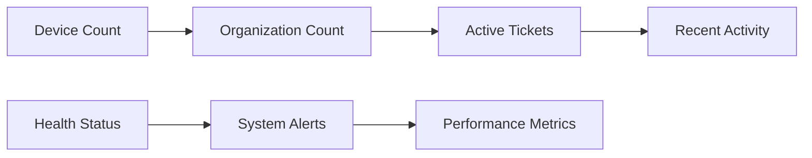

# First Steps

Now that OpenFrame is running, let's configure your installation and explore the key features. This guide walks you through the first 5 essential steps to get your OpenFrame platform production-ready.

> 📋 **Prerequisites**: Complete the [Quick Start Guide](./quick-start.md) before proceeding.

## Overview: Your First 30 Minutes

Here's what we'll accomplish in the next 30 minutes:

1. **[Configure OAuth Providers](#1-configure-oauth-providers)** - Enable Google/Azure AD login
2. **[Set Up Your First Organization](#2-set-up-your-first-organization)** - Create a client organization
3. **[Install the Client Agent](#3-install-the-client-agent)** - Connect your first device
4. **[Configure Integrations](#4-configure-integrations)** - Connect MSP tools
5. **[Explore Key Features](#5-explore-key-features)** - Navigate the platform

## 1. Configure OAuth Providers

OpenFrame supports multiple authentication providers. Let's set up Google OAuth as an example:

### Access Settings

1. Navigate to [http://localhost:3000](http://localhost:3000)
2. Log in with your admin account
3. Click **Settings** in the left sidebar
4. Select the **SSO Configuration** tab

### Set Up Google OAuth

1. Click **"Add Provider"** or **"Configure Google"**
2. Fill in the OAuth configuration:
   ```
   Provider: Google
   Client ID: your-google-client-id
   Client Secret: your-google-client-secret
   Redirect URI: http://localhost:8080/oauth2/callback/google
   ```
3. Click **"Save Configuration"**
4. Test the connection by clicking **"Test Provider"**

> 💡 **Tip**: Get your Google OAuth credentials from the [Google Cloud Console](https://console.cloud.google.com). See the [Prerequisites guide](./prerequisites.md#oauth-application-setup) for detailed setup instructions.

### Verify OAuth Setup

1. Log out of OpenFrame
2. On the login page, you should see a **"Sign in with Google"** button
3. Test the OAuth flow by clicking it

## 2. Set Up Your First Organization

Organizations represent your clients in OpenFrame. Let's create one:

### Create a Client Organization

1. Navigate to **Organizations** in the sidebar
2. Click **"Add Organization"**
3. Fill in the organization details:
   ```
   Organization Name: Acme Corporation
   Organization Type: Client
   Industry: Technology
   
   Contact Information:
   - Contact Person: John Smith
   - Email: john@acme-corp.com
   - Phone: (555) 123-4567
   
   Address:
   - Street: 123 Business Ave
   - City: San Francisco
   - State: CA
   - ZIP: 94105
   ```
4. Click **"Save Organization"**

### Organization Dashboard

After creating the organization, you'll see:
- **Device count** (initially 0)
- **User count** (initially 0) 
- **Active tickets** (initially 0)
- **Last activity** timestamp

## 3. Install the Client Agent

The OpenFrame client agent connects devices to your platform. Let's install it on your first device:

### Download the Client

From your OpenFrame dashboard:

1. Go to **Devices** → **"Add Device"**
2. Select your operating system
3. Copy the installation command shown

### Install on Linux/macOS

```bash
# Download the client
curl -L http://localhost:8080/download/client/linux -o openframe-client
chmod +x openframe-client

# Install with admin privileges
sudo ./openframe-client install \
  --serverUrl=http://localhost:8080 \
  --orgId=your-organization-id
```

### Install on Windows (PowerShell as Administrator)

```powershell
# Download the client
Invoke-WebRequest -Uri "http://localhost:8080/download/client/windows" -OutFile "openframe-client.exe"

# Install
./openframe-client.exe install --serverUrl=http://localhost:8080 --orgId=your-organization-id
```

### Verify Installation

1. Return to the **Devices** page in OpenFrame
2. You should see your device appear within 1-2 minutes
3. The device status should show as **"Online"**
4. Click on the device to view details:
   - Operating system information
   - Hardware specifications
   - Network configuration
   - Installed software

## 4. Configure Integrations

OpenFrame integrates with popular MSP tools. Let's set up TacticalRMM as an example:

### Start TacticalRMM (Optional)

If you want to test the integration:

```bash
# Start TacticalRMM using Docker Compose
docker compose -f integrated-tools/tactical-rmm/docker-compose.yml up -d

# Wait for services to initialize (2-3 minutes)
docker compose -f integrated-tools/tactical-rmm/docker-compose.yml logs tactical-rmm
```

### Configure the Integration

1. Go to **Settings** → **Integrations**
2. Find **TacticalRMM** in the list
3. Click **"Configure"**
4. Fill in the connection details:
   ```
   Server URL: http://localhost:8005
   API Key: [Generate from TacticalRMM admin]
   Username: admin
   ```
5. Click **"Test Connection"** to verify
6. Click **"Save Integration"**

### Verify Integration

1. Navigate to **Devices**
2. You should see additional data from TacticalRMM:
   - Agent status
   - Policy compliance
   - Recent alerts
   - Remote access options

## 5. Explore Key Features

Now let's explore OpenFrame's main capabilities:

### Dashboard Overview

Visit the **Dashboard** ([http://localhost:3000/dashboard](http://localhost:3000/dashboard)) to see:



**Key Metrics Displayed:**
- Total devices managed
- Organizations served  
- Open support tickets
- System health status
- Recent activity feed

### Device Management

Explore **Devices** ([http://localhost:3000/devices](http://localhost:3000/devices)):

| Feature | Description | Try This |
|---------|-------------|----------|
| **Device List** | View all connected devices | Filter by OS type |
| **Device Details** | Deep device information | Click any device |
| **Remote Access** | Connect to devices | Enable remote desktop |
| **File Manager** | Browse device files | Navigate file system |
| **Scripts** | Run commands remotely | Execute `systeminfo` |

### User Management

Check **Settings** → **Company and Users**:

1. **Invite Users**: 
   - Click **"Invite User"**
   - Enter email: `colleague@example.com`
   - Select role: **Technician**
   - Click **"Send Invitation"**

2. **Manage Permissions**:
   - View role-based access controls
   - Configure organization access
   - Set feature permissions

### Ticket System (Mingo AI)

Visit **Tickets** to explore AI-powered support:

1. **Create a Test Ticket**:
   - Click **"New Conversation"**
   - Type: "The server is running slow"
   - Watch Mingo AI analyze and respond

2. **AI Features**:
   - Automatic categorization
   - Suggested solutions
   - Escalation recommendations
   - Resolution tracking

## Configure Your Tenant Settings

Customize your OpenFrame installation:

### General Settings

1. Go to **Settings** → **Profile**
2. Update tenant information:
   ```
   Tenant Name: Your MSP Name
   Domain: yourmsp.com
   Time Zone: America/New_York
   Default Language: English
   ```

### Security Settings

1. Navigate to **Settings** → **Security**
2. Configure:
   - **Password Policy**: Minimum length, complexity
   - **Session Timeout**: 8 hours recommended
   - **Two-Factor Authentication**: Enable for admin users
   - **IP Restrictions**: Whitelist your office IPs

### Notification Settings  

1. Go to **Settings** → **Notifications**
2. Configure alert preferences:
   - **Email Notifications**: Device down, high CPU usage
   - **Slack Integration**: Connect your team channel
   - **SMS Alerts**: Critical system failures
   - **Webhook URLs**: Custom integrations

## Performance Optimization

For better performance in your environment:

### Database Optimization

```bash
# MongoDB index optimization
docker exec -it $(docker ps -q -f name=mongodb) mongosh openframe --eval "
  db.devices.createIndex({organizationId: 1, status: 1});
  db.events.createIndex({timestamp: -1, organizationId: 1});
  db.users.createIndex({email: 1}, {unique: true});
"
```

### Caching Configuration

```bash
# Configure Redis for better caching
docker exec -it $(docker ps -q -f name=redis) redis-cli CONFIG SET maxmemory 512mb
docker exec -it $(docker ps -q -f name=redis) redis-cli CONFIG SET maxmemory-policy allkeys-lru
```

## Common Configuration Issues

### OAuth Redirect Mismatch

**Problem**: OAuth login fails with redirect URI error

**Solution**:
1. Check your OAuth provider configuration
2. Ensure redirect URI exactly matches: `http://localhost:8080/oauth2/callback/google`
3. Include both HTTP and HTTPS versions if needed

### Client Agent Connection Issues

**Problem**: Device doesn't appear in the dashboard

**Solution**:
```bash
# Check agent status
sudo systemctl status openframe-client

# View agent logs
sudo journalctl -u openframe-client -f

# Restart agent if needed
sudo systemctl restart openframe-client
```

### Integration Connection Failures

**Problem**: TacticalRMM or other integrations can't connect

**Solution**:
1. Verify service URLs are accessible
2. Check firewall rules
3. Validate API keys and credentials
4. Test network connectivity:
   ```bash
   curl -v http://localhost:8005/api/v1/health
   ```

## Next Steps

You've successfully configured the basics! Here's what to explore next:

### Advanced Configuration
- **[Development Environment Setup](../development/setup/environment.md)** - For customization
- **[Architecture Overview](../development/architecture/overview.md)** - Understanding the platform
- **[API Documentation](../development/architecture/overview.md#api-reference)** - Integration guides

### Production Deployment
- **[Kubernetes Deployment](../development/architecture/overview.md)** - Scalable deployment
- **[Security Hardening](../development/architecture/overview.md)** - Production security
- **[Monitoring Setup](../development/architecture/overview.md)** - Observability

### Community & Support
- **Join [OpenMSP Slack](https://join.slack.com/t/openmsp/shared_invite/zt-36bl7mx0h-3~U2nFH6nqHqoTPXMaHEHA)** - Get help and share experiences
- **Contribute** - Help improve OpenFrame for everyone
- **Feature Requests** - Suggest new capabilities

## What You've Accomplished

✅ **Configured OAuth authentication** for secure login  
✅ **Created your first organization** to manage clients  
✅ **Installed the client agent** on a device  
✅ **Set up tool integrations** for comprehensive monitoring  
✅ **Explored key features** of the platform  

You now have a fully functional OpenFrame installation ready for production use!

---

🎉 **Excellent work!** Your OpenFrame platform is now configured and ready to help you manage your MSP operations more efficiently.

For continued learning, check out our comprehensive guides in the [Development section](../development/README.md).