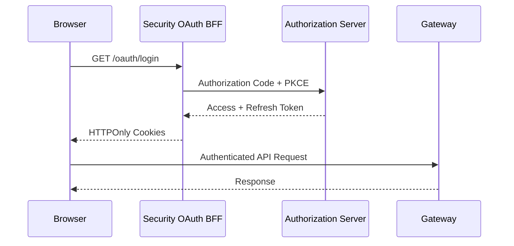

# First Steps

After getting the platform running, here are the first 5 things you should do to start working effectively with OpenFrame OSS Tenant.

[](https://www.youtube.com/watch?v=awc-yAnkhIo)

---

## 1. Register Your First Tenant

The Authorization Server supports multi-tenant registration. Your first step is to register the platform tenant (your MSP workspace).

The Authorization Server exposes a tenant registration endpoint at `/auth/register`. You'll use the `TenantRegistrationController` to create your first tenant:

```bash
# Register a new tenant (replace values with your configuration)
curl -X POST http://localhost:9000/auth/register \
  -H "Content-Type: application/json" \
  -d '{
    "tenantDomain": "your-msp-domain",
    "adminEmail": "admin@your-domain.com",
    "password": "your-secure-password"
  }'
```

> Refer to your environment configuration for the exact registration endpoint and required payload structure. The `TenantRegistrationRequest` DTO defines the required fields.

Once registered, the Authorization Server will:
- Create a per-tenant RSA key pair for JWT signing
- Initialize default OAuth2 client registration
- Set up tenant-scoped MongoDB collections

---

## 2. Explore the OAuth2 / OIDC Identity Flow

OpenFrame uses OAuth2 Authorization Code flow with PKCE for all browser-based authentication. After tenant registration, verify the identity flow is working:

```bash
# Check OIDC discovery document
curl http://localhost:9000/.well-known/openid-configuration
```

This returns the OpenID Configuration including:
- `token_endpoint` — where tokens are issued
- `jwks_uri` — public keys for JWT verification
- `authorization_endpoint` — where the auth code flow begins

**Authentication Flow:**



---

## 3. Connect an Integrated Tool

OpenFrame integrates with industry-standard MSP tools. The Management Service handles tool lifecycle. To register a tool connection, use the API:

```bash
# Authenticate first to get a token (via OAuth BFF)
# Then register a tool via the Management API
curl -X POST http://localhost:8081/v1/tools \
  -H "Authorization: Bearer <your-access-token>" \
  -H "Content-Type: application/json" \
  -d '{
    "toolType": "TACTICAL_RMM",
    "name": "My Tactical RMM Instance",
    "url": "https://your-tactical-rmm-instance.com"
  }'
```

Supported integrated tools include:
- **Tactical RMM** — Remote monitoring and management
- **MeshCentral** — Remote desktop and device management
- **Fleet MDM** — Device policy and compliance

Once connected, the Stream Service will begin consuming CDC events from the tool via Kafka/Debezium.

---

## 4. Register Your First Device (Agent)

The `openframe-client` (Rust-based agent) runs on managed devices. To add a device to the platform:

**Step 1:** Generate an agent registration secret from the platform:

```bash
# Get agent registration secrets via the API
curl -X GET http://localhost:8081/api/v1/agent-registration-secrets \
  -H "Authorization: Bearer <your-access-token>"
```

**Step 2:** Initialize the client on the target device.

For development, use the initialization script:

```bash
bash clients/openframe-client/scripts/setup_dev_init_config.sh
```

Once the agent registers, it:
- Appears in the Devices section of the dashboard
- Begins sending heartbeat messages via NATS
- Reports installed tools and tool connections

---

## 5. Explore the GraphQL API

The API Service exposes a full GraphQL API built with Netflix DGS. Connect to the GraphQL playground to explore available queries:

```text
http://localhost:8081/graphiql
```

### Key GraphQL Capabilities

| Domain | Example Query |
|--------|--------------|
| Devices | `query { devices { edges { node { id hostname status } } } }` |
| Organizations | `query { organizations { id name status } }` |
| Tickets | `query { tickets { edges { node { id title status } } } }` |
| Events | `query { events { edges { node { id type message } } } }` |
| Knowledge Base | `query { knowledgeBaseItems { id title type } }` |

The API uses **Relay-compatible cursor pagination**:

```text
query {
  devices(first: 10, after: "cursor...") {
    edges {
      node { id hostname }
      cursor
    }
    pageInfo {
      hasNextPage
      endCursor
    }
  }
}
```

---

## Common Initial Configuration

### Setting Up SSO (Optional)

To enable Google or Microsoft SSO for your tenant, configure via the SSO Config API:

```bash
curl -X POST http://localhost:8081/api/v1/sso-config \
  -H "Authorization: Bearer <your-access-token>" \
  -H "Content-Type: application/json" \
  -d '{
    "provider": "GOOGLE",
    "clientId": "your-google-client-id",
    "clientSecret": "your-google-client-secret"
  }'
```

### Inviting Team Members

```bash
curl -X POST http://localhost:8081/api/v1/invitations \
  -H "Authorization: Bearer <your-access-token>" \
  -H "Content-Type: application/json" \
  -d '{
    "email": "colleague@your-domain.com",
    "role": "ADMIN"
  }'
```

---

## Where to Get Help

- 💬 **OpenMSP Slack**: [Join here](https://join.slack.com/t/openmsp/shared_invite/zt-36bl7mx0h-3~U2nFH6nqHqoTPXMaHEHA)
- 🌐 **Community Hub**: [https://www.openmsp.ai/](https://www.openmsp.ai/)
- 🔗 **OpenFrame**: [https://openframe.ai](https://openframe.ai)
- 🔗 **Flamingo**: [https://flamingo.run](https://flamingo.run)

The OpenMSP Slack community is the primary support channel — GitHub Issues and Discussions are not used for this project.
