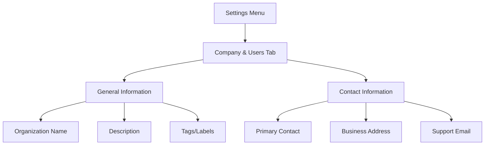
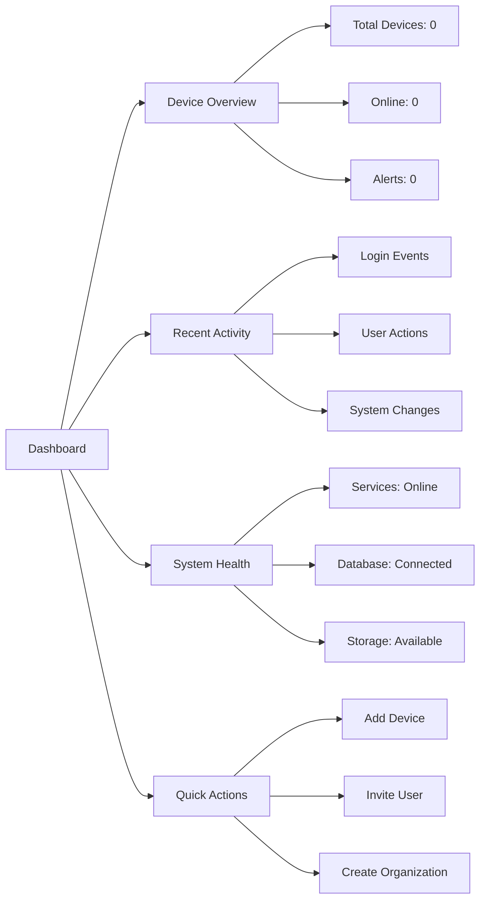

# First Steps with OpenFrame

Now that OpenFrame is running, this guide walks you through the essential first steps to get productive with the platform.

## Overview of Your Journey

This guide covers the five most important things to do after installation:

1. **[Complete Organization Setup](#1-complete-organization-setup)** — Configure your company profile
2. **[Explore the Dashboard](#2-explore-the-dashboard)** — Understand the interface
3. **[Configure User Management](#3-configure-user-management)** — Add team members
4. **[Connect Your First Tool](#4-connect-your-first-tool)** — Integrate existing MSP tools
5. **[Test Core Features](#5-test-core-features)** — Verify everything works

## 1. Complete Organization Setup

### Access Settings

Navigate to **Settings** → **Company & Users** from the main menu.

### Organization Profile

Complete your organization details:



**Required Fields:**
- **Organization Name**: Your official business name
- **Primary Contact**: Main administrative contact
- **Business Email**: Support and notification email

**Optional but Recommended:**
- **Description**: Brief description of your organization
- **Business Address**: Physical location for compliance
- **Support Phone**: Client contact number
- **Tags**: Industry labels (MSP, Enterprise, etc.)

### Save and Verify

Click **Save Changes** and verify the information appears correctly in the dashboard header.

## 2. Explore the Dashboard

### Main Navigation

Familiarize yourself with the core sections:

| Section | Purpose | Key Features |
|---------|---------|--------------|
| **Dashboard** | Overview and metrics | Device counts, alerts, activity |
| **Devices** | Endpoint management | Device list, remote access, file management |
| **Mingo** | AI assistant chat | Automated support, troubleshooting |
| **Tickets** | Support management | Ticket tracking, client communication |
| **Logs** | System monitoring | Audit trails, event tracking |
| **Policies & Queries** | Compliance | Security policies, system queries |
| **Scripts** | Automation | Custom scripts, scheduled tasks |
| **Organizations** | Multi-tenant | Client organization management |
| **Settings** | Configuration | Users, integrations, API keys |

### Dashboard Widgets

The main dashboard includes:



### Customize Your View

- **Dark/Light Mode**: Toggle in user menu
- **Widget Layout**: Drag widgets to reorder (coming soon)
- **Notification Preferences**: Set alert levels

## 3. Configure User Management

### Invite Team Members

1. Go to **Settings** → **Company & Users**
2. Click **Add Users** button
3. Enter email addresses (one per line)
4. Select user roles:
   - **Admin**: Full system access
   - **Technician**: Device management and support
   - **Read-Only**: View-only access

```bash
# Example: Bulk invite via API (optional)
curl -X POST https://localhost:8443/api/invitations \
  -H "Authorization: Bearer $TOKEN" \
  -H "Content-Type: application/json" \
  -d '{
    "emails": ["tech1@company.com", "tech2@company.com"],
    "role": "technician"
  }'
```

### Set Up SSO (Optional)

For larger teams, configure Single Sign-On:

1. Go to **Settings** → **SSO Configuration**
2. Choose your provider:
   - **Google Workspace**
   - **Microsoft Azure AD** 
   - **Custom OIDC**

3. Enter provider details:
   - **Client ID**: From your OAuth app
   - **Client Secret**: From your OAuth app  
   - **Tenant Domain**: Your organization domain

4. Test the connection
5. Enable SSO for your organization

### User Roles Explained

| Role | Permissions | Use Case |
|------|-------------|----------|
| **Super Admin** | Everything + tenant management | Platform administrators |
| **Admin** | Organization management | MSP owners/managers |
| **Technician** | Device & ticket management | Technical staff |
| **Read-Only** | View data only | Reporting/compliance roles |

## 4. Connect Your First Tool

### Supported Integrations

OpenFrame natively supports these MSP tools:

#### Remote Monitoring & Management (RMM)
- **Tactical RMM**: Open-source endpoint management
- **ConnectWise Automate**: Enterprise RMM platform
- **NinjaRMM**: Cloud-based RMM solution

#### Remote Access
- **MeshCentral**: Self-hosted remote access
- **TeamViewer**: Commercial remote support
- **AnyDesk**: Lightweight remote desktop

#### Mobile Device Management (MDM)
- **Fleet MDM**: Open-source MDM platform
- **Microsoft Intune**: Enterprise MDM
- **Jamf**: macOS/iOS management

### Connect Tactical RMM (Example)

1. **Navigate to Integrations**
   - Go to **Settings** → **Integrations**
   - Click **Add Integration**
   - Select **Tactical RMM**

2. **Enter Connection Details**
   ```text
   Server URL: https://your-tacticalrmm.com
   API Token: your-api-token
   Username: your-username (optional)
   ```

3. **Test Connection**
   - Click **Test Connection**
   - Verify green checkmark appears
   - Review imported device count

4. **Configure Sync Settings**
   - **Sync Frequency**: Every 15 minutes (default)
   - **Device Filters**: All devices or specific groups
   - **Data Mapping**: Map device fields to OpenFrame schema

### Integration Health Check

After connecting a tool, verify:

```bash
# Check integration status
curl -X GET https://localhost:8443/api/integrations \
  -H "Authorization: Bearer $TOKEN"

# View synchronized devices  
curl -X POST https://localhost:8443/graphql \
  -H "Authorization: Bearer $TOKEN" \
  -d '{"query": "{ devices(first: 10) { edges { node { name status toolId } } } }"}'
```

## 5. Test Core Features

### Device Management

1. **View Devices**
   - Go to **Devices** section
   - You should see devices from connected tools
   - Click on a device to view details

2. **Remote Access** (if MeshCentral connected)
   - Click **Remote Desktop** on any Windows device
   - Test file manager functionality
   - Verify session recording (if enabled)

3. **Device Groups**
   - Create logical device groups
   - Test group-based operations

### Mingo AI Assistant

1. **Open Mingo Chat**
   - Click the **Mingo** section
   - Start a conversation: "Show me device status"

2. **Test AI Capabilities**
   ```text
   User: What devices are offline?
   Mingo: I found 3 offline devices. Would you like me to:
         1. Attempt to wake them up
         2. Generate a status report
         3. Schedule a check in 30 minutes?
   ```

3. **Autonomous Actions** (if enabled)
   - Mingo can automatically resolve common issues
   - Review action logs in **Tickets** → **AI Actions**

### Logs and Monitoring

1. **System Logs**
   - Go to **Logs** section
   - Filter by severity: Info, Warning, Error
   - Test real-time log streaming

2. **Audit Trail**
   - All user actions are logged
   - Export logs for compliance
   - Set up log retention policies

### API Testing

Verify GraphQL API functionality:

```bash
# Health check
curl -k https://localhost:8443/health

# Get user info
curl -X POST https://localhost:8443/graphql \
  -H "Authorization: Bearer $TOKEN" \
  -d '{"query": "{ me { id email name organization { name } } }"}'

# List organizations
curl -X POST https://localhost:8443/graphql \
  -H "Authorization: Bearer $TOKEN" \
  -d '{"query": "{ organizations { edges { node { id name deviceCount } } } }"}'
```

## Common First-Time Tasks

### Generate API Keys

For external integrations:

1. **Go to Settings** → **API Keys**
2. **Click Create New Key**
3. **Configure Key Settings**:
   - **Name**: "External Integration" 
   - **Scope**: Read/Write devices
   - **Expiration**: 1 year
4. **Copy the Key** — Save it securely (not recoverable)

### Configure Notifications

Set up email alerts:

1. **Go to Settings** → **Notifications**
2. **Configure SMTP**:
   - **SMTP Server**: `smtp.gmail.com`
   - **Port**: `587`
   - **Username**: Your email
   - **Password**: App password
3. **Test Email Delivery**
4. **Set Alert Rules**:
   - Device offline > 5 minutes
   - Failed login attempts
   - System errors

### Security Hardening

For production environments:

```bash
# Enable 2FA (when available)
# Configure session timeout
export SESSION_TIMEOUT_MINUTES=60

# Set password policies
export PASSWORD_MIN_LENGTH=12
export PASSWORD_REQUIRE_SPECIAL=true

# Enable audit logging
export AUDIT_LOG_ENABLED=true
export AUDIT_LOG_RETENTION_DAYS=365
```

## Performance Optimization

### Resource Monitoring

Monitor system resources:

```bash
# Check container resource usage
docker stats

# View system load
htop

# Check disk usage
df -h
```

### Tuning Tips

For optimal performance:

1. **Database Indexing**
   ```javascript
   // MongoDB indexes (auto-created)
   db.devices.createIndex({organizationId: 1, status: 1})
   db.logs.createIndex({timestamp: -1, severity: 1})
   ```

2. **Caching Configuration**
   ```bash
   # Redis memory optimization
   export REDIS_MAXMEMORY=2gb
   export REDIS_MAXMEMORY_POLICY=allkeys-lru
   ```

3. **JVM Tuning**
   ```bash
   # Adjust for your hardware
   export JAVA_OPTS="-Xmx4g -Xms2g -XX:+UseG1GC"
   ```

## Next Steps

You've completed the essential first steps! Here's where to go next:

### For End Users
- Explore advanced device management features
- Set up automated scripts and policies
- Configure client portal access

### For Developers  
- **[Development Environment Setup](../development/setup/environment.md)**
- **[Architecture Overview](../development/architecture/overview.md)**
- **[Contributing Guidelines](../development/contributing/guidelines.md)**

### For Administrators
- Configure high availability deployment
- Set up monitoring and alerting
- Plan backup and disaster recovery

## Getting Help

When you need assistance:

- **Documentation**: Comprehensive guides for all features
- **Community**: [OpenMSP Slack](https://join.slack.com/t/openmsp/shared_invite/zt-36bl7mx0h-3~U2nFH6nqHqoTPXMaHEHA) for real-time help
- **GitHub**: Issues, feature requests, and contributions
- **Professional Support**: Available through Flamingo's enterprise services

---

Congratulations! You've successfully configured OpenFrame and explored its core features. You're now ready to leverage the full power of AI-driven MSP operations.