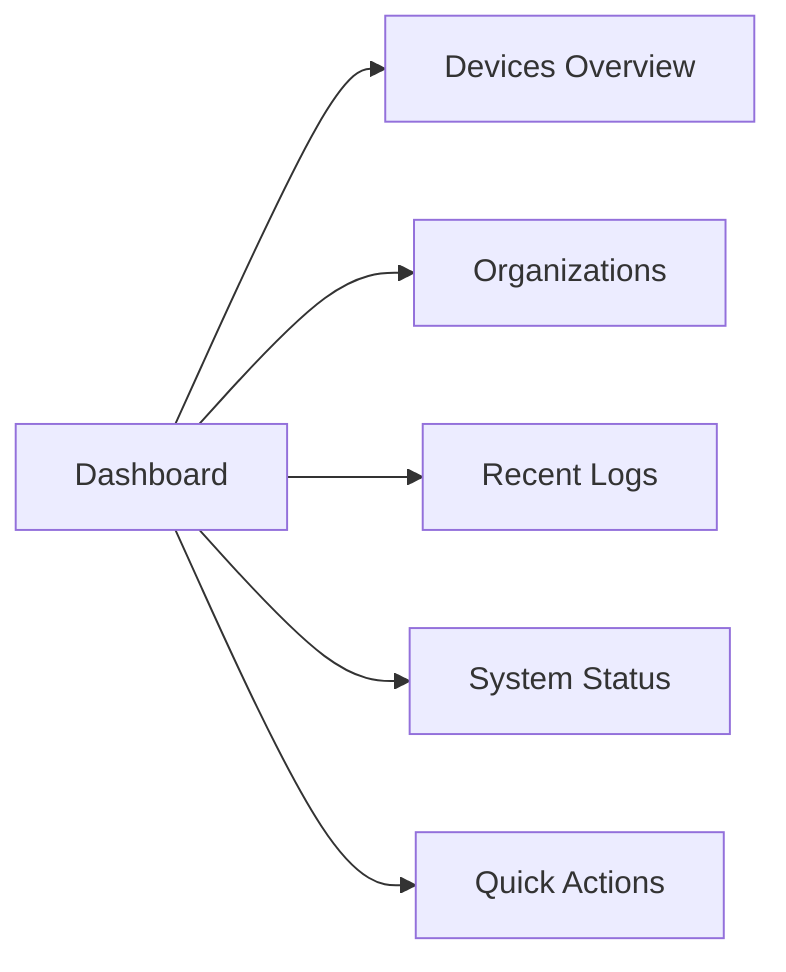

# First Steps with OpenFrame

Welcome to OpenFrame! Now that you have the platform running, this guide will walk you through your first 5 essential tasks to get familiar with the system.

> **Prerequisites**: Complete the [Quick Start Guide](quick-start.md) before proceeding.

## Your First 5 Steps

### 1. Explore the Dashboard

After logging in at `http://localhost:3000`, you'll see the main OpenFrame dashboard.

#### Dashboard Overview

The dashboard provides a unified view of your MSP operations:



**Key Sections:**
- **Devices Summary**: Total devices, online/offline status, alerts
- **Organizations**: Client organizations you manage
- **Recent Activity**: Latest logs and events
- **System Health**: Service status and performance metrics
- **Quick Actions**: Common tasks like adding devices or creating tickets

#### Navigation Menu

Familiarize yourself with the main navigation:

| Section | Purpose | Key Features |
|---------|---------|--------------|
| **Dashboard** | Overview and metrics | System health, recent activity |
| **Devices** | Device management | Agent deployment, monitoring, control |
| **Organizations** | Client management | Company profiles, contacts, settings |
| **Logs** | Event monitoring | Real-time logs, filtering, analysis |
| **Scripts** | Automation | PowerShell/Bash script execution |
| **Mingo (AI)** | AI Assistant | Chat-based automation and support |
| **Settings** | Configuration | Users, API keys, integrations |

### 2. Configure Your Organization

Set up your MSP organization details for proper client management.

#### Update Organization Profile

1. Navigate to **Settings** → **Company & Users**
2. Click **Edit Organization**
3. Fill in your MSP details:

```yaml
Organization Details:
  Name: "YourMSP Solutions"
  Domain: "yourmsp.com"
  Phone: "+1-555-123-4567"
  Email: "support@yourmsp.com"
  
Address:
  Street: "123 Business Ave"
  City: "Tech City"
  State: "CA"
  Postal Code: "90210"
  Country: "United States"

Contact Person:
  Name: "John Smith"
  Title: "IT Director"
  Email: "john@yourmsp.com"
  Phone: "+1-555-123-4567"
```

4. Click **Save Changes**

#### Configure Branding

1. Upload your company logo
2. Set primary colors that match your brand
3. Customize email templates for client communications

### 3. Add Your First Client Organization

Create your first client organization to start managing their devices.

#### Create Client Organization

1. Navigate to **Organizations**
2. Click **New Organization**
3. Fill in client details:

```yaml
Client Details:
  Name: "Acme Corporation"
  Domain: "acmecorp.com"
  Industry: "Manufacturing"
  
Contact Information:
  Primary Contact: "Jane Doe"
  Email: "jane.doe@acmecorp.com"
  Phone: "+1-555-987-6543"
  
Address:
  Street: "456 Industrial Blvd"
  City: "Factory Town"
  State: "TX"
  Postal Code: "75001"
```

4. Click **Create Organization**

#### Organization Features

Once created, you can:
- View organization dashboard
- Manage devices for this client
- Set up custom policies
- Configure specific tool integrations
- Track billing and contracts

### 4. Deploy Your First Agent

Deploy the OpenFrame agent to start monitoring a device.

#### Generate Registration Secret

1. Navigate to **Devices** → **New Device**
2. Click **Generate Registration Secret**
3. Copy the registration command:

```bash
# Example registration command
curl -L https://releases.openframe.ai/install.sh | bash -s -- \
  --secret "reg_1234567890abcdef" \
  --organization "your-org-id"
```

#### Install Agent (Example on Linux)

```bash
# On the target device, run the registration command
curl -L https://releases.openframe.ai/install.sh | bash -s -- \
  --secret "reg_1234567890abcdef" \
  --organization "acme-corp-id"

# Verify agent is running
sudo systemctl status openframe-agent

# Check agent logs
sudo journalctl -u openframe-agent -f
```

#### Agent Features

Once deployed, the agent provides:
- **Real-time monitoring**: CPU, memory, disk, network metrics
- **Remote access**: PowerShell/SSH sessions via web interface
- **File management**: Browse and transfer files remotely
- **Software inventory**: Installed applications and updates
- **Security monitoring**: Antivirus status, firewall rules

#### Verify Device Registration

1. Return to **Devices** in OpenFrame
2. Your device should appear within 30-60 seconds
3. Click on the device to view details:
   - System information
   - Real-time metrics
   - Installed software
   - Security status

### 5. Set Up Tool Integrations

Connect your existing MSP tools to OpenFrame for unified management.

#### Available Integrations

OpenFrame supports these popular MSP tools:

| Tool | Purpose | Integration Status |
|------|---------|-------------------|
| **TacticalRMM** | Remote monitoring | ✅ Native support |
| **FleetMDM** | Device management | ✅ Native support |
| **MeshCentral** | Remote access | ✅ Native support |
| **Authentik** | Identity management | ✅ SSO integration |

#### Configure TacticalRMM Integration

1. Navigate to **Settings** → **Integrations**
2. Click **TacticalRMM**
3. Configure connection:

```yaml
TacticalRMM Settings:
  Server URL: "https://rmm.yourmsp.com"
  API Key: "your-api-key"
  Username: "openframe-sync"
  
Sync Options:
  Import Existing Agents: true
  Sync Interval: "5 minutes"
  Enable Webhooks: true
```

4. Click **Test Connection**
5. If successful, click **Save Integration**

#### Configure FleetMDM Integration

1. In **Settings** → **Integrations**
2. Click **FleetMDM**
3. Enter Fleet credentials:

```yaml
FleetMDM Settings:
  Server URL: "https://fleet.yourmsp.com"
  API Token: "your-fleet-token"
  
Import Settings:
  Sync Host Data: true
  Sync Queries: true
  Import Teams: true
```

#### Verify Integrations

Once configured, you should see:
- Existing devices imported from connected tools
- Unified device dashboard showing data from all sources
- Synchronized alerts and events
- Cross-tool automation capabilities

## Common Initial Configurations

### API Keys for Automation

Create API keys for external integrations:

1. Navigate to **Settings** → **API Keys**
2. Click **Create API Key**
3. Configure permissions:

```yaml
API Key Configuration:
  Name: "External Monitoring"
  Description: "For third-party monitoring tools"
  
Permissions:
  - Read Devices
  - Read Organizations
  - Read Logs
  - Write Events
  
Expiration: "1 year"
Rate Limit: "1000 requests/hour"
```

### User Management

Add team members to your OpenFrame instance:

1. Navigate to **Settings** → **Company & Users**
2. Click **Invite User**
3. Configure user access:

```yaml
User Invitation:
  Email: "tech@yourmsp.com"
  Role: "Technician"
  
Permissions:
  Organizations: ["Acme Corp", "Beta Corp"]
  Access Level: "Read/Write"
  
Features:
  Device Management: true
  Script Execution: true
  Organization Management: false
  User Management: false
```

### Notification Setup

Configure alerting and notifications:

1. Navigate to **Settings** → **Notifications**
2. Set up alert channels:

```yaml
Email Alerts:
  SMTP Server: "smtp.gmail.com"
  Username: "alerts@yourmsp.com"
  Password: "app-specific-password"
  
Slack Integration:
  Webhook URL: "https://hooks.slack.com/..."
  Channel: "#alerts"
  
Alert Rules:
  Device Offline: "Immediate"
  High CPU Usage: "15 minutes"
  Disk Space Low: "1 hour"
  Security Alert: "Immediate"
```

## Explore Advanced Features

### AI Assistant (Mingo)

Try OpenFrame's AI assistant:

1. Navigate to **Mingo**
2. Start a conversation:
   - "Show me all offline devices"
   - "Generate a system health report"
   - "Create a PowerShell script to check disk space"

### Script Management

Create and run automation scripts:

1. Navigate to **Scripts**
2. Click **New Script**
3. Create a system health check:

```powershell
# System Health Check Script
$cpu = Get-Counter "\Processor(_Total)\% Processor Time"
$memory = Get-WmiObject Win32_OperatingSystem
$disk = Get-WmiObject Win32_LogicalDisk -Filter "DriveType=3"

Write-Output "=== System Health Report ==="
Write-Output "CPU Usage: $($cpu.CounterSamples[0].CookedValue)%"
Write-Output "Memory Usage: $(($memory.TotalPhysicalMemory - $memory.FreePhysicalMemory) / $memory.TotalPhysicalMemory * 100)%"

foreach ($drive in $disk) {
    $freePercent = ($drive.FreeSpace / $drive.Size) * 100
    Write-Output "Drive $($drive.DeviceID) Free Space: $($freePercent)%"
}
```

### Log Analysis

Explore real-time log monitoring:

1. Navigate to **Logs**
2. Use filters to find specific events:
   - Filter by organization: "Acme Corp"
   - Filter by severity: "Error" or "Warning"
   - Filter by time range: "Last 24 hours"

3. Set up log alerts for critical events

## Next Steps and Learning Resources

### Recommended Learning Path

1. **Device Management**: Learn advanced monitoring and control features
2. **Automation**: Master script creation and scheduling
3. **AI Integration**: Explore Mingo AI capabilities
4. **Multi-Tenant Management**: Add more client organizations
5. **Advanced Integrations**: Connect additional tools

### Documentation Resources

- **API Documentation**: Explore GraphQL and REST APIs
- **Integration Guides**: Detailed setup for each supported tool
- **Troubleshooting**: Common issues and solutions
- **Best Practices**: MSP workflow recommendations

### Community Support

- **OpenMSP Slack**: [Join the community](https://join.slack.com/t/openmsp/shared_invite/zt-36bl7mx0h-3~U2nFH6nqHqoTPXMaHEHA)
- **GitHub Discussions**: Ask questions and share experiences
- **Documentation**: Comprehensive guides and tutorials

## Troubleshooting Common Issues

### Device Not Appearing

If your agent-installed device doesn't appear:

1. Check agent service status on the device
2. Verify network connectivity to OpenFrame
3. Check registration secret expiration
4. Review agent logs for error messages

### Integration Connection Failures

If tool integrations fail to connect:

1. Verify API credentials and permissions
2. Check network connectivity between OpenFrame and tools
3. Review firewall rules and port access
4. Test API endpoints manually with curl

### Performance Issues

If the interface is slow:

1. Check system resources (CPU, memory, disk)
2. Review database performance metrics
3. Verify network connectivity
4. Consider scaling infrastructure

---

**🎉 Congratulations!** You've completed your first steps with OpenFrame. You now have a functioning MSP platform with:

- ✅ Organization properly configured
- ✅ First client added
- ✅ Agent deployed and monitoring
- ✅ Tool integrations established
- ✅ Basic automation in place

Continue exploring OpenFrame's capabilities and building out your MSP operations!