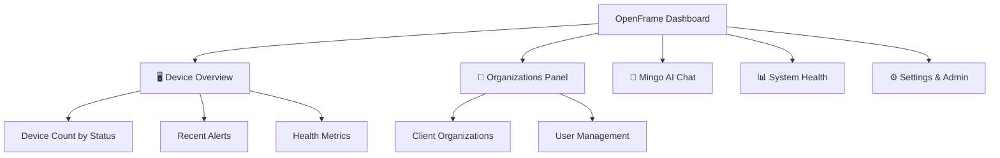

# First Steps with OpenFrame

Welcome to OpenFrame! This guide walks you through the essential first steps after installation, helping you understand core features and get productive quickly.

## Overview of First Steps

After completing the [Quick Start Guide](quick-start.md), you'll learn to:

1. **Navigate the OpenFrame Dashboard** - Understand the main interface
2. **Manage Organizations** - Set up your MSP structure
3. **Add and Monitor Devices** - Connect endpoints for management
4. **Configure User Access** - Set up team members with appropriate permissions
5. **Explore Mingo AI** - Interact with the intelligent automation assistant

## Step 1: Navigate the OpenFrame Dashboard

### Main Dashboard Overview

After logging in at [http://localhost:8080](http://localhost:8080), you'll see the main dashboard:



### Key Navigation Elements

| Section | Purpose | Quick Access |
|---------|---------|--------------|
| **Devices** | Monitor and manage all endpoints | Left sidebar → Devices |
| **Organizations** | Manage clients and internal structure | Left sidebar → Organizations |
| **Users** | User and permission management | Settings → Company & Users |
| **Logs** | System and security audit trails | Left sidebar → Logs |
| **Tickets** | AI-powered incident management | Left sidebar → Tickets |
| **Scripts** | Automation and policy enforcement | Left sidebar → Scripts |

### Dashboard Widgets

The dashboard provides real-time insights:

- **Device Health**: Visual status of all managed endpoints
- **Alert Summary**: Recent security and system alerts
- **Organization Overview**: Client status and metrics
- **AI Activity**: Recent Mingo AI interactions and automations

## Step 2: Manage Organizations

Organizations represent your MSP clients or internal business units.

### Create Your First Organization

1. Navigate to **Organizations** in the left sidebar
2. Click **"Add Organization"**
3. Fill in the required details:

```bash
Organization Name: "Demo Client Corp"
Domain: "democlient.com" 
Contact Person: "Jane Smith"
Email: "jane@democlient.com"
Phone: "+1-555-0123"
```

4. Configure the organization address:

```bash
Street: "123 Business Ave"
City: "Tech City"
State: "CA"
ZIP: "90210"
Country: "United States"
```

5. Click **"Create Organization"**

### Organization Management Features

- **Client Segmentation**: Isolate devices, users, and data per client
- **Billing Integration**: Track resource usage and costs
- **Branding**: Customize appearance for each organization
- **Compliance**: Apply organization-specific security policies

## Step 3: Add and Monitor Devices

Devices are the endpoints (computers, servers) that OpenFrame monitors and manages.

### Understanding Device Types

OpenFrame supports multiple device types:

| Device Type | Icon | Operating System | Use Cases |
|-------------|------|------------------|-----------|
| **Desktop** | 🖥️ | Windows, macOS, Linux | Employee workstations |
| **Laptop** | 💻 | Windows, macOS, Linux | Mobile workforce devices |
| **Server** | 🖥️ | Windows Server, Linux | Infrastructure and applications |

### Add a New Device

There are several ways to add devices:

#### Manual Device Registration
1. Go to **Devices** → **"Add Device"**
2. Select the organization: "Demo Client Corp"
3. Choose device type: "Desktop"
4. Enter device details:

```bash
Device Name: "DC-WORKSTATION-01"
Operating System: "Windows 11"
Owner: "jane@democlient.com"
Location: "Office - First Floor"
```

#### Agent Installation (Recommended)
For automatic device registration and monitoring:

1. Navigate to **Devices** → **"Download Agent"**
2. Select the target operating system
3. Download the OpenFrame agent installer
4. Run the installer on the target device:

```bash
# Windows
OpenFrameAgent-Setup.exe /S /TENANT=your-tenant

# macOS  
sudo installer -pkg OpenFrameAgent.pkg -target /

# Linux
sudo dpkg -i openframe-agent.deb
```

The agent will automatically register and begin reporting to OpenFrame.

### Monitor Device Health

Once devices are added, monitor their status:

- **Health Status**: Online/Offline/Warning/Critical
- **System Resources**: CPU, Memory, Disk usage
- **Security State**: Patch level, antivirus status, compliance
- **Network Information**: IP addresses, connectivity status

## Step 4: Configure User Access

Manage team members and their access levels across organizations.

### Understanding User Roles

| Role | Permissions | Typical Users |
|------|-------------|---------------|
| **System Admin** | Full platform access | MSP owners, senior administrators |
| **Organization Admin** | Manage specific organizations | Client administrators, team leads |
| **Technician** | Device and incident management | MSP technicians, support staff |
| **Viewer** | Read-only access | Managers, compliance auditors |

### Add Team Members

1. Navigate to **Settings** → **Company & Users**
2. Click **"Invite User"**
3. Configure the invitation:

```bash
Email: "tech@yourcompany.com"
Role: "Technician"
Organizations: ["Demo Client Corp", "Internal IT"]
Welcome Message: "Welcome to our OpenFrame platform!"
```

4. Click **"Send Invitation"**

The user will receive an email invitation to join the platform.

### Configure SSO (Optional)

For enterprise environments, configure Single Sign-On:

1. Go to **Settings** → **SSO Configuration**
2. Choose your identity provider:
   - Google Workspace
   - Microsoft Azure AD
   - Custom OIDC provider

3. Configure provider settings:

```bash
Provider: "Microsoft Azure AD"
Client ID: "your-azure-app-id"
Client Secret: "your-azure-secret"
Tenant ID: "your-azure-tenant-id"
```

4. Test the configuration and enable SSO

## Step 5: Explore Mingo AI

Mingo is OpenFrame's AI assistant for automation and incident management.

[](https://www.youtube.com/watch?v=PexpoNdZtUk)

### Access Mingo Chat

1. Click the **Mingo** icon in the top navigation bar
2. Or navigate to **Tickets** for incident-specific AI assistance

### Basic Mingo Interactions

Try these example queries:

#### Device Information
```text
"Show me all devices that are offline"
"What's the health status of DC-WORKSTATION-01?"
"List Windows devices needing security updates"
```

#### Organization Management
```text
"How many devices does Demo Client Corp have?"
"Show me users with admin access"
"What alerts happened in the last 24 hours?"
```

#### Automation Tasks
```text
"Restart the print spooler on all Windows desktops"
"Update Chrome browser on devices in the Sales department"
"Run disk cleanup on servers with low storage"
```

### AI Automation Features

Mingo can autonomously handle:

- **Incident Triage**: Classify and prioritize alerts
- **Automated Responses**: Execute predefined remediation workflows
- **Alert Correlation**: Connect related events across devices
- **Predictive Analysis**: Identify potential issues before they occur

### Configure AI Policies

1. Navigate to **Settings** → **AI Settings**
2. Configure automation policies:

```bash
Auto-approve low-risk actions: ✅ Enabled
Require approval for: ✅ System restarts, ✅ Software installations
Alert escalation after: 30 minutes
Maximum concurrent automations: 5
```

## Additional Configuration

### Enable Integrations

OpenFrame can integrate with existing MSP tools:

1. **RMM Integration**: Connect TacticalRMM or similar platforms
2. **PSA Integration**: Sync with ticketing and billing systems  
3. **Security Tools**: Integrate antivirus and EDR solutions
4. **Communication**: Connect Slack, Teams, or email notifications

### Set Up Monitoring

Configure proactive monitoring:

1. **Health Checks**: System resource thresholds
2. **Security Monitoring**: Failed login attempts, suspicious activity
3. **Performance Alerts**: Response time and availability
4. **Compliance Reporting**: Security patch status, policy violations

## Troubleshooting Common Issues

### Device Not Appearing
```bash
# Check agent service status
sudo systemctl status openframe-agent  # Linux
Get-Service OpenFrameAgent             # Windows PowerShell

# Restart agent service
sudo systemctl restart openframe-agent  # Linux
Restart-Service OpenFrameAgent          # Windows PowerShell
```

### User Login Issues
1. Verify email address is correct
2. Check spam folder for invitation emails
3. Ensure user has been assigned to the correct organization
4. Reset password if needed through the login page

### Mingo Not Responding
1. Check your internet connection
2. Verify AI services are enabled in Settings
3. Try refreshing the page
4. Contact support if issues persist

## Next Steps

Now that you've completed the first steps:

### Explore Advanced Features
- Set up custom automation scripts
- Configure detailed monitoring policies
- Create custom dashboards and reports
- Explore the GraphQL API for integrations

### Production Readiness
- Review security settings and harden configurations
- Set up backup and disaster recovery procedures
- Configure monitoring and alerting
- Plan for scaling and capacity management

### Training and Adoption
- Train your team on OpenFrame workflows
- Develop standard operating procedures
- Create documentation for your specific environment
- Plan regular security and compliance reviews

## Getting Help

Need assistance with your OpenFrame setup?

- 💬 **Community Support**: [OpenMSP Slack](https://join.slack.com/t/openmsp/shared_invite/zt-36bl7mx0h-3~U2nFH6nqHqoTPXMaHEHA)
- 📚 **Documentation**: Browse the complete documentation sections
- 🐛 **Bug Reports**: Create issues in the GitHub repository
- 📧 **Enterprise Support**: Contact the Flamingo team for enterprise assistance

---

**🎉 Excellent!** You've successfully completed the essential first steps with OpenFrame. You're now ready to manage devices, organizations, and leverage AI automation to transform your MSP operations.