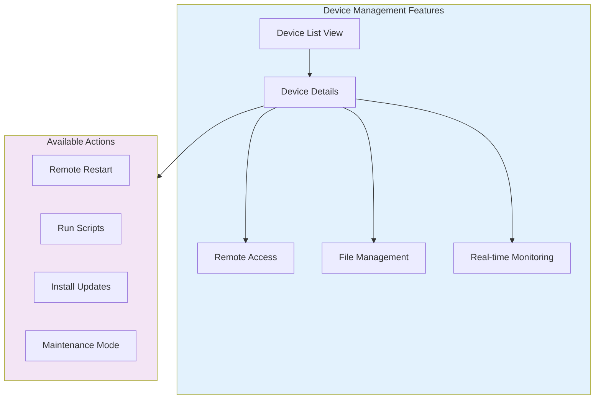

# First Steps Guide

Now that you have OpenFrame running, let's walk through the essential first steps to configure your environment for real-world use. This guide covers the top 5 things you should do after installation.

## Overview

After completing the [Quick Start Guide](./quick-start.md), you'll want to:

1. **[Set Up Your First Organization](#1-set-up-your-first-organization)** - Configure your MSP company profile
2. **[Configure Authentication](#2-configure-authentication)** - Set up OAuth providers and user access
3. **[Connect Your First Devices](#3-connect-your-first-devices)** - Register real devices for monitoring
4. **[Explore Key Features](#4-explore-key-features)** - Understand core functionality
5. **[Set Up Monitoring & Alerts](#5-set-up-monitoring--alerts)** - Configure proactive monitoring

Let's dive into each step!

## 1. Set Up Your First Organization

Organizations in OpenFrame represent your MSP clients or internal departments. Let's create your first organization.

### Create an Organization

1. **Navigate to Organizations**:
   - Click **Organizations** in the sidebar
   - Click **+ New Organization** button

2. **Fill in Organization Details**:

```yaml
General Information:
  Name: "Your MSP Company"
  Description: "Main MSP operations and management"
  Type: "Managed Service Provider"
  
Contact Information:
  Primary Contact: "IT Administrator"
  Email: "admin@yourcompany.com"
  Phone: "+1-555-0123"
  
Address:
  Street: "123 Business Ave"
  City: "Your City"
  State: "Your State"
  Postal Code: "12345"
  Country: "United States"
```

3. **Save and Verify**:
   - Click **Save Organization**
   - Verify the organization appears in the organizations list
   - Note the organization ID for future reference

### Organization Setup Checklist

- [ ] Organization profile completed with accurate information
- [ ] Primary contact information configured
- [ ] Address details added for compliance and reporting
- [ ] Organization appears in the dashboard

## 2. Configure Authentication

Set up secure authentication for your team and enable Single Sign-On (SSO) if needed.

### User Management

#### Create Additional Users

1. **Navigate to Settings → Users**:
   - Click **Settings** in the sidebar
   - Go to **Company & Users** tab
   - Click **Add Users**

2. **Add Team Members**:

```typescript
// Example user configuration
const newUsers = [
  {
    email: "tech1@yourcompany.com",
    firstName: "John",
    lastName: "Smith", 
    role: "TECHNICIAN",
    permissions: ["DEVICE_READ", "DEVICE_MANAGE", "TICKET_MANAGE"]
  },
  {
    email: "manager@yourcompany.com",
    firstName: "Jane",
    lastName: "Doe",
    role: "ADMIN", 
    permissions: ["ALL"]
  }
];
```

#### User Roles and Permissions

| Role | Permissions | Use Case |
|------|-------------|----------|
| **SUPER_ADMIN** | All system operations | Platform administrators |
| **ADMIN** | Organization management, user management | MSP managers |
| **TECHNICIAN** | Device management, ticket handling | Field technicians |
| **VIEWER** | Read-only access | Clients, reporting staff |

### Configure OAuth Providers

#### Microsoft Entra ID (Azure AD)

1. **Navigate to Settings → SSO Configuration**:
   - Click **Settings** → **SSO Configuration**
   - Click **+ Add Provider** → **Microsoft**

2. **Configure Azure AD**:

```yaml
Provider Settings:
  Provider Type: "Microsoft Entra ID"
  Tenant ID: "your-tenant-id"
  Client ID: "your-client-id"
  Client Secret: "your-client-secret"
  
Allowed Domains:
  - "yourcompany.com"
  - "clients.yourcompany.com"
  
User Mapping:
  Email Attribute: "email"
  First Name: "given_name"
  Last Name: "family_name"
  Role Mapping: "groups"
```

3. **Test Configuration**:
   - Click **Test Connection**
   - Verify successful authentication
   - Test user login flow

#### Google Workspace

1. **Add Google Provider**:
   - Click **+ Add Provider** → **Google**

2. **Configure Google OAuth**:

```yaml
Provider Settings:
  Client ID: "your-google-client-id"
  Client Secret: "your-google-client-secret"
  Hosted Domain: "yourcompany.com"  # Optional: restrict to domain

User Attributes:
  Email: "email"
  Name: "name"
  Picture: "picture"
```

### Authentication Checklist

- [ ] Additional user accounts created for team members
- [ ] User roles and permissions configured appropriately
- [ ] SSO provider configured and tested (if using)
- [ ] Login flow tested with different user types

## 3. Connect Your First Devices

Replace the sample data with real devices from your environment.

### Device Agent Installation

#### Windows Agent Setup

1. **Download the OpenFrame Client**:
   ```powershell
   # Download from releases or build from source
   Invoke-WebRequest -Uri "https://releases.openframe.ai/latest/openframe-client-windows.exe" -OutFile "openframe-client.exe"
   ```

2. **Install and Configure**:
   ```powershell
   # Run installer as Administrator
   .\openframe-client.exe install --server "https://your-openframe-server.com" --token "your-registration-token"
   
   # Verify installation
   Get-Service "OpenFrame Client"
   ```

#### Linux Agent Setup

1. **Install via Script**:
   ```bash
   # Download and run installation script
   curl -sSL https://install.openframe.ai/linux.sh | bash
   
   # Or manual installation
   wget https://releases.openframe.ai/latest/openframe-client-linux-amd64.tar.gz
   tar -xzf openframe-client-linux-amd64.tar.gz
   sudo ./install.sh
   ```

2. **Configure Service**:
   ```bash
   # Configure client
   sudo openframe-client configure \
     --server "https://your-openframe-server.com" \
     --token "your-registration-token"
   
   # Start service
   sudo systemctl start openframe-client
   sudo systemctl enable openframe-client
   
   # Check status
   sudo systemctl status openframe-client
   ```

#### macOS Agent Setup

1. **Install via Homebrew** (if available):
   ```bash
   # Add OpenFrame tap
   brew tap openframe/tap
   brew install openframe-client
   ```

2. **Configure and Start**:
   ```bash
   # Configure client
   openframe-client configure \
     --server "https://your-openframe-server.com" \
     --token "your-registration-token"
   
   # Start as service
   brew services start openframe-client
   ```

### Device Registration Tokens

Generate registration tokens for your devices:

1. **Navigate to Devices → Registration**:
   - Click **Devices** → **+ Add Device**
   - Select **Generate Registration Token**

2. **Configure Token Settings**:

```yaml
Token Configuration:
  Name: "Windows Workstations Q1 2024"
  Expires: "90 days"
  Max Uses: 50
  Allowed IPs: ["10.0.0.0/8", "192.168.0.0/16"]  # Optional
  
Device Defaults:
  Organization: "Your MSP Company"
  Tags: ["workstation", "windows", "production"]
  Monitoring Enabled: true
  Agent Auto-Update: true
```

### Verify Device Connectivity

After installing agents, verify they're connecting properly:

1. **Check Device List**:
   - Navigate to **Devices**
   - Look for newly registered devices
   - Verify **Status** shows "Online"

2. **Test Device Communication**:
   - Click on a device to view details
   - Check **Last Seen** timestamp
   - Verify **Agent Version** matches expected version

### Device Connection Checklist

- [ ] Registration tokens generated with appropriate settings
- [ ] Agents installed on target devices
- [ ] Devices appear in OpenFrame dashboard  
- [ ] Device status shows "Online" 
- [ ] Basic device information is populated

## 4. Explore Key Features

Now let's explore the core features that make OpenFrame powerful for MSP operations.

### Device Management

#### Device Dashboard



**Key Features to Explore**:
- **Device Inventory**: Hardware specs, installed software, network configuration
- **Remote Desktop**: Browser-based remote access via MeshCentral integration
- **File Manager**: Browse, upload, download files on remote devices
- **Performance Monitoring**: Real-time CPU, memory, disk metrics

### AI-Powered Chat (Mingo)

#### Getting Started with Mingo

1. **Access Chat Interface**:
   - Click the **Chat** icon (💬) in the top navigation
   - Or use the floating chat button

2. **Try These Sample Queries**:

```text
# Device status inquiries
"Show me all offline devices"
"Which devices need updates?"
"What's the current CPU usage across all devices?"

# Troubleshooting assistance  
"Help me diagnose high memory usage on DESKTOP-001"
"What should I check for network connectivity issues?"
"Walk me through Windows update troubleshooting"

# Reporting and analytics
"Generate a summary of this week's alerts"
"Show me devices with low disk space"
"What are the most common issues this month?"
```

3. **Advanced Mingo Features**:
   - **Context Awareness**: Mingo remembers conversation context
   - **Device Actions**: Execute commands through chat interface
   - **Documentation Search**: Ask about OpenFrame features and procedures
   - **Ticket Integration**: Create and update support tickets via chat

### Real-time Monitoring

#### Monitoring Dashboard

Explore the monitoring capabilities:

1. **System Overview**:
   - Navigate to **Dashboard** for high-level metrics
   - View **Active Alerts** panel
   - Check **Device Status** distribution

2. **Detailed Monitoring**:
   - Click **Monitoring** in sidebar for detailed views
   - Explore **Performance Metrics** charts
   - Review **Event Timeline** for system events

3. **Custom Dashboards**:
   - Create custom views for specific device groups
   - Set up monitoring dashboards for different clients
   - Configure alert thresholds and notifications

### Feature Exploration Checklist

- [ ] Device management interface explored
- [ ] Remote access functionality tested
- [ ] AI chat (Mingo) tested with sample queries
- [ ] Monitoring dashboards reviewed
- [ ] Custom views/filters created as needed

## 5. Set Up Monitoring & Alerts

Configure proactive monitoring to stay ahead of issues.

### Configure Alert Rules

1. **Navigate to Settings → Monitoring**:
   - Click **Settings** → **AI Settings** → **Monitoring**
   - Click **+ Add Alert Rule**

2. **Create Alert Rules**:

```yaml
# High CPU Usage Alert
Alert Name: "High CPU Usage"
Condition: "cpu_usage > 85% for 5 minutes"
Severity: "WARNING"
Notification: 
  - Email: "alerts@yourcompany.com"
  - Slack: "#alerts"
  
# Disk Space Alert
Alert Name: "Low Disk Space"  
Condition: "disk_free_percent < 10%"
Severity: "CRITICAL"
Auto-Actions:
  - Clean temporary files
  - Notify administrator
  
# Device Offline Alert
Alert Name: "Device Offline"
Condition: "device_status = 'offline' for 10 minutes" 
Severity: "WARNING"
Escalation:
  - Immediate: Email technician
  - After 30min: SMS to on-call
```

### Configure Notification Channels

#### Email Notifications

1. **Set up SMTP**:
   ```yaml
   SMTP Configuration:
     Host: "smtp.gmail.com"
     Port: 587
     Security: "STARTTLS"
     Username: "alerts@yourcompany.com"
     Password: "your-app-password"
   ```

#### Slack Integration

1. **Create Slack Webhook**:
   - Go to your Slack workspace
   - Create an Incoming Webhook app
   - Configure webhook URL in OpenFrame

2. **Configure Slack Alerts**:
   ```yaml
   Slack Integration:
     Webhook URL: "https://hooks.slack.com/services/..."
     Default Channel: "#alerts"
     Username: "OpenFrame Alerts"
     Icon: ":warning:"
   ```

### Performance Baselines

Set up performance baselines for better alerting:

1. **Automatic Baseline Learning**:
   - Enable **Learn Normal Patterns**
   - Set learning period: 7 days
   - Configure baseline sensitivity

2. **Manual Baseline Configuration**:

```yaml
Performance Baselines:
  CPU Usage:
    Normal: "< 60%"
    Warning: "> 75%"
    Critical: "> 90%"
    
  Memory Usage:
    Normal: "< 80%"
    Warning: "> 90%"
    Critical: "> 95%"
    
  Disk Usage:
    Normal: "< 80%"
    Warning: "> 90%"
    Critical: "> 95%"
```

### Monitoring Setup Checklist

- [ ] Alert rules configured for critical metrics
- [ ] Notification channels set up (email, Slack, SMS)
- [ ] Performance baselines established
- [ ] Test alerts sent and received successfully
- [ ] Escalation procedures documented

## Where to Get Help

As you complete these first steps, here are resources to help you succeed:

### 🗨️ **Community Support**
- **[OpenMSP Slack Community](https://join.slack.com/t/openmsp/shared_invite/zt-36bl7mx0h-3~U2nFH6nqHqoTPXMaHEHA)** - Get help from other users and the OpenFrame team
- **Community Hub** - Visit [OpenMSP.ai](https://www.openmsp.ai/) for events and resources

### 📚 **Documentation**
- **[Development Guide](../development/README.md)** - Complete development documentation
- **[Architecture Overview](../development/architecture/overview.md)** - Understand how OpenFrame works
- **[API Reference](../development/testing/overview.md)** - GraphQL and REST API documentation

### 🛠️ **Technical Support**
- **Issue Reporting** - Use our Slack community for bug reports and feature requests
- **Integration Help** - Get assistance with custom integrations and advanced configurations

## Next Steps

Congratulations! You've completed the essential first steps. Here's what to explore next:

### 🚀 **Immediate Next Steps**
1. **[Device Integration](../development/setup/local-development.md)** - Connect more devices and tools
2. **[User Training](../development/setup/environment.md)** - Train your team on OpenFrame features
3. **[Custom Dashboards](../development/architecture/overview.md)** - Create client-specific views

### 🏢 **Production Readiness**
1. **Security Hardening** - Implement production security measures
2. **Backup & Recovery** - Set up data backup and disaster recovery
3. **Performance Tuning** - Optimize for your specific workload

### 🔧 **Advanced Configuration**
1. **Custom Integrations** - Connect additional tools and services
2. **Automation Workflows** - Set up advanced automation rules
3. **API Development** - Build custom applications using OpenFrame APIs

---

**Well Done!** 🎉 You've successfully configured OpenFrame for real-world use. Your MSP operations are now enhanced with AI-powered automation and unified device management.

Ready for more advanced features? Check out our [Development Guide](../development/README.md) to unlock the full potential of OpenFrame!