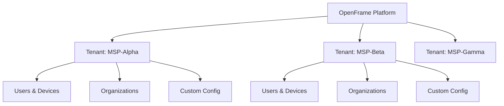
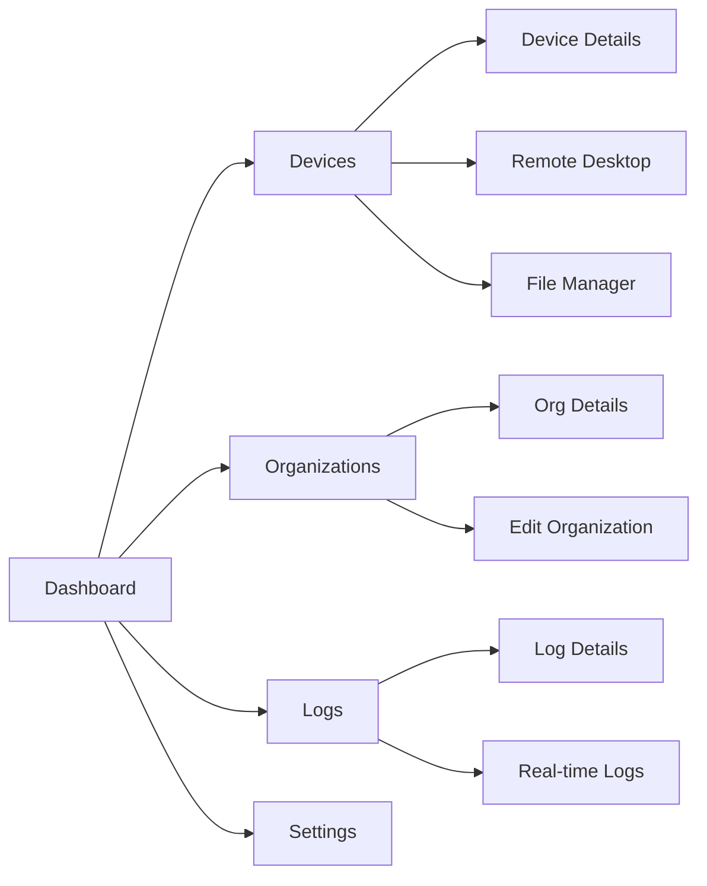
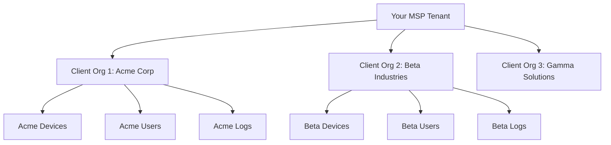

# First Steps with OpenFrame

Congratulations on getting OpenFrame running! This guide covers the **first 5 things** you should do to get familiar with the platform and explore its key capabilities.

> **Prerequisite**: Complete the [Quick Start Guide](quick-start.md) and have OpenFrame running locally.

## 1. Create Your First Tenant Organization

Every OpenFrame deployment starts with creating a tenant organization. This establishes your MSP business context and enables multi-tenant isolation.

### Access the Registration Flow

1. **Navigate** to http://localhost:3000
2. **Click "Sign Up"** if you haven't already registered
3. **Complete the registration form**:

```text
Organization Name: Your MSP Business Name
Your Name: Your Full Name  
Email: your.email@company.com
Password: [secure password]
Domain: your-company (will create your-company.openframe.local)
```

### Understand Tenant Isolation

Once registered, you'll notice:
- **Unique tenant URL**: Each organization gets isolated access
- **Branding space**: Placeholder for custom logos and colors  
- **Independent configuration**: Your settings don't affect other tenants



## 2. Explore the Main Dashboard

The OpenFrame dashboard provides a unified view of your MSP operations.

### Key Dashboard Sections

Navigate through these main areas:

**🏠 Overview Dashboard**
- **Device summary** - Total devices, online/offline status
- **Recent activity** - Latest events and alerts
- **Organization stats** - Client count and growth metrics
- **System health** - Platform performance indicators

**💻 Device Management**
- **Device inventory** - All managed endpoints
- **Real-time status** - Live connection monitoring  
- **Device details** - Hardware, software, and agent information
- **Remote actions** - Execute commands and scripts

**🏢 Organization Management** 
- **Client organizations** - Your MSP customers
- **Contact information** - Business details and contacts
- **Service relationships** - Device assignments per client

**📊 Logs & Analytics**
- **Centralized logging** - All device and system logs
- **Search and filtering** - Find specific events quickly
- **Real-time monitoring** - Live log streaming
- **Analytics dashboards** - Usage patterns and trends

### Navigation Patterns



## 3. Add Your First Organization (MSP Client)

OpenFrame separates your MSP business (tenant) from your client organizations. Let's add your first client.

### Create a Client Organization

1. **Navigate** to **Organizations** section
2. **Click "Add Organization"**
3. **Fill out the organization form**:

**General Information:**
```text
Organization Name: Acme Corporation
Industry: Manufacturing
Website: https://acme-corp.com
```

**Contact Information:**
```text
Primary Contact: John Smith
Email: john.smith@acme-corp.com  
Phone: +1-555-0123
Address: 123 Business St, City, State 12345
```

**Service Details:**
```text
Service Level: Premium Support
Contract Start: [current date]
Notes: 24/7 monitoring required
```

### Understanding Organization Hierarchy



## 4. Set Up Device Management

Device management is at the core of MSP operations. Let's configure your first device connection.

### Understanding Device Integration

OpenFrame supports multiple device management platforms:

| Platform | Use Case | Integration Type |
|----------|----------|------------------|
| **Fleet MDM** | macOS/Linux management | API + Agent |
| **Tactical RMM** | Windows/Linux monitoring | API + Agent |
| **MeshCentral** | Remote access & files | WebSocket + Agent |

### Add a Test Device (Simulation)

For initial exploration, we'll add your development machine as a managed device:

1. **Navigate** to **Devices** section
2. **Click "Add Device"** or **"Register New Device"**
3. **Choose registration method**:
   - **Manual Registration**: For testing and development
   - **Agent Installation**: For production environments

**Manual Registration Example:**
```text
Device Name: Development Workstation
Organization: Acme Corporation  
Device Type: Desktop
Operating System: macOS 14.0
IP Address: 192.168.1.100
```

### Device Status Overview

Once added, you'll see device information:
- **Connection Status**: Online/Offline indicator
- **Last Seen**: Timestamp of last communication
- **System Information**: OS, hardware specs, installed software
- **Agent Version**: OpenFrame client version if installed

## 5. Configure Basic Settings

Customize OpenFrame for your MSP operations and explore key configuration options.

### User & Access Management

**Add Team Members:**
1. **Navigate** to **Settings** → **Company & Users**
2. **Click "Invite Users"**
3. **Enter email addresses** for your team
4. **Assign roles**:
   - **Admin**: Full platform access
   - **Technician**: Device and log management
   - **Read-Only**: Dashboard and reporting access

**Configure SSO (Optional):**
1. **Go to Settings** → **SSO Configuration**
2. **Choose provider**: Google, Microsoft, or Custom OIDC
3. **Enter credentials** and configure domain restrictions
4. **Test authentication** flow

### API Access Setup

**Create API Keys:**
1. **Navigate** to **Settings** → **API Keys**
2. **Click "Create New Key"**
3. **Configure permissions**:
   - **Read-Only**: For reporting and monitoring tools
   - **Full Access**: For automation scripts
   - **Device Management**: For agent operations

**Example API Key Configuration:**
```text
Name: External Monitoring Integration
Permissions: Read-Only
Scope: Devices, Logs, Organizations
Rate Limit: 1000 requests/hour
```

### Platform Configuration

**System Settings:**
- **Time Zone**: Set your business timezone
- **Notification Preferences**: Email, Slack, webhook settings  
- **Retention Policies**: Log and data retention periods
- **Backup Configuration**: Data backup schedules

**Integration Settings:**
- **Tool Connections**: Configure Fleet MDM, Tactical RMM, MeshCentral
- **Webhook Endpoints**: For external system integration
- **Custom Branding**: Upload logos and set color schemes

## Next Steps & Exploration

### Immediate Exploration (Next 30 Minutes)

**🔍 Try These Features:**
- **Search functionality** - Use the global search to find devices, logs, or organizations
- **Real-time updates** - Watch live device status changes and log streaming
- **GraphQL API** - Explore http://localhost:8082/graphiql for API capabilities
- **Mobile responsiveness** - Check the interface on tablet/mobile viewports

**📊 Generate Some Data:**
- **Create additional organizations** to see multi-client scenarios
- **Add more test devices** with different configurations  
- **Explore log filtering** and search capabilities
- **Test user role permissions** by creating different user types

### Advanced Learning Path

**Week 1: Master the Basics**
1. **[Development Environment Setup](../development/setup/environment.md)** - Set up IDE and advanced tools
2. **[Architecture Overview](../development/architecture/overview.md)** - Understand system components
3. **[Local Development Guide](../development/setup/local-development.md)** - Advanced development workflows

**Week 2: Customization & Integration**
4. **[API Integration](../development/api-integration.md)** - Build custom integrations
5. **[Testing Overview](../development/testing/overview.md)** - Learn testing approaches
6. **[Contributing Guidelines](../development/contributing/guidelines.md)** - Contribute to the project

### Production Considerations

When ready to move beyond development:

**🏗️ Deployment Options:**
- **Kubernetes**: Use provided Helm charts in `manifests/`
- **Docker Compose**: Production-ready compose files
- **Cloud Platforms**: AWS, GCP, Azure deployment guides

**🔒 Security Hardening:**
- **SSL/TLS certificates** for all endpoints
- **Database encryption** at rest and in transit
- **Network segmentation** between services
- **Regular security updates** and patches

**📈 Scaling Preparation:**
- **Resource monitoring** with Prometheus and Grafana
- **Load balancing** for high-availability deployments
- **Database clustering** for MongoDB and Cassandra
- **Event streaming scaling** with Kafka clusters

## Getting Help & Community

### OpenMSP Slack Community

Join our active community for support, discussions, and collaboration:

🔗 **Slack Invite**: https://join.slack.com/t/openmsp/shared_invite/zt-36bl7mx0h-3~U2nFH6nqHqoTPXMaHEHA

**Popular Channels:**
- `#general` - General discussions and announcements
- `#support` - Technical help and troubleshooting  
- `#development` - Development questions and collaboration
- `#integrations` - Tool integration discussions

### Documentation Resources

- **API Documentation**: GraphQL schema and REST API references
- **Configuration Guides**: Detailed configuration for all services
- **Integration Examples**: Sample code for common integrations
- **Troubleshooting**: Common issues and solutions

### Video Tutorials

Check out our video walkthrough series for visual learning:

[](https://www.youtube.com/watch?v=O8hbBO5Mym8)

> **Remember**: We don't use GitHub Issues or GitHub Discussions. All support and community interaction happens in our OpenMSP Slack community.

---

**Congratulations!** You've completed the first steps with OpenFrame. You now have a solid foundation to explore the platform's capabilities and begin building your MSP operations.

**Continue Learning**: Ready to dive deeper? Start with [Development Environment Setup](../development/setup/environment.md) →