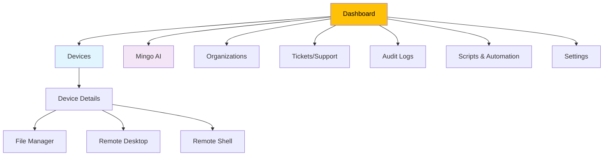
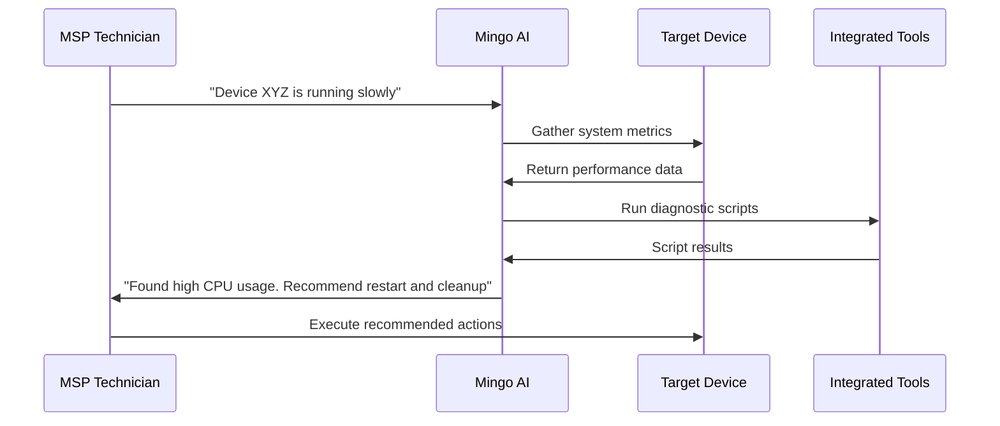

# First Steps Guide

Welcome to OpenFrame! You've successfully completed the quick start setup. Now let's explore the platform's key features and get you productive with AI-powered MSP operations.

## Your First 5 Actions

### 1. 🏢 Create Your Organization

Your organization is the foundation of your MSP setup in OpenFrame.

**Steps:**
1. Navigate to **Organizations** in the main menu
2. Click **"New Organization"** button
3. Fill out the organization details:

```text
Organization Name: Your MSP Company
Organization Type: Managed Service Provider
Industry: Information Technology
Contact Email: admin@yourmsp.com
Phone: +1 (555) 123-4567
```

4. Add address information:
   - Street address
   - City, State, ZIP
   - Country

5. Click **"Create Organization"**

**Why This Matters:** Organizations provide tenant isolation, branding, and billing boundaries. All devices, users, and tools are scoped to your organization.

### 2. 🤖 Meet Mingo AI Assistant

Mingo is your intelligent MSP assistant. Let's introduce yourself!

[](https://www.youtube.com/watch?v=mAi4qqA8b00)

**Steps:**
1. Click **"Mingo"** in the main navigation
2. Type your first message:

```text
Hello Mingo! I'm new to OpenFrame. Can you help me understand how to get started with device management?
```

3. Explore Mingo's capabilities:
   - Ask about MSP best practices
   - Request help with troubleshooting workflows
   - Get guidance on OpenFrame features

**Sample Conversation:**
```text
You: "How do I add my first device to monitoring?"

Mingo: "I'll help you add your first device! There are a few ways to do this:

1. **Agent Installation**: Install the OpenFrame client on the device
2. **Network Discovery**: Scan your network for devices
3. **Manual Entry**: Add device information manually

Which approach would you like to start with?"
```

### 3. 🖥️ Add Your First Device

Let's get a device under management to see OpenFrame in action.

**Option A: Install OpenFrame Client (Recommended)**

1. Go to **Devices** → **"Add Device"**
2. Select **"Install Agent"**
3. Choose the operating system:
   - Windows: Download `.msi` installer
   - macOS: Download `.pkg` installer  
   - Linux: Use shell script installation
4. Run the installer on your target device
5. Provide the registration key when prompted

**Option B: Network Discovery**

1. Go to **Devices** → **"Network Discovery"**
2. Enter your network range (e.g., `192.168.1.0/24`)
3. Click **"Scan Network"**
4. Select discovered devices to add to monitoring

**Expected Result:**
Your device will appear in the Devices dashboard with:
- Real-time status indicators
- Basic hardware information
- Connectivity status
- Available actions (remote desktop, file management, etc.)

### 4. ⚙️ Configure Basic Settings

Customize OpenFrame for your MSP's needs.

**Navigate to Settings:**
1. Click your profile icon → **"Settings"**
2. Configure essential settings:

**Profile Settings:**
- Update your name and contact information
- Set your timezone
- Configure notification preferences

**Company & Users:**
- Add team members via **"Invite Users"**
- Set up user roles and permissions
- Configure organizational defaults

**AI Configuration:**
- Set up your AI provider (Anthropic Claude recommended)
- Configure AI policies and guardrails
- Enable/disable specific AI features

**SSO Configuration (Optional):**
- Connect Google or Microsoft SSO
- Configure allowed domains
- Set up automatic user provisioning

### 5. 🔧 Explore Integrated Tools

OpenFrame's power comes from unified tool integration.

**Fleet MDM Integration:**
1. Go to **Tools** → **"Fleet MDM"**
2. Review device policies and queries
3. Explore compliance reporting

**Tactical RMM Features:**
1. Navigate to **Remote Management**
2. Access remote desktop sessions
3. Review monitoring scripts and alerts

**File Management:**
1. Select a device from the **Devices** list
2. Click **"File Manager"**
3. Browse device files and folders
4. Test file upload/download functionality

## Understanding the OpenFrame Interface

### Main Navigation Structure



### Key Dashboard Widgets

**Device Overview:**
- Total devices under management
- Online/offline status distribution
- Recent device activities
- Alert summaries

**Mingo AI Activity:**
- Recent AI conversations
- Automated resolutions
- Pending approvals

**Organization Health:**
- User activity metrics
- System performance indicators
- Integration status

## Common First-Day Workflows

### Workflow 1: Device Troubleshooting



### Workflow 2: Client Onboarding

1. **Create Organization**: Set up client's organizational structure
2. **Add Devices**: Install agents on client devices
3. **Configure Policies**: Set up monitoring and compliance rules
4. **Set Notifications**: Configure alert routing
5. **Grant Access**: Invite client users with appropriate permissions

### Workflow 3: Proactive Monitoring Setup

1. **Define Monitoring Policies**:
   - Disk space thresholds
   - CPU/memory utilization limits
   - Network connectivity requirements

2. **Create Automation Scripts**:
   - Automated maintenance tasks
   - Alert response procedures
   - Reporting schedules

3. **Configure AI Guardrails**:
   - Approval requirements for sensitive actions
   - Escalation procedures
   - Audit trail requirements

## Exploring Advanced Features

### Stream Processing & Analytics

OpenFrame processes device events in real-time using Apache Kafka:

- **Live Device Events**: See device status changes as they happen
- **Performance Metrics**: Real-time system resource monitoring
- **Audit Trails**: Complete activity logging for compliance

### Multi-Tenant Architecture

Each organization operates in complete isolation:

- **Data Separation**: Organizations cannot access each other's data
- **Custom Branding**: Apply organization-specific themes and logos
- **Independent Configuration**: Separate settings and integrations per organization

### API Access

OpenFrame provides comprehensive APIs:

- **GraphQL API**: Flexible queries for frontend applications
- **REST API**: Standard endpoints for integrations
- **WebSocket Support**: Real-time updates and notifications

## Customization Opportunities

### Extending AI Capabilities

- **Custom AI Models**: Integrate additional AI providers
- **Specialized Prompts**: Create MSP-specific AI interactions
- **Workflow Automation**: Build AI-driven operational procedures

### Tool Integrations

- **Add New Tools**: Integrate additional MSP software
- **Custom Connectors**: Build adapters for proprietary systems
- **Unified Dashboard**: Aggregate data from all your tools

### Branding & White-Labeling

- **Custom Themes**: Apply your MSP's brand colors and fonts
- **Logo Integration**: Add your company logo throughout the interface
- **Client Portals**: Provide branded experiences for your clients

## Next Steps & Learning Path

### Immediate Actions (Next 24 Hours)
- [ ] Complete organization setup with full contact details
- [ ] Add 3-5 devices to get comfortable with device management
- [ ] Have meaningful conversations with Mingo AI
- [ ] Invite at least one team member to test collaboration
- [ ] Explore one integrated tool (Fleet MDM or Tactical RMM)

### Short-term Goals (Next Week)
- [ ] Set up monitoring policies for critical device metrics
- [ ] Create your first automation script
- [ ] Configure SSO for your organization
- [ ] Establish client onboarding procedures
- [ ] Test remote management capabilities

### Long-term Development (Next Month)
- [ ] Fully onboard your first client
- [ ] Develop custom AI workflows for your MSP processes
- [ ] Integrate additional tools from your existing stack
- [ ] Implement advanced monitoring and alerting
- [ ] Explore API integrations for your business systems

## Getting Help & Resources

### Community Support
- **OpenMSP Slack**: [Join our community](https://join.slack.com/t/openmsp/shared_invite/zt-36bl7mx0h-3~U2nFH6nqHqoTPXMaHEHA)
- **Best Practices**: Share experiences with other MSPs
- **Feature Requests**: Suggest new capabilities and improvements

### Documentation & Learning
- **Development Guides**: Learn to customize and extend OpenFrame
- **API Documentation**: Comprehensive reference for integrations
- **Video Tutorials**: Step-by-step visual guides

### Advanced Topics
- **Architecture Deep-Dive**: Understand the microservices design
- **Security Best Practices**: Implement enterprise-grade security
- **Scaling Strategies**: Handle growth and performance optimization

## Troubleshooting First Steps

### Common Issues

**Devices Not Appearing:**
- Check agent installation logs
- Verify network connectivity
- Confirm registration key validity

**AI Assistant Not Responding:**
- Check AI provider configuration
- Verify API key settings
- Review rate limiting settings

**Performance Issues:**
- Monitor system resource usage
- Check database connection health
- Review service logs for errors

**Authentication Problems:**
- Verify SSO configuration
- Check token expiration settings
- Review user permission assignments

## Success Metrics

Track your OpenFrame adoption success:

**Technical Metrics:**
- Number of devices under management
- AI conversation engagement
- Automated resolution rate
- System uptime and performance

**Business Metrics:**
- Time saved on routine tasks
- Client satisfaction scores
- Operational efficiency improvements
- Cost reduction achievements

---

**Congratulations!** 🎉 You've completed the essential first steps with OpenFrame. You now have a solid foundation to build your AI-powered MSP operations.

**Ready for advanced customization?** Explore our [Development Environment Setup](../development/setup/environment.md) to start building custom solutions!

> **💡 Pro Tip**: OpenFrame is designed for continuous learning and improvement. The more you use Mingo AI and integrated tools, the more personalized and effective your MSP operations become.