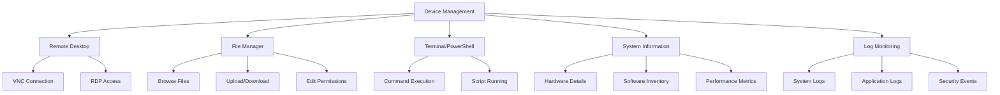
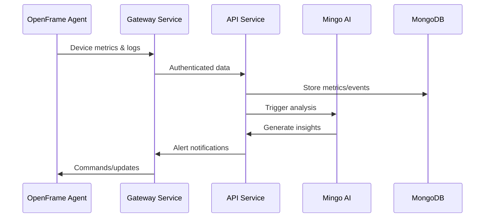

# First Steps with OpenFrame

Now that OpenFrame is running, let's explore the platform's key features and get you productive quickly. This guide covers the 5 essential things you should do after installation.

## 1. Complete Your Organization Setup

Your first task is to properly configure your organization and user management.

### Set Up Organization Details

1. **Navigate to Settings**
   - Click the **Settings** icon in the sidebar
   - Select **Company & Users** tab

2. **Complete Organization Information**
   ```text
   Organization Name: Your MSP Company
   Address: Complete business address
   Contact Information: Primary phone/email
   Time Zone: Your local timezone
   ```

3. **Configure SSO (Recommended)**
   - Go to **SSO Configuration** tab
   - Choose your identity provider (Azure AD, Google, Okta)
   - Configure OIDC/SAML integration

### Invite Team Members

1. **Add Users**
   - Click **Add Users** in Company & Users section
   - Enter email addresses (one per line)
   - Assign appropriate roles:
     - **Admin**: Full system access
     - **Technician**: Device and ticket management
     - **Client**: Limited read-only access

2. **Send Invitations**
   - Users will receive email invitations
   - They can register using your configured SSO or create local accounts

## 2. Connect Your First Integration

OpenFrame's power comes from unifying multiple MSP tools. Let's connect your first integration.

### Choose Your Integration

| Tool | Use Case | Setup Complexity |
|------|----------|------------------|
| **Tactical RMM** | Windows/Linux RMM | ⭐⭐⭐ Medium |
| **Fleet MDM** | Cross-platform MDM | ⭐⭐ Easy |
| **MeshCentral** | Remote access | ⭐⭐ Easy |
| **Authentik** | Identity provider | ⭐⭐⭐⭐ Advanced |

### Connect Tactical RMM (Example)

1. **Prepare Tactical RMM**
   ```bash
   # Get your Tactical RMM API credentials
   # From Tactical RMM UI: Settings > API Keys
   API_URL="https://your-trmm.domain.com"
   API_KEY="your-api-key-here"
   ```

2. **Configure in OpenFrame**
   - Go to **Settings** → **Integrations**
   - Click **Add Integration** → **Tactical RMM**
   - Enter connection details:
     ```text
     Name: Primary TRMM Server
     URL: https://your-trmm.domain.com
     API Key: [paste your API key]
     ```

3. **Test Connection**
   - Click **Test Connection**
   - Verify successful authentication
   - Click **Save Integration**

4. **Verify Data Sync**
   - Navigate to **Devices**
   - You should see devices imported from Tactical RMM
   - Check that device details and status are syncing

## 3. Register and Manage Devices

Experience OpenFrame's unified device management capabilities.

### Register Your First Device

1. **Get Registration Script**
   - Go to **Devices** → **Add Device**
   - Select your target platform
   - Choose integration source (if configured)
   - Copy the registration script

2. **Install OpenFrame Agent**

   **Windows (PowerShell as Administrator):**
   ```powershell
   # Download and run installer
   Invoke-WebRequest -Uri "https://your-openframe.domain/install/windows" -OutFile "install.ps1"
   Set-ExecutionPolicy -ExecutionPolicy RemoteSigned -Scope Process
   .\install.ps1
   ```

   **macOS/Linux:**
   ```bash
   # One-liner installation  
   curl -sSL https://your-openframe.domain/install/macos | bash
   # or for Linux
   curl -sSL https://your-openframe.domain/install/linux | bash
   ```

3. **Verify Device Registration**
   - Return to **Devices** in OpenFrame
   - Look for your newly registered device
   - Status should show **Online** within 1-2 minutes

### Explore Device Management

Once your device appears:



**Try These Features:**

1. **Remote Desktop**
   - Click on your device → **Remote Desktop**
   - Choose connection type (VNC/RDP)
   - Experience browser-based remote access

2. **File Manager**
   - Navigate to **File Manager** tab
   - Browse the remote filesystem
   - Upload/download files directly

3. **Terminal Access**
   - Open **Terminal** tab
   - Run commands remotely:
     ```bash
     # System info
     uname -a          # Linux/macOS
     systeminfo        # Windows
     
     # Disk usage
     df -h            # Linux/macOS
     Get-Volume       # Windows PowerShell
     ```

## 4. Experience Mingo AI Assistant

OpenFrame's AI-powered assistant can help automate many MSP tasks.

[](https://www.youtube.com/watch?v=PexpoNdZtUk)

### Start a Conversation with Mingo

1. **Access Mingo AI**
   - Click **Mingo AI** in the sidebar
   - You'll see a chat interface

2. **Try These Sample Queries**

   **Infrastructure Overview:**
   ```text
   "Show me all devices that are currently offline"
   "What's the health status of my Windows machines?"  
   "List devices that need updates"
   ```

   **Troubleshooting Assistance:**
   ```text
   "Help me diagnose high CPU usage on server-01"
   "What are the latest critical alerts?"
   "Show me disk space issues across all devices"
   ```

   **Automation Tasks:**
   ```text
   "Create a scheduled task to clean temporary files"
   "Generate a weekly infrastructure health report"
   "Set up monitoring for disk space on all servers"
   ```

### Configure AI Settings

1. **AI Model Selection**
   - Go to **Settings** → **AI Settings**
   - Choose your preferred AI model:
     - **Claude-3.5**: Best reasoning and analysis
     - **GPT-4**: Strong general capabilities  
     - **Gemini Pro**: Fast responses

2. **Set AI Permissions**
   - Configure what actions Mingo can perform automatically
   - Set approval thresholds for critical operations
   - Define escalation rules

## 5. Set Up Monitoring and Alerts

Configure OpenFrame to proactively monitor your infrastructure.

### Configure Alert Rules

1. **Navigate to Policies & Queries**
   - Click **Policies & Queries** in the sidebar
   - Switch to **Policies** tab

2. **Create Your First Alert**
   - Click **New Policy**
   - Configure alert criteria:
     ```yaml
     Name: High CPU Usage Alert
     Condition: CPU Usage > 85%
     Duration: 5 minutes
     Severity: Warning
     Actions:
       - Send notification
       - Log to audit trail
       - Trigger Mingo AI analysis
     ```

3. **Set Up Notification Channels**
   - Go to **Settings** → **Notifications**
   - Configure channels:
     - **Email**: Alert notifications via email
     - **Slack**: Integration with team channels
     - **Webhook**: Custom integrations

### Monitor System Health

1. **Dashboard Overview**
   - Return to the main **Dashboard**
   - You'll see widgets for:
     - Device status summary
     - Recent alerts
     - System performance metrics
     - AI activity summary

2. **Review Logs**
   - Navigate to **Logs**
   - Filter by severity, source, or time range
   - Use search to find specific events:
     ```text
     level:ERROR AND source:windows
     event_type:login AND user:admin
     timestamp:[NOW-1H TO NOW]
     ```

## Key Configuration Tips

### Performance Optimization

1. **Tune Polling Intervals**
   ```bash
   # In your environment configuration
   DEVICE_POLL_INTERVAL=300      # 5 minutes for device status
   METRICS_POLL_INTERVAL=60      # 1 minute for metrics
   LOG_RETENTION_DAYS=30         # Keep logs for 30 days
   ```

2. **Configure Data Retention**
   - **Metrics**: Keep 90 days of detailed metrics
   - **Logs**: Retain 30 days of logs locally
   - **Events**: Archive events after 1 year

### Security Best Practices

1. **Enable HTTPS**
   ```bash
   # Configure SSL certificates
   SSL_CERT_PATH=/path/to/cert.pem
   SSL_KEY_PATH=/path/to/key.pem
   FORCE_HTTPS=true
   ```

2. **Configure Authentication**
   - Enable multi-factor authentication
   - Set strong password policies
   - Configure session timeouts
   - Review user permissions regularly

3. **Network Security**
   - Whitelist IP ranges for API access
   - Use VPN for remote agent connections
   - Enable audit logging for all actions

## Understanding the Data Flow



## Next Steps & Advanced Features

Now that you've completed the first steps:

### Immediate Next Actions

1. **Scale Your Setup**
   - Register more devices
   - Connect additional integrations
   - Invite more team members

2. **Customize Workflows**
   - Create custom policies
   - Build automation scripts
   - Configure advanced alerts

3. **Explore Advanced Features**
   - Script execution and scheduling
   - Custom dashboard creation
   - API integration development

### Learning Resources

- **Development Documentation**: Explore the `/docs/development/` section
- **OpenMSP Community**: Join discussions on [OpenMSP Slack](https://join.slack.com/t/openmsp/shared_invite/zt-36bl7mx0h-3~U2nFH6nqHqoTPXMaHEHA)
- **Video Walkthroughs**: Check out the OpenFrame YouTube channel

## Getting Help

### Common Questions

**Q: My device isn't showing up after registration**
A: Check the agent service status and network connectivity. Verify the device can reach your OpenFrame gateway.

**Q: Mingo AI isn't responding**
A: Ensure AI services are configured in Settings → AI Settings. Check that your API keys are valid.

**Q: Integration sync is slow**
A: Review polling intervals and API rate limits for your integrated tools. Consider adjusting sync frequency.

### Support Channels

1. **Community Support**: OpenMSP Slack #openframe-support
2. **Documentation**: Search the docs for specific issues
3. **Bug Reports**: Report issues in OpenMSP Slack (we don't use GitHub Issues)

Congratulations! You've successfully completed the essential first steps with OpenFrame. You now have a unified MSP platform with AI-powered automation ready to streamline your IT operations. 🎉