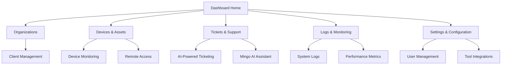

# First Steps Guide

Now that OpenFrame is installed and running, let's explore the platform and configure your initial setup. This guide covers the first 5 essential tasks to get your MSP environment operational.

## Overview of Your OpenFrame Dashboard

After logging in to http://localhost:8080, you'll see the main dashboard with these key areas:



## Step 1: Update Your Admin Profile

### Change Default Credentials

1. **Click** your profile icon (top-right corner)
2. **Select** "Settings" from the dropdown
3. **Navigate** to the "Profile" tab
4. **Update your information**:
   ```
   First Name: [Your First Name]
   Last Name: [Your Last Name]
   Email: [your-email@company.com]
   ```
5. **Change Password**:
   - Current password: `admin123!`
   - New password: [Use a strong password]
   - Confirm new password
6. **Save Changes**

### Configure Organization Details

1. **Go to** Settings → Company & Users
2. **Edit** your organization details:
   ```
   Company Name: [Your MSP Name]
   Domain: [yourcompany.com]
   Contact Email: [admin@yourcompany.com]
   Phone: [Your business phone]
   Address: [Complete business address]
   ```
3. **Upload** your company logo (recommended size: 200x60px)
4. **Save** organization settings

## Step 2: Set Up Your First Client Organization

### Create a Client Organization

1. **Navigate** to Organizations → New Organization
2. **Fill in client details**:
   ```
   Organization Name: Acme Corporation
   Domain: acme.com
   Industry: Manufacturing
   
   Contact Information:
   Primary Contact: John Smith
   Email: john.smith@acme.com
   Phone: +1-555-0123
   
   Address:
   Street: 123 Business Ave
   City: Business City
   State: NY
   ZIP: 12345
   Country: United States
   ```
3. **Set up billing information** (if applicable)
4. **Create Organization**

### Assign Contact Users

1. **Within** the new organization
2. **Go to** Users & Permissions tab
3. **Invite users**:
   ```
   Primary Admin:
   Email: john.smith@acme.com
   Role: Organization Admin
   
   IT Contact:
   Email: it@acme.com
   Role: IT User
   ```
4. **Send invitations** (users will receive email invites)

## Step 3: Configure Integrated Tools

OpenFrame's power comes from integrating your existing tools. Let's set up the core integrations:

### TacticalRMM Integration

1. **Go to** Settings → Tool Integrations
2. **Select** TacticalRMM
3. **Configure connection**:
   ```
   Server URL: https://rmm.yourcompany.com
   API Key: [Your TacticalRMM API key]
   Username: [RMM service account]
   ```
4. **Test Connection** and **Save**

### MeshCentral Remote Access

1. **Select** MeshCentral integration
2. **Configure settings**:
   ```
   Server URL: https://mesh.yourcompany.com
   Username: [MeshCentral admin user]
   Password: [Secure password]
   ```
3. **Enable** remote desktop features
4. **Test Connection** and **Save**

### Optional: Additional Tools

Configure other tools as needed:
- **Fleet MDM**: For mobile device management
- **Authentik**: For SSO and identity management
- **Custom APIs**: For proprietary tools

## Step 4: Add and Monitor Your First Devices

### Register a Test Device

1. **Navigate** to Devices → New Device
2. **Choose registration method**:

#### Option A: Agent Installation
```bash
# Download the OpenFrame agent
curl -L https://releases.openframe.ai/latest/openframe-agent-installer.sh | bash

# Or for Windows PowerShell:
Invoke-WebRequest -Uri https://releases.openframe.ai/latest/install.ps1 | Invoke-Expression
```

#### Option B: Manual Registration
```
Device Name: DEV-WORKSTATION-01
Device Type: Desktop
Operating System: Windows 11 Pro
IP Address: 192.168.1.100
Organization: Acme Corporation
Tags: development, testing
```

### Verify Device Connectivity

1. **Check device status** in the Devices dashboard
2. **Verify** the following indicators:
   - ✅ **Online Status**: Green indicator
   - ✅ **Agent Version**: Latest version number
   - ✅ **Last Seen**: Recent timestamp
   - ✅ **Tool Connections**: Connected integrations

### Explore Device Capabilities

1. **Click** on your device to open details
2. **Try these features**:
   - **Hardware Tab**: View system specifications
   - **Software Tab**: See installed applications
   - **Remote Access**: Test remote desktop connection
   - **Logs Tab**: Review device activity
   - **Security Tab**: Check compliance status

## Step 5: Test AI-Powered Ticketing with Mingo

### Create a Test Ticket

1. **Go to** Tickets → New Ticket
2. **Create** a sample support request:
   ```
   Title: Email not working on laptop
   Organization: Acme Corporation
   Assigned Device: DEV-WORKSTATION-01
   Priority: Medium
   
   Description:
   "User reports that Outlook keeps asking for password 
   and emails are not syncing properly. Started this morning 
   after a Windows update."
   ```
3. **Submit** the ticket

### Interact with Mingo AI

1. **Open** the ticket you just created
2. **Click** "Ask Mingo AI" button
3. **Try these AI interactions**:
   ```
   "What are common causes of Outlook authentication issues?"
   
   "Generate troubleshooting steps for this problem"
   
   "Check device logs for related errors"
   ```

### Review AI Suggestions

Mingo will provide:
- **Automated diagnosis** based on symptoms
- **Step-by-step troubleshooting** procedures
- **Related knowledge base** articles
- **Similar ticket patterns** from history
- **Recommended tools** and scripts

### Test Automated Resolution

1. **Follow** Mingo's suggested resolution steps
2. **Use** suggested PowerShell scripts (if applicable)
3. **Update** ticket status based on results
4. **Mark** ticket as resolved when complete

## Next Actions and Best Practices

### Immediate Setup Tasks

- [ ] **Configure backup settings** for your data
- [ ] **Set up monitoring alerts** for critical systems
- [ ] **Create standard device policies** for new machines
- [ ] **Configure automated patch management** workflows
- [ ] **Set up client notification preferences**

### Explore Advanced Features

1. **Custom Dashboards**: Create widgets for your KPIs
2. **Automated Workflows**: Set up trigger-based actions
3. **Reporting**: Generate monthly service reports
4. **API Integrations**: Connect additional tools
5. **User Training**: Familiarize your team with the interface

### Security Configuration

1. **Enable Two-Factor Authentication**:
   - Go to Settings → Security
   - Configure 2FA for admin accounts
   - Enforce 2FA for all users

2. **Review Access Policies**:
   - Set password complexity requirements
   - Configure session timeout policies
   - Review role-based permissions

3. **Audit Settings**:
   - Enable detailed logging
   - Set up log retention policies
   - Configure security alerts

## Understanding OpenFrame's Core Concepts

### Organizations
- **Multi-tenant architecture** isolates client data
- **Role-based access** controls user permissions
- **Billing integration** tracks service usage
- **Custom branding** for client-facing interfaces

### Devices
- **Unified inventory** across all client environments
- **Real-time monitoring** with automated alerts
- **Remote management** capabilities
- **Compliance tracking** and reporting

### AI Integration
- **Mingo AI** for technician assistance
- **Fae AI** for client-facing support
- **Automated ticket routing** and classification
- **Predictive analytics** for proactive maintenance

### Tool Ecosystem
- **Native integrations** with popular MSP tools
- **API-driven connections** for custom tools
- **Unified workflows** across multiple platforms
- **Centralized management** from single interface

## Troubleshooting Common First-Time Issues

### Login Problems
```bash
# Reset admin password via CLI
docker exec -it openframe-api java -jar reset-password.jar admin@openframe.local
```

### Device Not Appearing
1. **Check network connectivity** between device and OpenFrame
2. **Verify agent installation** and service status
3. **Review firewall settings** for required ports
4. **Check organization assignment** for the device

### Integration Failures
1. **Verify API credentials** for external tools
2. **Test network connectivity** to tool servers
3. **Check API rate limits** and quotas
4. **Review tool-specific documentation** for requirements

### Performance Issues
1. **Monitor resource usage** in Settings → System Health
2. **Check database connectivity** status
3. **Review error logs** for specific issues
4. **Verify adequate system resources**

## Product Demonstration

For a comprehensive overview of OpenFrame's capabilities, watch our detailed walkthrough:

[](https://www.youtube.com/watch?v=bINdW0CQbvY)

This webinar covers advanced features, integration patterns, and real-world usage scenarios.

## Getting Help

### Documentation Resources
- **[Architecture Overview](../development/architecture/overview.md)** - Understanding the platform structure
- **[API Reference](../development/testing/overview.md)** - GraphQL and REST API documentation  
- **[Troubleshooting Guide](../development/testing/overview.md)** - Common issues and solutions

### Community Support
- **OpenMSP Slack**: https://join.slack.com/t/openmsp/shared_invite/zt-36bl7mx0h-3~U2nFH6nqHqoTPXMaHEHA
- **Platform Updates**: https://www.flamingo.run/openframe
- **Community Hub**: https://www.openmsp.ai/

### Professional Services
For enterprise deployments, custom integrations, or training:
- Contact the Flamingo team through the OpenMSP Slack community
- Enterprise support packages available for production deployments

---

🎉 **Congratulations!** You've successfully completed the initial setup of OpenFrame. Your MSP platform is now ready to streamline operations, reduce costs, and provide superior service to your clients through AI-enhanced automation.