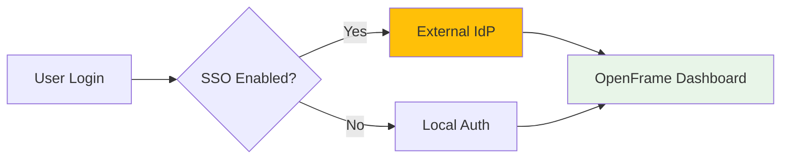
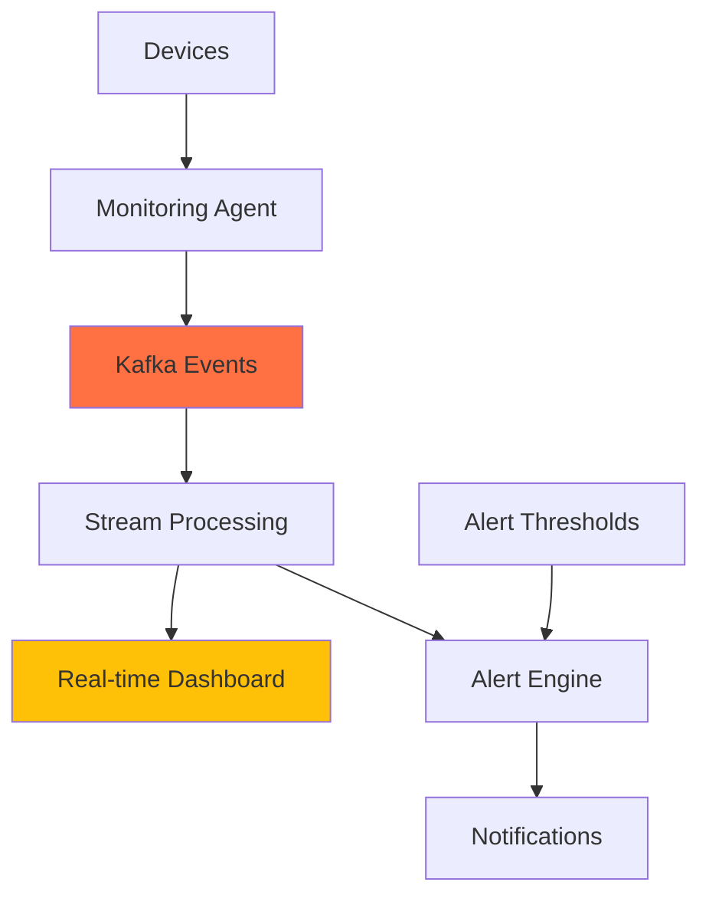

# First Steps Guide

Now that OpenFrame is running, let's configure the essential settings and explore key features. This guide walks you through the first 5 tasks every OpenFrame administrator should complete.

> **Prerequisites**  
> ✅ Completed the [Quick Start Guide](quick-start.md) with OpenFrame running at http://localhost:8080

## First 5 Essential Tasks

### 1. Complete Organization Setup

**Why**: Organization details are used throughout OpenFrame for branding, user management, and multi-tenant operations.

#### Configure Organization Details

1. **Navigate to Organization Settings**:
   - Login to http://localhost:8080
   - Go to **Organizations** in the left sidebar
   - Click your organization name

2. **Complete Organization Profile**:

| Field | Purpose | Example |
|-------|---------|---------|
| **Name** | Display name | "Acme IT Services" |
| **Domain** | Email domain for users | "acme-it.com" |
| **Address** | Business address | Full address |
| **Contact Information** | Support details | Phone, email |

3. **Save Changes**: Click "Save" to persist your configuration

#### Set Organization Preferences

- **Time Zone**: Configure for accurate scheduling and logging
- **Branding**: Upload logo and customize colors
- **Default Settings**: Configure user defaults and permissions

### 2. Configure User Management & Invitations

**Why**: Proper user setup ensures secure access and appropriate permissions for your team.

#### Invite Team Members

1. **Go to Settings** → **Company and Users** → **Users**

2. **Click "Add Users"**:
   - **Email**: Enter team member email
   - **Role**: Choose appropriate role:
     - **Admin**: Full system access
     - **User**: Standard access
     - **Viewer**: Read-only access

3. **Send Invitations**: Users will receive email invites

#### Configure SSO (Optional)

For enterprise environments:

1. **Go to Settings** → **SSO Configuration**
2. **Choose Provider**:
   - **Azure AD/Entra ID**
   - **Google Workspace**  
   - **Generic SAML**

3. **Configure Settings** based on your identity provider



### 3. Generate API Keys for External Access

**Why**: API keys enable integration with external tools, scripts, and monitoring systems.

#### Create Your First API Key

1. **Navigate to API Keys**:
   - Settings → **API Keys**
   - Click **"Create API Key"**

2. **Configure API Key**:

| Setting | Recommendation | Purpose |
|---------|---------------|---------|
| **Name** | "Development Testing" | Identify key purpose |
| **Scope** | Start with "Read Only" | Limit initial permissions |
| **Expiration** | 90 days | Security best practice |

3. **Save and Copy Key**: 
   - ⚠️ **Important**: Copy the key immediately - you won't see it again
   - Store securely (password manager recommended)

#### Test API Access

```bash
# Test with your API key
curl -H "Authorization: Bearer YOUR_API_KEY" \
     http://localhost:8080/api/v1/devices

# Expected: JSON response with device list (empty initially)
```

### 4. Explore Device Management

**Why**: Understanding device management is central to OpenFrame's MSP capabilities.

#### Device Management Interface

1. **Navigate to Devices**: Click **"Devices"** in the left sidebar

2. **Explore Views**:
   - **Grid View**: Visual overview of all devices
   - **Table View**: Detailed list with sortable columns
   - **Filters**: Filter by status, type, organization

#### Add Test Device (Simulation)

For testing purposes, you can simulate device registration:

1. **Device Registration**: Go to **Devices** → **"New Device"**

2. **Generate Registration Secret**:
   ```bash
   # In OpenFrame, this would be done through the UI
   # For testing, use the following command:
   curl -X POST http://localhost:8080/api/v1/agent/registration-secret \
        -H "Authorization: Bearer YOUR_API_KEY" \
        -H "Content-Type: application/json"
   ```

3. **Device Types Supported**:
   - **Windows Desktops/Servers**
   - **macOS Workstations** 
   - **Linux Servers**
   - **Network Devices** (via SNMP)

### 5. Set Up Basic Monitoring & Alerting

**Why**: Proactive monitoring prevents issues and ensures optimal performance.

#### Configure Monitoring Preferences

1. **Go to Settings** → **Monitoring**:
   - **Alert Thresholds**: CPU, Memory, Disk usage limits
   - **Notification Channels**: Email, Slack, webhook endpoints
   - **Monitoring Intervals**: Balance between accuracy and performance

#### Dashboard Customization

1. **Dashboard Widgets**:
   - **Device Status Overview**: Online/offline summary
   - **Recent Alerts**: Latest system alerts
   - **Performance Metrics**: System health indicators
   - **Activity Timeline**: Recent user and system actions

2. **Real-Time Updates**: Dashboard refreshes automatically via WebSocket



## Essential Configuration Options

### Application Settings

| Category | Key Settings | Impact |
|----------|--------------|--------|
| **Security** | JWT expiration, password policy | User authentication |
| **Performance** | Cache settings, connection pools | System responsiveness |
| **Integration** | External tool connections | Feature availability |
| **Logging** | Log levels, retention | Troubleshooting capability |

### Database Configuration

For development, OpenFrame uses local databases. In production, configure external instances:

```bash
# Example production environment variables
MONGODB_URI=mongodb://production-mongo:27017/openframe
REDIS_URL=redis://production-redis:6379
KAFKA_BOOTSTRAP_SERVERS=prod-kafka1:9092,prod-kafka2:9092
```

### Tool Integrations Setup

OpenFrame integrates with several MSP tools. Configure these for enhanced functionality:

#### Tactical RMM Integration

1. **Start Tactical RMM** (if using local development):
   ```bash
   cd integrated-tools/tactical-rmm
   docker compose up -d
   ```

2. **Configure in OpenFrame**:
   - Settings → **Integrations** → **Tactical RMM**
   - URL: `http://localhost:8001`
   - API Token: (generated from Tactical RMM)

#### MeshCentral Integration

1. **Start MeshCentral**:
   ```bash
   cd integrated-tools/meshcentral
   docker compose up -d
   ```

2. **Configure Remote Access**:
   - Settings → **Integrations** → **MeshCentral**
   - URL: `https://localhost:443`
   - Login credentials: (created during setup)

## Verification Checklist

Confirm you've completed these essential steps:

- [ ] **Organization configured** with complete details
- [ ] **Team members invited** with appropriate roles
- [ ] **API key created** and tested
- [ ] **Device management explored** and understood
- [ ] **Basic monitoring configured** with alerts

## Where to Get Help

### Built-in Resources

- **GraphQL Explorer**: http://localhost:8080/graphql - Interactive API exploration
- **Health Checks**: http://localhost:8080/actuator/health - System status
- **Documentation**: Built-in help sections within each UI area

### Community Support

- **OpenMSP Slack Community**: https://join.slack.com/t/openmsp/shared_invite/zt-36bl7mx0h-3~U2nFH6nqHqoTPXMaHEHA
- **OpenFrame Website**: https://openframe.ai
- **Flamingo Platform**: https://flamingo.run

### Troubleshooting Tips

#### Common First-Time Issues

1. **Cannot create users**: Check organization domain configuration
2. **API keys not working**: Verify key scope and expiration
3. **Devices not appearing**: Check agent installation and network connectivity
4. **Alerts not firing**: Verify notification channel configuration

#### Performance Optimization

```bash
# Check system resource usage
docker stats

# Monitor Java services
docker logs openframe-api
docker logs openframe-gateway

# Check database performance
docker logs mongodb
```

## Next Steps

🎉 **Great work!** You've configured the essential OpenFrame settings.

### Recommended Learning Path

> **Continue Your Journey**
> 
> 1. **Development Environment**: Set up [development environment](../development/setup/environment.md) for customization
> 2. **Architecture Deep Dive**: Understand [OpenFrame architecture](../development/architecture/overview.md)
> 3. **API Integration**: Learn [API usage](../development/testing/overview.md) for custom integrations
> 4. **Production Deployment**: Plan your [deployment strategy](../development/contributing/guidelines.md)

### Advanced Features to Explore

- **AI Integration**: Configure Mingo AI and Fae assistants
- **Custom Dashboards**: Create role-specific dashboards
- **Automation Rules**: Set up automated responses to common issues
- **Compliance Reporting**: Generate compliance and audit reports
- **Multi-Tenant Management**: Configure additional tenants (enterprise feature)

### Video Resources

Learn more about OpenFrame's enhanced developer experience:

[](https://www.youtube.com/watch?v=O8hbBO5Mym8)

---

**First steps complete!** Your OpenFrame installation is now properly configured and ready for production use or further development.