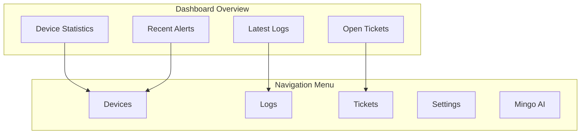
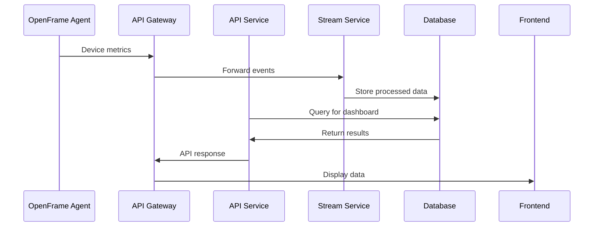

# First Steps with OpenFrame

Now that you have OpenFrame running, this guide walks you through the essential first steps to get familiar with the platform's key features and functionality. You'll learn to navigate the interface, connect tools, and start monitoring devices.

## The First 5 Things to Do

### 1. Complete Your Profile Setup

After your initial login, complete your user profile:

1. **Navigate to Settings** → **Profile**
2. **Update Your Information**:
   - First Name and Last Name
   - Email preferences
   - Time zone
   - Profile picture (optional)
3. **Set Security Preferences**:
   - Enable two-factor authentication (if available)
   - Review login sessions
   - Update password if needed

### 2. Configure Your Organization

Set up your organization details:

1. **Go to Settings** → **Company and Users**
2. **Update Organization Information**:
   - Company name and domain
   - Contact information
   - Address details
   - Logo upload (optional)
3. **Configure Tenant Settings**:
   - Default timezone
   - Regional preferences
   - Branding customization

### 3. Explore the Dashboard

Familiarize yourself with the main dashboard:



**Key Dashboard Sections:**
- **Device Overview**: Summary of managed devices
- **Recent Activity**: Latest logs and events
- **System Health**: Platform status indicators
- **Quick Actions**: Common tasks and shortcuts

### 4. Set Up Your First Integration

Connect an external MSP tool to start collecting data:

#### Option A: Tactical RMM Integration

1. **Navigate to Settings** → **Integrations**
2. **Select Tactical RMM**
3. **Configure Connection**:
   ```bash
   # Tactical RMM URL
   https://your-tactical-rmm.domain.com
   
   # API Token (from Tactical RMM settings)
   your-tactical-rmm-api-token
   
   # Organization mapping
   Map to existing or create new organization
   ```

4. **Test Connection**: Verify data sync

#### Option B: Fleet MDM Integration

1. **Go to Settings** → **Integrations**  
2. **Select Fleet**
3. **Enter Fleet Configuration**:
   ```bash
   # Fleet URL
   https://your-fleet.domain.com
   
   # API Token
   your-fleet-api-token
   
   # Team configuration
   Select team or use default
   ```

### 5. Deploy Your First Agent

Install the OpenFrame client agent on a test device:

#### Windows Installation
```powershell
# Download the installer
Invoke-WebRequest -Uri "http://localhost:8080/downloads/openframe-client-windows.msi" -OutFile "openframe-client.msi"

# Install with registration
msiexec /i openframe-client.msi /quiet REGISTRATION_TOKEN="your-registration-token"
```

#### macOS Installation
```bash
# Download the installer
curl -O http://localhost:8080/downloads/openframe-client-macos.pkg

# Install
sudo installer -pkg openframe-client-macos.pkg -target /
```

#### Linux Installation
```bash
# Download the installer
wget http://localhost:8080/downloads/openframe-client-linux.deb

# Install
sudo dpkg -i openframe-client-linux.deb
```

**Get Registration Token:**
1. Go to **Devices** → **Add Device**
2. Copy the registration token
3. Use in agent installation command

## Initial Configuration Walkthrough

### Device Management Setup

Once agents are connected, configure device management:

1. **Device Categories**: Organize devices by type/function
2. **Monitoring Policies**: Set alert thresholds
3. **Maintenance Schedules**: Configure automatic tasks
4. **Access Controls**: Set user permissions per device

### Log Configuration

Set up centralized logging:

1. **Log Sources**: Configure which services send logs
2. **Retention Policies**: Set how long to keep logs
3. **Alert Rules**: Create notifications for important events
4. **Search Indexes**: Configure for efficient querying

### AI Assistant Setup

Configure Mingo AI for your environment:

1. **Navigate to Settings** → **AI Settings**
2. **Choose AI Provider**: OpenAI, Anthropic, or local models
3. **Set API Keys**: Configure your AI service credentials
4. **Configure Policies**: Set AI behavior and restrictions
5. **Test Integration**: Try a simple query with Mingo

## Key Features Exploration

### Device Monitoring

**Access**: Main menu → **Devices**

Key capabilities:
- **Real-time Status**: Live device health monitoring
- **Hardware Inventory**: CPU, memory, disk, network details
- **Software Tracking**: Installed applications and versions
- **Security Monitoring**: Patch status and vulnerabilities
- **Remote Access**: Built-in remote desktop and file management

### Log Analytics

**Access**: Main menu → **Logs**

Features to explore:
- **Unified Search**: Search across all connected systems
- **Filtering**: Filter by time, severity, source, organization
- **Correlation**: Link related events across systems
- **Exports**: Download logs for external analysis
- **Real-time Streaming**: Watch logs as they arrive

### Ticket Management

**Access**: Main menu → **Tickets**

Core functionality:
- **AI Triage**: Automatic ticket classification
- **Assignment Rules**: Auto-assign based on criteria
- **Escalation**: Automatic escalation on SLA breach
- **Client Portal**: Customer-facing ticket interface
- **Integration**: Sync with external PSA tools

### Settings and Administration

**Access**: Settings icon (top-right)

Important settings:
- **User Management**: Add/remove users, set permissions
- **Organization Management**: Multi-tenant configuration
- **API Keys**: Generate keys for external integrations
- **SSO Configuration**: Set up single sign-on
- **Backup Configuration**: Data backup and restore

## Common Initial Tasks

### 1. Add Team Members

```bash
# Steps to add users:
1. Settings → Company and Users
2. Click "Add User" 
3. Enter email and role
4. Send invitation
5. User receives email to set password
```

### 2. Configure Notifications

```bash
# Set up alert notifications:
1. Settings → Notifications
2. Configure email/SMS settings
3. Set escalation rules
4. Test notification delivery
```

### 3. Import Existing Data

```bash
# Options for data import:
1. CSV imports for devices/users
2. API-based migration scripts  
3. Tool-specific import wizards
4. Bulk operations via GraphQL
```

### 4. Set Up Monitoring Policies

```bash
# Create monitoring rules:
1. Devices → Policies
2. Define thresholds (CPU, memory, disk)
3. Set alert conditions
4. Configure actions (email, ticket, script)
```

### 5. Configure Backup Strategy

```bash
# Essential backups:
1. Database backups (MongoDB)
2. Configuration backups
3. Log archival policies
4. Agent deployment packages
```

## Understanding the Architecture

### Data Flow Overview



### Service Interactions

| Service | Purpose | Data Sources |
|---------|---------|--------------|
| **Gateway** | Entry point, authentication | All external requests |
| **API** | GraphQL/REST endpoints | MongoDB, external APIs |
| **Stream** | Event processing | Kafka, NATS, Debezium |
| **Management** | Background tasks | MongoDB, external tools |
| **Client** | Agent management | NATS, agent connections |

## Best Practices for New Users

### Security
- ✅ **Change default passwords** immediately
- ✅ **Enable audit logging** for compliance
- ✅ **Use API keys** for external integrations
- ✅ **Configure HTTPS** for production
- ✅ **Set up regular backups**

### Performance  
- ✅ **Monitor resource usage** during initial setup
- ✅ **Configure log retention** to manage storage
- ✅ **Use filters** in log searches for better performance
- ✅ **Set up alerts** for system health monitoring

### Organization
- ✅ **Create logical device groups** early
- ✅ **Use consistent naming conventions**
- ✅ **Document your configuration** decisions
- ✅ **Train team members** on the platform

## Getting Help

When you need assistance:

### Community Support
- **OpenMSP Slack**: Join our active community at [OpenMSP Slack](https://join.slack.com/t/openmsp/shared_invite/zt-36bl7mx0h-3~U2nFH6nqHqoTPXMaHEHA)
- **Documentation**: Comprehensive guides available in the `/docs` directory
- **GitHub Discussions**: Community Q&A and feature discussions

### Self-Service Resources
- **Built-in Help**: Context-sensitive help throughout the UI
- **API Documentation**: GraphQL schema and REST API docs
- **Video Tutorials**: Product walkthrough videos
- **Best Practices**: Community-contributed guides

### Troubleshooting
Common issues and solutions:
- **Connection Problems**: Check network connectivity and firewalls
- **Performance Issues**: Monitor resource usage and optimize queries
- **Data Sync Issues**: Verify integration credentials and permissions
- **UI Problems**: Clear browser cache and check console errors

## What's Next?

After completing these first steps:

1. **Deep Dive**: Explore advanced features in specific areas of interest
2. **Customize**: Configure the platform to match your workflow
3. **Scale**: Add more devices, users, and integrations
4. **Contribute**: Join the community and contribute back
5. **Deploy**: Move from development to production environment

---

**🚀 You're Ready!** You now have a solid foundation with OpenFrame. Explore the development guides to customize and extend the platform for your specific needs.