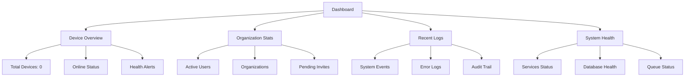

# First Steps with OpenFrame

Now that OpenFrame is running, let's explore the platform and configure your first organization. This guide walks you through the essential first 5 things to do after installation.

## Step 1: Explore the Dashboard

### Access Your Dashboard

Navigate to http://localhost:3000 and log in with the account you created during quick start.

### Dashboard Overview

The main dashboard provides an overview of your OpenFrame environment:



### Key Dashboard Sections

| Section | Purpose | What You'll See |
|---------|---------|-----------------|
| **Device Overview** | Device management summary | 0 devices (initially) |
| **Organizations** | Multi-tenant overview | Your organization |
| **Recent Activity** | System and user events | Login events, system startup |
| **Health Monitors** | Service status checks | All services should show green |

## Step 2: Configure Your Organization Profile

### Navigate to Organization Settings

1. Click on **Settings** in the left sidebar
2. Select **Company and Users** tab
3. Click **Edit Organization**

### Complete Organization Information

Fill in these essential details:

#### Basic Information
```yaml
Organization Name: Your MSP Company Name
Display Name: Public Name (shown to clients)
Domain: yourmsp.com
Industry: Managed Service Provider
```

#### Contact Information
```yaml
Primary Email: admin@yourmsp.com
Phone: +1-555-123-4567
Website: https://yourmsp.com
```

#### Address Details
```yaml
Street Address: 123 Business Ave
City: Your City
State/Province: Your State  
Postal Code: 12345
Country: United States
```

### Save Configuration

Click **Save Changes** to persist your organization profile.

## Step 3: Set Up User Management

### Invite Additional Users

1. Go to **Settings** > **Company and Users**
2. Click **Add Users** button
3. Fill in user details:

```yaml
Email: user@yourmsp.com
First Name: Team
Last Name: Member
Role: Technician | Administrator | Viewer
```

### Configure User Roles

| Role | Permissions | Use Case |
|------|-------------|----------|
| **Administrator** | Full system access | IT managers, MSP owners |
| **Technician** | Device management, scripting | Field technicians |
| **Viewer** | Read-only access | Reporting, auditing |

### Set Up SSO (Optional)

For larger teams, configure Single Sign-On:

1. Navigate to **Settings** > **SSO Configuration**
2. Choose your provider:
   - Google Workspace
   - Microsoft Azure AD
   - Custom OIDC Provider

#### Example: Google SSO Setup

```yaml
Provider Type: Google
Client ID: your-google-client-id.googleusercontent.com
Client Secret: your-google-client-secret  
Domain Restriction: yourmsp.com
```

## Step 4: Add Your First Device

### Install OpenFrame Client Agent

The OpenFrame client agent monitors and manages devices. Install it on a test machine:

#### Windows Installation
```powershell
# Download and run installer
Invoke-WebRequest -Uri "http://localhost:3000/downloads/windows/openframe-client.msi" -OutFile "openframe-client.msi"
Start-Process msiexec.exe -Wait -ArgumentList '/I openframe-client.msi /quiet'
```

#### macOS Installation
```bash
# Download and install
curl -L "http://localhost:3000/downloads/macos/openframe-client.pkg" -o openframe-client.pkg
sudo installer -pkg openframe-client.pkg -target /
```

#### Linux Installation
```bash
# Ubuntu/Debian
curl -L "http://localhost:3000/downloads/linux/openframe-client.deb" -o openframe-client.deb
sudo dpkg -i openframe-client.deb

# RHEL/CentOS
curl -L "http://localhost:3000/downloads/linux/openframe-client.rpm" -o openframe-client.rpm
sudo rpm -i openframe-client.rpm
```

### Generate Registration Secret

1. In OpenFrame UI, navigate to **Devices** > **Add Device**
2. Click **Generate Registration Secret**
3. Copy the secret (e.g., `secret_abc123def456`)

### Register Device

On the device where you installed the client:

```bash
# Register with OpenFrame
openframe-client register --secret secret_abc123def456 --server http://localhost:8080

# Verify registration  
openframe-client status
```

### Verify Device Appears

1. Return to **Devices** page in OpenFrame UI
2. You should see your device listed with:
   - Device name (hostname)
   - Operating system
   - IP address
   - Online status
   - Last seen timestamp

## Step 5: Configure Basic Monitoring and Alerts

### Set Up Device Monitoring

1. Click on your device in the **Devices** list
2. Navigate to the **Monitoring** tab
3. Enable basic checks:

```yaml
CPU Usage Threshold: 80%
Memory Usage Threshold: 85%  
Disk Space Threshold: 90%
Network Connectivity: Enabled
```

### Configure Notifications

1. Go to **Settings** > **Notifications**
2. Set up alert channels:

#### Email Alerts
```yaml
SMTP Server: smtp.gmail.com
Port: 587
Username: alerts@yourmsp.com
Password: your-app-password
Recipients: admin@yourmsp.com, tech@yourmsp.com
```

#### Slack Integration (Optional)
```yaml
Webhook URL: https://hooks.slack.com/services/YOUR/SLACK/WEBHOOK
Channel: #alerts
Username: OpenFrame Bot
```

### Test Alert System

Trigger a test alert to verify notifications:

1. Navigate to **Devices** > [Your Device] > **Actions**
2. Click **Send Test Alert**
3. Check your email/Slack for the test notification

## Additional Configuration Options

### API Keys for Integrations

If you plan to integrate external tools:

1. Go to **Settings** > **API Keys**
2. Click **Create API Key**
3. Configure:

```yaml
Name: External Integration
Permissions: Read Devices, Write Logs
Expiration: 1 year
Rate Limit: 1000 requests/hour
```

### Backup Configuration

Set up automated backups:

1. Navigate to **Settings** > **System Configuration**
2. Configure backup settings:

```yaml
Backup Frequency: Daily at 2:00 AM
Retention: 30 days
Storage: Local filesystem
Encryption: Enabled
```

## Verify Your Setup

### Health Check Checklist

Ensure these items are configured:

- [ ] Organization profile completed
- [ ] At least one additional user invited
- [ ] First device added and online
- [ ] Basic monitoring enabled
- [ ] Alert notifications configured
- [ ] API keys created (if needed)

### Test Core Functionality

1. **Device Communication**: Check device status updates every 30 seconds
2. **User Access**: Log in with secondary user account
3. **Notifications**: Verify test alerts are received
4. **Data Collection**: Confirm logs and metrics appear in dashboard

## Common First-Time Issues

### Device Registration Fails

```bash
# Check client logs
tail -f /var/log/openframe-client/client.log

# Common solutions:
# 1. Verify server URL is accessible
curl http://localhost:8080/health

# 2. Check registration secret validity
# 3. Ensure firewalls allow outbound connections
```

### UI Not Loading Properly

```bash
# Check frontend service
curl http://localhost:3000

# Restart frontend if needed
cd openframe/services/openframe-frontend
npm run dev
```

### Missing Permissions

```bash
# Verify user roles in database
mongosh openframe --eval "db.users.find({email: 'your-email@domain.com'})"
```

## Where to Get Help

As you explore OpenFrame further:

### Community Resources
- **OpenMSP Slack**: https://join.slack.com/t/openmsp/shared_invite/zt-36bl7mx0h-3~U2nFH6nqHqoTPXMaHEHA
- **Community Hub**: https://www.openmsp.ai/
- **Documentation**: Local docs and inline help

### Advanced Topics
- **Tool Integration**: Connect Fleet MDM, Tactical RMM, MeshCentral
- **Scripting**: Automate device management tasks
- **Custom Policies**: Define compliance and security rules
- **Analytics**: Set up custom dashboards and reports

## Next Steps

With these first steps complete, you're ready to:

1. **Add More Devices**: Scale your device management
2. **Integrate Tools**: Connect your existing MSP tools
3. **Automate Workflows**: Create scripts and policies
4. **Customize Dashboards**: Build custom reporting views
5. **Invite Team Members**: Scale user access

---

**🎉 Congratulations!** You've successfully configured the basics of OpenFrame. Your MSP platform foundation is now ready for day-to-day operations and further customization.