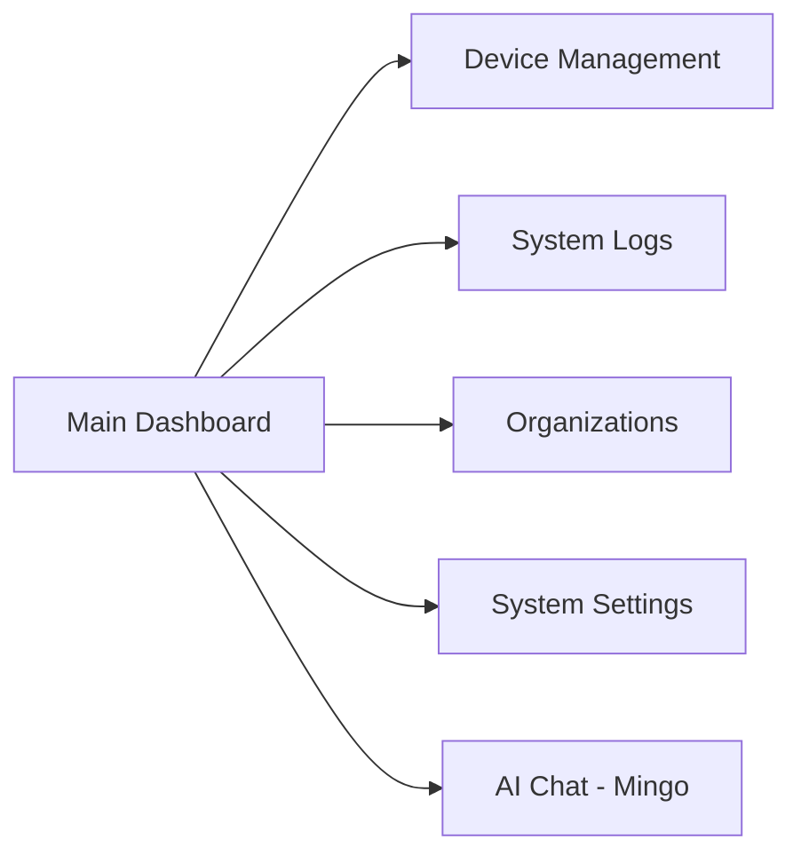
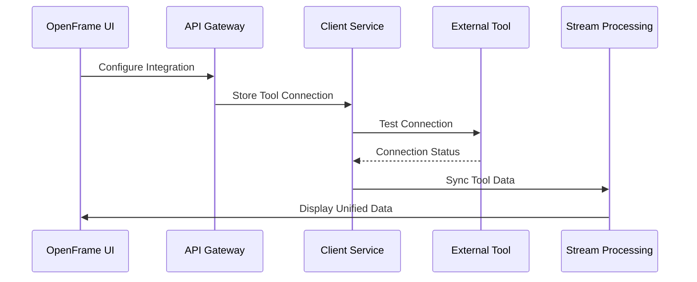

# First Steps with OpenFrame

After completing the [Quick Start](quick-start.md), you now have OpenFrame running locally. This guide walks you through the essential first steps to configure and explore your new OpenFrame deployment.

## Initial System Configuration

### 1. Change Default Credentials

**Security Priority**: Change the default admin credentials immediately.

1. **Log in** with default credentials:
   - Email: `admin@openframe.local`
   - Password: `admin123`

2. **Navigate** to Settings → Profile
3. **Update** your profile information:
   - Change password to a strong, unique password
   - Update email to your actual email address
   - Set your display name and organization details

4. **Save changes** and log out/in with new credentials

### 2. Configure Your Organization

**Set up your primary organization:**

1. **Go to** Organizations → Details
2. **Update organization information:**
   ```text
   Organization Name: Your Company Name
   Domain: yourcompany.local
   Contact Person: Your Name
   Email: your-email@company.com
   Phone: Your phone number
   Address: Your business address
   ```
3. **Configure branding** (optional):
   - Upload organization logo
   - Set theme colors
   - Customize display preferences

### 3. Set Up User Management

**Configure additional users and invitations:**

1. **Navigate** to Settings → Company and Users
2. **Add team members:**
   - Click "Add Users" 
   - Enter email addresses for team members
   - Assign appropriate roles (Admin, User, Viewer)
   - Send invitations

3. **Configure user roles:**
   - **Admin**: Full system access
   - **User**: Standard operational access  
   - **Viewer**: Read-only access to dashboards

### 4. Configure SSO (Optional)

**Set up Single Sign-On for team productivity:**

1. **Go to** Settings → SSO Configuration
2. **Choose provider** (Google or Microsoft)
3. **Configure OAuth2 settings:**
   - Client ID from your OAuth2 application
   - Client Secret (stored securely)
   - Allowed domains for your organization
   - Default user roles for SSO users

4. **Test SSO flow** before enabling for all users

## Explore Key Features

### 1. Dashboard Overview

**Familiarize yourself with the main dashboard:**

- **Device Overview**: Monitor all connected systems
- **Recent Logs**: Real-time system event stream  
- **Organization Stats**: Key metrics and performance indicators
- **Recent Activity**: Latest system changes and user actions

**Key Dashboard Elements:**


### 2. Device Management

**Add and manage your first devices:**

1. **Navigate** to Devices → New Device
2. **Choose device type:**
   - Workstations/Laptops
   - Servers  
   - Network equipment
   - Mobile devices

3. **Configure device registration:**
   ```bash
   # Example agent installation command
   curl -sSL https://your-openframe-domain/agent/install.sh | bash
   ```

4. **Monitor device status:**
   - Connection status (Online/Offline)
   - Last heartbeat timestamp
   - Installed agents and tools
   - System health metrics

### 3. System Logs and Monitoring

**Explore real-time system monitoring:**

1. **Access** Logs section in the main navigation
2. **Use filters** to find relevant information:
   - Filter by date range
   - Filter by log severity (Info, Warning, Error)
   - Filter by organization or device
   - Search by keyword or message content

3. **Explore log details:**
   - Click any log entry for detailed information
   - View related logs and context
   - Export logs for external analysis

### 4. AI Chat Interface (Mingo)

**Try the AI-powered assistant:**

1. **Access** Mingo chat from the main navigation
2. **Start a conversation:**
   ```text
   Example queries:
   "Show me system status"
   "What devices are offline?"
   "Help me troubleshoot connection issues"
   "Generate a system health report"
   ```

3. **Explore AI capabilities:**
   - System status queries
   - Troubleshooting assistance
   - Automated report generation
   - Task automation recommendations

## Connect External Tools (Optional)

### 1. Tool Integration Overview

OpenFrame can integrate with popular MSP tools:

- **Tactical RMM** - Remote monitoring and management
- **Fleet MDM** - Mobile device management
- **MeshCentral** - Remote access and control
- **Authentik** - Identity and access management

### 2. Example: Connect Tactical RMM

1. **Prepare Tactical RMM instance:**
   ```bash
   # Start Tactical RMM using Docker Compose
   cd integrated-tools/tactical-rmm/
   docker compose up -d
   ```

2. **Configure connection in OpenFrame:**
   - Navigate to Settings → Integrated Tools
   - Add new Tactical RMM connection
   - Provide API endpoint and credentials
   - Test connection and save

3. **Verify integration:**
   - Check device synchronization
   - Monitor agent status updates
   - View unified logs from both systems

### 3. Tool Connection Architecture



## Development and API Exploration

### 1. GraphQL API Exploration

**Learn the API through interactive exploration:**

1. **Visit** http://localhost:8080/graphql
2. **Explore the schema:**
   - Browse available queries and mutations
   - Review data types and relationships
   - Test queries with real data

3. **Try sample queries:**
   ```graphql
   # Get all organizations
   query Organizations {
     organizations {
       edges {
         node {
           id
           name
           domain
           createdAt
         }
       }
     }
   }

   # Get device information
   query Devices($orgId: ID!) {
     devices(organizationId: $orgId) {
       edges {
         node {
           id
           name
           status
           lastHeartbeat
           installedAgents {
             name
             version
             status
           }
         }
       }
     }
   }
   ```

### 2. REST API Usage

**Access REST endpoints for external integrations:**

```bash
# Health check
curl http://localhost:8080/actuator/health

# API with authentication (after obtaining JWT)
curl -H "Authorization: Bearer YOUR_JWT_TOKEN" \
     http://localhost:8080/api/organizations
```

### 3. WebSocket Real-Time Updates

**Connect to real-time data streams:**

```javascript
// Example WebSocket connection
const ws = new WebSocket('ws://localhost:8080/ws/realtime');
ws.onmessage = (event) => {
  const data = JSON.parse(event.data);
  console.log('Real-time update:', data);
};
```

## Configuration Management

### 1. System Configuration

**Access centralized configuration:**

1. **Visit** Config Server: http://localhost:8888
2. **View environment configurations:**
   - Development settings
   - Production overrides  
   - Service-specific configurations

3. **Update configurations:**
   - Modify application properties
   - Adjust logging levels
   - Configure external integrations

### 2. Environment Variables

**Key environment variables to understand:**

```bash
# Database connections
MONGODB_HOST=localhost
KAFKA_HOST=localhost  
REDIS_HOST=localhost

# Security settings
JWT_SECRET_KEY=generated-secret
OAUTH2_CLIENT_ID=your-client-id
OAUTH2_CLIENT_SECRET=your-client-secret

# Service discovery
EUREKA_SERVER_URL=http://localhost:8761
CONFIG_SERVER_URL=http://localhost:8888
```

## Monitoring and Observability

### 1. Health Check Endpoints

**Monitor service health:**

```bash
# Check all service health
curl http://localhost:8080/actuator/health
curl http://localhost:8081/actuator/health  # Gateway
curl http://localhost:8082/actuator/health  # Auth Server
curl http://localhost:8888/actuator/health  # Config Server
```

### 2. Application Metrics

**Access metrics and monitoring:**

```bash
# Service metrics
curl http://localhost:8080/actuator/metrics
curl http://localhost:8080/actuator/prometheus

# JVM metrics
curl http://localhost:8080/actuator/metrics/jvm.memory.used
```

### 3. Log Analysis

**Effective log monitoring:**

1. **Application logs** located in `logs/` directory
2. **Docker container logs:**
   ```bash
   docker logs openframe-api
   docker logs openframe-gateway  
   docker logs openframe-mongodb
   ```

3. **Real-time log streaming** through the web interface

## Common Next Steps

### For MSP Operations
1. **Add more devices** to monitor your infrastructure
2. **Set up tool integrations** for existing MSP tools
3. **Configure alerting** for critical system events
4. **Create user accounts** for your team members

### For Development  
1. **Set up development environment** following the [Development Setup Guide](../development/setup/environment.md)
2. **Explore the codebase** and contribute to OpenFrame
3. **Build custom integrations** using the API
4. **Extend functionality** through plugins and extensions

### For System Administration
1. **Configure backup strategies** for data persistence
2. **Set up monitoring** and alerting systems
3. **Plan scaling** for production deployment
4. **Implement security hardening** measures

## Getting Help

### Resources
- **Documentation**: Comprehensive guides in the `docs/` directory
- **API Reference**: GraphQL schema browser at `/graphql`
- **Community**: Join [OpenMSP Slack](https://join.slack.com/t/openmsp/shared_invite/zt-36bl7mx0h-3~U2nFH6nqHqoTPXMaHEHA)

### Common Questions
- **"How do I add more users?"** → Settings → Company and Users → Add Users
- **"Can I integrate with my existing tools?"** → Yes, check Settings → Integrated Tools
- **"Where are logs stored?"** → View in UI or check `logs/` directory  
- **"How do I backup data?"** → MongoDB dump + configuration files

## What's Next?

You've now completed the essential first steps with OpenFrame! You should have:

✅ Secured your admin account  
✅ Configured your organization  
✅ Explored the main features  
✅ Understanding of the architecture  
✅ Knowledge of key configuration options  

**Ready for more?** Continue with:
- **[Development Guide](../development/README.md)** for customization and development
- **[Architecture Overview](../development/architecture/overview.md)** for deeper technical understanding
- **Community Slack** for questions and collaboration

OpenFrame is now configured and ready for your MSP operations!