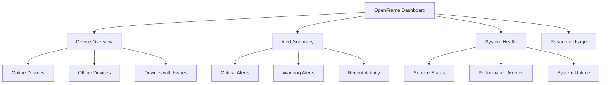

# First Steps with OpenFrame

Welcome to OpenFrame! Now that you have the platform running, let's explore the key features and get you productive with essential MSP operations. This guide covers the first 5 things you should do after installation.

> **Prerequisites**: Completed [Quick Start Guide](quick-start.md) with OpenFrame running at `http://localhost:3000`

## Step 1: Complete Initial Configuration

### Set Up Your Organization Profile

1. **Navigate to Settings** → **Company & Users**
2. **Complete your organization information**:
   - Company name and description
   - Contact information
   - Business address
   - Primary contact person

3. **Configure basic settings**:
   - Timezone and locale
   - Default notification preferences
   - Logo upload (optional)

### Create Additional Users

```bash
# Add team members via API
curl -X POST http://localhost:8080/invitations \
  -H "Content-Type: application/json" \
  -H "Authorization: Bearer YOUR_JWT_TOKEN" \
  -d '{
    "email": "technician@yourmsp.com",
    "role": "TECHNICIAN",
    "organizationId": "your-org-id"
  }'
```

Or use the UI: **Settings** → **Users** → **Invite User**

## Step 2: Set Up Device Agent Registration

### Generate Agent Registration Secret

1. Go to **Settings** → **Architecture** → **Agent Registration**
2. Click **Generate New Secret**
3. Copy the registration secret - you'll need this for device enrollment

### Install OpenFrame Client on Test Device

#### Windows
```powershell
# Download and install OpenFrame client
Invoke-WebRequest -Uri "https://releases.openframe.ai/latest/windows/openframe-client.msi" -OutFile "openframe-client.msi"
Start-Process msiexec.exe -Wait -ArgumentList '/I openframe-client.msi /quiet'

# Configure with registration secret
Set-Content -Path "C:\Program Files\OpenFrame\config.yml" -Value @"
server:
  url: "http://your-openframe-server:8080"
  registration_secret: "YOUR_REGISTRATION_SECRET"
"@
```

#### macOS
```bash
# Install via Homebrew
brew tap flamingo-stack/openframe
brew install openframe-client

# Configure
sudo openframe-client configure \
  --server-url "http://your-openframe-server:8080" \
  --registration-secret "YOUR_REGISTRATION_SECRET"
```

#### Linux
```bash
# Download and install
curl -LO https://releases.openframe.ai/latest/linux/openframe-client.deb
sudo dpkg -i openframe-client.deb

# Configure
sudo openframe-client configure \
  --server-url "http://your-openframe-server:8080" \
  --registration-secret "YOUR_REGISTRATION_SECRET"
```

### Verify Device Registration

1. **Go to Devices** in the OpenFrame UI
2. **Confirm your device appears** in the device list
3. **Check device status** - should show as "Online"

## Step 3: Explore the Dashboard

### Understanding Dashboard Widgets

The OpenFrame dashboard provides real-time insights:



### Key Metrics to Monitor

| Widget | Purpose | What to Watch |
|--------|---------|---------------|
| **Device Status** | Fleet health overview | Offline devices, failed checks |
| **Recent Alerts** | Immediate attention items | Critical and high-priority alerts |
| **Performance** | System resource usage | CPU, memory, storage trends |
| **Event Stream** | Real-time activity | Successful/failed operations |

### Customize Your Dashboard

1. **Click the gear icon** on any widget
2. **Adjust time ranges** (1h, 24h, 7d, 30d)
3. **Filter by organization** or device group
4. **Rearrange widgets** by dragging

## Step 4: Configure Essential Integrations

### Set Up Tactical RMM Integration

OpenFrame integrates seamlessly with Tactical RMM for enhanced device management:

1. **Go to Settings** → **Integrations** → **Tactical RMM**
2. **Enter connection details**:
   ```yaml
   Server URL: https://your-tactical-rmm.com
   API Key: your-tactical-api-key
   Organization: your-tactical-org-id
   ```
3. **Test the connection**
4. **Enable agent synchronization**

### Configure MeshCentral for Remote Access

1. **Navigate to Settings** → **Integrations** → **MeshCentral**
2. **Configure connection**:
   ```yaml
   Server URL: https://your-meshcentral.com
   Username: your-mesh-username
   Password: your-mesh-password
   ```
3. **Enable remote desktop features**

### Set Up SSO (Optional but Recommended)

#### Google SSO
1. **Go to Settings** → **SSO Configuration**
2. **Choose Google** as provider
3. **Enter OAuth credentials**:
   - Client ID from Google Cloud Console
   - Client Secret
   - Allowed domains
4. **Test SSO login**

#### Microsoft Azure SSO
1. **Select Microsoft** as provider
2. **Configure Azure AD**:
   - Tenant ID
   - Application (client) ID  
   - Client secret
3. **Set up user mappings**

## Step 5: Explore Core Features

### Device Management

#### View Device Details
1. **Click on any device** in the Devices list
2. **Explore the tabs**:
   - **Overview**: Basic system info and status
   - **Hardware**: CPU, RAM, storage details
   - **Software**: Installed applications and updates
   - **Logs**: Recent system and application logs
   - **Remote**: Remote desktop and file management

#### Device Actions
```bash
# Via OpenFrame UI - Device Actions menu:
- Restart device
- Run PowerShell/Bash script
- Install software
- Configure policies
- Access file manager
- Start remote session
```

### Event and Log Management

#### View System Logs
1. **Navigate to Logs** in the main menu
2. **Filter logs by**:
   - Device or organization
   - Time range
   - Severity level (Info, Warning, Error)
   - Source application

#### Set Up Log Alerts
```bash
# Configure alert rules for critical events
1. Go to Settings → Alerts
2. Create new alert rule:
   - Name: "Critical System Errors"
   - Condition: severity = "ERROR" 
   - Actions: Email notification
3. Test and activate
```

### Script Management

#### Create Your First Script
1. **Go to Scripts** in the main menu
2. **Click "New Script"**
3. **Configure script details**:
   ```powershell
   # Example: System Health Check
   Name: "Windows Health Check"
   Type: "PowerShell"
   Content:
   Get-ComputerInfo | Select-Object WindowsVersion, TotalPhysicalMemory
   Get-Disk | Select-Object FriendlyName, Size, FreeSpace
   Get-Service | Where-Object Status -eq "Stopped" | Select-Object Name, Status
   ```
4. **Test on a device**
5. **Schedule for regular execution**

### User and Permission Management

#### Set Up Role-Based Access
1. **Go to Settings** → **Users**
2. **Define roles**:
   - **Admin**: Full platform access
   - **Technician**: Device management only
   - **Viewer**: Read-only access
3. **Assign users to appropriate roles**

## Essential Configuration Checklist

Mark off these items as you complete them:

- [ ] **Organization profile completed**
- [ ] **At least one additional user invited**
- [ ] **Agent registration secret generated**
- [ ] **First device successfully registered**
- [ ] **Dashboard customized for your needs**
- [ ] **Primary integration configured (Tactical RMM or MeshCentral)**
- [ ] **SSO set up (if using multiple users)**
- [ ] **First script created and tested**
- [ ] **Alert rules configured for critical events**
- [ ] **User roles and permissions defined**

## Common First-Step Questions

### "How do I add more devices?"

Use the same registration secret on each device, or generate device-specific secrets:

```bash
# Generate device-specific secret
curl -X POST http://localhost:8080/agent/registration-secret \
  -H "Content-Type: application/json" \
  -d '{"deviceName": "office-workstation-01"}'
```

### "Can I import existing device inventory?"

Yes! Use the bulk import feature:

1. **Go to Devices** → **Import**
2. **Download the CSV template**
3. **Fill in device details**
4. **Upload and map fields**

### "How do I set up automated monitoring?"

Configure monitoring policies:

1. **Settings** → **Policies** → **Create New**
2. **Define checks**: Disk space, CPU usage, service status
3. **Set thresholds** and response actions
4. **Apply to device groups**

## Where to Get Help

When you need assistance:

- **Documentation**: Continue to development guides for advanced topics
- **Community**: Join [OpenMSP Slack](https://join.slack.com/t/openmsp/shared_invite/zt-36bl7mx0h-3~U2nFH6nqHqoTPXMaHEHA)
- **Video Guides**: Check our [YouTube channel](https://youtube.com/openframe)

[](https://www.youtube.com/watch?v=bINdW0CQbvY)

## What's Next?

You're now ready to use OpenFrame for daily MSP operations! Consider these advanced topics:

- **Development Setup**: If you want to customize or contribute
- **Production Deployment**: Scale OpenFrame for your MSP
- **Advanced Integrations**: Connect additional tools and services
- **AI Configuration**: Set up Mingo AI for automated ticket triage

---

**🎯 You've completed the essentials!** OpenFrame is now configured for your MSP operations. Start managing devices, running scripts, and exploring the unified platform experience.