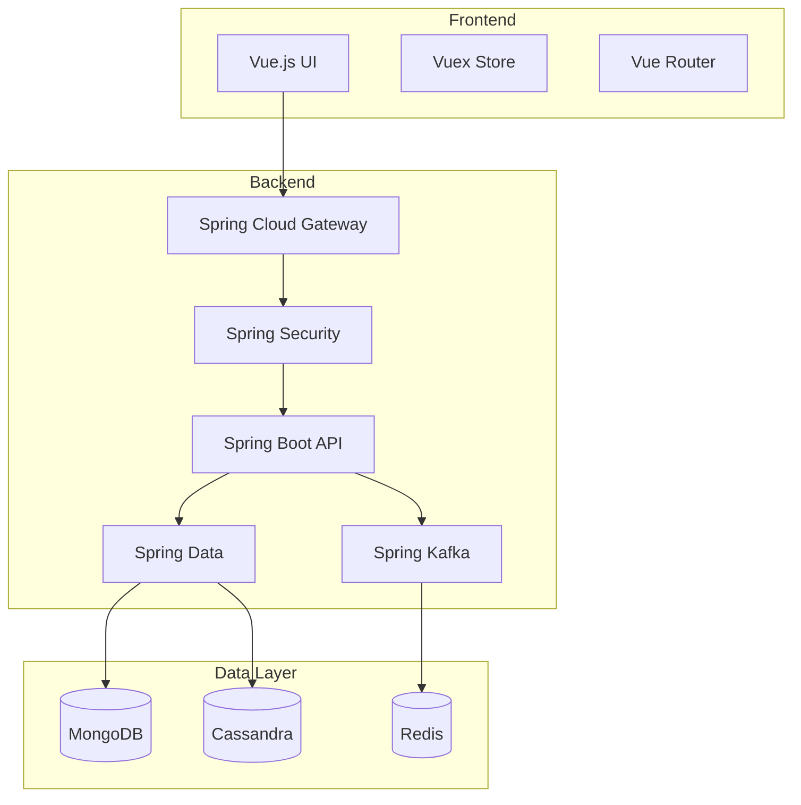

# Introduction to OpenFrame

OpenFrame is a distributed platform that creates a unified layer for data, APIs, automation, and AI on top of carefully selected open-source projects. Built with Java Spring Boot and Vue.js, it simplifies IT and security operations through a single, cohesive platform.

## What is OpenFrame?

OpenFrame is an enterprise-grade platform that combines powerful microservices architecture with modern web technologies to provide:

- Real-time data processing and analytics
- Unified API access through GraphQL
- Automated deployment and monitoring
- AI-powered insights and anomaly detection
- Enterprise-grade security controls
- High-performance event streaming

## Key Features

### 1. Unified Dashboard
- Modern Vue.js-based interface
- Real-time data visualization
- Customizable dashboards
- Role-based access control

### 2. Smart Automation
- Automated deployment pipelines
- Self-healing capabilities
- Predictive maintenance
- Workflow automation

### 3. AI-Powered Insights
- Real-time anomaly detection
- Predictive analytics
- AI assistants ("copilots")
- Automated decision making

### 4. Enterprise Security
- OAuth 2.0 authentication
- Role-based access control
- End-to-end encryption
- Audit logging

### 5. High Performance
- Handles 100,000 events/second
- Sub-500ms latency
- Scalable microservices
- Distributed architecture

## Technology Stack

### Backend
- **Core Runtime**: Spring Boot 3.2.x, OpenJDK 21
- **API Layer**: Netflix DGS Framework (GraphQL)
- **Gateway**: Spring Cloud Gateway
- **Security**: Spring Security with OAuth 2.0
- **Data Storage**: MongoDB, Cassandra
- **Event Streaming**: Apache Kafka
- **Caching**: Redis

### Frontend
- **Framework**: Vue.js 3 with TypeScript
- **State Management**: Vuex
- **Routing**: Vue Router
- **UI Framework**: Vuetify
- **Build Tool**: Vite

### Infrastructure
- **Container Orchestration**: Kubernetes
- **Service Mesh**: Istio
- **Monitoring**: Prometheus, Grafana
- **Logging**: Loki
- **CI/CD**: GitHub Actions

## System Architecture

## Getting Started

To get started with OpenFrame:

1. Review the [Development Setup Guide](../development/setup.md)
2. Follow the [Architecture Overview](../development/architecture.md)
3. Explore the [API Documentation](../api/overview.md)

## Support

For additional support and resources:

- Visit our [GitHub repository](https://github.com/Flamingo-CX/openframe)
- Join our community discussions
- Contact our support team

## Next Steps

- [Development Setup](../development/setup.md)
- [Architecture Overview](../development/architecture.md)
- [API Documentation](../api/overview.md)
- [Contributing Guidelines](../development/contributing.md) 