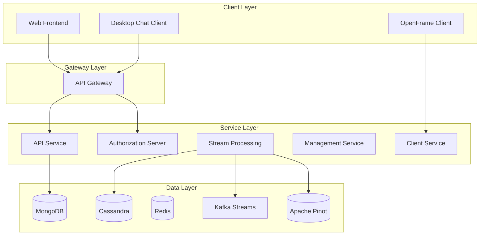

# OpenFrame Introduction

Welcome to OpenFrame - the AI-powered MSP platform that replaces expensive proprietary software with open-source alternatives enhanced by intelligent automation.

## What is OpenFrame?

OpenFrame is a unified platform that integrates multiple MSP tools into a single AI-driven interface, automating IT support operations across the stack. It combines:

- **Flamingo**: AI-powered MSP platform with Mingo AI for technicians and Fae for clients
- **OpenFrame**: The unified platform for MSP tool integration
- **Open Source**: Community-driven development with enterprise features

## Key Features & Benefits

### 🤖 AI-Powered Automation
- **Mingo AI**: Intelligent technician assistant for IT support
- **Fae**: Client-facing AI for automated customer service
- **Autonomous Agents**: AI that can actually fix infrastructure issues

### 🔧 Unified Tool Integration
- **Fleet MDM**: Mobile device management
- **Tactical RMM**: Remote monitoring and management
- **MeshCentral**: Remote access and control
- **Custom Integrations**: Extensible architecture for additional tools

### 🏢 Multi-Tenant Architecture
- **Organization Management**: Complete tenant isolation
- **User & Role Management**: Granular access controls
- **SSO Integration**: Google, Microsoft, and custom providers
- **API Key Management**: Secure external integrations

### 📊 Real-Time Analytics
- **Device Monitoring**: Real-time status and health metrics
- **Event Streaming**: Kafka-based event processing
- **Log Aggregation**: Centralized logging with Cassandra/Pinot
- **GraphQL API**: Efficient data querying and subscriptions

## Architecture Overview

OpenFrame follows a modern microservices architecture with event-driven components:

```mermaid
flowchart TD
    subgraph "Client Layer"
        UI[Web Frontend]
        Chat[Desktop Chat Client]
        Agent[OpenFrame Client]
    end
    
    subgraph "Gateway Layer"
        Gateway[API Gateway]
    end
    
    subgraph "Service Layer"
        API[API Service]
        Auth[Authorization Server]
        Stream[Stream Processing]
        Management[Management Service]
        Client[Client Service]
    end
    
    subgraph "Data Layer"
        Mongo[(MongoDB)]
        Cassandra[(Cassandra)]
        Redis[(Redis)]
        Kafka[Kafka Streams]
        Pinot[(Apache Pinot)]
    end
    
    UI --> Gateway
    Chat --> Gateway
    Agent --> Client
    Gateway --> API
    Gateway --> Auth
    API --> Mongo
    Stream --> Kafka
    Stream --> Cassandra
    Stream --> Pinot
```

## Target Audience

### 🎯 MSP Providers
Perfect for Managed Service Providers looking to:
- Reduce vendor costs with open-source alternatives
- Automate repetitive IT support tasks
- Improve technician efficiency with AI assistance
- Provide better client experiences

### 👨‍💻 DevOps Teams
Ideal for DevOps professionals who need:
- Unified device and infrastructure monitoring
- Automated incident response
- Compliance and security management
- Scalable multi-tenant architecture

### 🏢 Enterprise IT
Great for enterprise IT departments wanting:
- Centralized tool management
- AI-powered support automation
- Custom integration capabilities
- Modern, scalable infrastructure

## Technology Stack

### Backend
- **Runtime**: Java 21, Spring Boot 3.3.0
- **API**: GraphQL, REST, WebSocket
- **Security**: OAuth2/OIDC, JWT with cookies
- **Data**: MongoDB, Cassandra, Redis, Apache Pinot
- **Messaging**: Apache Kafka 3.6.0

### Frontend
- **Framework**: Vue 3 with TypeScript
- **UI**: PrimeVue components, custom design system
- **State**: Pinia for reactive state management
- **GraphQL**: Apollo Client with real-time subscriptions

### Client Agent
- **Language**: Rust for cross-platform compatibility
- **Features**: System monitoring, remote management
- **Security**: Encrypted communication, secure updates

## Getting Started

Ready to dive in? Here's your next steps:

1. **[Prerequisites](prerequisites.md)**: Check system requirements and dependencies
2. **[Quick Start](quick-start.md)**: Get OpenFrame running in 5 minutes
3. **[First Steps](first-steps.md)**: Explore key features and configuration

## Community & Support

- **GitHub**: [OpenFrame OSS](https://github.com/flamingo-stack)
- **Slack**: [OpenMSP Community](https://join.slack.com/t/openmsp/shared_invite/zt-36bl7mx0h-3~U2nFH6nqHqoTPXMaHEHA)
- **Website**: [OpenFrame.ai](https://openframe.ai)
- **Documentation**: [Getting Started Guides](/docs/getting-started/)

> 💡 **Note**: OpenFrame is actively developed by the Flamingo Stack team with contributions from the open-source community. Join our Slack for discussions, feature requests, and support.

## What's Next?

Now that you understand what OpenFrame is and what it can do, let's get you set up:

- Continue to [Prerequisites](prerequisites.md) to check your environment
- Jump to [Quick Start](quick-start.md) for immediate deployment
- Browse [Development Documentation](/docs/development/) if you want to contribute

---

*OpenFrame - Unifying MSP tools with AI-powered automation*