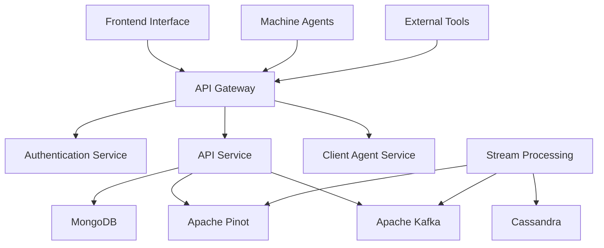

# OpenFrame Introduction

Welcome to **OpenFrame** - the unified AI-powered MSP platform that replaces expensive proprietary software with open-source alternatives enhanced by intelligent automation.

## What is OpenFrame?

OpenFrame is the comprehensive MSP (Managed Service Provider) platform developed by **Flamingo** that integrates multiple MSP tools into a single AI-driven interface. It combines the power of open-source tools with intelligent automation to streamline IT support operations across your entire technology stack.

## Key Features

### 🤖 AI-Powered Automation
- **Mingo AI**: Intelligent assistant for technicians that helps automate routine tasks and provides intelligent insights
- **Fae**: Client-facing AI that enhances customer support and self-service capabilities
- **Smart Device Management**: Automated monitoring, alerting, and remediation across your infrastructure

### 🔧 Unified Tool Integration
- **Multi-Platform Support**: Windows, macOS, and Linux endpoint management
- **Tool Consolidation**: Integrates with popular MSP tools like TacticalRMM, Fleet MDM, MeshCentral, and more
- **Real-time Monitoring**: Live device status, system metrics, and health monitoring
- **Centralized Management**: Single pane of glass for all your IT operations

### 🏢 Multi-Tenant Architecture
- **Organization Management**: Support multiple clients and organizations from a single platform
- **User Access Control**: Role-based permissions and SSO integration
- **Scalable Infrastructure**: Built for MSPs of all sizes, from small shops to enterprise providers

### 🔒 Enterprise Security
- **OAuth2/OIDC Authentication**: Modern identity and access management
- **JWT Security**: Secure token-based authentication with HTTP-only cookies
- **API Key Management**: Secure external integrations and tool connectivity
- **Audit Logging**: Complete audit trail for compliance and security

## Target Audience

OpenFrame is designed for:

- **Managed Service Providers (MSPs)** looking to consolidate their tooling and reduce costs
- **IT Departments** wanting to modernize their infrastructure management
- **System Administrators** seeking AI-powered automation and insights
- **Organizations** wanting to replace expensive proprietary solutions with open-source alternatives

## Architecture Overview

OpenFrame uses a modern microservices architecture built for scale and reliability:

```mermaid
graph TD
    A[Frontend Interface] --> B[API Gateway]
    B --> C[Authentication Service]
    B --> D[API Service]
    B --> E[Client Agent Service]
    
    D --> F[MongoDB]
    D --> G[Apache Pinot]
    D --> H[Apache Kafka]
    
    I[Stream Processing] --> H
    I --> J[Cassandra]
    I --> G
    
    K[Machine Agents] --> B
    L[External Tools] --> B
```

### Core Components

| Component | Description |
|-----------|-------------|
| **API Gateway** | Edge security, JWT validation, rate limiting, and request routing |
| **Authentication Service** | OAuth2/OIDC provider with multi-tenant support |
| **API Service** | GraphQL and REST APIs for all platform functionality |
| **Client Agent Service** | Manages device agents and tool integrations |
| **Stream Processing** | Real-time data processing and enrichment |
| **Frontend Application** | Modern React-based user interface |

## Benefits

### 💰 Cost Reduction
- Replace expensive proprietary MSP tools with open-source alternatives
- Reduce licensing costs while maintaining or improving functionality
- Consolidate multiple tools into a single platform

### ⚡ Increased Efficiency  
- AI-powered automation reduces manual tasks
- Unified interface eliminates tool-switching overhead
- Intelligent insights help prevent issues before they occur

### 🔧 Enhanced Capabilities
- Real-time monitoring and alerting
- Advanced analytics and reporting
- Comprehensive audit logging and compliance features

### 🚀 Modern Architecture
- Cloud-native microservices design
- Kubernetes-ready deployment options
- API-first approach for maximum flexibility

## Next Steps

Ready to get started with OpenFrame? Here's what to do next:

1. **Check Prerequisites**: Review the [Prerequisites Guide](prerequisites.md) to ensure your environment is ready
2. **Quick Start**: Follow our [Quick Start Guide](quick-start.md) for a 5-minute setup
3. **First Steps**: Complete the [First Steps Guide](first-steps.md) to explore key features

## Getting Help

- **Community Support**: Join our [OpenMSP Slack Community](https://join.slack.com/t/openmsp/shared_invite/zt-36bl7mx0h-3~U2nFH6nqHqoTPXMaHEHA)
- **Documentation**: Explore the development guides and architecture documentation
- **Issues**: Report bugs or request features through our community channels

Welcome to the future of MSP platform management with OpenFrame! 🎉