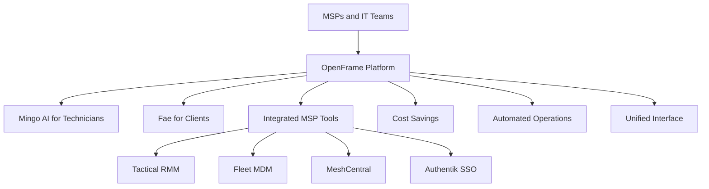
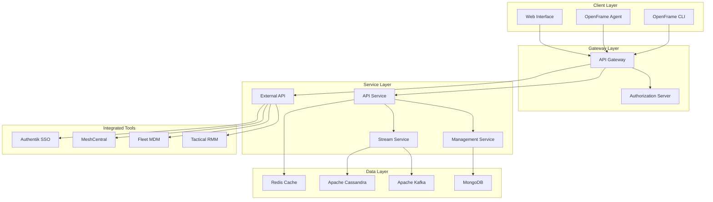

# OpenFrame Introduction

Welcome to **OpenFrame** - the unified AI-powered MSP platform that replaces expensive proprietary software with open-source alternatives enhanced by intelligent automation.

## What is OpenFrame?

OpenFrame is Flamingo's unified platform that integrates multiple MSP tools into a single AI-driven interface, automating IT support operations across the entire technology stack. It combines the power of open-source technologies with intelligent automation to deliver enterprise-grade MSP capabilities.

```mermaid
flowchart TD
    A[MSPs and IT Teams] --> B[OpenFrame Platform]
    B --> C[Mingo AI for Technicians]
    B --> D[Fae for Clients]
    B --> E[Integrated MSP Tools]
    
    E --> F[Tactical RMM]
    E --> G[Fleet MDM]
    E --> H[MeshCentral]
    E --> I[Authentik SSO]
    
    B --> J[Cost Savings]
    B --> K[Automated Operations]
    B --> L[Unified Interface]
```

## Key Features & Benefits

### 🤖 AI-Powered Automation
- **Mingo AI**: Advanced AI assistant for technicians, providing contextual guidance and automating routine tasks
- **Fae**: Client-facing AI that handles support requests and provides real-time assistance
- **Intelligent Insights**: AI-driven analytics and recommendations for operational improvements

### 💰 Cost Reduction
- **Replace Expensive Proprietary Tools**: Eliminate costly per-device/per-user licensing
- **Open Source Foundation**: Built on proven open-source technologies with no vendor lock-in
- **Unified Licensing**: Single platform replacing multiple tool subscriptions

### 🔧 Comprehensive MSP Stack
- **Device Management**: Fleet MDM for endpoint management
- **Remote Monitoring**: Tactical RMM for system monitoring and management  
- **Remote Access**: MeshCentral for secure remote desktop connections
- **Identity Management**: Authentik SSO for unified authentication
- **Multi-Tenant Architecture**: Secure isolation for multiple clients

### 📊 Unified Experience
- **Single Dashboard**: All tools accessible through one interface
- **Centralized Data**: Unified logging, monitoring, and reporting
- **Consistent Workflows**: Standardized processes across all integrated tools

## Target Audience

OpenFrame is designed for:

| Audience | Use Case | Benefits |
|----------|----------|----------|
| **MSPs** | Multi-tenant client management | Reduced costs, unified operations, AI automation |
| **IT Teams** | Internal infrastructure management | Streamlined workflows, comprehensive monitoring |
| **System Administrators** | Server and endpoint management | Centralized control, automated tasks |
| **DevOps Engineers** | Infrastructure automation | Event-driven processing, scalable architecture |

## Architecture Overview

OpenFrame follows a modern, microservices architecture built on open-source technologies:

```mermaid
graph TB
    subgraph "Client Layer"
        UI[Web Interface]
        Agent[OpenFrame Agent]
        CLI[OpenFrame CLI]
    end
    
    subgraph "Gateway Layer"
        Gateway[API Gateway]
        Auth[Authorization Server]
    end
    
    subgraph "Service Layer"
        API[API Service]
        Management[Management Service]
        Stream[Stream Service]
        External[External API]
    end
    
    subgraph "Data Layer"
        Mongo[MongoDB]
        Cassandra[Apache Cassandra]
        Redis[Redis Cache]
        Kafka[Apache Kafka]
    end
    
    subgraph "Integrated Tools"
        TacticalRMM[Tactical RMM]
        FleetMDM[Fleet MDM]
        MeshCentral[MeshCentral]
        Authentik[Authentik SSO]
    end
    
    UI --> Gateway
    Agent --> Gateway
    CLI --> Gateway
    
    Gateway --> Auth
    Gateway --> API
    Gateway --> External
    
    API --> Management
    API --> Stream
    
    Management --> Mongo
    Stream --> Kafka
    Stream --> Cassandra
    
    API --> Redis
    
    External --> TacticalRMM
    External --> FleetMDM
    External --> MeshCentral
    External --> Authentik
```

## Technology Stack

### Backend Services
- **Runtime**: Java 21 with Spring Boot 3.3.0
- **APIs**: GraphQL (Netflix DGS) and RESTful services
- **Security**: JWT with OAuth2/OpenID Connect
- **Data Storage**: MongoDB, Apache Cassandra, Redis
- **Event Streaming**: Apache Kafka for real-time processing
- **Configuration**: Spring Cloud Config Server

### Frontend Applications
- **Primary UI**: Vue 3 with TypeScript and PrimeVue components
- **Alternative UI**: React with Next.js (available)
- **Desktop Client**: Tauri-based chat application
- **CLI Tools**: Command-line interface for automation

### System Agent
- **OpenFrame Agent**: Cross-platform Rust application for system monitoring and management
- **Platforms**: Windows, macOS, Linux support
- **Features**: Real-time metrics, secure communication, automated updates

## Getting Started Resources

After reading this introduction, explore these resources to begin your OpenFrame journey:

- **[Prerequisites Guide](prerequisites.md)** - Required software and system requirements
- **[Quick Start Guide](quick-start.md)** - 5-minute setup for immediate results  
- **[First Steps Guide](first-steps.md)** - Essential configuration and initial tasks

## Community and Support

OpenFrame is maintained by the Flamingo team with an active open-source community:

- **Slack Community**: Join the [OpenMSP Slack](https://join.slack.com/t/openmsp/shared_invite/zt-36bl7mx0h-3~U2nFH6nqHqoTPXMaHEHA) for support and discussion
- **Documentation**: Comprehensive guides and API reference
- **GitHub**: Open source development and issue tracking

## Why OpenFrame?

In today's challenging economic environment, MSPs and IT teams face:
- **Rising software costs** with per-device/per-user licensing
- **Tool fragmentation** requiring multiple dashboards and workflows  
- **Manual processes** that don't scale with growing client bases
- **Lack of AI integration** in traditional MSP tooling

OpenFrame addresses these challenges by providing:
- **Unified platform** replacing multiple expensive tools
- **AI-powered automation** reducing manual workload
- **Open-source foundation** eliminating vendor lock-in
- **Modern architecture** designed for cloud-native scalability

Ready to get started? Continue to the [Prerequisites Guide](prerequisites.md) to prepare your environment for OpenFrame.