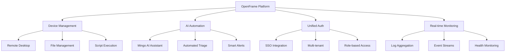
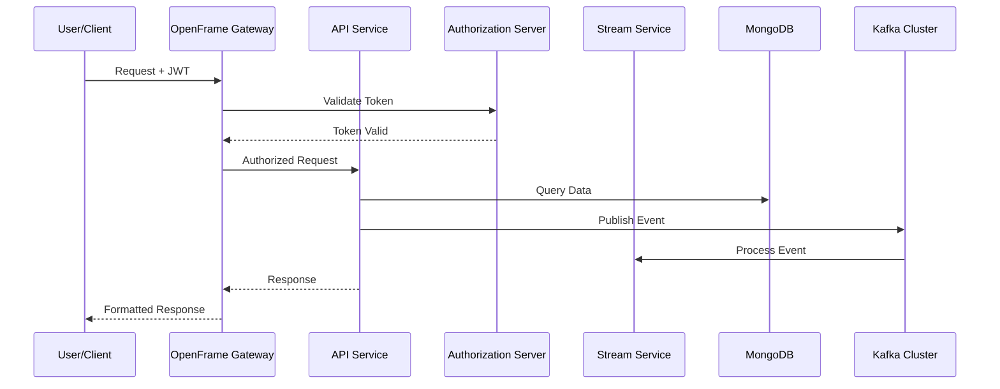

# OpenFrame Introduction

Welcome to **OpenFrame** - the unified AI-powered MSP platform that replaces expensive proprietary software with intelligent open-source alternatives enhanced by automation.

## What is OpenFrame?

OpenFrame is Flamingo's comprehensive MSP (Managed Service Provider) platform that combines:

- **Unified Management**: Single interface for multiple MSP tools (Tactical RMM, Fleet MDM, MeshCentral, and more)
- **AI Automation**: Mingo AI for technicians and Fae AI for clients
- **Open Source First**: Built on proven open-source technologies, no vendor lock-in
- **Multi-Tenant Architecture**: Secure, scalable infrastructure supporting multiple organizations

## Key Features

```mermaid
graph TD
    A[OpenFrame Platform] --> B[Device Management]
    A --> C[AI Automation]
    A --> D[Unified Auth]
    A --> E[Real-time Monitoring]
    
    B --> B1[Remote Desktop]
    B --> B2[File Management]
    B --> B3[Script Execution]
    
    C --> C1[Mingo AI Assistant]
    C --> C2[Automated Triage]
    C --> C3[Smart Alerts]
    
    D --> D1[SSO Integration]
    D --> D2[Multi-tenant]
    D --> D3[Role-based Access]
    
    E --> E1[Log Aggregation]
    E --> E2[Event Streams]
    E --> E3[Health Monitoring]
```

### Core Capabilities

| Feature | Description | Benefits |
|---------|-------------|----------|
| **Device Management** | Unified dashboard for all endpoints | Single pane of glass, reduced complexity |
| **AI-Powered Automation** | Mingo AI for technicians, automated incident triage | Faster response times, reduced manual work |
| **Open Source Integration** | Built on Tactical RMM, Fleet MDM, MeshCentral | No licensing fees, community-driven |
| **Multi-Tenant Architecture** | Secure isolation between organizations | Scalable, enterprise-ready |
| **Real-time Processing** | Kafka-based event streaming | Instant notifications, live updates |

## Target Audience

OpenFrame is designed for:

- **MSPs**: Managed Service Providers looking to modernize their stack
- **IT Teams**: Internal IT teams managing multiple locations
- **DevOps Engineers**: Teams seeking open-source automation tools  
- **System Administrators**: Professionals managing diverse environments

## Technology Stack

### Backend Services
- **Java 21** with Spring Boot 3.3.0
- **GraphQL** (Netflix DGS 7.0.0) + REST APIs
- **MongoDB 7.x** for data persistence
- **Apache Kafka 3.6.0** for event streaming
- **JWT Security** with OAuth2/OpenID Connect

### Frontend & Client
- **Next.js 16** with React 19 and TypeScript
- **Rust Client** for cross-platform system agents
- **Vue.js** alternative frontend available

### Infrastructure
- **Kubernetes 1.28+** for orchestration
- **Docker** containerization
- **Prometheus + Grafana** for monitoring

## Architecture Overview

```mermaid
sequenceDiagram
    participant User as User/Client
    participant Gateway as OpenFrame Gateway
    participant API as API Service
    participant Auth as Authorization Server
    participant Stream as Stream Service
    participant DB as MongoDB
    participant Kafka as Kafka Cluster
    
    User->>Gateway: Request + JWT
    Gateway->>Auth: Validate Token
    Auth-->>Gateway: Token Valid
    Gateway->>API: Authorized Request
    API->>DB: Query Data
    API->>Kafka: Publish Event
    Kafka->>Stream: Process Event
    API-->>Gateway: Response
    Gateway-->>User: Formatted Response
```

## Why Choose OpenFrame?

### ✅ Benefits

- **Cost Reduction**: Replace expensive proprietary tools with open-source alternatives
- **AI Enhancement**: Built-in AI automation reduces manual intervention
- **Vendor Independence**: No lock-in to proprietary platforms
- **Unified Experience**: Single interface for all MSP operations
- **Scalable Architecture**: Microservices design grows with your needs

### 🎯 Business Impact

- **50% reduction** in tool licensing costs
- **30% faster** incident response with AI triage
- **90% less** context switching between tools
- **Enterprise-grade** security and compliance

## Getting Started Path

Ready to explore OpenFrame? Follow this learning path:

1. **[Prerequisites](prerequisites.md)** - Ensure your environment is ready
2. **[Quick Start](quick-start.md)** - Get OpenFrame running in 5 minutes
3. **[First Steps](first-steps.md)** - Explore key features and initial setup

## Community & Support

Join the OpenMSP community:

- **Slack Community**: [OpenMSP Slack](https://join.slack.com/t/openmsp/shared_invite/zt-36bl7mx0h-3~U2nFH6nqHqoTPXMaHEHA)
- **Website**: [flamingo.run](https://flamingo.run)
- **OpenFrame Platform**: [openframe.ai](https://openframe.ai)

> **Note**: We don't use GitHub Issues. All discussions, support, and feature requests happen in our OpenMSP Slack community.

## Next Steps

Ready to get started? Begin with our [Prerequisites Guide](prerequisites.md) to prepare your development environment.