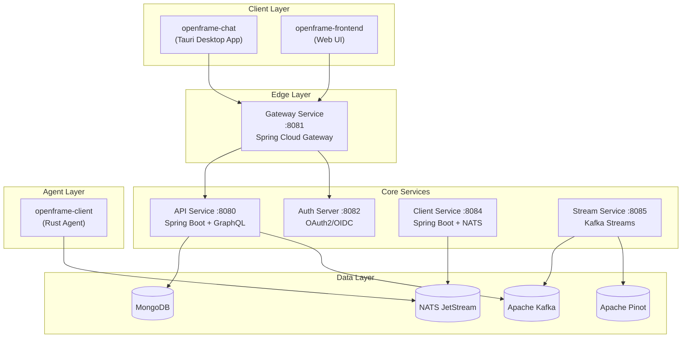

# Introduction to OpenFrame OSS Tenant

**OpenFrame OSS Tenant** is the open-source foundation of the [OpenFrame platform](https://openframe.ai) — an AI-powered MSP (Managed Service Provider) platform built by [Flamingo](https://flamingo.run) that replaces expensive proprietary software with intelligent automation.

---

## What Is OpenFrame OSS Tenant?

OpenFrame OSS Tenant is a multi-service, multi-tenant platform that integrates device management, real-time messaging, and AI-assisted support into a single cohesive system. It provides the infrastructure that enables MSPs to:

- Manage endpoints across Windows, macOS, and Linux through a cross-platform Rust agent
- Deliver AI-powered helpdesk interactions through **Mingo AI** (for technicians) and **Fae** (for clients)
- Stream events in real-time across Kafka, NATS, and Apache Pinot
- Enforce strict multi-tenant data isolation through OAuth2/OIDC and JWT-scoped APIs

---

## Key Features

| Feature | Description |
|---|---|
| **AI-Assisted Support** | Mingo AI for technicians, Fae for end clients — both powered by streaming LLMs |
| **Cross-Platform Agent** | Rust-based agent (openframe-client) runs as a system service on Windows, macOS, and Linux |
| **Desktop AI Chat** | Tauri-based desktop app (openframe-chat) delivering the Fae experience to clients |
| **Multi-Tenant Architecture** | Full tenant isolation with per-tenant OAuth2 clients, RSA-signed JWTs, and database scoping |
| **Real-Time Event Streaming** | Apache Kafka + NATS JetStream for device events, script execution, and AI message chunks |
| **Remote Management (RMM)** | Script execution, scheduling, live commands, and compliance checking across all managed devices |
| **Integrated Tool Management** | MeshCentral, FleetMDM, and custom tool agents orchestrated through the platform |
| **Open Source** | Apache-licensed microservice platform you can self-host and extend |

---

## Target Audience

OpenFrame OSS Tenant is designed for:

- **MSP Teams** looking to reduce vendor costs while gaining AI-assisted automation
- **Platform Engineers** building or extending an MSP platform on open-source infrastructure
- **Developers** contributing to or building integrations on top of OpenFrame

---

## High-Level Architecture Overview

OpenFrame OSS Tenant is a polyglot microservice system built with Java (Spring Boot 3.3), Rust, and TypeScript (React + Tauri). All client traffic passes through the Spring Cloud Gateway before reaching backend services.

```mermaid
graph TB
    subgraph Clients["Client Layer"]
        ChatApp["openframe-chat\n(Tauri Desktop App)"]
        FrontendUI["openframe-frontend\n(Web UI)"]
    end

    subgraph Gateway["Edge Layer"]
        GW["Gateway Service\n:8081\nSpring Cloud Gateway"]
    end

    subgraph CoreServices["Core Services"]
        API["API Service :8080\nSpring Boot + GraphQL"]
        AuthServer["Auth Server :8082\nOAuth2/OIDC"]
        ClientSvc["Client Service :8084\nSpring Boot + NATS"]
        StreamSvc["Stream Service :8085\nKafka Streams"]
    end

    subgraph AgentLayer["Agent Layer"]
        OFClient["openframe-client\n(Rust Agent)"]
    end

    subgraph DataLayer["Data Layer"]
        Mongo[("MongoDB")]
        NATS[("NATS JetStream")]
        Kafka[("Apache Kafka")]
        Pinot[("Apache Pinot")]
    end

    ChatApp --> GW
    FrontendUI --> GW
    GW --> API
    GW --> AuthServer
    API --> Mongo
    API --> Kafka
    StreamSvc --> Kafka
    StreamSvc --> Pinot
    ClientSvc --> NATS
    OFClient --> NATS
```

---

## Core Components at a Glance

| Component | Technology | Role |
|---|---|---|
| **Gateway** | Spring Cloud Gateway | Security, JWT validation, routing, WebSocket proxy |
| **API Service** | Spring Boot + Netflix DGS (GraphQL) | Core business logic, tickets, AI, devices |
| **Authorization Server** | Spring Authorization Server | OAuth2/OIDC, multi-tenant JWT issuance, SSO |
| **Client Service** | Spring Boot + NATS | Agent lifecycle, tool orchestration |
| **Stream Service** | Kafka Streams | Event normalization, analytics writes |
| **openframe-client** | Rust | Cross-platform endpoint agent |
| **openframe-chat** | React + Tauri | Desktop AI chat client (Fae) |

---

## The OpenFrame Ecosystem

OpenFrame OSS Tenant works alongside:

- **[OpenFrame CLI](https://github.com/flamingo-stack/openframe-cli)** — Command-line tools for deploying and managing the platform
- **[OpenFrame Frontend Core](https://github.com/flamingo-stack/openframe-oss-tenant)** — Shared TypeScript UI component library (included in this repo)
- **[OpenMSP Community](https://www.openmsp.ai/)** — Join the community on Slack for support and discussion

---

## Get Started

Ready to explore OpenFrame OSS Tenant? Continue with:

- [Prerequisites](prerequisites.md) — What you need before setting up
- [Quick Start](quick-start.md) — Get running in 5 minutes
- [First Steps](first-steps.md) — What to do after your first setup
