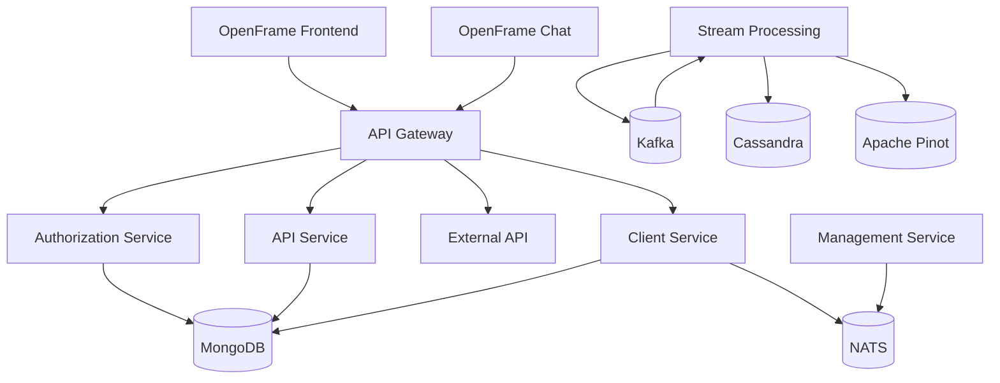

# OpenFrame Introduction

Welcome to **OpenFrame** - the AI-powered MSP platform that replaces expensive proprietary software with open-source alternatives enhanced by intelligent automation.

## What is OpenFrame?

OpenFrame is a unified platform that integrates multiple MSP tools into a single AI-driven interface, automating IT support operations across the entire technology stack. Built by [Flamingo](https://flamingo.run), it combines the power of open-source tools with autonomous AI agents to transform how MSPs manage their clients' IT infrastructure.

## Key Features

### 🤖 Autonomous AI Agents
- **Mingo AI** for technicians - Handles incident triage, alert management, and automated responses
- **Fae** for clients - Provides intelligent customer support and self-service capabilities
- Independent agent architecture for proactive IT management

### 🔧 Unified Tool Integration
- **Fleet MDM** - Device management and security policies
- **Tactical RMM** - Remote monitoring and management
- **MeshCentral** - Remote access and file management
- **Authentik** - Identity and access management
- Extensible architecture for additional tool integrations

### 📊 Real-time Data Processing
- Apache Kafka for event streaming
- Stream processing with enrichment and analytics
- Real-time device monitoring and alerting
- Comprehensive audit logging and compliance

### 🏢 Multi-tenant Architecture
- Secure tenant isolation
- OAuth2/OpenID Connect authentication
- Role-based access control
- Customizable per-tenant configurations

## Target Audience

OpenFrame is designed for:

- **Managed Service Providers (MSPs)** looking to reduce vendor costs and increase automation
- **IT Teams** managing multiple client environments
- **System Administrators** seeking unified tool management
- **Developers** building on top of open-source MSP tooling

## Platform Benefits

| Benefit | Description |
|---------|-------------|
| **Cost Reduction** | Replace expensive proprietary solutions with open-source alternatives |
| **Automation** | AI agents handle routine tasks and incident triage |
| **Unified Interface** | Single dashboard for all MSP tools and client management |
| **Extensibility** | Plugin architecture for custom integrations and workflows |
| **Security** | Built-in security with JWT authentication and tenant isolation |
| **Compliance** | Comprehensive logging and audit trails |

## Architecture Overview

```mermaid
flowchart TD
    Frontend[OpenFrame Frontend] --> Gateway[API Gateway]
    ChatClient[OpenFrame Chat] --> Gateway
    
    Gateway --> AuthSvc[Authorization Service]
    Gateway --> ApiSvc[API Service]
    Gateway --> ExternalApi[External API]
    Gateway --> ClientSvc[Client Service]
    
    AuthSvc --> MongoDB[(MongoDB)]
    ApiSvc --> MongoDB
    ClientSvc --> MongoDB
    
    StreamSvc[Stream Processing] --> Kafka[(Kafka)]
    Kafka --> StreamSvc
    StreamSvc --> Cassandra[(Cassandra)]
    StreamSvc --> Pinot[(Apache Pinot)]
    
    ClientSvc --> NATS[(NATS)]
    Management[Management Service] --> NATS
```

## Technology Stack

### Backend Services
- **Java 21** with Spring Boot 3.3.0
- **GraphQL** API with Netflix DGS
- **OAuth2/OpenID Connect** for authentication
- **MongoDB** for operational data
- **Apache Kafka** for event streaming
- **Apache Cassandra** for time-series data
- **Apache Pinot** for analytics
- **NATS** for real-time messaging

### Frontend Applications
- **React** with TypeScript and Next.js
- **Vue.js** alternative implementation
- **Tauri** desktop chat client
- **PrimeVue** component library

### Infrastructure
- **Docker** containerization
- **Kubernetes** orchestration with Helm charts
- **Istio** service mesh
- **Prometheus/Grafana** monitoring

## Getting Started Next Steps

Ready to explore OpenFrame? Here's your recommended path:

1. **[Prerequisites](prerequisites.md)** - Set up your development environment
2. **[Quick Start](quick-start.md)** - Get OpenFrame running in 5 minutes
3. **[First Steps](first-steps.md)** - Explore key features and configurations

## Community and Support

- **OpenMSP Slack Community**: [Join here](https://join.slack.com/t/openmsp/shared_invite/zt-36bl7mx0h-3~U2nFH6nqHqoTPXMaHEHA)
- **Documentation**: Full documentation available in this repository
- **GitHub Issues**: Report bugs and feature requests via GitHub
- **Website**: [flamingo.run/openframe](https://www.flamingo.run/openframe)

## What's Next?

OpenFrame is continuously evolving with new features and integrations. Recent releases have introduced:

- Enhanced developer experience with comprehensive documentation
- Windows CLI compatibility
- Autonomous AI agent architecture
- Improved real-time processing capabilities

---

*OpenFrame - Transforming MSP operations with AI-powered automation and open-source innovation.*