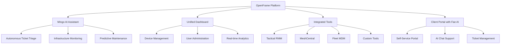
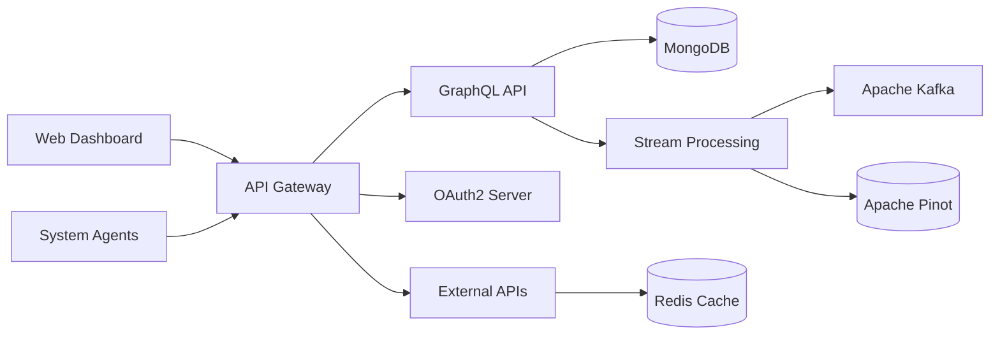

# OpenFrame Introduction

Welcome to **OpenFrame** — the unified AI-powered MSP platform that consolidates your IT management tools into a single, intelligent interface. 

## What is OpenFrame?

OpenFrame is the flagship product of Flamingo's open-source MSP stack, designed to replace expensive proprietary software with intelligent automation powered by **Mingo AI** for technicians and **Fae AI** for clients.

### The Problem We Solve

MSPs today struggle with:
- **Tool sprawl**: Managing dozens of disparate systems
- **High vendor costs**: Expensive per-technician licensing
- **Manual workflows**: Repetitive tasks that drain productivity  
- **Poor client experience**: Disconnected support channels
- **Margin pressure**: Rising costs eating into profits

### The OpenFrame Solution

OpenFrame consolidates everything into one intelligent platform:

```mermaid
graph TD
    A[OpenFrame Platform] --> B[Mingo AI Assistant]
    A --> C[Unified Dashboard] 
    A --> D[Integrated Tools]
    A --> E[Client Portal with Fae AI]
    
    B --> B1[Autonomous Ticket Triage]
    B --> B2[Infrastructure Monitoring]
    B --> B3[Predictive Maintenance]
    
    C --> C1[Device Management]
    C --> C2[User Administration]
    C --> C3[Real-time Analytics]
    
    D --> D1[Tactical RMM]
    D --> D2[MeshCentral]
    D --> D3[Fleet MDM] 
    D --> D4[Custom Tools]
    
    E --> E1[Self-Service Portal]
    E --> E2[AI Chat Support]
    E --> E3[Ticket Management]
```

## Key Features

| Feature | Description | AI Enhancement |
|---------|-------------|----------------|
| **Device Management** | Unified monitoring across Windows, macOS, Linux | Mingo predicts issues before they occur |
| **Remote Access** | Browser-based remote desktop and file management | AI-guided troubleshooting workflows |
| **Tool Integration** | Native support for RMM, MDM, and security tools | Automatic correlation across platforms |
| **Client Portal** | Self-service portal with knowledge base | Fae AI handles L1 support automatically |
| **Multi-Tenancy** | Secure organization isolation with SSO | AI learns tenant-specific patterns |
| **Real-Time Analytics** | Live dashboards with historical reporting | Predictive analytics and recommendations |

## Target Audience

OpenFrame is designed for:

- **MSPs** seeking to modernize their tech stack
- **IT Departments** wanting unified management
- **System Administrators** tired of tool switching
- **Business Owners** looking to reduce vendor costs

## Platform Overview

### Architecture at a Glance

```mermaid
flowchart LR
    Client[Web Dashboard] --> Gateway[API Gateway]
    Agents[System Agents] --> Gateway
    
    Gateway --> API[GraphQL API]
    Gateway --> Auth[OAuth2 Server]
    Gateway --> External[External APIs]
    
    API --> Mongo[(MongoDB)]
    API --> Stream[Stream Processing]
    
    Stream --> Kafka[Apache Kafka]
    Stream --> Pinot[(Apache Pinot)]
    
    External --> Redis[(Redis Cache)]
```

### Technology Stack

**Backend Services:**
- Java 21 with Spring Boot 3.3
- GraphQL APIs with Netflix DGS
- OAuth2/OIDC authentication
- Apache Kafka for event streaming
- MongoDB for operational data
- Apache Pinot for analytics

**Frontend Experience:**
- Vue 3 with TypeScript
- Real-time WebSocket updates
- Mobile-responsive design
- Progressive Web App support

**Client Agents:**
- Rust-based cross-platform agents
- Secure encrypted communication
- Automatic updates and self-healing
- Platform-native integrations

## Getting Started Path

Ready to explore OpenFrame? Follow this learning path:

1. **[Prerequisites](prerequisites.md)** — System requirements and dependencies
2. **[Quick Start](quick-start.md)** — 5-minute setup and first login
3. **[First Steps](first-steps.md)** — Essential configuration and exploration

## Video Overview

Get a comprehensive overview of OpenFrame in this product preview:

## Why OpenFrame Matters

### Cost Savings
Replace 5-10 vendor tools with one platform, reducing licensing costs by 60-80%.

### Productivity Gains  
Mingo AI handles routine tasks, freeing technicians for strategic work.

### Better Client Experience
Fae AI provides instant L1 support, improving satisfaction and retention.

### Open Source Foundation
Built on open-source tools, avoiding vendor lock-in and ensuring transparency.

## Community and Support

- **Slack Community**: Join [OpenMSP Slack](https://join.slack.com/t/openmsp/shared_invite/zt-36bl7mx0h-3~U2nFH6nqHqoTPXMaHEHA) for support and discussion
- **Documentation**: Comprehensive guides and API references
- **GitHub**: Open-source development and issue tracking
- **Flamingo Platform**: Enterprise support and hosted services at [flamingo.run](https://flamingo.run)

---

Ready to transform your MSP operations? Let's get started with the [Prerequisites Guide](prerequisites.md).