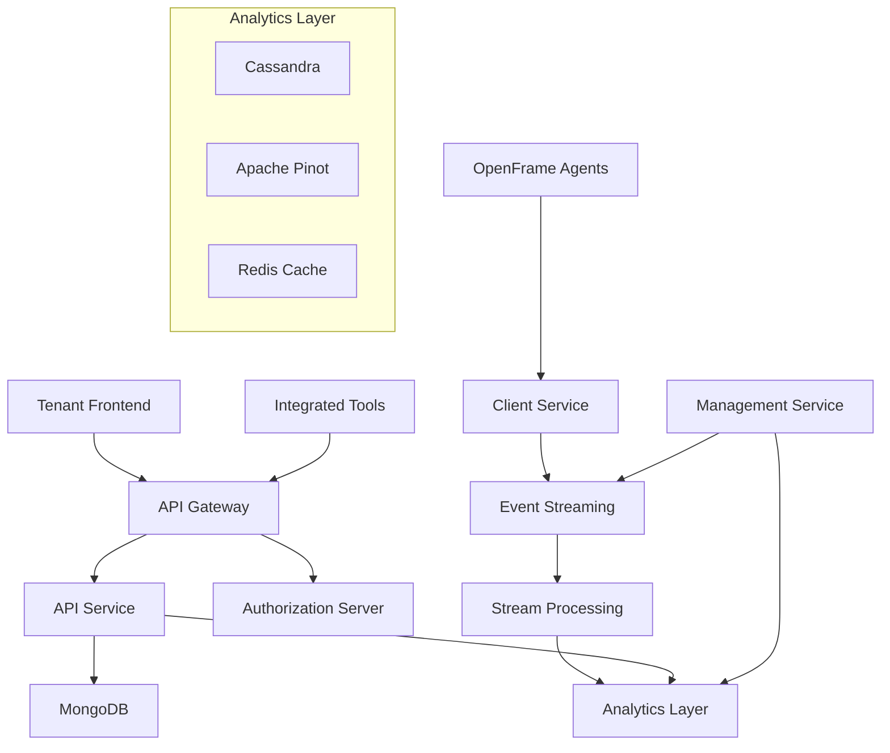

# OpenFrame: The AI-Powered MSP Platform

Welcome to OpenFrame, the unified platform that integrates multiple MSP tools into a single AI-driven interface, automating IT support operations across the stack. Built by the team at Flamingo, OpenFrame replaces expensive proprietary software with open-source alternatives enhanced by intelligent automation.

## What is OpenFrame?

OpenFrame is a **multi-tenant, microservices-based platform** that serves as the central control plane for Managed Service Providers (MSPs). It consolidates devices, logs, tools, tickets, and AI assistance (Mingo) into one cohesive interface, eliminating the need for multiple disparate tools.

## Key Features

### 🤖 AI-Native Operations
- **Mingo AI**: Autonomous agent architecture for incident triage and alert management
- **Intelligent Automation**: AI-powered technician assistance and client-facing automation (Fae)
- **Approval Workflows**: Human-in-the-loop oversight for critical operations

### 🔧 Unified Tool Integration
- **Device Management**: Consolidated view across multiple RMMs and MDMs
- **Real-time Monitoring**: Live logs, events, and system metrics
- **Remote Access**: Integrated remote desktop and file management
- **Script Management**: Cross-platform script execution and scheduling

### 🏢 Multi-Tenant Architecture
- **Tenant Isolation**: Secure, isolated environments for each MSP
- **SSO Support**: Google, Microsoft, and custom identity providers
- **Role-Based Access**: Fine-grained permissions and user management

### 🔌 Vendor-Agnostic Integrations
- **FleetDM**: Open-source device management and osquery integration
- **Tactical RMM**: Python-based RMM for Windows/Linux management
- **MeshCentral**: Remote access and file management capabilities
- **Authentik**: Identity and access management

## Target Audience

OpenFrame is designed for:

- **MSP Technicians**: Day-to-day device management and incident response
- **MSP Operators**: Business operations, reporting, and client management
- **IT Decision Makers**: Looking to consolidate tools and reduce vendor costs
- **Developers**: Building custom integrations and automations

## Core Architecture

```mermaid
flowchart TD
    Browser[Tenant Frontend] --> Gateway[API Gateway]
    Agents[OpenFrame Agents] --> Client[Client Service]
    Tools[Integrated Tools] --> Gateway
    
    Gateway --> API[API Service]
    Gateway --> Auth[Authorization Server]
    
    Client --> Kafka[Event Streaming]
    Kafka --> Stream[Stream Processing]
    Stream --> Analytics[Analytics Layer]
    
    API --> MongoDB[MongoDB]
    API --> Analytics
    
    Management[Management Service] --> Analytics
    Management --> Kafka
    
    subgraph analytics_layer[Analytics Layer]
        Cassandra[Cassandra]
        Pinot[Apache Pinot]
        Redis[Redis Cache]
    end
```

## Technology Stack Overview

| Component | Technology | Purpose |
|-----------|------------|---------|
| **Backend** | Java 21, Spring Boot 3.3 | Microservices runtime |
| **API** | GraphQL (Netflix DGS), REST | Unified data access |
| **Security** | JWT, OAuth2, Spring Security | Authentication & authorization |
| **Data** | MongoDB, Cassandra, Apache Pinot | Multi-model data storage |
| **Streaming** | Apache Kafka 3.6 | Event processing |
| **Frontend** | Next.js, React, TypeScript | Web application |
| **Agents** | Rust | Cross-platform system monitoring |
| **Orchestration** | Kubernetes, Helm, Docker | Container management |

## Benefits

### Cost Reduction
- **Open Source Foundation**: No expensive licensing fees
- **Unified Platform**: Eliminate multiple tool subscriptions
- **Efficient Operations**: Reduce time spent context-switching

### Enhanced Security
- **Zero-Trust Architecture**: JWT-based authentication with cookie security
- **Tenant Isolation**: Multi-tenant security boundaries
- **Audit Trails**: Comprehensive logging and event tracking

### Scalability
- **Microservices Design**: Independent service scaling
- **Event-Driven**: Handle high-volume data ingestion
- **Cloud-Native**: Kubernetes-ready deployment

## Getting Started Paths

Depending on your role and needs, here are recommended next steps:

### For MSP Technicians
1. Review [Prerequisites](prerequisites.md) for system requirements
2. Follow the [Quick Start Guide](quick-start.md) for basic setup
3. Explore [First Steps](first-steps.md) for initial configuration

### For Developers
1. Check [Development Environment Setup](../development/setup/environment.md)
2. Review [Architecture Overview](../development/architecture/overview.md)
3. Follow [Local Development Guide](../development/setup/local-development.md)

### For Decision Makers
- Review system requirements and integration capabilities
- Consider deployment options (SaaS, self-hosted, or hybrid)
- Evaluate ROI through vendor consolidation

## Community and Support

OpenFrame is built on open-source principles with active community support:

- **Documentation**: Comprehensive guides and API references
- **Community**: Join the OpenMSP Slack community for discussions and support
- **GitHub**: Open-source contributions and issue tracking
- **Professional Support**: Available through Flamingo for enterprise deployments

## Next Steps

Ready to get started? Continue with:

- [Prerequisites](prerequisites.md) - Verify your environment is ready
- [Quick Start Guide](quick-start.md) - Get OpenFrame running in 5 minutes
- [First Steps](first-steps.md) - Initial configuration and exploration

---

**Note**: OpenFrame is actively developed with regular updates and new features. Check the [release notes](https://github.com/flamingo-stack) for the latest improvements and changes.