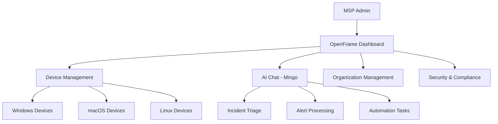
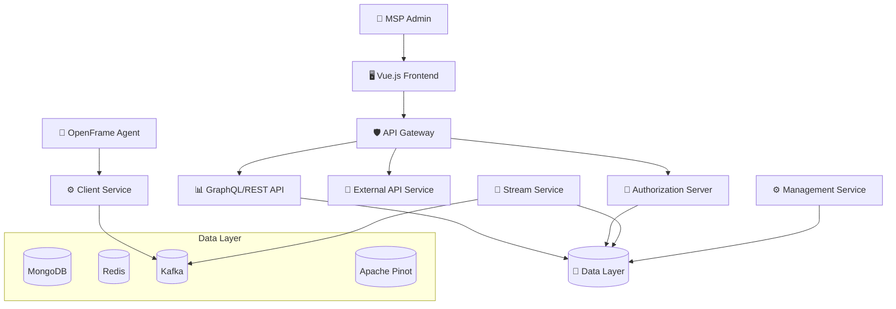

# Getting Started with OpenFrame

## Overview

**OpenFrame** is the unified, AI-powered platform that consolidates multiple MSP (Managed Service Provider) tools into a single intelligent interface. As part of the [Flamingo](https://flamingo.run) ecosystem, OpenFrame replaces expensive proprietary software with open-source alternatives enhanced by artificial intelligence.

## What is OpenFrame?

OpenFrame is a **distributed microservices platform** that serves as the backbone for modern MSP operations. It provides:

- **Unified Device Management**: Monitor and manage endpoints across Windows, macOS, and Linux
- **AI-Powered Automation**: Intelligent incident triage and alert handling with Mingo AI
- **Multi-Tenant Architecture**: Secure isolation for multiple organizations and clients
- **Open Source Foundation**: Built on proven open-source technologies with enterprise features
- **Comprehensive Integrations**: Connect with existing RMM, PSA, and security tools

```mermaid
graph TD
    A[MSP Admin] --> B[OpenFrame Dashboard]
    B --> C[Device Management]
    B --> D[AI Chat - Mingo]
    B --> E[Organization Management]
    B --> F[Security & Compliance]
    
    C --> G[Windows Devices]
    C --> H[macOS Devices]
    C --> I[Linux Devices]
    
    D --> J[Incident Triage]
    D --> K[Alert Processing]
    D --> L[Automation Tasks]
```

## Key Features

### 🎯 **Unified Management Interface**
- Single dashboard for all MSP operations
- Real-time device monitoring and control
- Centralized user and organization management
- Integrated logging and audit trails

### 🤖 **Mingo AI Assistant**
- Autonomous incident response and triage
- Natural language query processing
- Automated alert correlation and escalation
- Context-aware recommendations

### 🔒 **Enterprise Security**
- Multi-factor authentication with SSO support
- Role-based access control (RBAC)
- End-to-end encryption
- SOC 2 Type II compliant architecture

### 🔧 **Open Architecture**
- RESTful and GraphQL APIs
- Webhook-based integrations
- Plugin system for custom extensions
- Cloud-native deployment options

## Target Audience

OpenFrame is designed for:

| User Type | Primary Use Cases |
|-----------|-------------------|
| **MSP Owners** | Business oversight, client management, operational efficiency |
| **MSP Technicians** | Device management, incident response, automation workflows |
| **IT Administrators** | Infrastructure monitoring, security compliance, user management |
| **Developers** | API integrations, custom tool development, workflow automation |

## Architecture at a Glance

OpenFrame follows a modern microservices architecture designed for scale and reliability:

```mermaid
flowchart TD
    User[👤 MSP Admin] --> Frontend[🖥️ Vue.js Frontend]
    Frontend --> Gateway[🛡️ API Gateway]
    
    Gateway --> Auth[🔐 Authorization Server]
    Gateway --> API[📊 GraphQL/REST API]
    Gateway --> External[🔌 External API Service]
    
    API --> Data[(📁 Data Layer)]
    Auth --> Data
    
    subgraph "Data Layer"
        Mongo[(MongoDB)]
        Redis[(Redis)]
        Kafka[(Kafka)]
        Pinot[(Apache Pinot)]
    end
    
    Agent[🤖 OpenFrame Agent] --> ClientService[⚙️ Client Service]
    ClientService --> Kafka
    
    Stream[🌊 Stream Service] --> Kafka
    Stream --> Data
    
    Management[⚙️ Management Service] --> Data
```

## Technology Stack

### Backend Services
- **Runtime**: Java 21 with Spring Boot 3.3.0
- **API Layer**: GraphQL (Netflix DGS), REST with OpenAPI
- **Security**: OAuth2/OIDC with JWT authentication
- **Data Storage**: MongoDB, Apache Cassandra, Apache Pinot, Redis
- **Messaging**: Apache Kafka for event streaming
- **Orchestration**: Kubernetes with Helm charts

### Frontend & Clients
- **Web UI**: Vue 3 with TypeScript and PrimeVue components
- **Desktop Client**: React with Tauri for cross-platform chat
- **System Agent**: Rust-based agent for device monitoring
- **State Management**: Pinia stores with Apollo GraphQL client

### Infrastructure
- **Containerization**: Docker and Docker Compose
- **Monitoring**: Prometheus, Grafana, Loki
- **Service Mesh**: Istio for traffic management
- **CI/CD**: GitHub Actions with automated testing

## Benefits for MSPs

### 💰 **Cost Reduction**
- Eliminate expensive proprietary tool licensing
- Reduce infrastructure complexity and maintenance
- Minimize training costs with unified interface

### ⚡ **Operational Efficiency** 
- Automate routine incident triage and response
- Centralize all MSP tools in one platform
- Reduce context switching between applications

### 📈 **Scalability**
- Multi-tenant architecture supports unlimited clients
- Cloud-native design scales with business growth
- API-first approach enables easy integrations

### 🛡️ **Security & Compliance**
- Built-in security best practices and frameworks
- Audit logs and compliance reporting
- SOC 2 Type II compliant architecture

## Getting Started Journey

Ready to explore OpenFrame? Follow this recommended path:

1. **[Prerequisites](prerequisites.md)** - Ensure your environment is ready
2. **[Quick Start](quick-start.md)** - Get OpenFrame running in 5 minutes
3. **[First Steps](first-steps.md)** - Explore key features and capabilities

## Community & Support

- 💬 **Slack Community**: [Join OpenMSP](https://join.slack.com/t/openmsp/shared_invite/zt-36bl7mx0h-3~U2nFH6nqHqoTPXMaHEHA)
- 🌐 **Website**: [https://www.flamingo.run/openframe](https://www.flamingo.run/openframe)
- 📚 **Documentation**: Browse the docs sections in this repository

## What's Next?

Continue your OpenFrame journey:

- **For Quick Setup**: Head to [Quick Start Guide](quick-start.md)
- **For Complete Setup**: Review [Prerequisites](prerequisites.md) first
- **For Development**: Check out the [development section](../development/README.md)

---

**Ready to transform your MSP operations?** OpenFrame brings the power of AI automation and open-source innovation to modern managed service providers.