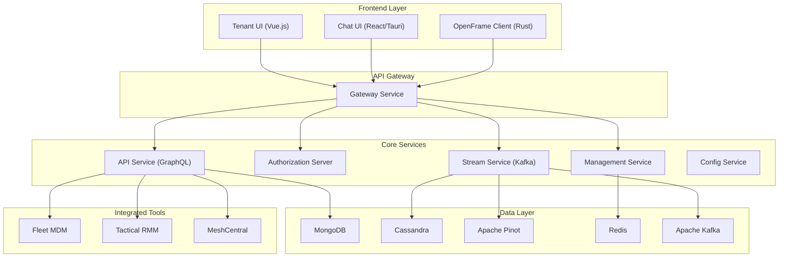

# OpenFrame Introduction

OpenFrame is an open-source, AI-powered MSP platform that replaces expensive proprietary software with intelligent open-source alternatives. Part of the Flamingo (https://flamingo.run) ecosystem, OpenFrame unifies multiple MSP tools into a single, AI-driven interface that automates IT support operations across your entire stack.

## What is OpenFrame?

OpenFrame serves as the unified platform that integrates multiple MSP tools into a single AI-driven interface. It provides:

- **Multi-tenant architecture** - Support for multiple organizations in a single deployment
- **Event-driven microservices** - Scalable, resilient backend architecture
- **AI-powered automation** - Mingo AI for technicians, Fae for clients
- **Open-source foundation** - No vendor lock-in, full source code access
- **Tool consolidation** - Replace dozens of proprietary tools with one platform

## Key Features & Benefits

### 🤖 AI-Powered Operations
- **Mingo AI**: AI assistant for technicians that helps with troubleshooting, automation, and decision-making
- **Fae**: Client-facing AI for self-service and support
- **Autonomous agents**: AI agents that can actually fix infrastructure issues

### 🔧 Unified Tool Management
- **Device Management**: Fleet MDM, Tactical RMM integration
- **Remote Access**: MeshCentral for remote desktop and file management
- **Monitoring & Alerts**: Real-time system monitoring and alerting
- **Script Automation**: Centralized script management and execution

### 🏢 Multi-Tenant & Secure
- **Tenant Isolation**: Complete data and access isolation between organizations
- **SSO Integration**: OAuth2/OpenID Connect with Google, Microsoft, and custom providers
- **Role-based Access**: Granular permissions and user management
- **API Security**: JWT-based authentication with proper token handling

### 📊 Real-time Analytics
- **Event Streaming**: Apache Kafka for real-time data processing
- **Time-series Data**: Cassandra and Apache Pinot for analytics
- **GraphQL API**: Flexible data querying with real-time subscriptions
- **WebSocket Support**: Live updates for dashboards and monitoring

## Platform Architecture Overview

```mermaid
flowchart TD
    subgraph "Frontend Layer"
        TenantUI["Tenant UI (Vue.js)"]
        ChatUI["Chat UI (React/Tauri)"]
        Client["OpenFrame Client (Rust)"]
    end

    subgraph "API Gateway"
        Gateway["Gateway Service"]
    end

    subgraph "Core Services"
        API["API Service (GraphQL)"]
        Auth["Authorization Server"]
        Stream["Stream Service (Kafka)"]
        Management["Management Service"]
        Config["Config Service"]
    end

    subgraph "Data Layer"
        Mongo["MongoDB"]
        Cassandra["Cassandra"]
        Pinot["Apache Pinot"]
        Redis["Redis"]
        Kafka["Apache Kafka"]
    end

    subgraph "Integrated Tools"
        Fleet["Fleet MDM"]
        Tactical["Tactical RMM"]
        Mesh["MeshCentral"]
    end

    TenantUI --> Gateway
    ChatUI --> Gateway
    Client --> Gateway

    Gateway --> API
    Gateway --> Auth
    Gateway --> Stream
    Gateway --> Management

    API --> Mongo
    Stream --> Cassandra
    Stream --> Pinot
    Management --> Redis
    Stream --> Kafka

    API --> Fleet
    API --> Tactical
    API --> Mesh
```

## Who Should Use OpenFrame?

### Managed Service Providers (MSPs)
- Looking to reduce tool sprawl and vendor costs
- Want to implement AI-powered automation
- Need a unified platform for client management
- Require multi-tenant capabilities

### IT Departments
- Managing multiple environments and tools
- Seeking automation and efficiency gains
- Want open-source alternatives to proprietary tools
- Need centralized monitoring and management

### System Integrators
- Building custom MSP solutions
- Requiring a flexible, extensible platform
- Need white-label capabilities
- Want to integrate existing tools

## Technology Stack

| Component | Technology | Purpose |
|-----------|------------|---------|
| **Backend** | Java 21, Spring Boot 3.3 | Microservices framework |
| **Frontend** | Vue.js 3, TypeScript | Tenant web interface |
| **Chat UI** | React, Tauri | Desktop chat application |
| **Client Agent** | Rust | Cross-platform system monitoring |
| **API** | GraphQL (Netflix DGS) | Flexible data API |
| **Messaging** | Apache Kafka | Event streaming |
| **Database** | MongoDB | Configuration and state |
| **Analytics** | Cassandra, Apache Pinot | Time-series and analytics |
| **Cache** | Redis | Caching and session management |
| **Auth** | OAuth2, OpenID Connect | Secure authentication |
| **Orchestration** | Kubernetes, Helm | Container orchestration |

## Community and Support

OpenFrame is part of the broader OpenMSP community:

- **Community Hub**: Join our Slack community at [openmsp.ai](https://www.openmsp.ai/)
- **Slack Workspace**: [OpenMSP Slack](https://join.slack.com/t/openmsp/shared_invite/zt-36bl7mx0h-3~U2nFH6nqHqoTPXMaHEHA)
- **Source Code**: Available on GitHub
- **Commercial Support**: Available through Flamingo

> **Note**: We don't use GitHub Issues or GitHub Discussions. All community interaction happens on our OpenMSP Slack community.

## Getting Started

Ready to dive in? Here's your next steps:

1. **Check Prerequisites**: Review system requirements and dependencies
2. **Quick Start**: Get OpenFrame running in 5 minutes
3. **First Steps**: Explore the platform and configure your first organization

---

OpenFrame represents the future of MSP operations - where AI augments human expertise, open-source provides freedom from vendor lock-in, and unified platforms replace tool sprawl. Welcome to the community!