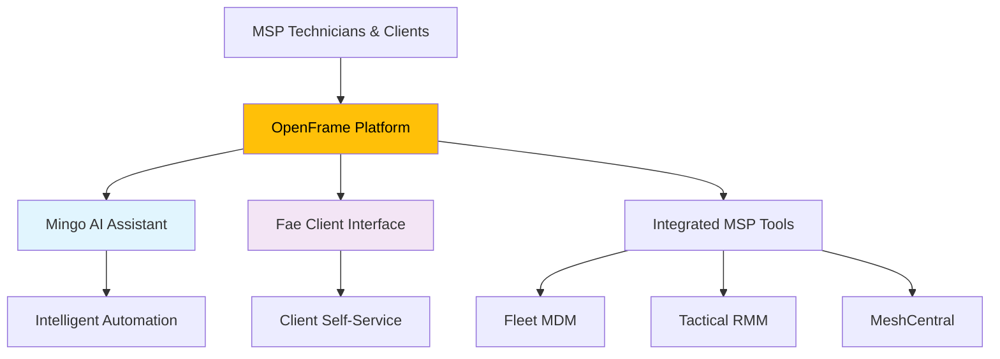
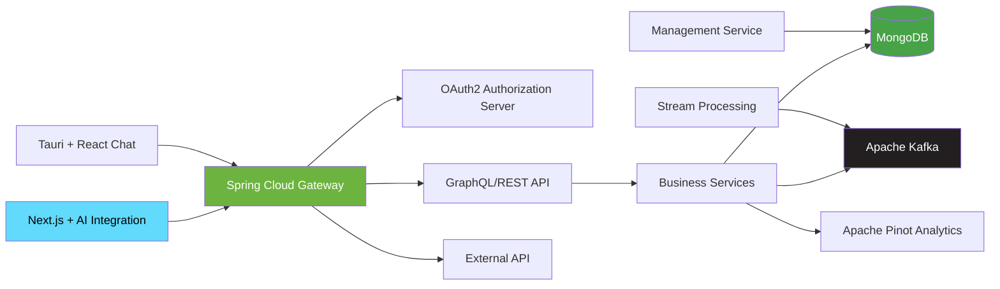

# OpenFrame Platform Introduction

Welcome to OpenFrame, the AI-powered open-source MSP platform that transforms IT support operations with intelligent automation and unified tool integration.

## What is OpenFrame?

OpenFrame is a comprehensive multi-tenant platform that replaces expensive proprietary MSP software with open-source alternatives enhanced by intelligent automation. It combines the power of modern microservices architecture with AI-driven support tools to create a unified IT management experience.

### Key Components

```mermaid
graph TB
    User[MSP Technicians & Clients] --> OpenFrame[OpenFrame Platform]
    
    OpenFrame --> Mingo[Mingo AI Assistant]
    OpenFrame --> Fae[Fae Client Interface]
    OpenFrame --> Tools[Integrated MSP Tools]
    
    Mingo --> Automation[Intelligent Automation]
    Fae --> SelfService[Client Self-Service]
    Tools --> Fleet[Fleet MDM]
    Tools --> Tactical[Tactical RMM]
    Tools --> MeshCentral[MeshCentral]
    
    style OpenFrame fill:#FFC008,color:#000
    style Mingo fill:#e1f5fe
    style Fae fill:#f3e5f5
```

## Elevator Pitch

**"OpenFrame transforms MSPs from reactive firefighters into proactive AI-powered operations teams."**

Instead of spending 12+ hours weekly on manual ticket triage, MSPs can deploy autonomous AI agents that:
- ✅ Automatically diagnose and resolve infrastructure issues
- ✅ Provide intelligent recommendations to technicians
- ✅ Enable client self-service through AI-powered interfaces
- ✅ Integrate seamlessly with existing MSP toolchains

## Key Features & Benefits

### 🤖 AI-Powered Automation
- **Mingo AI Assistant**: Intelligent technician support with enterprise guardrails
- **Autonomous Issue Resolution**: AI agents that actually fix infrastructure problems
- **Smart Triage**: Automatic ticket categorization and priority assignment

### 🛡️ Enterprise Security
- **Multi-tenant OAuth2/OIDC**: Secure identity management
- **API Key Management**: Granular access control
- **SSO Integration**: Google, Microsoft, and custom providers
- **Tenant Isolation**: Complete data separation between organizations

### 🔧 Unified Tool Integration
- **Fleet MDM**: Device management and compliance
- **Tactical RMM**: Remote monitoring and management
- **MeshCentral**: Remote desktop and file management
- **Open Architecture**: Easy integration of additional tools

### 📊 Real-time Operations
- **Stream Processing**: Apache Kafka for event-driven architecture
- **Live Monitoring**: Real-time device status and alerts
- **Analytics**: Apache Pinot for fast query performance
- **Audit Trails**: Comprehensive logging and compliance

### 💰 Cost Efficiency
- **Open Source Foundation**: No vendor lock-in
- **Horizontal Scaling**: Kubernetes-ready microservices
- **Reduced Licensing**: Replace expensive proprietary tools
- **Cloud-Native**: Deploy anywhere (AWS, Azure, GCP, on-premises)

## Target Audience

### Primary Users
- **MSP Owners & Decision Makers**: Looking to reduce operational costs and improve service quality
- **MSP Technicians**: Need efficient tools for device management and issue resolution
- **MSP Clients**: Want self-service capabilities and transparency

### Secondary Users
- **Platform Engineers**: Building or customizing MSP solutions
- **Open Source Contributors**: Extending the OpenFrame ecosystem
- **IT Consultants**: Implementing MSP solutions for clients

## Technology Stack Overview

```mermaid
graph LR
    Frontend[Next.js + AI Integration] --> Gateway[Spring Cloud Gateway]
    Desktop[Tauri + React Chat] --> Gateway
    
    Gateway --> Auth[OAuth2 Authorization Server]
    Gateway --> API[GraphQL/REST API]
    Gateway --> External[External API]
    
    API --> Services[Business Services]
    Services --> MongoDB[(MongoDB)]
    Services --> Kafka[Apache Kafka]
    Services --> Pinot[Apache Pinot Analytics]
    
    Stream[Stream Processing] --> Kafka
    Management[Management Service] --> MongoDB
    
    style Frontend fill:#61dafb,color:#000
    style Gateway fill:#6db33f,color:#fff
    style MongoDB fill:#47a248,color:#fff
    style Kafka fill:#231f20,color:#fff
```

### Architecture Highlights
- **Backend**: Spring Boot 3.3.0 with Java 21
- **Frontend**: Next.js with VoltAgent AI framework
- **Desktop**: Tauri (Rust) + React for chat client
- **Data**: MongoDB, Apache Kafka, Apache Pinot, Redis
- **Security**: JWT, OAuth2/OIDC, multi-tenant isolation
- **Deployment**: Docker containers, Kubernetes-ready

## Getting Started Journey

Ready to dive into OpenFrame? Here's your learning path:

### 1. **Setup & Installation**
Start with our [Prerequisites Guide](prerequisites.md) to prepare your development environment, then follow the [Quick Start Guide](quick-start.md) for a 5-minute setup.

### 2. **First Steps**
Once installed, check out [First Steps Guide](first-steps.md) to explore key features and configure your first organization.

### 3. **Development**
For customization and contribution, explore our development documentation in the `development/` section.

## What Makes OpenFrame Different?

| Traditional MSP Platforms | OpenFrame Platform |
|---------------------------|-------------------|
| ❌ Expensive proprietary licenses | ✅ Open source with AI enhancement |
| ❌ Manual ticket triage | ✅ Autonomous AI resolution |
| ❌ Vendor lock-in | ✅ Open architecture & APIs |
| ❌ Reactive problem solving | ✅ Proactive AI-driven operations |
| ❌ Limited integration options | ✅ Unified tool ecosystem |
| ❌ Complex multi-vendor management | ✅ Single pane of glass |

## Community & Support

- **GitHub**: [OpenFrame OSS Tenant](https://github.com/flamingo-stack/openframe-oss-tenant)
- **Community Slack**: [OpenMSP Community](https://join.slack.com/t/openmsp/shared_invite/zt-36bl7mx0h-3~U2nFH6nqHqoTPXMaHEHA)
- **Website**: [flamingo.run](https://flamingo.run)
- **OpenFrame Hub**: [openframe.ai](https://openframe.ai)

## What's Next?

1. **Check Prerequisites**: Ensure your system meets the requirements
2. **Quick Start**: Get OpenFrame running in 5 minutes
3. **Explore Features**: Discover Mingo AI and integrated tools
4. **Join Community**: Connect with other OpenFrame users and contributors

> **💡 Pro Tip**: Start with our [Quick Start Guide](quick-start.md) if you want to see OpenFrame in action immediately, or review [Prerequisites](prerequisites.md) first for a thorough setup experience.

---

**Ready to transform your MSP operations with AI?** Let's get started! 🚀