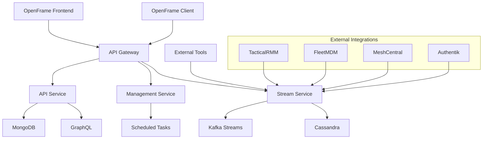

# Introduction to OpenFrame

OpenFrame is the unified platform that integrates multiple MSP tools into a single AI-driven interface, automating IT support operations across your entire technology stack. Built by Flamingo (https://flamingo.run), OpenFrame replaces expensive proprietary software with open-source alternatives enhanced by intelligent automation.

## What is OpenFrame?

OpenFrame is an AI-powered MSP (Managed Service Provider) platform that consolidates your IT management tools into one intelligent dashboard. Instead of juggling multiple expensive proprietary tools, OpenFrame gives you:

- **Unified Management**: Single interface for all your IT infrastructure
- **AI Automation**: Mingo AI for technicians, Fae for clients
- **Open Source Foundation**: Built on proven open-source technologies
- **Cost Reduction**: Replace expensive vendor licenses with one platform

## Key Features

| Feature | Description | Benefits |
|---------|-------------|----------|
| **Device Management** | Monitor and manage all devices across your network | Centralized visibility and control |
| **AI Chat Interface** | Mingo AI assistant for technical support | Faster problem resolution |
| **Multi-Tool Integration** | Connect existing tools like TacticalRMM, FleetMDM | Preserve existing investments |
| **Real-time Monitoring** | Live dashboards and alerts | Proactive issue detection |
| **Organization Management** | Multi-tenant architecture | Serve multiple clients efficiently |
| **Security & Compliance** | Built-in security scanning and compliance tracking | Meet regulatory requirements |

## Architecture Overview

```mermaid
graph TD
    A[OpenFrame Frontend] --> B[API Gateway]
    B --> C[API Service]
    B --> D[Management Service]
    B --> E[Stream Service]
    C --> F[MongoDB]
    C --> G[GraphQL]
    E --> H[Kafka Streams]
    E --> I[Cassandra]
    D --> J[Scheduled Tasks]
    K[OpenFrame Client] --> B
    L[External Tools] --> E
    
    subgraph "External Integrations"
        L1[TacticalRMM]
        L2[FleetMDM]
        L3[MeshCentral]
        L4[Authentik]
    end
    
    L1 --> E
    L2 --> E
    L3 --> E
    L4 --> E
```

## Target Audience

### MSP Owners & Managers
- Reduce operational costs by 50-70%
- Standardize client management processes
- Scale operations without linear cost increases

### IT Technicians
- Access AI-powered troubleshooting assistance
- Manage multiple client environments from one interface
- Automate routine maintenance tasks

### System Administrators
- Deploy and maintain open-source infrastructure
- Integrate with existing tools and workflows
- Customize platform to organizational needs

## Technology Stack

### Frontend
- **Vue 3** with TypeScript and Composition API
- **PrimeVue** component library for consistent UI
- **Pinia** for state management
- **Apollo Client** for GraphQL integration

### Backend Services
- **Java 21** with Spring Boot 3.3.0
- **GraphQL** API using Netflix DGS
- **MongoDB** for primary data storage
- **Cassandra** for time-series data
- **Apache Kafka** for event streaming
- **Redis** for caching and sessions

### Infrastructure
- **Docker** containers with Kubernetes orchestration
- **Prometheus** and Grafana for monitoring
- **Istio** service mesh for traffic management
- **Helm** charts for deployment

## Benefits Over Traditional MSP Tools

### Cost Reduction
- Eliminate per-seat licensing fees
- Reduce vendor lock-in
- Lower total cost of ownership

### Operational Efficiency  
- Single pane of glass management
- AI-powered automation
- Reduced context switching

### Scalability
- Cloud-native architecture
- Horizontal scaling capabilities
- Multi-tenant design

### Flexibility
- Open-source foundation
- Customizable workflows
- API-first design

## Getting Started Path

Ready to transform your MSP operations? Follow this learning path:

1. **[Prerequisites](./prerequisites.md)** - Ensure you have the required setup
2. **[Quick Start](./quick-start.md)** - Get OpenFrame running in 5 minutes
3. **[First Steps](./first-steps.md)** - Essential configuration and setup
4. **[Development Setup](../development/setup/environment.md)** - For developers and integrators

## Community and Support

OpenFrame is built with the community in mind:

- **OpenMSP Community**: Join our Slack at https://www.openmsp.ai/
- **GitHub**: Contribute and report issues (when available)
- **Documentation**: Comprehensive guides and API references
- **Training**: Webinars and certification programs

> **Note**: We don't use GitHub Issues or Discussions. All support and development discussions happen in our OpenMSP Slack community at https://join.slack.com/t/openmsp/shared_invite/zt-36bl7mx0h-3~U2nFH6nqHqoTPXMaHEHA

## What's Next?

Start your OpenFrame journey by checking the [Prerequisites](./prerequisites.md) to ensure your environment is ready, then proceed to our [Quick Start Guide](./quick-start.md) to get your first instance running.

For a comprehensive overview of the platform capabilities, watch our product walkthrough video above or explore our [Architecture Overview](../development/architecture/overview.md) for technical details.