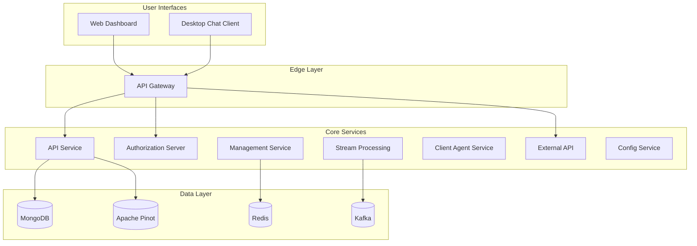

# OpenFrame Introduction

OpenFrame is a unified AI-powered MSP (Managed Service Provider) platform that replaces expensive proprietary software with open-source alternatives enhanced by intelligent automation. Built on a microservices architecture, OpenFrame integrates multiple MSP tools into a single AI-driven interface, automating IT support operations across the entire technology stack.

## What is OpenFrame?

OpenFrame is the complete OSS (Open Source Software) foundation for Flamingo/OpenFrame deployments, providing a production-ready multi-tenant architecture that serves as the backbone for modern MSP operations.

### Key Value Propositions

- **Cost Reduction**: Replace expensive proprietary MSP tools with open-source alternatives
- **AI Enhancement**: Intelligent automation through Mingo AI for technicians and Fae for clients
- **Unified Platform**: Single interface for all MSP operations and tool management
- **Multi-Tenant**: Secure, scalable architecture supporting multiple organizations
- **Open Source**: Full transparency, customizability, and community-driven development

## Core Architecture Overview

OpenFrame consists of several integrated components working together:

```mermaid
graph TB
    subgraph "User Interfaces"
        Frontend[Web Dashboard]
        Chat[Desktop Chat Client]
    end
    
    subgraph "Edge Layer" 
        Gateway[API Gateway]
    end
    
    subgraph "Core Services"
        API[API Service]
        Auth[Authorization Server] 
        Management[Management Service]
        Stream[Stream Processing]
        Client[Client Agent Service]
        External[External API]
        Config[Config Service]
    end
    
    subgraph "Data Layer"
        MongoDB[(MongoDB)]
        Kafka[(Kafka)]
        Redis[(Redis)]
        Pinot[(Apache Pinot)]
    end
    
    Frontend --> Gateway
    Chat --> Gateway
    Gateway --> API
    Gateway --> Auth
    Gateway --> External
    
    API --> MongoDB
    Stream --> Kafka
    Management --> Redis
    API --> Pinot
```

## Key Features

### Multi-Tenant Security
- **Per-tenant RSA signing keys** for JWT authentication
- **OAuth2/OIDC identity provider** with Google & Microsoft SSO
- **API key enforcement** and rate limiting
- **Role-based access control** throughout the platform

### Real-Time Processing
- **Event-driven architecture** using Kafka + Debezium
- **Stream processing** for real-time data enrichment  
- **WebSocket support** for live dashboard updates
- **Agent heartbeat tracking** for system monitoring

### MSP Tool Integration
- **Agent lifecycle management** for endpoint monitoring
- **Tool connection synchronization** across platforms
- **External API integrations** for third-party tools
- **Proxy routing** for secure tool access

### AI-Powered Automation
- **Mingo AI** for technician assistance and automation
- **Fae AI** for client-facing support interactions
- **Intelligent enrichment** of system events and logs
- **Automated decision making** based on system patterns

## Technology Stack

### Backend Services
- **Java 21** with Spring Boot 3.3.0 and Spring Cloud 2023.0.3
- **GraphQL** API layer using Netflix DGS 7.0.0
- **MongoDB 7.x** for primary data storage
- **Apache Kafka 3.6.0** for event streaming
- **Apache Pinot 1.2.0** for real-time analytics
- **Redis** for caching and session management

### Frontend Applications
- **Vue 3** with Composition API and TypeScript
- **React** (alternative frontend option)
- **Tauri** for desktop chat client
- **PrimeVue** component library for consistent UI

### Infrastructure
- **Kubernetes 1.28+** with Helm charts for orchestration
- **Docker** containerization for all services
- **Istio 1.20** service mesh for traffic management
- **Prometheus + Grafana** for monitoring and observability

## Who Should Use OpenFrame?

### Managed Service Providers (MSPs)
- Companies looking to modernize their MSP stack
- Organizations seeking to reduce software licensing costs
- Teams wanting to leverage AI for operational efficiency

### IT Departments
- Internal IT teams managing multiple systems
- Organizations requiring centralized monitoring and management
- Teams needing unified dashboards for diverse tools

### Developers and Integrators
- Teams building custom MSP solutions
- Organizations requiring extensible, API-first platforms
- Developers contributing to open-source MSP tooling

## Getting Started Journey

This documentation will guide you through:

1. **[Prerequisites](prerequisites.md)** - System requirements and preparation
2. **[Quick Start](quick-start.md)** - 5-minute setup for immediate evaluation
3. **[First Steps](first-steps.md)** - Essential configuration and exploration

## Product Walkthrough

Get a comprehensive overview of OpenFrame's capabilities:

## Support and Community

- **OpenMSP Slack Community**: Join our active community at [OpenMSP Slack](https://join.slack.com/t/openmsp/shared_invite/zt-36bl7mx0h-3~U2nFH6nqHqoTPXMaHEHA)
- **Documentation**: Comprehensive guides and API references
- **Issue Tracking**: Report bugs and request features through our community channels

## Next Steps

Ready to get started? Begin with the [Prerequisites Guide](prerequisites.md) to prepare your environment for OpenFrame deployment.

OpenFrame represents the future of MSP operations - open, intelligent, and infinitely extensible. Let's build the next generation of IT management together.