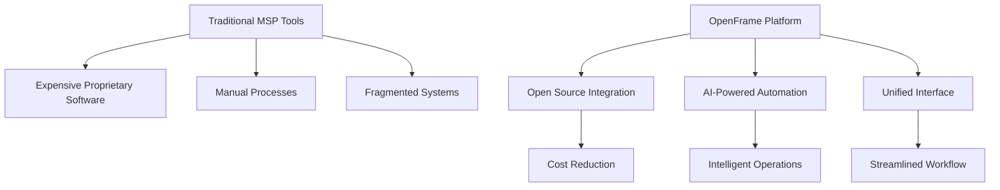
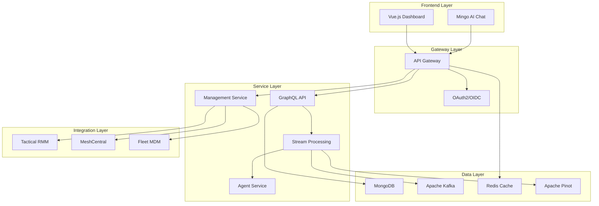

# OpenFrame Introduction

Welcome to **OpenFrame** - the open-source unified platform that transforms expensive proprietary MSP software into intelligent, AI-driven automation.

## What is OpenFrame?

OpenFrame is Flamingo's revolutionary approach to MSP operations, combining the power of open-source alternatives with intelligent automation through **Mingo AI** (for technicians) and **Fae** (for clients). It replaces costly vendor lock-in with a unified, extensible platform that adapts to your workflow.

### The Problem We Solve

Traditional MSP tools are:
- **Expensive** - Vendor lock-in with escalating costs
- **Fragmented** - Multiple disconnected systems
- **Manual** - Time-consuming, repetitive tasks
- **Reactive** - Limited proactive monitoring and automation

### The OpenFrame Solution

```mermaid
flowchart TD
    A[Traditional MSP Tools] --> B[Expensive Proprietary Software]
    A --> C[Manual Processes]
    A --> D[Fragmented Systems]
    
    E[OpenFrame Platform] --> F[Open Source Integration]
    E --> G[AI-Powered Automation]
    E --> H[Unified Interface]
    
    F --> I[Cost Reduction]
    G --> J[Intelligent Operations]
    H --> K[Streamlined Workflow]
```

## Key Features

| Feature | Description | Benefit |
|---------|-------------|---------|
| **Unified Dashboard** | Single pane of glass for all MSP operations | Reduce context switching |
| **Mingo AI Assistant** | Intelligent technician support with enterprise guardrails | Accelerate issue resolution |
| **Open Source Integration** | Tactical RMM, MeshCentral, Fleet MDM, and more | Eliminate vendor lock-in |
| **Real-time Monitoring** | Live device status, alerts, and performance metrics | Proactive issue detection |
| **Automation Engine** | Scriptable workflows and automated responses | Reduce manual tasks |
| **Multi-tenant Architecture** | Secure client isolation with role-based access | Scale operations efficiently |

## Core Architecture

OpenFrame is built on a modern microservices architecture:

```mermaid
graph TB
    subgraph "Frontend Layer"
        UI[Vue.js Dashboard]
        Chat[Mingo AI Chat]
    end
    
    subgraph "Gateway Layer"
        GW[API Gateway]
        Auth[OAuth2/OIDC]
    end
    
    subgraph "Service Layer"
        API[GraphQL API]
        Mgmt[Management Service]
        Stream[Stream Processing]
        Client[Agent Service]
    end
    
    subgraph "Data Layer"
        Mongo[MongoDB]
        Kafka[Apache Kafka]
        Redis[Redis Cache]
        Pinot[Apache Pinot]
    end
    
    subgraph "Integration Layer"
        TacticalRMM[Tactical RMM]
        MeshCentral[MeshCentral]
        FleetMDM[Fleet MDM]
    end
    
    UI --> GW
    Chat --> GW
    GW --> Auth
    GW --> API
    GW --> Mgmt
    API --> Stream
    Stream --> Client
    API --> Mongo
    Stream --> Kafka
    GW --> Redis
    Stream --> Pinot
    Mgmt --> TacticalRMM
    Mgmt --> MeshCentral
    Mgmt --> FleetMDM
```

## Who Should Use OpenFrame?

### Managed Service Providers (MSPs)
- **Reduce operational costs** by 60-80% through open-source alternatives
- **Increase efficiency** with AI-powered automation
- **Scale operations** without proportional cost increases

### IT Teams & Consultants
- **Centralize management** across multiple client environments
- **Automate routine tasks** to focus on strategic initiatives
- **Gain visibility** into distributed infrastructure

### Technology Partners
- **Integrate existing tools** through open APIs
- **Extend functionality** with custom automation
- **Build solutions** on proven architecture

## Getting Started Journey

Your OpenFrame journey follows these key milestones:

1. **Prerequisites Setup** - Prepare your environment with required tools
2. **Quick Start** - Get OpenFrame running in 5 minutes
3. **First Steps** - Configure your first organization and devices
4. **Integration** - Connect your existing tools and workflows
5. **Automation** - Build intelligent workflows with Mingo AI

## Success Stories

> *"OpenFrame reduced our tool licensing costs by 75% while increasing our response time by 3x through AI automation."*  
> — Regional MSP with 500+ endpoints

> *"The unified dashboard finally gave us the single pane of glass we've been seeking for years."*  
> — IT Consultant managing 15 client networks

## Community & Support

OpenFrame is backed by the vibrant **OpenMSP community**:

- **Slack Community**: Join [OpenMSP Slack](https://join.slack.com/t/openmsp/shared_invite/zt-36bl7mx0h-3~U2nFH6nqHqoTPXMaHEHA) for real-time support
- **Documentation**: Comprehensive guides for every use case
- **GitHub**: Open-source development and issue tracking
- **Community Calls**: Regular updates and roadmap discussions

## Next Steps

Ready to transform your MSP operations? Start with these essential guides:

- [Prerequisites](prerequisites.md) - Ensure your environment is ready
- [Quick Start](quick-start.md) - Get running in minutes
- [First Steps](first-steps.md) - Essential configuration walkthrough

---

**💡 Pro Tip**: Join our OpenMSP Slack community before you start - our community experts are ready to help you succeed with OpenFrame!