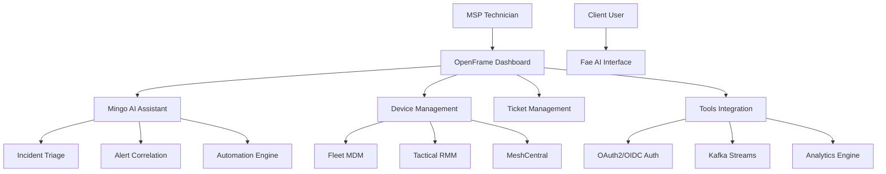

# Introduction to OpenFrame

OpenFrame is an AI-powered MSP (Managed Service Provider) platform that replaces expensive proprietary software with open-source alternatives enhanced by intelligent automation. Created by Flamingo (https://flamingo.run), OpenFrame delivers a unified platform that integrates multiple MSP tools into a single AI-driven interface, automating IT support operations across the stack.

## What is OpenFrame?

OpenFrame is the unified platform that consolidates your entire MSP tech stack into one intelligent system. Instead of juggling multiple tools, switching between interfaces, and manually correlating data, OpenFrame provides:

- **AI-Enhanced Open Source Tools**: Replace expensive proprietary software with battle-tested open-source alternatives, intelligently automated by Mingo AI for technicians and Fae for clients
- **Unified Dashboard**: One interface to rule them all - devices, users, alerts, tickets, and integrations
- **Autonomous Operations**: Mingo AI handles incident triage, alert correlation, and routine maintenance automatically
- **Multi-Tenant Architecture**: Secure, scalable platform supporting multiple MSP clients with complete tenant isolation

## Key Features & Benefits

### 🤖 Intelligent Automation
- **Mingo AI**: AI assistant for technicians that handles device management, incident triage, and automation
- **Fae AI**: Client-facing AI that manages support requests and provides self-service capabilities
- **Autonomous Agent Architecture**: v0.5.2+ introduces independent AI agents for alert handling and incident response

### 💰 Cost Reduction
- **Cut Vendor Costs**: Replace 25-35% of revenue spent on expensive vendor tools
- **Reduce Labor**: Automate routine tasks like password resets and disk cleanups
- **Open Source Foundation**: Leverage community-driven tools without vendor lock-in

### 🔧 Integrated Tool Stack
- **Device Management**: Fleet MDM, Tactical RMM integration
- **Remote Access**: MeshCentral for secure remote desktop and file management  
- **Monitoring & Logging**: Unified event processing with Kafka and Apache Pinot analytics
- **Authentication**: Multi-tenant OAuth2/OIDC with SSO support (Google, Microsoft)

### 🏗️ Enterprise Architecture
- **Spring Boot Microservices**: Scalable Java 21 backend with modern reactive patterns
- **Event-Driven**: Kafka streams for real-time data processing and tool integrations
- **Multi-Database**: MongoDB for operational data, Cassandra for logs, Pinot for analytics
- **Cloud Native**: Docker containers, Kubernetes ready, Redis caching

## Platform Overview

```mermaid
graph TD
    A[MSP Technician] --> B[OpenFrame Dashboard]
    C[Client User] --> D[Fae AI Interface]
    
    B --> E[Mingo AI Assistant]
    B --> F[Device Management]
    B --> G[Ticket Management]
    B --> H[Tools Integration]
    
    F --> I[Fleet MDM]
    F --> J[Tactical RMM]
    F --> K[MeshCentral]
    
    E --> L[Incident Triage]
    E --> M[Alert Correlation]
    E --> N[Automation Engine]
    
    H --> O[OAuth2/OIDC Auth]
    H --> P[Kafka Streams]
    H --> Q[Analytics Engine]
```

## Target Audience

OpenFrame is designed for:

- **MSP Owners & Managers**: Looking to cut costs and improve service delivery
- **MSP Technicians**: Who need intelligent automation to handle routine tasks
- **IT Directors**: Seeking unified visibility across client environments
- **Platform Engineers**: Building or maintaining MSP infrastructure
- **Open Source Enthusiasts**: Wanting enterprise-grade MSP tools without vendor lock-in

## Technology Stack

**Frontend & User Interface:**
- Next.js-based tenant application
- React components with Tailwind CSS
- Desktop chat client built with Tauri (Rust + TypeScript)
- Real-time WebSocket communications

**Backend Services:**
- Spring Boot 3.3.0 microservices (Java 21)
- Multi-tenant OAuth2 Authorization Server
- Reactive Spring Cloud Gateway
- GraphQL API with Netflix DGS
- REST APIs for external integrations

**AI & Machine Learning:**
- VoltAgent core for autonomous agents
- Anthropic Claude integration
- Custom AI models for incident triage
- Natural language processing for client interactions

**Data & Infrastructure:**
- MongoDB for operational data persistence
- Apache Kafka for real-time event streaming
- Apache Cassandra for time-series logs
- Apache Pinot for analytical queries
- Redis for caching and session management
- NATS JetStream for agent communication

**Integrated Tools:**
- Fleet MDM for device management
- Tactical RMM for endpoint monitoring
- MeshCentral for remote access
- Debezium for change data capture

## Architecture Principles

### Multi-Tenant by Design
Every component supports tenant isolation with:
- Per-tenant JWT signing keys
- Database-level tenant separation
- Isolated configuration and customization

### Event-Driven Architecture  
Real-time operations powered by:
- Kafka streams for tool integrations
- NATS for agent communications
- WebSockets for live dashboard updates

### Microservices Pattern
Independently scalable services:
- API Service Core (GraphQL + REST orchestration)
- Gateway Service Core (routing + auth)
- Client Service Core (agent management) 
- Stream Processing Service Core (data pipeline)
- Management Service Core (admin operations)

## What's New in v0.5.2

- **Independent AI Agents**: Autonomous architecture for incident handling
- **Enhanced Device Management**: Improved Fleet and Tactical RMM integrations
- **Advanced Analytics**: Apache Pinot integration for real-time insights
- **Security Improvements**: Enhanced multi-tenant isolation and JWT handling

## Getting Started

Ready to dive in? Here's your next steps:

1. **[Prerequisites](prerequisites.md)** - Check system requirements and prepare your environment
2. **[Quick Start](quick-start.md)** - Get OpenFrame running in 5 minutes
3. **[First Steps](first-steps.md)** - Essential configuration and initial setup
4. **[Development Setup](../development/setup/environment.md)** - For developers and customization

## Community & Support

- **OpenMSP Slack Community**: https://www.openmsp.ai/
- **Join Slack**: https://join.slack.com/t/openmsp/shared_invite/zt-36bl7mx0h-3~U2nFH6nqHqoTPXMaHEHA
- **GitHub Repository**: https://github.com/flamingo-stack/openframe-oss-tenant
- **Website**: https://www.flamingo.run/openframe

> **Note**: We don't use GitHub Issues or GitHub Discussions. All community support and discussions happen in our OpenMSP Slack community.