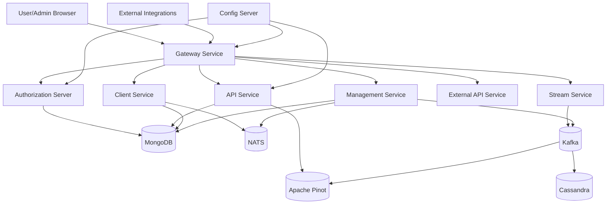
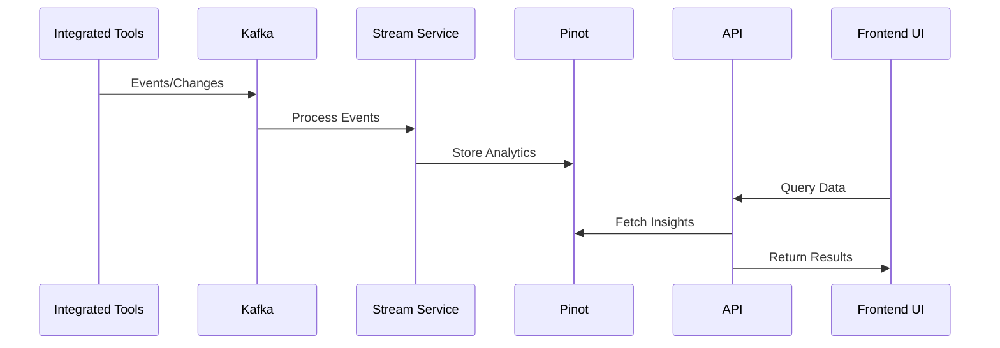

# OpenFrame Introduction

Welcome to **OpenFrame** - the unified, AI-powered MSP platform that replaces expensive proprietary software with open-source alternatives enhanced by intelligent automation.

## What is OpenFrame?

OpenFrame is Flamingo's **multi-tenant, open-source backend stack** that brings together everything required to run a complete MSP platform. It combines:

- **AI-Powered Automation**: Mingo AI for technicians and Fae for client interactions
- **Open Source Foundation**: Built entirely on OSS technologies
- **Multi-Tenant Architecture**: Designed from the ground up for MSP service providers
- **Event-Driven Processing**: Real-time data processing and analytics
- **Unified Interface**: Single platform integrating multiple MSP tools

### Key Features

| Feature | Description | Benefit |
|---------|-------------|---------|
| **Multi-Tenant by Design** | Tenant context propagated across all services | Secure isolation for MSP clients |
| **Microservice Architecture** | Spring Boot services with WebFlux | Scalable and maintainable |
| **Event-Driven Processing** | Kafka, Debezium, NATS streaming | Real-time automation and alerts |
| **Analytics-First** | Apache Pinot + Cassandra | Low-latency insights and reporting |
| **Security-Centric** | OAuth2, OIDC, JWT, SSO | Enterprise-grade security |
| **AI Integration** | Built-in AI agents and automation | Reduce manual MSP tasks |

## Platform Architecture

```mermaid
flowchart TD
    Browser[User/Admin Browser] --> Gateway[Gateway Service]
    ExternalClient[External Integrations] --> Gateway
    
    Gateway --> Auth[Authorization Server]
    Gateway --> API[API Service]
    Gateway --> Client[Client Service]
    Gateway --> Mgmt[Management Service]
    Gateway --> ExtAPI[External API Service]
    Gateway --> Stream[Stream Service]
    
    Auth --> MongoDB[(MongoDB)]
    API --> MongoDB
    API --> Pinot[(Apache Pinot)]
    
    Client --> NATS[(NATS)]
    Client --> MongoDB
    
    Stream --> Kafka[(Kafka)]
    Kafka --> Pinot
    Kafka --> Cassandra[(Cassandra)]
    
    Mgmt --> MongoDB
    Mgmt --> Kafka
    Mgmt --> NATS
    
    Config[Config Server] --> Gateway
    Config --> API
    Config --> Auth
```

## Target Audience

OpenFrame is designed for:

- **MSP Service Providers** looking to modernize their technology stack
- **IT Professionals** wanting AI-powered automation tools
- **Developers** building integrations with MSP platforms  
- **Organizations** seeking open-source alternatives to proprietary MSP software

## Technology Stack

### Backend Services
- **Runtime**: Java 21, Spring Boot 3.3.0, Spring Cloud 2023.0.3
- **API**: GraphQL (Netflix DGS), RESTful services
- **Security**: JWT with OAuth2, Spring Security, AES-256 encryption
- **Data**: MongoDB, Cassandra, Apache Pinot, Redis
- **Messaging**: Apache Kafka, NATS for real-time events
- **Processing**: Custom stream processing components

### Frontend & Clients
- **Web UI**: Vue 3 with TypeScript, PrimeVue components
- **System Agents**: Rust-based cross-platform clients
- **External Clients**: OpenFrame CLI tools (separate repository)

### Infrastructure
- **Containerization**: Docker and Docker Compose
- **Orchestration**: Kubernetes with Helm charts
- **Monitoring**: Prometheus, Grafana, Loki
- **Service Mesh**: Istio for traffic management

## Core Benefits

> **Cost Reduction**: Replace expensive MSP software licenses with open-source alternatives
> 
> **AI Automation**: Reduce manual ticket triage and resolution time by 12+ hours weekly
> 
> **Unified Platform**: Single interface for all MSP operations and client management
> 
> **Open Architecture**: Full control over your MSP technology stack

## Quick Overview

OpenFrame consists of several key components working together:

1. **API Gateway**: Routes requests, handles authentication, manages WebSockets
2. **Authorization Server**: Multi-tenant OAuth2/OIDC identity provider  
3. **Core API**: GraphQL and REST APIs for UI and integrations
4. **Stream Processor**: Real-time event processing and data enrichment
5. **Management Service**: Administrative tasks and scheduled operations
6. **Client Agents**: Cross-platform system monitoring and management
7. **External API**: Third-party integration endpoints

## Data Flow

```mermaid
sequenceDiagram
    participant Tools as Integrated Tools
    participant Kafka
    participant Stream as Stream Service
    participant Pinot
    participant API
    participant UI as Frontend UI
    
    Tools->>Kafka: Events/Changes
    Kafka->>Stream: Process Events
    Stream->>Pinot: Store Analytics
    UI->>API: Query Data
    API->>Pinot: Fetch Insights
    API->>UI: Return Results
```

MongoDB serves as the **source of truth**, Kafka provides **change propagation**, and Pinot/Cassandra deliver **low-latency analytics**.

## Getting Started

Ready to explore OpenFrame? Here's what to do next:

- **[Prerequisites](prerequisites.md)**: Check system requirements and dependencies
- **[Quick Start](quick-start.md)**: Get OpenFrame running in 5 minutes  
- **[First Steps](first-steps.md)**: Explore key features and initial configuration

## Community & Support

- **GitHub**: Contribute to the open-source project
- **OpenMSP Slack**: Join our community at [openmsp.ai](https://www.openmsp.ai/)
- **Documentation**: Comprehensive guides and reference materials

---

OpenFrame transforms MSP operations through intelligent automation and open-source innovation. Join the revolution in MSP technology.