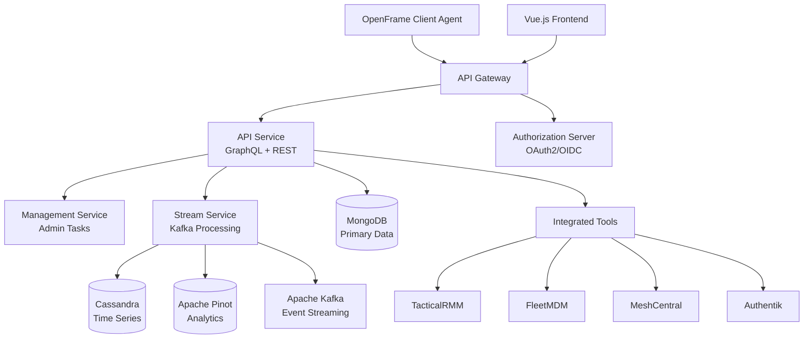

# Introduction to OpenFrame

OpenFrame is a unified, AI-powered MSP platform that replaces expensive proprietary software with open-source alternatives enhanced by intelligent automation. It integrates multiple MSP tools into a single AI-driven interface, automating IT support operations across your entire stack.

## What is OpenFrame?

OpenFrame transforms how Managed Service Providers (MSPs) operate by providing:

- **Unified Platform**: Single interface for all your MSP tools and services
- **AI-Powered Automation**: Mingo AI for technicians and Fae AI for clients
- **Open Source Foundation**: Built on proven open-source technologies
- **Cost Effective**: Significant savings compared to proprietary alternatives
- **Seamless Integration**: Works with existing MSP tools and workflows

## Key Features

### 🤖 Intelligent Automation
- **Mingo AI**: Your AI technician that handles routine tasks and provides intelligent insights
- **Fae AI**: Client-facing AI assistant for end-user support
- **Smart Workflows**: Automated ticket routing, escalation, and resolution

### 🔧 Comprehensive Tool Integration
- **Remote Monitoring & Management (RMM)**: TacticalRMM integration
- **Mobile Device Management (MDM)**: FleetMDM support  
- **Remote Access**: MeshCentral for secure remote control
- **Identity Management**: Authentik for SSO and authentication

### 📊 Unified Dashboard
- Real-time device monitoring and management
- Centralized logging and event tracking
- Automated compliance reporting
- Custom dashboards and analytics

### 🔐 Enterprise Security
- Multi-tenant architecture with complete data isolation
- OAuth2/OpenID Connect authentication
- JWT-based security with HTTP-only cookies
- AES-256 encryption for sensitive data

## Platform Architecture Overview

```mermaid
graph TB
    Client[OpenFrame Client Agent] --> Gateway[API Gateway]
    Frontend[Vue.js Frontend] --> Gateway
    
    Gateway --> API[API Service<br/>GraphQL + REST]
    Gateway --> Auth[Authorization Server<br/>OAuth2/OIDC]
    
    API --> Management[Management Service<br/>Admin Tasks]
    API --> Stream[Stream Service<br/>Kafka Processing]
    
    API --> MongoDB[(MongoDB<br/>Primary Data)]
    Stream --> Cassandra[(Cassandra<br/>Time Series)]
    Stream --> Pinot[(Apache Pinot<br/>Analytics)]
    
    Stream --> Kafka[Apache Kafka<br/>Event Streaming]
    
    API --> Tools[Integrated Tools]
    Tools --> TacticalRMM[TacticalRMM]
    Tools --> FleetMDM[FleetMDM]
    Tools --> MeshCentral[MeshCentral]
    Tools --> Authentik[Authentik]
```

## Target Audience

### MSP Owners & Operators
- Reduce operational costs by 40-60%
- Gain unified visibility across all tools
- Automate routine tasks and workflows
- Scale operations efficiently

### IT Technicians
- Work with AI-powered assistance
- Access all tools from single interface
- Automated ticket routing and escalation
- Real-time insights and recommendations

### End Users/Clients
- Self-service portal with AI assistance
- Faster issue resolution
- Transparent communication
- Reduced downtime

## Why Choose OpenFrame?

| Traditional MSP Stack | OpenFrame Platform |
|----------------------|-------------------|
| Multiple vendor licenses ($$$) | Single platform cost ($$) |
| Fragmented user experience | Unified interface |
| Manual processes | AI-powered automation |
| Vendor lock-in | Open source foundation |
| Complex integrations | Pre-integrated tools |
| Limited customization | Fully customizable |

## Technology Foundation

OpenFrame is built on enterprise-grade, open-source technologies:

### Backend Services
- **Java 21** with Spring Boot 3.3+ for microservices
- **Apache Kafka** for real-time event streaming
- **MongoDB** for primary data storage
- **Apache Cassandra** for time-series data
- **Apache Pinot** for real-time analytics

### Frontend & Client
- **Vue 3** with TypeScript for web interface
- **Rust** for cross-platform system agent
- **GraphQL** for efficient data fetching
- **WebSockets** for real-time updates

### Infrastructure
- **Kubernetes** ready with Helm charts
- **Docker** containers for all services
- **Prometheus & Grafana** for monitoring
- **Istio** service mesh support

## Watch: Product Walkthrough

Get a comprehensive overview of OpenFrame's capabilities in this product walkthrough:

This video covers:
- Platform overview and key features
- Integration capabilities
- AI automation in action
- Getting started tips

## Benefits Summary

### For MSPs
- **60% cost reduction** vs traditional tool stack
- **Unified operations** across all services
- **AI-powered efficiency** gains
- **Scalable architecture** for growth

### For Technicians  
- **Single pane of glass** for all tools
- **AI assistance** for complex tasks
- **Automated workflows** reduce manual work
- **Real-time insights** improve decision making

### For Clients
- **Faster resolution** through automation
- **Self-service capabilities** reduce tickets
- **Transparent communication** builds trust
- **Proactive monitoring** prevents issues

## Next Steps

Ready to get started with OpenFrame? Here's your path forward:

1. **[Check Prerequisites](./prerequisites.md)** - Ensure your environment is ready
2. **[Quick Start Guide](./quick-start.md)** - Get up and running in 5 minutes
3. **[First Steps](./first-steps.md)** - Configure your initial setup

## Getting Help

- **Community Support**: Join our [OpenMSP Slack Community](https://join.slack.com/t/openmsp/shared_invite/zt-36bl7mx0h-3~U2nFH6nqHqoTPXMaHEHA)
- **Documentation**: Comprehensive guides and API reference
- **GitHub Issues**: For bug reports and feature requests (managed through community)

---

*OpenFrame is developed by [Flamingo](https://flamingo.run) as part of the open-source MSP ecosystem. Learn more at [openframe.ai](https://openframe.ai).*