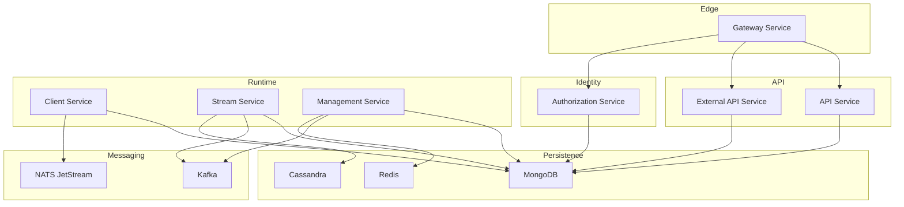

# OpenFrame OSS Tenant - Introduction

Welcome to **OpenFrame OSS Tenant**, the complete open-source backend platform that powers the OpenFrame AI-driven MSP ecosystem. This project provides a production-grade, multi-tenant backend stack that replaces expensive proprietary MSP tools with intelligent automation.

## What is OpenFrame?

OpenFrame (https://openframe.ai) is a unified platform that integrates multiple MSP tools into a single AI-driven interface, automating IT support operations across the stack. The OpenFrame OSS Tenant repository contains the complete backend runtime infrastructure that powers this platform.

## Key Features

### 🏢 Multi-Tenant SaaS Backend Architecture
- Complete tenant isolation
- Secure OAuth2/OIDC identity provider
- Per-tenant configuration management
- Scalable microservices architecture

### 🔐 Enterprise-Grade Security
- JWT-based authentication with API key support
- Edge gateway with security enforcement
- Multi-tenant RSA key management
- CORS, rate limiting, and request validation

### 🚀 Intelligent Automation
- **Mingo AI**: AI-powered technician assistant
- **Fae**: Client-facing AI support
- Real-time event processing and enrichment
- Automated tool lifecycle management

### 🔧 Comprehensive MSP Operations
- Device and machine management
- Organization and user administration
- Log aggregation and analysis
- Tool integration and agent management
- Script execution and scheduling

## Architecture Overview

OpenFrame OSS Tenant implements a microservices architecture with the following core components:

```mermaid
flowchart TD
    subgraph Edge
        Gateway[Gateway Service]
    end

    subgraph Identity
        Authz[Authorization Service]
    end

    subgraph API
        Api[API Service]
        ExternalApi[External API Service]
    end

    subgraph Runtime
        Client[Client Service]
        Stream[Stream Service]
        Management[Management Service]
    end

    subgraph Persistence
        Mongo[MongoDB]
        Cassandra[Cassandra]
        Redis[Redis]
    end

    subgraph Messaging
        Kafka[Kafka]
        Nats[NATS JetStream]
    end

    Gateway --> Api
    Gateway --> ExternalApi
    Gateway --> Authz

    Api --> Mongo
    ExternalApi --> Mongo
    Authz --> Mongo
    Client --> Mongo
    Management --> Mongo
    Stream --> Mongo

    Stream --> Kafka
    Client --> Nats
    Management --> Kafka

    Stream --> Cassandra
    Management --> Redis
```

### Service Responsibilities

| Service | Purpose |
|---------|---------|
| **Gateway Service** | Edge routing, JWT validation, CORS, rate limiting |
| **Authorization Service** | OAuth2/OIDC flows, tenant isolation, token management |
| **API Service** | Internal GraphQL/REST APIs for platform UI |
| **External API Service** | Public REST APIs for integrations |
| **Client Service** | Agent authentication and registration |
| **Stream Service** | Event processing and data enrichment |
| **Management Service** | Tool lifecycle and system coordination |

## Technology Stack

### Backend (Spring Boot 3.3.0)
- **Language**: Java 21
- **Framework**: Spring Boot with Spring Cloud
- **Database**: MongoDB (primary), Cassandra (logs), Redis (cache)
- **Messaging**: Apache Kafka, NATS JetStream
- **Monitoring**: Prometheus with Micrometer
- **Security**: Spring Security OAuth2 Resource Server

### Tooling Layer (Node.js)
- **AI Integration**: Anthropic AI SDK (@ai-sdk/anthropic)
- **Core Library**: VoltAgent Core (@voltagent/core)
- **File Processing**: Glob pattern matching
- **Validation**: Zod schema validation

### Deployment & Orchestration
- **Containerization**: Docker support
- **Configuration**: Spring Cloud Config Server
- **Service Discovery**: Spring Cloud Discovery
- **Event Streaming**: Kafka with Debezium CDC

## Target Audience

### MSP Providers
- Small to medium MSPs looking to reduce vendor costs
- Teams wanting AI-powered automation
- Organizations seeking unified tool management

### Developers & System Integrators  
- Backend developers working on multi-tenant SaaS
- DevOps teams implementing microservices
- Organizations building custom MSP solutions

### IT Operations Teams
- Teams managing multiple MSP tools
- Organizations wanting centralized logging and monitoring
- Groups seeking automated script execution and device management

## Benefits

### 💰 Cost Reduction
- Replace expensive proprietary MSP tools
- Reduce vendor lock-in with open-source alternatives
- Lower operational overhead through automation

### 🤖 AI-Powered Efficiency  
- Intelligent ticket routing and resolution
- Automated password resets and maintenance tasks
- Predictive issue detection and prevention

### 📈 Scalability & Flexibility
- Multi-tenant architecture supports growth
- Microservices enable independent scaling
- Event-driven design handles high volumes

## Getting Started

Ready to explore OpenFrame OSS Tenant? Here's your learning path:

1. **[Prerequisites](prerequisites.md)** - Set up your development environment
2. **[Quick Start](quick-start.md)** - Get the platform running in 5 minutes  
3. **[First Steps](first-steps.md)** - Explore key features and configuration

## Community & Support

- **OpenMSP Slack Community**: https://join.slack.com/t/openmsp/shared_invite/zt-36bl7mx0h-3~U2nFH6nqHqoTPXMaHEHA
- **OpenFrame Website**: https://www.flamingo.run/openframe
- **Flamingo Platform**: https://flamingo.run

> **Note**: We use our OpenMSP Slack community for all discussions, support, and feature requests. GitHub Issues and Discussions are not monitored.

## License & Contributing

OpenFrame OSS Tenant is open-source software. Check the repository for licensing terms and contribution guidelines. Join our Slack community to connect with other developers and contributors.

---

**Next Step**: Review the [Prerequisites](prerequisites.md) to set up your development environment.