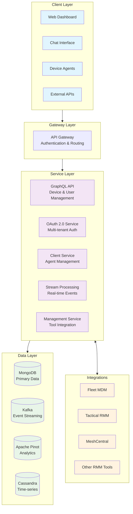
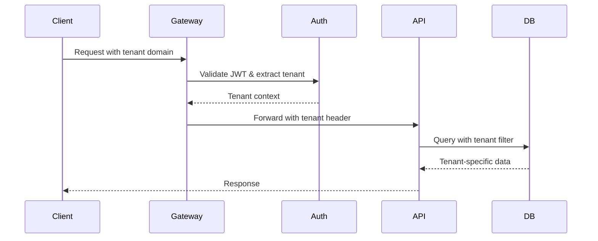

# Introduction to OpenFrame

Welcome to OpenFrame, the AI-powered MSP platform that revolutionizes IT operations by replacing expensive proprietary software with open-source alternatives enhanced by intelligent automation.

## What is OpenFrame?

OpenFrame is the unified platform that integrates multiple MSP tools into a single AI-driven interface, automating IT support operations across the entire stack. Built by Flamingo (https://flamingo.run), OpenFrame provides the technical foundation that powers:

- **Mingo AI**: Intelligent assistant for technicians
- **Fae**: AI-powered client interface  
- **Unified Platform**: Single dashboard for all IT operations

## Key Features & Benefits

### 🚀 **Unified MSP Platform**
- Single interface for device management, monitoring, and support
- Integrates Fleet MDM, Tactical RMM, MeshCentral, and more
- Real-time dashboard with comprehensive device visibility

### 🤖 **AI-Powered Automation**
- Mingo AI assistant for intelligent troubleshooting
- Automated ticket resolution and escalation
- Smart policy recommendations and compliance monitoring

### 💰 **Cost-Effective Open Source**
- Replace expensive proprietary MSP tools
- Open-source foundation with enterprise features
- Transparent pricing and no vendor lock-in

### 🔒 **Enterprise-Grade Security**
- OAuth 2.0/OIDC authentication with SSO support
- Multi-tenant architecture with data isolation
- Role-based access control and audit logging

### 📊 **Advanced Analytics**
- Real-time performance metrics and alerting
- Historical data analysis with Apache Pinot
- Custom reporting and dashboard creation

## Target Audience

OpenFrame is designed for:

| Audience | Use Case | Benefits |
|----------|----------|----------|
| **MSP Providers** | Centralized management of client environments | Reduced operational costs, improved efficiency |
| **IT Departments** | Unified device and asset management | Single pane of glass, automated workflows |
| **System Administrators** | Cross-platform monitoring and maintenance | Simplified toolchain, AI-assisted troubleshooting |
| **DevOps Teams** | Infrastructure monitoring and automation | Event-driven workflows, real-time alerts |

## Core Architecture Overview

```mermaid
graph TB
    subgraph clients[Client Layer]
        Web[Web Dashboard]
        Chat[Chat Interface]
        Agent[Device Agents]
        API[External APIs]
    end
    
    subgraph gateway[Gateway Layer]
        GW[API Gateway<br/>Authentication & Routing]
    end
    
    subgraph services[Service Layer]
        GraphQL[GraphQL API<br/>Device & User Management]
        Auth[OAuth 2.0 Service<br/>Multi-tenant Auth]
        Client[Client Service<br/>Agent Management]
        Stream[Stream Processing<br/>Real-time Events]
        Mgmt[Management Service<br/>Tool Integration]
    end
    
    subgraph data[Data Layer]
        Mongo[(MongoDB<br/>Primary Data)]
        Kafka[(Kafka<br/>Event Streaming)]
        Pinot[(Apache Pinot<br/>Analytics)]
        Cassandra[(Cassandra<br/>Time-series)]
    end
    
    subgraph integrations[Integrations]
        Fleet[Fleet MDM]
        Tactical[Tactical RMM]
        Mesh[MeshCentral]
        Tools[Other RMM Tools]
    end

    clients --> gateway
    gateway --> services
    services --> data
    services <--> integrations
    
    classDef clientStyle fill:#e1f5fe
    classDef serviceStyle fill:#f3e5f5
    classDef dataStyle fill:#e8f5e8
    classDef integrationStyle fill:#fff3e0
    
    class Web,Chat,Agent,API clientStyle
    class GraphQL,Auth,Client,Stream,Mgmt serviceStyle
    class Mongo,Kafka,Pinot,Cassandra dataStyle
    class Fleet,Tactical,Mesh,Tools integrationStyle
```

## Technology Stack

### Backend Services
- **Runtime**: Java 21 with Spring Boot 3.x
- **API**: GraphQL (Netflix DGS) + REST
- **Security**: OAuth 2.0/OIDC, JWT with HTTP-only cookies
- **Data**: MongoDB, Apache Cassandra, Apache Pinot, Redis
- **Messaging**: Apache Kafka for event streaming
- **Processing**: Custom stream processing service

### Frontend Applications
- **Framework**: Vue 3 with TypeScript and Composition API
- **Chat Client**: Tauri-based desktop application
- **State Management**: Pinia stores
- **UI Components**: PrimeVue design system

### Client Agents
- **Language**: Rust for cross-platform compatibility
- **Runtime**: Tokio async runtime
- **Communication**: NATS messaging for real-time updates

## Multi-Tenant Architecture

OpenFrame supports true multi-tenancy with isolation at every layer:

```mermaid
sequenceDiagram
    participant Client
    participant Gateway
    participant Auth
    participant API
    participant DB
    
    Client->>Gateway: Request with tenant domain
    Gateway->>Auth: Validate JWT & extract tenant
    Auth-->>Gateway: Tenant context
    Gateway->>API: Forward with tenant header
    API->>DB: Query with tenant filter
    DB-->>API: Tenant-specific data
    API-->>Client: Response
```

### Tenant Isolation Features
- **Data Segregation**: Complete tenant data separation in databases
- **Authentication**: Tenant-specific JWT signing keys and SSO configs
- **Configuration**: Per-tenant service configurations and feature flags
- **Billing**: Resource usage tracking per tenant

## Getting Started Paths

Choose your path based on your role and goals:

| Path | Description | Time Required | Next Steps |
|------|-------------|---------------|------------|
| **Quick Demo** | Try OpenFrame with sample data | 5 minutes | [Quick Start Guide](./quick-start.md) |
| **Local Development** | Set up full development environment | 30 minutes | [Prerequisites](./prerequisites.md) |
| **Production Deployment** | Deploy to production infrastructure | 2+ hours | [Deployment Guide](../development/setup/local-development.md) |
| **Integration Development** | Build custom integrations | 1+ hours | [Architecture Overview](../development/architecture/overview.md) |

## Community & Support

OpenFrame is built for the community, by the community. We encourage collaboration and welcome contributions.

### 🗨️ **Join Our Community**
- **OpenMSP Slack**: [Join here](https://join.slack.com/t/openmsp/shared_invite/zt-36bl7mx0h-3~U2nFH6nqHqoTPXMaHEHA) for discussions, support, and announcements
- **Community Hub**: Visit [OpenMSP.ai](https://www.openmsp.ai/) for resources and events

### 📚 **Resources**
- **Documentation**: Complete guides for setup, development, and operations
- **API Reference**: Comprehensive GraphQL and REST API documentation  
- **Video Tutorials**: Step-by-step walkthroughs and feature demos
- **Best Practices**: Proven patterns for MSP operations

### 🤝 **Contributing**
- **GitHub Issues**: Report bugs and request features (managed via Slack)
- **Code Contributions**: Submit pull requests with improvements
- **Community Support**: Help other users in our Slack community

---

## What's Next?

Ready to dive in? Here are your next steps:

1. **Check Prerequisites**: Review [system requirements](./prerequisites.md) for your environment
2. **Quick Start**: Follow the [5-minute setup guide](./quick-start.md) to see OpenFrame in action
3. **First Steps**: Complete the [initial configuration](./first-steps.md) for your first project
4. **Deep Dive**: Explore the [development guides](../development/README.md) for advanced usage

> **Need Help?** Join our [OpenMSP Slack community](https://join.slack.com/t/openmsp/shared_invite/zt-36bl7mx0h-3~U2nFH6nqHqoTPXMaHEHA) where our team and community members are ready to assist you.

Welcome to the future of MSP operations with OpenFrame! 🚀