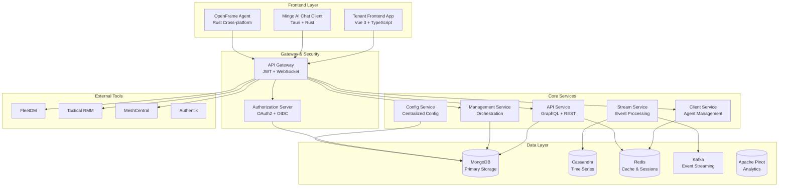

# OpenFrame Introduction

## What is OpenFrame?

**OpenFrame** is Flamingo's unified, AI-powered MSP (Managed Service Provider) platform that replaces expensive proprietary software with open-source alternatives enhanced by intelligent automation. It provides a comprehensive, integrated solution for IT support operations across the entire technology stack.

OpenFrame is the technical implementation of Flamingo's vision to democratize MSP tools through open source technology combined with cutting-edge AI capabilities.

## Key Features

### 🤖 AI-Powered Automation
- **Mingo AI** for technicians - autonomous incident triage and alert management
- **Fae AI** for clients - intelligent client interaction and support
- Real-time event processing and automated decision-making
- Natural language interaction for complex IT operations

### 🔧 Unified Tool Integration
- **Single interface** for multiple MSP tools
- **FleetDM integration** for endpoint management
- **Tactical RMM** for remote monitoring and management
- **MeshCentral** for remote desktop access
- Extensible architecture for additional tool integrations

### 🏢 Multi-Tenant Architecture
- **Secure tenant isolation** at all layers
- **Organization management** with role-based access
- **SSO integration** (Google, Microsoft, custom OIDC)
- **API-first design** for third-party integrations

### 📊 Comprehensive Monitoring
- **Real-time device monitoring** and alerting
- **Centralized logging** with advanced filtering
- **Event stream processing** for audit trails
- **Compliance reporting** and vulnerability tracking

## Architecture Overview

OpenFrame follows a modern microservices architecture with strict security and tenant isolation:

```mermaid
graph TB
    subgraph "Frontend Layer"
        Frontend[Tenant Frontend App<br/>Vue 3 + TypeScript]
        Chat[Mingo AI Chat Client<br/>Tauri + Rust]
        Agent[OpenFrame Agent<br/>Rust Cross-platform]
    end

    subgraph "Gateway & Security"
        Gateway[API Gateway<br/>JWT + WebSocket]
        AuthZ[Authorization Server<br/>OAuth2 + OIDC]
    end

    subgraph "Core Services"
        API[API Service<br/>GraphQL + REST]
        Management[Management Service<br/>Orchestration]
        Stream[Stream Service<br/>Event Processing]
        Client[Client Service<br/>Agent Management]
        Config[Config Service<br/>Centralized Config]
    end

    subgraph "Data Layer"
        Mongo[(MongoDB<br/>Primary Storage)]
        Cassandra[(Cassandra<br/>Time Series)]
        Redis[(Redis<br/>Cache & Sessions)]
        Kafka[Kafka<br/>Event Streaming]
        Pinot[(Apache Pinot<br/>Analytics)]
    end

    subgraph "External Tools"
        Fleet[FleetDM]
        Tactical[Tactical RMM]
        Mesh[MeshCentral]
        Authentik[Authentik]
    end

    Frontend --> Gateway
    Chat --> Gateway
    Agent --> Gateway

    Gateway --> AuthZ
    Gateway --> API
    Gateway --> Client
    Gateway --> Management

    API --> Mongo
    Management --> Mongo
    Stream --> Kafka
    Stream --> Cassandra
    
    Client --> Redis
    API --> Redis

    Gateway --> Fleet
    Gateway --> Tactical
    Gateway --> Mesh

    AuthZ --> Mongo
    Config --> Mongo
```

## Target Audience

### MSP Owners & Operators
- **Cost reduction** by replacing expensive proprietary tools
- **Unified platform** reducing tool switching and training overhead
- **AI automation** improving efficiency and reducing manual tasks
- **Open source transparency** with full control over your platform

### IT Professionals & Technicians
- **Single dashboard** for all monitoring and management tasks
- **AI-assisted troubleshooting** with Mingo intelligent recommendations
- **Remote access tools** built directly into the platform
- **Advanced scripting and automation** capabilities

### Developers & System Integrators
- **API-first architecture** for custom integrations
- **Open source extensibility** for custom tool additions
- **Modern tech stack** with comprehensive documentation
- **Container-native deployment** with Kubernetes support

## Key Benefits

| Benefit | Description |
|---------|-------------|
| **Cost Savings** | Replace expensive proprietary MSP tools with open-source alternatives |
| **AI Enhancement** | Leverage cutting-edge AI for automated incident response and client interaction |
| **Unified Interface** | Single platform for all MSP operations, reducing context switching |
| **Vendor Independence** | Full control over your platform with open-source transparency |
| **Modern Architecture** | Cloud-native, microservices design built for scale and reliability |
| **Extensible Platform** | Add custom tools and integrations through well-documented APIs |

## Community & Support

- **OpenMSP Slack Community**: [https://www.openmsp.ai/](https://www.openmsp.ai/)
- **Join our Slack**: [Direct Invite Link](https://join.slack.com/t/openmsp/shared_invite/zt-36bl7mx0h-3~U2nFH6nqHqoTPXMaHEHA)
- **OpenFrame Website**: [https://openframe.ai](https://openframe.ai)
- **Flamingo Platform**: [https://flamingo.run](https://flamingo.run)

> **Note**: We use our OpenMSP Slack community for all support, discussions, and community engagement. GitHub Issues and Discussions are not monitored - please use Slack for all questions and support requests.

## What's Next?

Ready to get started with OpenFrame? Here's your roadmap:

1. **[Check Prerequisites](prerequisites.md)** - Ensure your system meets the requirements
2. **[Quick Start Guide](quick-start.md)** - Get OpenFrame running in 5 minutes
3. **[First Steps](first-steps.md)** - Explore key features and initial configuration
4. **[Development Setup](../development/setup/environment.md)** - Set up your development environment

## Learn More

For an in-depth look at the latest OpenFrame features and autonomous AI capabilities, watch our latest release overview.