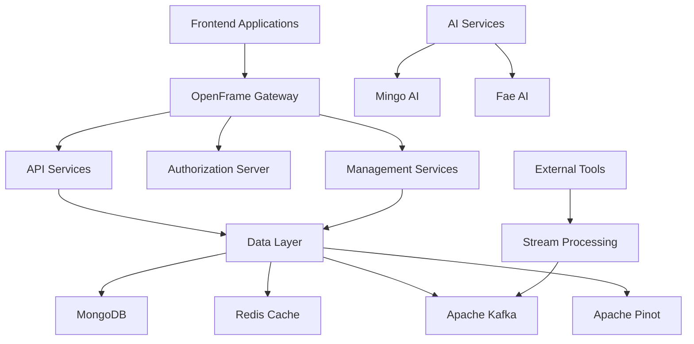

# Introduction to OpenFrame

Welcome to OpenFrame, the unified AI-powered MSP platform that replaces expensive proprietary software with open-source alternatives enhanced by intelligent automation.

## What is OpenFrame?

OpenFrame is Flamingo's revolutionary approach to MSP (Managed Service Provider) operations. Instead of juggling multiple expensive proprietary tools, OpenFrame provides a single, unified platform that integrates all your MSP needs into one AI-driven interface.

### Core Value Proposition

OpenFrame transforms MSP operations by:

- **Consolidating Tools**: Replace multiple expensive proprietary solutions with a unified platform
- **AI Enhancement**: Mingo AI for technicians and Fae for clients provide intelligent assistance
- **Cost Reduction**: Leverage open-source alternatives to cut vendor costs significantly
- **Automation**: Intelligent automation across the IT support stack
- **Unified Experience**: Single interface for all MSP operations

## Key Features & Benefits

| Feature | Benefit | Description |
|---------|---------|-------------|
| **Mingo AI Assistant** | Intelligent Technician Support | AI-powered assistant that helps technicians with troubleshooting, documentation, and task automation |
| **Fae Client AI** | Enhanced Client Experience | AI assistant for clients to get help and request services |
| **Unified Dashboard** | Centralized Operations | Single pane of glass for devices, logs, organizations, and tickets |
| **Multi-Tool Integration** | Seamless Workflow | Native integration with TacticalRMM, FleetDM, MeshCentral, and more |
| **Real-time Monitoring** | Proactive Management | Live device status, log streaming, and event processing |
| **Multi-tenant Architecture** | Scalable Operations | Built for MSPs managing multiple clients and organizations |

## Target Audience

OpenFrame is designed for:

### **MSP Owners & Managers**
- Reduce operational costs by replacing proprietary tools
- Gain unified visibility across all client operations
- Improve technician productivity with AI assistance

### **IT Technicians**
- Use Mingo AI for intelligent troubleshooting assistance
- Access all tools through a single interface
- Automate routine tasks and documentation

### **MSP Clients**
- Interact with Fae AI for self-service support
- Get faster response times through automation
- Benefit from improved service quality

### **Developers & Integrators**
- Extend OpenFrame with custom integrations
- Leverage open APIs and comprehensive documentation
- Contribute to the open-source ecosystem

## Technology Overview

```mermaid
graph TD
    A[Frontend Applications] --> B[OpenFrame Gateway]
    B --> C[API Services]
    B --> D[Authorization Server]
    B --> E[Management Services]
    
    C --> F[Data Layer]
    E --> F
    
    F --> G[MongoDB]
    F --> H[Redis Cache]
    F --> I[Apache Kafka]
    F --> J[Apache Pinot]
    
    K[External Tools] --> L[Stream Processing]
    L --> I
    
    M[AI Services] --> N[Mingo AI]
    M --> O[Fae AI]
```

### Architecture Highlights

- **Microservices Architecture**: Scalable, maintainable service design
- **Event-Driven**: Real-time data processing with Kafka and NATS
- **Multi-tenant**: Isolated environments for different organizations
- **API-First**: GraphQL and REST APIs for all operations
- **Container-Ready**: Docker and Kubernetes deployment support

## Getting Started Path

Your OpenFrame journey involves these key steps:

1. **Setup Environment** - Install prerequisites and configure your development environment
2. **Quick Start** - Get OpenFrame running in 5 minutes with our quick setup
3. **First Integration** - Connect your first MSP tool (TacticalRMM or FleetDM)
4. **Explore Features** - Try Mingo AI, device management, and log analysis
5. **Production Deployment** - Scale to production with Kubernetes

> **Ready to get started?** Check out our [Prerequisites Guide](prerequisites.md) to ensure your environment is ready, then move on to our [Quick Start Guide](quick-start.md) for a 5-minute setup.

## Community & Support

- **OpenMSP Community**: Join our [Slack workspace](https://join.slack.com/t/openmsp/shared_invite/zt-36bl7mx0h-3~U2nFH6nqHqoTPXMaHEHA)
- **Documentation**: Comprehensive guides and API references
- **GitHub**: Open-source development and issue tracking
- **Flamingo Platform**: Enterprise features and support at [flamingo.run](https://flamingo.run)

## What's Next?

Continue your OpenFrame journey:

- [Prerequisites](prerequisites.md) - Prepare your environment
- [Quick Start](quick-start.md) - Get running in 5 minutes  
- [First Steps](first-steps.md) - Explore key features after setup

---

*OpenFrame is part of the Flamingo ecosystem - learn more at [flamingo.run](https://flamingo.run) and [openframe.ai](https://openframe.ai)*