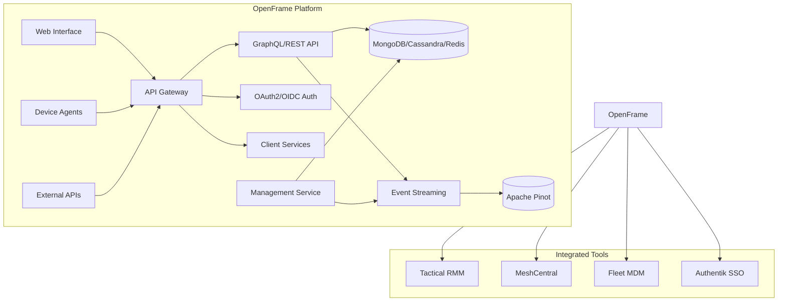

# Introduction to OpenFrame

Welcome to OpenFrame, the open-source unified AI-driven MSP platform that transforms how Managed Service Providers operate and scale their business.

## What is OpenFrame?

OpenFrame is Flamingo's revolutionary platform that replaces expensive proprietary MSP tools with open-source alternatives enhanced by intelligent automation. It consolidates fragmented MSP toolchains into a single, AI-ready ecosystem that reduces costs, improves efficiency, and scales with your business.

## Key Features & Benefits

### 🤖 **AI-Powered Automation**
- **Mingo AI**: Intelligent technician assistant that handles incident triage and alert management
- **Fae**: Client-facing AI that improves customer experience
- **Autonomous Agent Architecture**: AI agents that actually fix your infrastructure

### 💰 **Cost Reduction**
- Replace expensive vendor lock-in with open-source alternatives
- Reduce operational overhead with unified tooling
- Minimize training costs with single-platform expertise

### 🔧 **Unified Platform**
- Single interface for all MSP operations
- Integrated device management, monitoring, and automation
- Seamless tool interoperability

### 🚀 **Enterprise-Ready Architecture**
- Microservices-based design for scalability
- Multi-tenant support for MSP operations
- Cloud-native deployment with Kubernetes

## Target Audience

OpenFrame is designed for:

- **Managed Service Providers (MSPs)** looking to modernize their tech stack
- **IT Professionals** seeking unified device and infrastructure management
- **DevOps Teams** requiring scalable automation and monitoring
- **Organizations** wanting to reduce MSP tool fragmentation and costs

## Core Components Overview

```mermaid
flowchart TD
    subgraph "OpenFrame Platform"
        UI[Web Interface] --> Gateway[API Gateway]
        Agent[Device Agents] --> Gateway
        External[External APIs] --> Gateway
        
        Gateway --> API[GraphQL/REST API]
        Gateway --> Auth[OAuth2/OIDC Auth]
        Gateway --> Client[Client Services]
        
        API --> Data[(MongoDB/Cassandra/Redis)]
        API --> Stream[Event Streaming]
        Stream --> Analytics[(Apache Pinot)]
        
        Management[Management Service] --> Data
        Management --> Stream
    end
    
    subgraph "Integrated Tools"
        TacticalRMM[Tactical RMM]
        MeshCentral[MeshCentral]
        FleetDM[Fleet MDM]
        Authentik[Authentik SSO]
    end
    
    OpenFrame --> TacticalRMM
    OpenFrame --> MeshCentral
    OpenFrame --> FleetDM
    OpenFrame --> Authentik
```

## Technology Stack

| Layer | Technologies |
|-------|-------------|
| **Frontend** | Vue 3, TypeScript, PrimeVue, Vite |
| **Backend** | Java 21, Spring Boot 3.3, Spring Cloud |
| **APIs** | GraphQL (Netflix DGS), REST |
| **Security** | OAuth2/OIDC, JWT, AES-256 |
| **Data** | MongoDB, Cassandra, Redis, Apache Pinot |
| **Messaging** | Apache Kafka, NATS |
| **Infrastructure** | Docker, Kubernetes, Helm |
| **Clients** | Rust (system agents), TypeScript (desktop apps) |

## Getting Started Paths

Choose your journey based on your role:

### 📋 **MSP Operators**
1. Review [Prerequisites](prerequisites.md)
2. Follow [Quick Start Guide](quick-start.md)
3. Complete [First Steps](first-steps.md)

### 🔧 **Developers & Contributors**
1. Set up [Development Environment](../development/setup/environment.md)
2. Configure [Local Development](../development/setup/local-development.md)
3. Review [Architecture Overview](../development/architecture/overview.md)

### 🚀 **DevOps Teams**
1. Check system [Prerequisites](prerequisites.md)
2. Review [Architecture Overview](../development/architecture/overview.md)
3. Plan production deployment strategy

## Community & Support

OpenFrame is built by the open-source community. Get help and contribute:

- **Community Slack**: [OpenMSP Community](https://join.slack.com/t/openmsp/shared_invite/zt-36bl7mx0h-3~U2nFH6nqHqoTPXMaHEHA)
- **Website**: [flamingo.run](https://flamingo.run)
- **OpenFrame Platform**: [openframe.ai](https://openframe.ai)

> **Note**: We don't use GitHub Issues or Discussions. All support and collaboration happens in our OpenMSP Slack community.

## What's Next?

Ready to get started? Here's your roadmap:

1. **Check Prerequisites**: Ensure your environment meets the [system requirements](prerequisites.md)
2. **Quick Setup**: Get OpenFrame running in 5 minutes with our [Quick Start Guide](quick-start.md)
3. **Explore Features**: Learn key platform features in [First Steps](first-steps.md)
4. **Join Community**: Connect with other users in our [OpenMSP Slack](https://join.slack.com/t/openmsp/shared_invite/zt-36bl7mx0h-3~U2nFH6nqHqoTPXMaHEHA)

---

Welcome to the future of MSP operations. Let's build something amazing together! 🚀